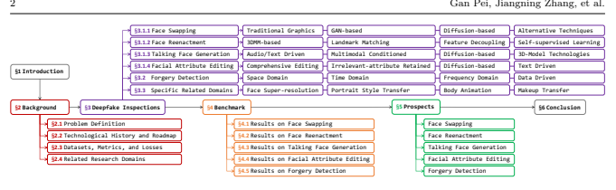
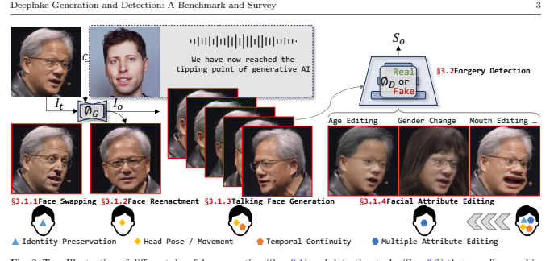
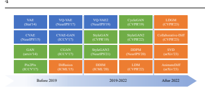
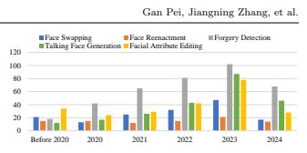
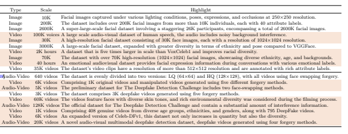
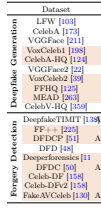
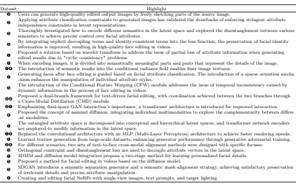

# Deepfake Generation And Detection: A Benchmark And Survey

Gan Pei1· Jiangning Zhang2· Menghan Hu1· Zhenyu Zhang3· Chengjie Wang2· Yunsheng Wu2· Guangtao Zhai4· Jian Yang3·
Chunhua Shen5· Dacheng Tao6

## Received: Date / Accepted: Date

arXiv:2403.17881v4 [cs.CV] 16 May 2024 Abstract Deepfake is a technology dedicated to creating highly realistic facial images and videos under specific conditions, which has significant application potential in fields such as entertainment, movie production, and digital human creation, to name a few.

With the advancements in deep learning, techniques primarily represented by Variational Autoencoders and Generative Adversarial Networks have achieved impressive generation results. More recently, the emergence of diffusion models with powerful generation capabilities has sparked a renewed wave of research. In addition to deepfake generation, corresponding detection technologies continuously evolve to regulate the potential misuse of deepfakes, such as privacy invasion and phishing attacks. This survey comprehensively reviews the latest developments in deepfake generation and detection, summarizing and analyzing current state-of-the-arts in this rapidly evolving field. First, we unify task definitions, comprehensively introduce datasets and metrics, and discuss developing technologies. Then, we discuss the development of several related sub-fields and focus on researching four representative deepfake fields: face swapping, face reenactment, talking face generation, and facial attribute editing, as well as forgery detection. Subsequently, we comprehensively benchmark representative methods on popular datasets for each field, fully evaluating the latest and most influential published works.

Finally, we analyze the challenges and future research directions of the discussed fields. We closely follow the latest developments in this project.

Keywords Deepfake Generation · Face Swapping ·
Face Reenactment · Talking Face Generation · Facial Attribute Editing · Forgery detection · Survey

## 1 Introduction

Artificial Intelligence Generated Content (AIGC) garners considerable attention [227] in academia and industry. Deepfake generation, as one of the important technologies in the generative domain, gains significant attention due to its ability to create highly realistic facial media content. This technique transitions from traditional graphics-based methods to deep learning-based approaches. Early methods employ advanced Variational Autoencoder [136, 239, 255] (VAE) and Generative Adversarial Network (GAN) [125,126] techniques, enabling seemingly realistic image generation, but their performance is still unsatisfactory, which limits practical applications. Recently, the diffusion structure [15,77,166] has greatly enhanced the generation capability of images and videos. Benefiting from this new wave of research, deepfake technology demonstrates potential value for practical applications and can generate content indistinguishable from real ones, which has further attracted attention and is widely applied in numerous fields [11], including entertainment, movie production, online live broadcasting, and privacy protection, etc.

Deepfake generation can generally be divided into four mainstream research fields: 1) Face swapping [6, 236, 283] is dedicated to executing identity exchanges between two person images; 2) Face reenactment [17, 97, 140] emphasizes transferring source movements and poses; 3) Talking face generation [179, 189, 326] focuses



on achieving natural matching of mouth movements to textual content in character generation, and 4) Facial attribute editing [105, 210, 241] aims to modify specific facial attributes of the target image. The development of related foundational technologies has gradually shifted from single forward GAN models [69, 125] to multistep diffusion models [15, 93, 223] with higher quality generation capabilities, and the generated content has also gradually transitioned from single-frame images to temporal video modeling [77]. In addition, NeRF [66, 187] has been frequently incorporated into modeling to improve multi-view consistency capabilities [115, 330].

While enjoying the novelty and convenience of this technology, the unethical use of it raises concerns over the spread of privacy invasion, and dissemination of fake news, necessitating the development of effective forgery detection methods [249] in opposition, *a.k.a*., deepfake detection. From the earliest handcrafted featurebased methods [90, 353] to deep learning-based methods [304, 308], and the recent hybrid detection techniques [109], forgery detection has undergone substantial technological advancements along with the development of generative technologies. The data modality has also transitioned from the spatial and frequent domains [150, 219] to the more challenging temporal domain [84, 301]. Considering that current generative technologies have a higher level of interest, develop faster, and can generate indistinguishable content from reality [190], corresponding detection technologies need continuous evolution.

Overall, despite the significant progress made in both directions, they still exhibit challenging limitations in specific scenarios [257], mainly reflected in the visual perception authenticity and generative accuracy of models. This has attracted a large number of researchers to continue their efforts and has sparked thoughts on industrial applications. Existing survey works only focus on partial deepfake fields and lack discussions on new technologies [169, 190, 227], especially diffusion-based image/video generation methods, due to their disconnection from current technologies. The survey will comprehensively discuss these fields as well as related sub-fields, and cover tracking of the latest works.

- Contribution. In this survey, we comprehensively explore the key technologies and latest advancements in Deepfakes generation and forgery detection. We first unify the task definitions (Sec. 2.1), provide a comprehensive comparison of datasets and metrics (Sec. 2.3),
and discuss the development of related technologies.

Specifically, we investigate four mainstream deepfake fields: face swapping (Sec. 3.1.1), face reenactment (Sec.

3.1.2), talking face generation (Sec. 3.1.3), and facial attribute editing (mainly on multiple editing) (Sec. 3.1.4),
as well as forgery detection (Sec. 3.2). We also analyze the benchmarks and settings for each domain, thoroughly evaluating the latest and influential works published in top-tier conferences/journals (Sec. 4), especially recent diffusion-based approaches. Additionally, we discuss closely related fields, including head swapping, face super-resolution, face reconstruction, face inpainting, body animation, portrait style transfer, makeup transfer, and adversarial sample detection. Benefiting from the current popularity of AIGC, the research iteration cycle in the deepfake field has been significantly reduced, and we keep updating and discussing the in-submission works in the revised version.

- Scope. This survey primarily focuses on mainstream face-related tasks, including face swapping, face reenactment, talking face generation, facial (multiple) attribute editing, and forgery detection. We also cover some related domain tasks in Sec. 2.4 and detail specific popular sub-tasks in Sec. 3.3. Considering the large number of articles (including published and preprints), we mainly include representative and attention-grabbing works. In addition, we compare this investigation with recent surveys. Sha *et al*. [227] only discuss character generation while we cover a more comprehensive range of tasks.

Compared to works [169, 184, 190], our study encompasses a broader range of technical models, particularly the more powerful diffusion-based methods. Additionally, Target Source Output

(a) Face Swap

```
             "Make Amrica great again!"
                                   
Drive Source Or
                         
   Target Output
                           

```

(c) Talking Face Generation Target Source Face swap Reenactment Make up transfer Head swap

```
                                                    Identity information
                                                                       
                                                    Makeup information
                                                                        
                                                    Motion information (gesture, expression) 
                                                                                             
                                                    Other face attribute information 
                                                                                    
Different colors represent different sources of information Talking face generation Face attribute editing

```

Targeted edits

(e) Comparison of Objects Operated by Different Tasks 



Head Swap Age Editing Gender Change
we thoroughly discuss the related sub-fields of deepfake generation and detection.

- Survey Pipeline. Fig. 1 shows the pipeline of this survey. Sec. 2 provides the essential background knowledge that encompasses task-specific definitions, datasets, evaluation metrics, and exploration of related research areas. Sec. 3 presents technical discussions, examining the four most popular deepfake tasks from the perspective of technological categorization and evolution. In addition, we meticulously classify and discuss forgery detection techniques, emphasizing the technological routes involved. Subsequently, Sec. 4 organizes and evaluates performance from various approaches for a thorough and fair performance comparison. Sec. 5 focuses on a critical review of the challenges that persist in existing techniques, outlining feasible future development directions. Finally, we encapsulate the entirety of the paper through a comprehensive summary in Sec. 6.

VAE
(Stat'14)
VQ-VAE
(NeurIPS'17)
CVAE
(NeurIPS'15)
CVAE-GAN
(ICCV'17)
GAN
(arxiv'14)
CGAN
(ICCV'17)
Pix2Pix
(ICCV'17)
Diffusion
(ICML'15)

## 2 Background

In this section, we first introduce the conceptual definitions of the discussed mainstream fields. Fig. 2 illustrates the intuitive objectives for each task and shows the distinctions among tasks in terms of manipulated facial components. Then, we review the developmental history of commonly used neural networks, highlighting several representative ones. Next, we summarize popular datasets, metrics, and loss functions. Finally, we comprehensively discuss several relevant domains.

## 2.1 Problem Definition

- Unified Formulation of Studied Problems. Fig. 2 intuitively displays the various deepfakes generation and detection tasks studied in this paper. For the former, different tasks can essentially be expressed as controlled content generation problems under specific conditions, such as images, audio, text, specific attributes, etc..

Given the target image It to be manipulated and the condition information C = {Image, Audio, Text*, . . .* },
the content generation process can be represented as:
VQ-VAE2
(NeurIPS'19)
CycleGAN
(CVPR'19)
StyleGAN
(CVPR'19)
StyleGAN2
(CVPR'22)

## Io = Φg(It, C), (1)

StyleGAN3
(NeurIPS'21)
DDPM
(NeurIPS'20)
where ϕG abstracts the specific generation network and Io = {I
0 t
, I1 t
, . . . , IN−1 t } represents generated contents.

N is the total frame number for the generated video, which is set to 1 by default). The latter task can be viewed as an image-level or pixel-level classification problem as practical application needs, which can be represented as:
DDIM
(ICML'20)
LDM
(CVPR'22)

## So = Φd(Io), (2)

Before 2019 2019-2022 After 2022 where ϕD abstracts the specific detection network and So represents the fake score for the generated content Io.

- Face Swapping involves replacing the identity information of the target face It by the source face C=Is, while preserving ID-irrelevant attributes of the target face, such as skin color and expressions.

- Face Reenactment alters the facial movement of a target image It without changing the identity and other



0 20 40 60 80 100 120 

facial attributes, under the conditions of driving image, video, head pose, etc.. This technology often involves the support of facial motion capture technology, such as facial tracking or prediction based on deep learning models [346].

- Talking Face Generation can be viewed as an extension in time, aiming at generating a talking video Io={I
i o}, i = 0, 1, · · · , N − 1 with the character in the target image It engaging in a conversation based on an arbitrary driving source, such as text, audio, video, or a multi-modal composite source. The lip movements, facial poses, expressions, emotions, and spoken content information of the character in the generated video match the target information.

- Facial Attribute Editing aims to modify the semantic information of the target face It (e.g., personality, age, expressions, skin color, etc.) in a directed manner based on individual interest and preference. Existing methods include single and comprehensive attribute editing: the former focuses on training a model for only one attribute, while the latter integrates multiple attribute editing tasks simultaneously that is our primary focus in this survey.

- Forgery Detection aims to detect and identify anomalies, tampering, or forgery areas in images or videos by the anomaly score So, and it has great research and application value in information security and multimedia forensics.

## 2.2 Technological History And Roadmap

- Generative Framework. Variational Autoencoders
(VAEs) [136, 239, 255], Generative Adversarial Networks
(GANs) [69, 125, 126], and Diffusion [93, 223, 238] have played pivotal roles in the developmental history of generative models.

1) VAE [136] emerges in 2013, altering the relationship between latent features and linear mappings in autoencoder latent spaces. It introduces feature distributions like the Gaussian distribution and achieves the generation of new entities through interpolation. To enhance generation capabilities under specific conditions,

4 Gan Pei, Jiangning Zhang, et al.



CVAE [239] introduces conditional input. VQ-VAE [255]
introduces the concept of vector quantization to improve the learning of latent representations. Subsequent models continually advance.

2) GANs [69] achieve high-quality generation through adversarial training with an extra discriminator. Subsequently, research on GANs experiences a surge, and currently, implementations based on GANs remain the mainstream approach for various deepfake tasks.

CGAN [191] introduces conditional control variables to GANs. Pix2Pix [111] enhances GAN performance in specific image translation tasks. StyleGAN [125] introduces the concept of style transfer to GANs. StyleGAN2 [126]
further improves the quality and controllability of generated images. Additionally, some composite research combines GANs with VAEs, e.g., CVAE-GAN [9].

3) Diffusion models [238] model the generation of data as a diffusion process. DDPM [93] gains widespread attention for its outstanding generative performance, especially when the model excels in handling large-scale, high-resolution images. LDM [223] is more flexible and powerful when it comes to modeling complex data distributions. In the field of video generation, diffusion models play a crucial role [81, 164, 177]. SVD [15] finetunes the base model using an image-to-video conversion task based on text-to-video models. AnimateDiff [77]
attaches a newly initialized motion modeling module to a frozen text-to-image model and trains it on subsequent video clips to refine reasonable motion prior knowledge, thus achieving excellent generation results.

- Discriminative Neural Network. Convolutional Neural Networks (CNNs) [89, 141, 144, 174, 329, 331]
have played a pivotal role in the history of deep learning. LeNet [144], as the pioneer of CNNs, showcased the charm of machine learning. AlexNet [141] and ResNet [89] made deep learning feasible. Recently, ConvNeXt [174] has achieved excellent results surpassing those of Swin-Transformer [172]. The Transformer architecture initially proposed [256] in 2017. The core idea involves using self-attention mechanisms to capture dependencies between different positions in the input sequence, enabling global modeling of sequences. ViT [53]
Table 1: Overview of commonly used datasets. Orange-marked ones are selected to evaluate different methods in Sec. 4.





Forgery DetectionDeepfakeTIMIT [138Audio-Video
demonstrates that using Transformer in the field of computer vision can still achieve excellent performance and PVT [271] overcomes the challenges of adapting Transformer to various dense prediction tasks. In addition, Swin-Transformer [172] addresses the limitations of Transformer in handling high-resolution image processing tasks. Subsequently, Swin-Transformer V2 [170]
further improves the model's efficiency and the resolution of manageable inputs.

- Neural Radiance Field (NeRF) is first introduced in 2020 [187], with its core idea revolving around the use of volume rendering and implicit neural fields to represent and reconstruct both geometric and illumination information of 3D scenes [66]. Compared to traditional 3D methods, it exhibits higher visual quality and is currently widely applied in tasks such as 3D geometry enhancement [110, 228], segmentation [168] and 6D pose estimation [188]. In addition, Some notable works [108, 303] combining NeRF as a supplement to 3D information and generation models are particularly prominent at present.

- Work Summary. The evolution of mainstream generative models is depicted chronologically in Fig. 3. This survey delves into four categories of generation tasks along with the forgery detection task, and the publication years distribution of the surveyed articles is shown in Fig. 4.

## 2.3 Datasets, Metrics, And Losses

- Dataset. Given the various datasets in surveyed fields, we use numerical labels to save posttextual space. 1) Commonly used deepfake generation datasets include LFW [103], CelebA [173], CelebAHQ [124], VGGFace [211], VGGFace2 [22], FFHQ [125],
Multi-PIE [193], VoxCeleb1 [198], VoxCeleb2 [39],
MEAD [263], MM CelebA-HQ [280], CelebAText-
HQ [242], CelebV-HQ [359], TalkingHead-1KH [270],
LRS2 [2], LRS3 [3], etc. 2) Commonly used forgery detection datasets include UADFV [156], DeepfakeTIMIT [138], FF++ [225], Deeperforensics-1.0 [117],
DFDCP [51], DFDC [50], Celeb-DF [158], CelebDFv2 [158], FakeAVCeleb [130], DFD [48], WildDeepfake [363], KoDF [142], UADFV [302], Deephy [199],
DF-Platter [200], etc. We summarize popular datasets in Table 1 .

- Metric. 1) For deepfake generation tasks, commonly used metrics include: Peak Signal-toNoise Ratio (PSNR) [262], Structured Similarity
(SSIM) [274], Learned Perceptual Image Patch Similarity (LPIPS) [336], Fréchet Inception Distance (FID) [92],
Kernel Inception Distance (KID) [12], Cosine Similarity
(CSIM) [270], Identity Retrieval Rate (ID Ret) [258], Expression Error [28], Pose Error [226], Landmark Distance
(LMD) around the mouths [32], Lip-sync Confidence
(LSE-C) [217], Lip-sync Distance (LSE-D) [217], etc. 2)
For forgery generation commonly uses: Area Under the ROC Curve (AUC) [143], Accuracy (ACC) [260], Equal Error Rate (EER) [102], Average Precision (AP) [249],
F1-Score [35], etc. Detailed definitions are explained in Sec. 4.1.

- Loss Function. VAE-based approaches generally employ reconstruction loss and KL divergence loss [136].

Commonly used reconstruction loss functions include Mean Squared Error, Cross-Entropy, LPIPS [336], and perceptual [122] losses. GAN-based methods further introduce adversarial loss [69] to increase image authenticity, while diffusion-based works introduce denoising loss function [93].

## 2.4 Related Research Domains

- Head Swapping replaces the entire head information rather than only the face of the target image [237],
including facial contours and hairstyle, with that of the source image. However, in terms of facial attributes, Head Swap only replaces identity attributes, while leaving other attribute information unchanged. Recently, some methods [87, 264] based on Diffusion have been proposed and have shown promising results in achieving good performance.

- Face Super-resolution aims to enhance the resolution of low-resolution face images to generate highresolution face images [196, 333]. This task is closely related to various deepfake sub-tasks. In the early stages of Face Swapping [201, 244] and Talking Face Generation [33, 58], there is consistently a low-resolution issue in the generated images and videos. This problem is addressed by incorporating face super-resolution methods into the models [189, 289] to improve output quality. In terms of technical approaches, FSR can be categorized into methods based on CNNs [30, 36, 104],
GANs [137, 197], reinforcement learning [234], and ensemble learning [116].

- Face Reconstruction refers to the process of recreating the three-dimensional appearance of an individual's face based on one or multiple 2D facial images [194,229].

Facial reconstruction often plays an intermediate role in various deepfake sub-tasks. In Face Swapping and Face Reenactment tasks, facial parameters are reconstructed using 3DMM, and the model's parameters can be controlled directionally. Additionally, reconstructing a 3D facial model is one of the methods to address the issue of facial artifacts in videos generated under large facial poses.

Common technical approaches for facial reconstruction include methods based on 3DMM [160,180], epipolar geometry [61], one-shot learning [254, 281], shadow shape reconstruction [118, 128], and hybrid learning-based reconstruction [27, 54].

- Face Inpainting, *a.k.a*. face completion, aims to reconstruct missing regions in face images caused by external factors such as occlusion and lighting while preserving facial texture information is crucial in this process [340]. This task is a crucial sub-task of image inpainting, and the current methods are mostly based on deep learning that can be roughly divided into two categories: GAN based [307, 352] and Diffusion based [286, 298].

- Body Animation aims to alter the entire bodily pose while unchanging the overall body information [314]. The goal is to achieve a modification of the target image's entire body posture using an optional driving image or video, aligning the body of the target image with the information from the driving signal. The mainstream implementation path for body animation is based on GANs [343, 356], and Diffusion [177, 268, 273, 292].

- Portrait Style Transfer aims to reconstruct the style of a target image to match that of a source image by learning the stylistic features of the source image [213, 299]. The goal is to preserve the content information of the target image while adapting its style to that of the source image [20]. Common applications include image cross-domain style transfer, such as transforming real face images into animated face styles [60, 216]. Methods based on GANs [1,120,288] and Diffusion [107,163] have achieved high-quality performance in this task.

- Makeup Transfer aims to achieve style transfer learning from a source image to a target image [119, 154].

Existing models have achieved initial success in applying and removing makeup on target images [26,71,154,167],
allowing for quantitative control over the intensity of makeup. However, they perform poorly in transferring extreme styles [295,296,349]. Existing mainstream methods are based on GANs [88, 119, 246].

- Adversarial Sample Detection focuses on identifying whether the input data is an adversarial sample [86].

If recognized as such, the model can refuse to provide services for it, such as throwing an error or not producing an output [316]. Current deepfake detection models often rely on a single cue from the generation process as the basis for detection, making them vulnerable to specific adversarial samples. Furthermore, relatively little work has focused on adversarial sample testing in terms of model generalization capability and detection evaluation.

## 3 Deepfake Inspections: A Survey

This section systematically examines four generation tasks: Face Swapping (Sec. 3.1.1), Talking Face Generation (Sec. 3.1.3), Face Reenactment (Sec. 3.1.2), Facial Attribute Editing (Sec. 3.1.4). Additionally, we review techniques for forgery detection (commonly known as deepfake detection) in Sec. 3.2. We document and compare the most representative works in the main text.

Furthermore, we discuss several related domains that garnered significant attention in Sec. 3.3.

## 3.1 Deepfake Generation 3.1.1 Face Swapping

In this section, we review face swapping methods from the perspective of basic architecture, which can be mainly divided into four categories and summarized in Table 2.

- Traditional Graphics. As representative early implementations, traditional graphics methods in the

| Method                                    | Venue                                                       | Dataset Categorize                                                                                                                                                                                                                          | Limitation                                                                                                                                                                                                                                                    | Highlight                                                                                                                                                                                                                                          |                                                                                                                                                                                              |                                                                       |
|-------------------------------------------|-------------------------------------------------------------|---------------------------------------------------------------------------------------------------------------------------------------------------------------------------------------------------------------------------------------------|---------------------------------------------------------------------------------------------------------------------------------------------------------------------------------------------------------------------------------------------------------------|----------------------------------------------------------------------------------------------------------------------------------------------------------------------------------------------------------------------------------------------------|----------------------------------------------------------------------------------------------------------------------------------------------------------------------------------------------|-----------------------------------------------------------------------|
| Blanz et al. [14]                         | EG.'04                                                      | ➊                                                                                                                                                                                                                                           | 3DMM Manual intervention, unnatural output.                                                                                                                                                                                                                   | Early face-swapping efforts simplified manual interaction steps.                                                                                                                                                                                   |                                                                                                                                                                                              |                                                                       |
| Traditional Graphics Bitouk et al. [13]   | SIG.'08                                                     | ➊                                                                                                                                                                                                                                           | SI.                                                                                                                                                                                                                                                           | Manual intervention, attribute loss.                                                                                                                                                                                                               | A three-phase implementation framework with the help of a pre-constructed face database to match faces that are similar to the source face in terms of posture and lighting.                 |                                                                       |
| Sunkavalli et al. [247] TOG'10            | ➊                                                           | SI.                                                                                                                                                                                                                                         | Poor generalizability, frequent artifacts.                                                                                                                                                                                                                    | Early work on face exchange was realized using image processing methods such as smooth histogram matching technique.                                                                                                                               |                                                                                                                                                                                              |                                                                       |
| Dale et al. [43]                          | SIG.'11                                                     | ➊                                                                                                                                                                                                                                           | 3DMM Poor generalizability and output quality.                                                                                                                                                                                                                | Early work on face exchange, proposing an improved Poisson mixing approach to achieve face swapping in video through frame-by-frame face replacement.                                                                                              |                                                                                                                                                                                              |                                                                       |
| Lin et al. [161]                          | ICME'12                                                     | [360]                                                                                                                                                                                                                                       | 3DMM Poor generalizability, frequent artifacts.                                                                                                                                                                                                               | An attempt to construct a personalized 3D head model to solve the artifact problem occurring in face swapping in large poses.                                                                                                                      |                                                                                                                                                                                              |                                                                       |
| Mosaddegh et al. [195] ACCV'14 [70] [186] | SI.                                                         | Poor generalizability and output quality.                                                                                                                                                                                                   | A diverse form of face swapping where facial components can be targeted for replacement.                                                                                                                                                                      |                                                                                                                                                                                                                                                    |                                                                                                                                                                                              |                                                                       |
| Nirkin et al. [205]                       | FG'18                                                       | [19]                                                                                                                                                                                                                                        | SI.                                                                                                                                                                                                                                                           | Poor generalization ability and resolution.                                                                                                                                                                                                        | Transfer of expressions and poses by building some 3D variable models and training facial segmentation networks to maintain target facial occlusion.                                         |                                                                       |
| IPGAN [10]                                | CVPR'18                                                     | [78]                                                                                                                                                                                                                                        | G.+V. Poor output image quality, frequent artifacts.                                                                                                                                                                                                          | Using two encoders to encode facial identity and attribute information separately for facial information decoupling and swapping.                                                                                                                  |                                                                                                                                                                                              |                                                                       |
| RSGAN [201]                               | SIG.'18                                                     | ➐                                                                                                                                                                                                                                           | G.+V.                                                                                                                                                                                                                                                         | Loss of lighting information.                                                                                                                                                                                                                      | Using two independent VAE modules to represent the latent spaces of the face and hair regions, respecti -vely, with the replacement of identity information in the latent space implemented. |                                                                       |
| Sun et al. [244]                          | ECCV'18                                                     | [335]                                                                                                                                                                                                                                       | G.+3DMM Poor ability to preserve face feature attributes.                                                                                                                                                                                                     | Implementing in two stages: the first stage involves replacing the identity information of the face reg -ion, while the second stage achieves complete facial rendering.                                                                           |                                                                                                                                                                                              |                                                                       |
| FSGAN [203]                               | ICCV'19                                                     | [182]                                                                                                                                                                                                                                       | G.                                                                                                                                                                                                                                                            | Poor ability to preserve face feature attributes.                                                                                                                                                                                                  | Two novel loss functions are introduced to refine the stitching in the face fusion phase following the swapping process.                                                                     |                                                                       |
| FaceShifter [152]                         | CVPR'20 ➊➋➌➎                                                | G.                                                                                                                                                                                                                                          | Poor ability to preserve face feature attributes.                                                                                                                                                                                                             | Face swapping is realized in two stages, the firstly AEI-Net improves the output image quality level, and the second HEAR-Net is targeted to focus on abnormal regions for image recovery.                                                         |                                                                                                                                                                                              |                                                                       |
| Zhu et al. [358]                          | AAAI'20                                                     | ➊                                                                                                                                                                                                                                           | G.+V. Inability to process facial contour information.                                                                                                                                                                                                        | First show of the applicability of deepfake to keypoint invariant de-identification work.                                                                                                                                                          |                                                                                                                                                                                              |                                                                       |
| DeepFaceLab [165]                         | PR'20                                                       | ➊                                                                                                                                                                                                                                           | G.+V. Poor output image resolution.                                                                                                                                                                                                                           | A mature and complete framework for face swapping.                                                                                                                                                                                                 |                                                                                                                                                                                              |                                                                       |
| SimSwap [34]                              | MM'20                                                       | ➊➍                                                                                                                                                                                                                                          | G.+V. Poor ability to preserve face feature attributes.                                                                                                                                                                                                       | ID modules and weak feature matching loss functions are proposed to find a balance between identity information replacement and attribute information retention.                                                                                   |                                                                                                                                                                                              |                                                                       |
| MegaFS [361]                              | CVPR'21 ➊➋➌                                                 | G.                                                                                                                                                                                                                                          | Poor ability to preserve face feature attributes.                                                                                                                                                                                                             | The first method allows for face swapping on images with a resolution of one million pixels.                                                                                                                                                       |                                                                                                                                                                                              |                                                                       |
| FaceInpainter [149]                       | CVPR'21 ➊➋➌➎ G.+3DMM Poor representation of image details.  | A two-stage framework innovatively implements heterogeneous domains face swapping.                                                                                                                                                          |                                                                                                                                                                                                                                                               |                                                                                                                                                                                                                                                    |                                                                                                                                                                                              |                                                                       |
| HifiFace [272]                            | IJCAI'21                                                    | ➍                                                                                                                                                                                                                                           | G.+3DMM Uses a large number of parameters.                                                                                                                                                                                                                    | A 3D shape-aware identity extractor is proposed to achieve better retention of attribute information such as facial shape.                                                                                                                         |                                                                                                                                                                                              |                                                                       |
| FSGANv2 [204]                             | TPAMI'22 ➊ [182]                                            | G.                                                                                                                                                                                                                                          | Unable to process posture differences effectively. An extension of the FSGAN method that combines Poisson optimization with perceptual loss enhances the output image facial details.                                                                         |                                                                                                                                                                                                                                                    |                                                                                                                                                                                              |                                                                       |
| StyleSwap [293]                           | ECCV'22 ➊➎➑                                                 | G.                                                                                                                                                                                                                                          | Unable to process posture differences effectively. Proposing an exchange-guided ID reversal strategy to enhance the performance of attribute informa -tion replacement during face exchange.                                                                  |                                                                                                                                                                                                                                                    |                                                                                                                                                                                              |                                                                       |
| RAFSwap [283]                             | CVPR'22                                                     | ➋                                                                                                                                                                                                                                           | G.                                                                                                                                                                                                                                                            | Unable to process posture differences effectively. Local facial region awareness branch with global source feature adaptation (SFA) branch is proposed to better achieve the preservation of target image attribute information.                   |                                                                                                                                                                                              |                                                                       |
| FSLSD [289]                               | CVPR'22                                                     | ➊➋                                                                                                                                                                                                                                          | G.                                                                                                                                                                                                                                                            | Poor ability to preserve face feature attributes.                                                                                                                                                                                                  | Potential semantic de-entanglement is realized to obtain facial structural attributes and appearance attributes in a hierarchical manner.                                                    |                                                                       |
| Kim et al. [134]                          | CVPR'22                                                     | ➌➍                                                                                                                                                                                                                                          | G.                                                                                                                                                                                                                                                            | Unable to process posture differences effectively. An identity embedder is proposed to enhance the training speed under supervision.                                                                                                               |                                                                                                                                                                                              |                                                                       |
| 3DSwap [157]                              | CVPR'23                                                     | ➋➌ G.+3DMM Unable to process posture differences effectively. A 3d-aware approach to the face-swapping task, de-entangling identity and attribute features in latent space to achieve identity replacement and attribute feature retention. |                                                                                                                                                                                                                                                               |                                                                                                                                                                                                                                                    |                                                                                                                                                                                              |                                                                       |
| FALCO [11]                                | CVPR'23                                                     | ➋➒                                                                                                                                                                                                                                          | G.                                                                                                                                                                                                                                                            | Poor ability to handle facial occlusion.                                                                                                                                                                                                           | Oriented with privacy-preserving applications, the method directly employs latent space of pre-trained GANs to achieve the identity of anonymized images while preserving facial attributes. |                                                                       |
| WSC-Swap [220]                            | ICCV'23 ➊➋➌➎ G.+3DMM Poor resolution of the output image .  | Two mutually independent encoders are proposed to encode attribute information outside the face region and semantic-level non-identical facial attributes inside the face region.                                                           |                                                                                                                                                                                                                                                               |                                                                                                                                                                                                                                                    |                                                                                                                                                                                              |                                                                       |
| BlendFace [236]                           | ICCV'23 ➊➌➍➏                                                | G.                                                                                                                                                                                                                                          | Unable to handle occlusion and extreme lighting. The identity features obtained from the de-entanglement are fed to the generator as an identity loss function, which guides the generator to generate an image to fit the source image identity information. |                                                                                                                                                                                                                                                    |                                                                                                                                                                                              |                                                                       |
| FlowFace [320]                            | AAAI'23 ➊➋➌➍ G.+3DMM Altered target image lighting details. | It consists of face reshaping network and face exchange network, which better solves the influence of the difference between source and target face contours on the face exchange work.                                                     |                                                                                                                                                                                                                                                               |                                                                                                                                                                                                                                                    |                                                                                                                                                                                              |                                                                       |
| S2Swap [162]                              | MM'23                                                       | ➊➋➌➑                                                                                                                                                                                                                                        | G.+3D Poor ability to preserve face feature attributes.                                                                                                                                                                                                       | Achieving high-fidelity face swapping through semantic disentanglement and structural enhancement.                                                                                                                                                 |                                                                                                                                                                                              |                                                                       |
| StableSwap [362]                          | TMM'24                                                      | ➊➌                                                                                                                                                                                                                                          | G.+3D Unable to handle extreme skin color differences. Utilizing a multi-stage identity injection mechanism effectively combines facial features from both the source and target to produce high-fidelity face swapping.                                      |                                                                                                                                                                                                                                                    |                                                                                                                                                                                              |                                                                       |
| Generative Adversarial Network            | DiffFace [135]                                              | arXiv'22                                                                                                                                                                                                                                    | ➊➌                                                                                                                                                                                                                                                            | D.                                                                                                                                                                                                                                                 | Facial lighting attributes are altered.                                                                                                                                                      | Claims to be the first diffusion model-based face exchange framework. |
| Difussion DiffSwap [345]                  | CVPR'23                                                     | ➊➌                                                                                                                                                                                                                                          | D.                                                                                                                                                                                                                                                            | Poor ability to handle facial occlusion.                                                                                                                                                                                                           | Reenvisioning face swapping as conditional inpainting to harness the power of the diffusion model.                                                                                           |                                                                       |
| FaceX [87]                                | arXiv'23                                                    | ➊➌➏                                                                                                                                                                                                                                         | D.                                                                                                                                                                                                                                                            | Unable to handle extreme skin color differences. A novel facial all-rounder model capable of performing various facial tasks.                                                                                                                      |                                                                                                                                                                                              |                                                                       |
| Liu et al. [166]                          | arXiv'24                                                    | ➊➋➌                                                                                                                                                                                                                                         | D.                                                                                                                                                                                                                                                            | Poor ability to preserve face feature attributes.                                                                                                                                                                                                  | Conditional diffusion model introduces identity and expression encoders components, achieving a balance between identity replacement and attribute preservation during the generation process.                                                                                                                                                                                              |                                                                       |
| Cui et al. [42]                           | CVPR'23                                                     | ➊➋                                                                                                                                                                                                                                          | Other Altered target image lighting details.                                                                                                                                                                                                                  | Introducing a multiscale transformer network focusing on high-quality semantically aware correspondences between source and target faces.                                                                                                                                                                                                                                                    |                                                                                                                                                                                              |                                                                       |
| Alternative                               | TransFS [23]                                                | FG'23                                                                                                                                                                                                                                       | ➊➋➓                                                                                                                                                                                                                                                           | Other Unable to process posture differences effectively. The identity generator is designed to reconstruct high-resolution images of specific identities, and an attention mechanism is utilized to enhance the retention of identity information. |                                                                                                                                                                                              |                                                                       |
| Wang et al. [269]                         | TMM'24                                                      | ➊➋                                                                                                                                                                                                                                          | Other Poor ability to handle facial occlusion.                                                                                                                                                                                                                | A Global Residual Attribute-Preserving Encoder (GRAPE) is proposed, and a network flow considering the facial landmarks of the target face was introduced, achieving high-quality face swapping.                                                   |                                                                                                                                                                                              |                                                                       |

Table 2: Overview of representative face swapping methods. Notations: ➊ Self-build, ➋ CelebA-HQ, ➌ FFHQ, ➍ VGGFace2, ➎ VGGFace, ➏ CelebV, ➐ CelebA, ➑ VoxCeleb2, ➒ LFW, ➓ KoDF. Abbreviations: SIGGRAPH (SIG.),
EUROGRAPHICS (EG.), GANs (G.), VAEs (V.), Diffusion (D.), Split-up and Integration (SI.).

Method Venue Dataset Categorize Limitation Highlight implementation path can be divided into two categories: 1) Key information matching and fusion. Methods [13,205,247] ground in critical information matching and fusion are geared towards substituting corresponding regions by aligning key points within facial regions of interest (ROIs), such as the mouth, eyes, nose, and mouth, between the source and target images. Following this, additional procedures such as boundary blending and lighting adjustments are executed to produce the resulting image. Bitouk *et al*. [13] accomplish automated face replacement by constructing a substantial face database to locate faces with akin poses and lighting conditions for substitution. Meanwhile, Nirkin et al. [205] enhance keypoint matching and segmentation accuracy by incorporating a Fully Convolutional Network (FCN) into their method. 2) The construction of a 3D prior model for facial parameterization. Methods [14, 43] based on constructing a 3D prior and introducing a facial parameter model often involve building a facial parameter model using 3DMM technology based on a pre-collected face database. After matching the facial information of the source image with the constructed face model, specific modifications are made to the relevant parameters of the facial parameter model to generate a completely new face. Dale *et al*. [43] utilize 3DMM to track facial expressions in two videos, enabling face swapping in videos. Some methods [74, 161]
explore scenarios involving significant pose differences between the source and target images. Lin *et al*. [161]
construct a 3D face model from frontal faces, renderable in any pose. Guo *et al*. [74] utilize plane parameterization and affine transformation to establish a one-toone dense mapping between 2D graphics. Traditional computer graphics methods solve basic face-swapping problems, exploring full automation to enhance generalization. However, these methods are constrained by the need for similarities in pose and lighting between source and target images. They also face challenges like low image resolution, modification of target attributes, and poor performance in extreme lighting and occlusion scenarios.

- Generative Adversarial Network. GAN-based methods aim to obtain realistic images generated through adversarial training between the generator and the discriminator, becoming the mainstream face swapping approach. According to different improvement objectives, methods can be classified into seven categories:
1) Early GAN-based methods [9, 165, 192, 358] address issues related to the similarity of pose and lighting between source and target images. DepthNets [192] combines GANs with 3DMM to map the source face to any target geometry, not limited to the geometric shape of the target template. This allows it to be less affected by differences in pose between the source and target faces. However, they face challenges in generalizing the trained model to unknown faces.

2) Improved Generalizability. To improve the model's generalization, many efforts [34, 203, 244] are made to explore solutions. Combining GANs with VAEs, the model [10, 201] encodes and processes different facial regions separately. FSGAN [203] integrates face reenactment with face swap, designing a facial blending network to mix two faces seamlessly. SimSwap [34] introduces an identity injection module to avoid integrating identity information into the decoder. However, these methods suffer from low resolution and significant attribute loss and need help to handle facial occlusions effectively.

3) Resolution Upgrading. Some methods [114, 282, 361]
provide solutions to enhance the resolution of generated images. MegaFS [361] introduces the first single-lens face swapping method at the million-pixel level. The face encoder no longer compresses facial information but represents it in layers, achieving more detailed preservation. StyleIPSB [114] constrains semantic attribute codes within the subspace of StyleGAN, thereby fixing certain semantic information during face swapping to preserve pore-level details.

4) Geometric Detail Preservation. To capture and reproduce more facial geometric details, some methods [220, 272, 320, 341] introduce 3DMM into GANs, enabling the incorporation of 3D priors. HifiFace [272]
introduces a novel 3D shape-aware identity extractor, replacing traditional face recognition networks to generate identity vectors that include precise shape information. FlowFace [320] introduces a two-stage framework based on semantic guidance to achieve shape-aware face swapping. FlowFace++ [341] improves upon FlowFace by utilizing a pre-trained Mask Autoencoder to convert face images into a fine-grained representation space shared between the target and source faces. It further enhances feature fusion for both source and target by introducing a cross-attention fusion module. However, most of the aforementioned methods often struggle to effectively handle occlusion issues.

5) Facial Masking Artifacts. Some methods [152, 171, 203, 224] have partially alleviated the artifacts caused by facial occlusion. FSGAN [203] designs a restoration network to estimate missing pixels. E4S [171] redefines the face-swapping problem as a mask-exchanging problem for specific information. It utilizes a mask-guided injection module to perform face swapping in the latent space of StyleGAN. However, overall, the methods above have not thoroughly addressed the issue of artifacts in generated images under extreme occlusion conditions.

6) Trade-offs between Identity-replacement and Attribute-retention. In addition to the occlusion issues that need further handling, researchers [65,236] discover that the balance between identity replacement and attribute preservation in generated images seems akin to a seesaw. Many methods [134, 162, 293] explore the equilibrium between identity replacement and attribute retention. InfoSwap [65] aims to decouple identity and attribute information in face swapping by leveraging the information bottleneck theory. It seeks controlled swapping of identity between source and target faces.

StyleSwap [293] introduces a novel swapping guidance strategy, the ID reversal, to enhance the similarity of facial identity in the output. Shiohara *et al*. [236] propose BlendFace, using an identity encoder that extracts identity features from the source image and uses it as identity distance loss, guiding the generator to produce facial exchange results.

7) Model Light-weighting is also an important topic with profound implications for the widespread application of models. FastSwap [309] achieves this by innovating a decoder block called Triple Adaptive Normalization
(TAN), effectively integrating identity information from the source image and pose information from the target image. XimSwap [6] modifies the design of convolutional blocks and the identity injection mechanism, successfully deploying on STM32H743.

- Diffusion-based. The latest studies [87,135,166,345]
in this area produce promising generation results. DiffSwaps [345] redefines the face swapping problem as a conditional inpainting task. Liu *et al*. [166] introduce a multi-modal face generation framework and achieved this by introducing components such as balanced identity and expression encoders to the conditional diffusion model, striking a balance between identity replacement and attribute preservation during the generation process.

As a novel facial generalist model, FaceX [87] can achieve various facial tasks, including face swapping and edit-

| Method                        | Venue                        | Controllable object                                                                                     | Dataset                                                                                                                                                                                                                                                       | Highlight                                                                                                                                                                                                                                 |
|-------------------------------|------------------------------|---------------------------------------------------------------------------------------------------------|---------------------------------------------------------------------------------------------------------------------------------------------------------------------------------------------------------------------------------------------------------------|-------------------------------------------------------------------------------------------------------------------------------------------------------------------------------------------------------------------------------------------|
| Based on 3DMM                 |                              |                                                                                                         |                                                                                                                                                                                                                                                               |                                                                                                                                                                                                                                           |
| Face2Face [251]               | CVPR'16                      | Exp, Pose                                                                                               | ➋                                                                                                                                                                                                                                                             | Using 3D facial reconstruction, transfer facial expressions and pose from a driving character to a target character via affine transforma -tion, then generate the final video through rendering techniques.                              |
| Kim et al. [133]              | TOG'18                       | Exp, Pose, Blink                                                                                        | ➋                                                                                                                                                                                                                                                             | Using synthesized rendering images of a parameterized face model as input, creating lifelike video frames for the target actor.                                                                                                           |
| Kim et al. [132]              | TOG'19                       | Lip,Exp, Pose                                                                                           | ➋                                                                                                                                                                                                                                                             | Built on a recurrent generative adversarial network, it employs a hierarchical neural face renderer to synthesize realistic video frames.                                                                                                 |
| Head2Head [140]               | FG'21 Exp, Pose, Blink, Gaze | ➋                                                                                                       | The model consists of two stages: facial reconstruction and tracking in the first stage, followed by video rendering in the second stage.                                                                                                                     |                                                                                                                                                                                                                                           |
| HeadGAN [56]                  | ECCV'21                      | Exp, Pose                                                                                               | ➊                                                                                                                                                                                                                                                             | Using 3DMM for facial modeling provides a 3D prior to the GAN, effectively guiding the generator to accurately recover pose and expression from the target frame.                                                                         |
| Face2Faceρ [297]              | ECCV'22                      | Exp, Pose                                                                                               | ➊                                                                                                                                                                                                                                                             | Decoupling the actor's facial appearance and motion information with two separate encodings allows the network to learn facial app -earance and motion priors.                                                                            |
| PECHead [68]                  | CVPR'23                      | Lip, Exp, Pose                                                                                          | ➌➍➎➏ A novel multi-scale feature alignment module for motion perception is proposed to minimize distortion during motion transmission. Based on Landmark Matching                                                                                             |                                                                                                                                                                                                                                           |
| X2Face [278]                  | CVPR'18                      | Exp, Pose                                                                                               | ➑                                                                                                                                                                                                                                                             | The training is realized in two stages: the first stage guides the generation frames towards the driving frames and the second stage accomplishes the preservation of the source identity information through the identity loss function. |
| Zakharov et al. [319] ICCV'19 | Exp, Pose                    | ➊➌                                                                                                      | Proposed a meta-learning framework for adversarial generative models, reducing the required training data size.                                                                                                                                               |                                                                                                                                                                                                                                           |
| FReeNet [334]                 | CVPR'20                      | Exp, Pose                                                                                               | ➐ [193]                                                                                                                                                                                                                                                       | A new triple perceptual loss is proposed to richly reproduce facial details of the face.                                                                                                                                                  |
| Zakharov et al. [318] ECCV'20 | Exp, Pose                    | ➌                                                                                                       | Decomposed facial information into two layers for modeling: the first layer synthesizes coarse images related to the pose using a small neural network, and the second layer defines texture images unrelated to the pose, containing high-frequency details. |                                                                                                                                                                                                                                           |
| MarioNETte [83]               | AAAI'20                      | Exp, Pose                                                                                               | ➊➒                                                                                                                                                                                                                                                            | Introduced image attention blocks, target feature alignment modules, and landmark transformers, enhancing the model's performance when generalizing to unknown individual identities.                                                     |
| DG [97]                       | CVPR'22                      | Exp, Pose                                                                                               | ➊➌➐                                                                                                                                                                                                                                                           | A proposed dual generator model network for large pose face reproduction.                                                                                                                                                                 |
| Doukas et al. [55] TPAMI'23   | Exp, Pose, Gaze              | ➊ [127] [339] Eye gaze control in the generated video is implemented to further enhance visual realism. |                                                                                                                                                                                                                                                               |                                                                                                                                                                                                                                           |
| MetaPortrait [324] CVPR'23    | Exp, Pose                    | ➌                                                                                                       | By establishing dense facial keypoint matching, accurate deformation field prediction is achieved, and the model training is expedited based on the meta-learning philosophy.                                                                                 |                                                                                                                                                                                                                                           |
| Yang et al. [300]             | AAAI'24                      | Exp, Pose                                                                                               | ➊➌➍                                                                                                                                                                                                                                                           | The facial tri-plane is represented by canonical tri-plane, identity deformation, and motion components, achieving face reenactment without the need for 3D parameter model priors.                                                       |
| FSRT [222]                    | CVPR'24                      | Exp, Pose                                                                                               | ➊                                                                                                                                                                                                                                                             | The Transformer-based encoder-decoder effectively encodes attributes and improves action transmission quality. Based on Face Feature Decopling                                                                                            |
| HiDe-NeRF [155]               | CVPR'23                      | Lip, Exp, Pose                                                                                          | ➊➌➍                                                                                                                                                                                                                                                           | High-fidelity and free-viewing talking head synthesis using deformable neural radiation fields.                                                                                                                                           |
| HyperReenact [17]             | ICCV'23                      | Exp, Pose                                                                                               | ➊➌                                                                                                                                                                                                                                                            | Exploiting the effectiveness of hypernetworks in real image inversion tasks and extending them to real image manipulation.                                                                                                                |
| Stylemask [18]                | FG'23                        | Exp, Pose                                                                                               | ➓                                                                                                                                                                                                                                                             | This work optimizes a Mask Network and combines it with StyleGAN2's style potential space S in order to achieve the separation of facial pose and expression of the target image from the identity features of the source image.          |
| Bounareli et al. [16] IJCV'24 | Exp, Pose                    | ➊➌                                                                                                      | In GANs' latent space, head pose and expression changes are decoupled, achieving near-real outputs through real image embedding. Based on Self-supervised                                                                                                     |                                                                                                                                                                                                                                           |
| ICface [253]                  | WACV'20                      | Exp, Pose                                                                                               | ➊                                                                                                                                                                                                                                                             | The model is decoupled and driven by interpretable control signals that can be obtained from multiple sources such as external driving videos and manual controls.                                                                        |
| Oorloff et al. [207]          | ICCV'23                      | Lip, Exp, Pose                                                                                          | ➎                                                                                                                                                                                                                                                             | Identity and attribute decomposition are realized in StyleGAN2's latent space, and a cyclic manifold adjustment technique enhances facial reconstruction results.                                                                         |
| Xue et al. [294]              | TOMM'23                      | Exp, Pose                                                                                               | ➊➌                                                                                                                                                                                                                                                            | High-fidelity facial generation is achieved by using information-rich Projected Normalized Coordinate Code (PNCC) and eye maps, replacing sparse facial landmark representations.                                                         |

ing. Leveraging the pre-trained StableDiffusion [15] has significantly improved the quality and model training speed.

- Alternative Techniques. Some methods stand independently from the above classifications that are discussed here collectively. Fast Face-swap [139] views the identity swap task as a style transfer task, achieving its goals based on VGG-Net. However, this method has poor generalization. Some methods [23, 42] apply the Transformer architecture to face swapping tasks. Leveraging a facial encoder based on the Swin Transformer [172],
TransFS [23] obtains rich facial features, enabling facial swapping in high-resolution images. ReliableSwap [317] enhances the model's identity preservation capabilities by constructing a reliable supervisor called the "cyclic triplet." However, it has limitations in preserving attribute information.

## 3.1.2 Face Reenactment

This section reviews current methods from four points:
3DMM-based, landmark matching, face feature decoupling, and self-supervised learning. We summarize them in Table 3.

- 3DMM-based. Some methods [68, 140, 297] utilize 3DMM to construct a facial parameter model as an intermediary for transferring information between the source and target. In particular, Face2Faceρ[297], based on 3DMM, consists of a u-shaped rendering network driven by head pose and facial motion fields and a hierarchical coarse-to-fine motion network guided by landmarks at different scales. However, some methods [132, 133, 251] exhibit visible artifacts in the background when dealing with significant head movements in the input images.

To address issues such as incomplete attribute decoupling in facial reproduction tasks, PECHead [68] models facial expressions and pose movements. It combines self-supervised learning of landmarks with 3D facial landmarks and introduces a new motion-aware multiscale feature alignment module to eliminate artifacts that may arise from facial motion.

- Landmark Matching. This kind of methods [55, 83, 97, 278, 318] aim to establish a mapping relationship between semantic objects in the facial regions of the driving source and the target source through landmarks. Based on this mapping relationship [319, 334],
the transfer of facial movement information is achieved.

In particular, X2Face [278] achieves one-to-one driving of facial expressions and poses for each frame of the character in the driving video and source video. To address the challenge of reproducing large head poses in facial reenactment, Xu *et al*. [97] propose a dual-generator network incorporating a 3D landmark detector into the model. Free-headgan [55] comprises a 3D keypoint estimator, an eye gaze estimator, and a generator built on the HeadGAN architecture. The 3D keypoint estimator addresses the regression of deformations related to 3D poses and expressions. The eye gaze estimator controls eye movement in videos, providing finer details.

MetaPortrait [324] achieves accurate distortion field prediction through dense facial keypoint matching and accelerates model training based on meta-learning principles, delivering excellent results on limited datasets.

- Feature Decoupling. The latent feature decoupling and driving methods [16–18,155,300] aims to disentangle facial features in the latent space of the driving video, replacing or mapping the corresponding latent information to achieve high-fidelity facial reproduction under specific conditions. HyperReenact [17] uses attribute decoupling, employing a hyper-network to refine source identity features and modify facial poses. StyleMask [18] separates facial pose and expression from the identity information of the source image by learning masks and blending corresponding channels in the pre-trained style space S
of StyleGAN2. HiDe-NeRF [155] employs a deformable neural radiance field to represent a 3D scene, with a lightweight deformation module explicitly decoupling facial pose and expression attributes.

- Self-supervised Learning. Self-supervised learning employs supervisory signals inferred from the intrinsic structure of the data, reducing the reliance on external data labels [207, 253, 321, 328]. Oorloff *et al*. [207]
employs self-supervised methods to train an encoder, disentangling identity and facial attribute information of portrait images within the pre-defined latent space itself of a pre-trained StyleGAN2. Zhang *et al*. [328]
utilizes 3DMM to provide geometric guidance, employs pre-computed optical flow to guide motion field estimation, and relies on pre-computed occlusion maps to guide the perception and repair of occluded areas.

## 3.1.3 Talking Face Generation

In this section, we review current methods from three perspectives: audio/text driven, multimodal conditioned, diffusion-based, and 3D-model Technologies. We also summarize them in Table 4.

- Audio/Text Driven. Methods aim to map and guide lip and facial movements in generated videos by understanding the semantic information from the driving source [230, 259, 332]. Early methods [32, 58] perform poorly in terms of generalization and training complexity. After training, the models struggled to generalize to new individuals, requiring extensive conversational data for training new characters. Researchers [33, 217] propose their solutions from various perspectives. However, Most of these methods prioritize generating lip movements aligned with semantic information, overlooking essential aspects like identity and style, such as head pose changes and movement control, which are crucial in natural videos. To address this, MakeItTalk [357] decouples input audio information by predicting facial landmarks based on audio and obtaining semantic details on facial expressions and poses from audio signals. SadTalker [337] extracts 3D motion coefficients for constructing a 3DMM from audio and uses this to modulate a new 3D perceptual facial rendering for generating head poses in talking videos. Additionally, some methods [63, 145, 262, 279] propose their improvement methods, and these will not be detailed one by one. In addition, the emotional expression varies for different texts during a conversation, and vivid emotions are an essential part of real talking face videos [64,233]. Recently, some methods [82, 250, 322] extend their previous approaches by incorporating matching between the driving information and corresponding emotions. EMMN [250]
establishes an organic relationship between emotions and lip movements by extracting emotion embeddings from the audio signal, synthesizing overall facial expressions in talking faces rather than focusing solely on audio for facial expression synthesis. AMIGO [322] employs a sequence-to-sequence cross-modal emotion landmark generation network to generate vivid landmarks aided by audio information, ensuring that lips and emotions in the output image sequence are synchronized with the input audio. However, existing methods still lack effective control over the intensity of emotions. In addition, TalkCLIP [178] introduces style parameters, expanding the style categories for text-guided talking video generation. Zhong *et al*. [348] propose a two-stage framework, incorporating appearance priors during the generation process to enhance the model's ability to preserve attributes of the target face. DR2 [326] explores practical strategies for reducing the training workload.

- Multimodal Conditioned. To generate more realistic talking videos, some methods [159, 261, 284, 351]
introduce additional modal information on top of audiodriven methods to guide facial pose and expression.

GC-AVT [159] generates realistic talking videos by independently controlling head pose, audio information, and facial expressions. This approach introduces an expression source video, providing emotional information during the speech and the pose source video. However, the video quality falls below expectations, and it struggles to handle complex background changes. Xu *et al*. [284]
integrate text, image, and audio-emotional modalities into a unified space to complement emotional content in textual information. Multimodal approaches have significantly enhanced the vividness of generated videos, but there is still room for exploration of organically combining information driven by different sources and modalities.

| Method                                | Venue                                                                                                                                                                                                                                                      | Dataset                                                                                                                                                                                                                                                 | Limitation                                                                                                                                                                                        | Highlight                                                                                                                                                                                         |
|---------------------------------------|------------------------------------------------------------------------------------------------------------------------------------------------------------------------------------------------------------------------------------------------------------|---------------------------------------------------------------------------------------------------------------------------------------------------------------------------------------------------------------------------------------------------------|---------------------------------------------------------------------------------------------------------------------------------------------------------------------------------------------------|---------------------------------------------------------------------------------------------------------------------------------------------------------------------------------------------------|
| Chen et al. [32]                      | ECCV'18 ➊ [40] [221] Poor resolution, inability to control pose and emotional. Proposed a novel generator network and a comprehensive model with four complementary losses, as well as a new audio-visual related loss function to guide video generation. |                                                                                                                                                                                                                                                         |                                                                                                                                                                                                   |                                                                                                                                                                                                   |
| Zhou et al. [350]                     | AAAI'19                                                                                                                                                                                                                                                    | ➊                                                                                                                                                                                                                                                       | Inability to control pose and emotional variations.                                                                                                                                               | Generate high-quality talking face videos by disentangling audio-visual representations.                                                                                                          |
| Chen et al. [33]                      | CVPR'19                                                                                                                                                                                                                                                    | ➊                                                                                                                                                                                                                                                       | Inability to control pose and emotional variations.                                                                                                                                               | Proposed a cascaded approach, using facial landmarks as an intermediate high-level representation.                                                                                                |
| Wav2Lip [217]                         | ICMR'20                                                                                                                                                                                                                                                    | ➊➎➐                                                                                                                                                                                                                                                     | Poor resolution, inability to control pose and emotional.                                                                                                                                         | A new evaluation framework and a dataset for training mouth synchronization are proposed.                                                                                                         |
| MakeItTalk [357]                      | TOG'20                                                                                                                                                                                                                                                     | ➋                                                                                                                                                                                                                                                       | Uable to control pose and emotional variations well.                                                                                                                                              | Separating content information and identity information from audio signals, combining LSTM and self -attention mechanism to enhance head movement coherence.                                      |
| Audio / Text - Driven Ji et al. [113] | CVPR'21                                                                                                                                                                                                                                                    | ➊➌                                                                                                                                                                                                                                                      | Inability to control pose and emotional variations.                                                                                                                                               | By breaking down the input audio sample into content and emotion embeddings, cross-reconstruction of emotional disentanglement creates facial landmarks with nuanced emotional content.           |
| SPACE [82]                            | ICCV'23                                                                                                                                                                                                                                                    | ➋➌                                                                                                                                                                                                                                                      | Lack emotional and other latent attributes control                                                                                                                                                | Constructed a novel facial intermediate representation, achieving control overhead pose, blinking, and gaze direction.                                                                            |
| Gan et al. [64]                       | ICCV'23                                                                                                                                                                                                                                                    | ➊➋➌                                                                                                                                                                                                                                                     | Insufficient emotional output diversity.                                                                                                                                                          | Proposed a two-stage architecture, implementing speaker generation independent of emotion and emb -edding emotion information.                                                                    |
| SadTalker [337]                       | CVPR'23                                                                                                                                                                                                                                                    | ➏➒                                                                                                                                                                                                                                                      | Lack emotional and other latent attributes control.                                                                                                                                               | Based on the idea of 3DMM and conditional VAE, 3D coefficients controlling facial motion and expre -ssion are generated from audio to realize the reproduction of accurate faces from audio.      |
| Zhongetc. [348]                       | CVPR'23                                                                                                                                                                                                                                                    | ➎➐ [2]                                                                                                                                                                                                                                                  | Lack emotional and other latent attributes control.                                                                                                                                               | A two-stage framework for step-by-step audio-to-face action generation is proposed.                                                                                                               |
| EmoTalk [215]                         | ICCV'23                                                                                                                                                                                                                                                    | ➍➏                                                                                                                                                                                                                                                      | Poor real-time performance and expression details.                                                                                                                                                | An emotion-entangled encoder and emotion-guided decoder enable emotion injection, with outputs generated using Blendshape and FLAME model rendering.                                              |
| TalkLip [259]                         | CVPR'23                                                                                                                                                                                                                                                    | ➊➎                                                                                                                                                                                                                                                      | Inability to control pose and emotional variations.                                                                                                                                               | Pre-trained lip-reading experts are employed to penalize incorrect lip-reading predictions in the synth -esized videos.                                                                           |
| DR2 [326]                             | WACV'24                                                                                                                                                                                                                                                    | ➍                                                                                                                                                                                                                                                       | Lack emotional and other latent attributes control.                                                                                                                                               | The model explored effective strategies for reducing the training workload.                                                                                                                       |
| RADIO [145]                           | WACV'24                                                                                                                                                                                                                                                    | ➊➋➏                                                                                                                                                                                                                                                     | Lack emotional and other latent attributes control.                                                                                                                                               | Introducing StyleGAN2 style modulation to adapt to human identity and utilizes ViT blocks to focus on facial attributes in the reference image.                                                   |
| PC-AVS [351]                          | CVPR'21                                                                                                                                                                                                                                                    | ➊➋                                                                                                                                                                                                                                                      | Lack emotional and other latent attributes control.                                                                                                                                               | Introduction of pose-source video drive compensation to generate head motion in video.                                                                                                            |
| GC-AVT [159]                          | CVPR'22                                                                                                                                                                                                                                                    | ➋➌                                                                                                                                                                                                                                                      | Poor resolution, unable to handl complex backgrounds.                                                                                                                                             | In addition to the source image, a gesture source, an expression source, and audio are introduced to                                                                                              |
| Multimodal                            | drive the talking head generation.                                                                                                                                                                                                                         |                                                                                                                                                                                                                                                         |                                                                                                                                                                                                   |                                                                                                                                                                                                   |
| Yu et al. [312]                       | TMM'22                                                                                                                                                                                                                                                     | ➍                                                                                                                                                                                                                                                       | Lack emotional and other latent attributes control.                                                                                                                                               | Fusion of audio and text inputs for more accurate lip movement and chin posture prediction.                                                                                                       |
| Xu et al. [284]                       | CVPR'23                                                                                                                                                                                                                                                    | ➌                                                                                                                                                                                                                                                       | Insufficient control over the intensity of emotional output. Embedding textual, visual, and auditory emotional modalities into a unified space.                                                   |                                                                                                                                                                                                   |
| LipFormer [261]                       | CVPR'23                                                                                                                                                                                                                                                    | ➎➓                                                                                                                                                                                                                                                      | Poor ability to preserve face feature attributes.                                                                                                                                                 | Propose retaining high-quality facial details obtained from pre-training in a codebook format and repro -ducing them by driving the encoded mapping relationship between audio and lip movements. |
| Wang et al. [266] TPAMI'24            | ➋➌➏                                                                                                                                                                                                                                                        | Unable to delicately control emotions.                                                                                                                                                                                                                  | Using 3DMM as an intermediate variable to convey facial expressions and head movements, and intro -ducing additional reference videos to extract the desired speaking style.                      |                                                                                                                                                                                                   |
| DAE-Talker [57]                       | MM'23                                                                                                                                                                                                                                                      | ➍                                                                                                                                                                                                                                                       | High model complexity.                                                                                                                                                                            | It replaces traditional manually crafted intermediate representations with data-driven latent representa -tions obtained from a DAE.                                                              |
| Yu et al. [315]                       | ICCV'23                                                                                                                                                                                                                                                    | ➋➒                                                                                                                                                                                                                                                      | Poor resolution, high model complexity.                                                                                                                                                           | Building a corresponding mapping between audio and non-lip representations and training using the diffusion model.                                                                                |
| Diffusion DreamTalk [179]             | arXiv'23                                                                                                                                                                                                                                                   | ➋➌➏                                                                                                                                                                                                                                                     | Mismatched emotion and semantics, occasional artifacts. The denoising network, style-aware lip expert, and style predictor collaborate to make the model perform well in various speaking styles. |                                                                                                                                                                                                   |
| Stypułkowski [240] WACV'24            | ➊➑                                                                                                                                                                                                                                                         | High model complexity, short video generation duration. The model incorporates motion frame and audio embedding information to capture past movements and future expressions, with an emphasis on the mouth region through an additional lip sync loss. |                                                                                                                                                                                                   |                                                                                                                                                                                                   |
| EmoTalker [325] ICASSP'24             | ➌➑                                                                                                                                                                                                                                                         | High model complexity.                                                                                                                                                                                                                                  | It achieves emotion-editable talking face generation based on a conditional diffusion model.                                                                                                      |                                                                                                                                                                                                   |
| VASA-1 [287]                          | arXiv'24                                                                                                                                                                                                                                                   | ➒                                                                                                                                                                                                                                                       | High model complexity.                                                                                                                                                                            | Expressive and well-decoupled facial latent space has been constructed, and highly controllable, high -quality generation effects have been achieved based on the Diffusion Transformer.          |
| AD-NeRF [76]                          | ICCV'21                                                                                                                                                                                                                                                    | ➍                                                                                                                                                                                                                                                       | Inadequate control of emotions and latent attributes.                                                                                                                                             | The NeRF based approach achieves accurate reproduction of detailed facial components and generates the upper body region.                                                                         |
| DFRF [230]                            | ECCV'22                                                                                                                                                                                                                                                    | ➍                                                                                                                                                                                                                                                       | Lack of emotional and other latent attributes control.                                                                                                                                            | Combining audio with 3D perceptual features and proposing an facial deformation module.                                                                                                           |
| 3D-Model AE-NeRF [148]                | AAAI'24                                                                                                                                                                                                                                                    | ➏                                                                                                                                                                                                                                                       | Lack emotional and other latent attributes control.                                                                                                                                               | Facial modeling is divided into NeRF related to audio and unrelated to audio to enhance audio-visual lip synchronization and facial detail.                                                       |
| SyncTalk [214]                        | CVPR'24                                                                                                                                                                                                                                                    | ➍                                                                                                                                                                                                                                                       | Lack controllable emotional intensity regulation.                                                                                                                                                 | The facial sync controller boosts component coordination, and a portrait generator corrects artifacts, enhancing video details.                                                                   |
| Ye et al. [306]                       | ICLR'24                                                                                                                                                                                                                                                    | ➋ [359] Lack emotional control and occasional artifacts.                                                                                                                                                                                                | Facial and audio information is separately represented using tri-plane, followed by rendering. The gen -erated results are further optimized based on the super-resolution network.               |                                                                                                                                                                                                   |

Table 4: Overview of representative talking face generation methods. Notations: ➊ LRW, ➋ VoxCeleb2, ➌ MEAD,
➍ Self-build, ➎ LRS2, ➏ HDTF, ➐ LRS3, ➑ CREMA-D, ➒ VoxCeleb, ➓ FFHQ.

Method Venue Dataset Limitation Highlight
- Diffusion-based. Recently, some methods [57, 179, 189, 285, 325] apply the Diffusion model to the task of talking face generation. For fine-grained talking video generation, DAE-Talker [57] replaces manually crafted intermediate representations, such as facial landmarks and 3DMM coefficients, with data-driven latent representations obtained from a Diffusion Autoencoder (DAE).

The image decoder generates video frames based on predicted latent variables. EmoTalker [325] utilizes a conditional diffusion model for emotion-editable talking face generation. It introduces emotion intensity blocks and the FED dataset to enhance the model's understanding of complex emotions. Very recently, diffusion models are gaining prominence in talking face generation tasks [240,252,275] and video generation tasks [123,273].

Emo [252] directly predicts video from audio without the need for intermediate 3D components, achieving excellent results. However, the lack of explicit control signals may easily lead to unnecessary artifacts. Based on the Diffusion Transformer architecture, VASA-1 [287]
finely encodes and reconstructs facial details, constructing an expressive and well-decoupled facial latent space.

This results in highly controllable and high-resolution video generation.

- 3D-model Technologies. 3D models, exemplified by NeRF, are gaining traction in talking face generation [76, 148,230]. AD-NeRF [76] directly feeds features from the input audio signal into a conditional implicit function to generate a dynamic NeRF. AE-NeRF [148] employs a dual NeRF framework to separately model audio-related regions and audio-independent regions. Furthermore, some methods [214, 306] adopt Tri-Plane [25] to represent facial and audio attributes. Synctalk [214] models and renders head motion using a tri-plane hash representation, and then further enhances the output quality using a portrait synchronization generator. Very recently, 3D Gaussian Splatting [129] also been widely applied to this task. Some method [29, 37, 151, 311] introduce 3DGS to achieve more refined facial reconstruction and motion details, aiming to address the issue of insufficient pose and expression control caused by NeRF's implicit representation.

## 3.1.4 Facial Attribute Editing

In this section, we review current methods chronologically, following the progression in overcoming technical challenges, primarily focusing on multiple attribute edit-

Table 5: Overview of representative facial attribute editing methods. Notations: ➊ FFHQ, ➋ CelebA, ➌ CelebA-HQ,
➍ CelebAMask-HQ, ➎ VoxCeleb, ➏ CelebAText-HQ, ➐ LFW, ➑ MM CelebA-HQ, ➒ CARLA, ➓ Multi-PIE. In addition, some abbreviations are used in the table: SIGGRAPH (SIG.), GANs (G.), Diffusion (D.), Transformer (T.).

Method Venue Categorize Dataset Highlight



Kim *et al*. [131] CVPR'23 D. ➎ Proposed a method for facial editing in videos based on the diffusion model.
ing methods utilizing GANs. Finally, we summarize methods in Table 5.

IA-FaceS [105] embeds the face image to be edited into two branches of the model, where one branch calculates high-dimensional component-invariant content embedding to capture facial details, and the other branch provides low-dimensional component-specific embedding for component operations. Additionally, some approaches [115, 243, 330, 354] combine GANs with NeRF [187] for enhanced spatial awareness capabilities.

Specifically, FENeRF [243] uses two decoupled latent codes to generate corresponding facial semantics and textures in a 3D volume with spatial alignment sharing the same geometry. CIPS-3D++ [354] enhances the model's training efficiency with a NeRF-based shallow 3D shape encoder and an MLP-based deep 2D image decoder.

- Comprehensive Editing. Facial attribute editing aims to selectively alter specific facial attributes without affecting others. Therefore, disentangling different facial attributes is a primary challenge. Early facial attribute editing models [231, 355] often achieve editing for a single attribute through data-driven training. For instance, Shen *et al*. [231] propose learning the difference between pre-/post-operation images, represented as residual images, to achieve attribute-specific operations.

However, single-attribute editing falls short of meeting expectations, and compression steps in the process often lead to a significant loss of image resolution, a common issue in early methods. The fundamental challenge in comprehensive editing and unrelated attribute modification is achieving complete attribute disentanglement.

Many approaches [67, 232, 291, 305] have explored this.

E.g., HifaFace [67] identifies cycle consistency issues as the cause of facial attribute information loss that proposes a wavelet-based method for high-fidelity face editing, while TransEditor [291] introduces a dual-space GAN structure based on the transformer framework that improves image quality and attribute editing flexibility.

- Text Driven facial attribute editing is a crucial application scenario and a recent hot topic in academic research [7, 94, 241, 310]. TextFace [94] introduces textto-style mapping, directly encoding text descriptions into the latent space of pre-trained StyleGAN. TG3DFace [310] introduces two text-to-face cross-modal alignment techniques, including global contrastive learning and fine-grained alignment modules, to enhance the high semantic consistency between the generated 3D
face and the input text.

- Irrelevant-attribute Retained. Another critical aspect of face editing is retaining as much target image information as possible in the generated images [95, 105, 305]. GuidedStyle [95] leverages attention mechanisms in StyleGAN [125] for the adaptive selection of style modifications for different image layers.

- Diffusion-based models have been introduced into facial attribute editing [49, 106, 131, 218] and achieve excellent results. Huang *et al*. [106] propose a collaborative diffusion framework, utilizing multiple pre-trained unimodal diffusion models together for multimodal face generation and editing. DiffusionRig [49] conditions the initial 3D face model, which helps preserve facial identity information during personalized editing of facial appearance based on the general facial details before the dataset.

## 3.2 Forgery Detection

In this section, we review current forgery detection techniques based on the type of detection cues, categorizing them into three: Space Domain (Sec. 3.2.1), Time Domain (Sec. 3.2.2), Frequency Domain (Sec. 3.2.3), and Data-Driven (Sec. 3.2.4). We also summarize the detailed information about popular methods in Table 6.

## 3.2.1 Space Domain

- Image-level Inconsistency. The generation process of forged images often involves partial alterations rather than global generation, leading to common local differences in non-globally generated forgery methods.

Therefore, some methods focus on differences in image spatial details as criteria for determining whether an image is forged, such as color [90], saturation [183], artifacts [21, 235, 342], gradient variations [249], etc. Specifically, RECCE [21] considers shadow generation from a training perspective, utilizing the learned representations on actual samples to identify image reconstruction differences. LGrad [249] utilizes a pre-trained transformation model, converting images to gradients to visualize general artifacts and subsequently classifying based on these representations. In addition, some works focus on detection based on differences in facial and non-facial regions [206], as well as the fine-grained details of image textures [24,175]. Recently, Ba *et al*. [8] focuse not only on the discordance in a single image region but also on the detection of fused local representation information from multiple non-overlapping areas.

- Local Noise Inconsistency. Image forgery may involve adding, modifying, or removing content in the image, potentially altering the noise distribution in the image. Detection methods based on noise aim to identify such local or even global differences in the image. Zhou et al. [353] propose a dual-stream structure, combining GoogleNet with a triplet network to focus on tampering artifacts and local noise in images. Nguyen *et al*. [202]
utilize capsule networks to detect forged pictures and videos in various forgery scenarios. NoiseDF [267] specializes in identifying underlying noise traces left behind in Deepfake videos, introducing an efficient and novel Multi-Head Relative Interaction with depth-wise separable convolutions to enhance detection performance.

## 3.2.2 Time Domain

- Abnormal Physiological Information. Forgery videos often overlook the authentic physiological features of humans, failing to achieve overall consistency with authentic individuals. Therefore, some methods focus on assessing the plausibility of the physiological features of the generated faces in videos. Li *et al*. [156]
detect blinking and blink frequency in videos as criteria for determining the video's authenticity. Yang et al. [302] focuses on the inconsistency of head poses in videos, comparing the differences between head poses estimated using all facial landmarks and those estimated using only the landmarks in the central region. Peng et al. [212] focuse on inter-frame gaze angles, obtaining gaze characteristics of each video frame and using a spatio-temporal feature aggregator to combine temporal gaze features, spatial attribute features, and spatial texture features as the basis for detection and classification.

- Inter-Frame Inconsistency. Methods [38, 72, 290, 304, 308, 347] based on inter-frame inconsistency for forgery detection aim to uncover differences in images between adjacent frames or frames with specific temporal spans. Gu *et al*. [72] focuse on inter-frame image inconsistency by densely sampling adjacent frames, while Yin *et al*. [308] design a Dynamic Fine-grained Difference Capturing module and a Multi-Scale SpatioTemporal Aggregation module to cooperatively model spatio-temporal inconsistencies. Yang *et al*. [304] approach forgery detection as a graph classification problem, emphasizing the relationship information between facial regions to capture the relationships among local features across different frames. Choi *et al*. [38] discover that the style variables in each frame of Deepfake work change. Based on this, they developed a style attention module to focus on the inconsistency of the style latent variables between frames.

- Multimodal Inconsistency. The core idea behind multimodal detection algorithms is to make judgments based on the flow of prior information from multiple attributes rather than solely considering the image or audio differences of individual characteristics in each frame. The consideration of audio-visual modal inconsistency has received extensive research in various methods [41, 59, 84, 301]. POI-Forensics [41] proposes a deep forgery detection method based on audio-visual authentication, utilizing contrastive learning to learn the most distinctive embeddings for each identity in moving facial and audio segments. AVoiD-DF [301] embeds spatiotemporal information in a spatiotemporal encoder and employs a multimodal joint decoder to fuse multimodal features and learn their inherent relationships.

Subsequently, a cross-modal classifier is applied to detect Table 6: Overview of representative forgery detection methods. Notations: ➀ FF++, ➁ DFDC, ➂ Celeb-DF,
➃ Deeperforensics, ➄ Self-build, ➅ UADFV, ➆ Celeb-HQ, ➇ DFDCp, ➈ FFHQ, ➉ DFD.

| Method                       | Venue                                                                                                                                        | Train                                                                                    | Test                                                                                                                                                                                            | Highlight                                                                                                                                                                                                       |
|------------------------------|----------------------------------------------------------------------------------------------------------------------------------------------|------------------------------------------------------------------------------------------|-------------------------------------------------------------------------------------------------------------------------------------------------------------------------------------------------|-----------------------------------------------------------------------------------------------------------------------------------------------------------------------------------------------------------------|
| Gram-Net [175]               | CVPR'20                                                                                                                                      | ➆➈                                                                                       | ➆➈                                                                                                                                                                                              | The method posits that genuine faces and fake faces exhibit inconsistencies in texture details.                                                                                                                 |
| Face X-ray [153]             | CVPR'20                                                                                                                                      | ➀                                                                                        | ➀➁➂➉                                                                                                                                                                                            | Focusing on boundary artifacts of face fusion for forgery detection.                                                                                                                                            |
| Zhao et al. [342]            | CVPR'21                                                                                                                                      | ➀                                                                                        | ➀➁➂                                                                                                                                                                                             | A texture enhancement module, an attention generation module, and a bilinear attention pooling mod                                                                                                              |
| Space Domain                 | -ule are proposed to focus on texture details.                                                                                               |                                                                                          |                                                                                                                                                                                                 |                                                                                                                                                                                                                 |
| Nirkin et al. [206] TPAMI'21 | ➀                                                                                                                                            | ➀➁➂                                                                                      | Detecting swapped faces by comparing the facial region with its context (non-facial area).                                                                                                      |                                                                                                                                                                                                                 |
| SBIs [235]                   | CVPR'22                                                                                                                                      | ➀                                                                                        | ➁➂➇➉                                                                                                                                                                                            | The belief that the more difficult to detect forged faces typically contain more generalized traces of forg -ery can encourage the model to learn a feature representation with greater generalization ability. |
| RECCE [21]                   | CVPR'22                                                                                                                                      | ➀                                                                                        | ➀➁➂ [363] Reconstruction learning on real samples to learn common compressed representations of real images.                                                                                    |                                                                                                                                                                                                                 |
| LGrad [249]                  | CVPR'23                                                                                                                                      | ➄                                                                                        | ➄                                                                                                                                                                                               | The gradient is utilized to present generalized artifacts that are fed into the classifier to determine the truth of the image.                                                                                 |
| NoiseDF [267]                | AAAI'23                                                                                                                                      | ➀                                                                                        | ➀➁➂➃                                                                                                                                                                                            | Extracting noise traces and features from cropped faces and background squares in video frames.                                                                                                                 |
| Ba et al. [8]                | AAAI'24                                                                                                                                      | ➀➁➂                                                                                      | ➀➁➂                                                                                                                                                                                             | Multiple non-overlapping local representations are extracted from the image for forgery detection. A local information loss function, based on information bottleneck theory, is proposed for constraint.       |
| Yang et al. [302] ICASSP'19  | ➅                                                                                                                                            | ➅                                                                                        | Focusing on the inconsistency in the head pose in videos by comparing the estimated head pose using all facial landmarks with the one estimated using only the landmarks in the central region. |                                                                                                                                                                                                                 |
| Time Domain                  | It is believed that most face video forgeries are generated frame by frame. As each altered face is inde                                     |                                                                                          |                                                                                                                                                                                                 |                                                                                                                                                                                                                 |
| FTCN [347]                   | ICCV'21                                                                                                                                      | ➀                                                                                        | ➀➁➂➃ [152] -pendently generated, this inevitably leads to noticeable flickering and discontinuity.                                                                                              |                                                                                                                                                                                                                 |
| LipForensics [85] CVPR'21    | ➀                                                                                                                                            | ➀➁➂                                                                                      | Concern about temporal inconsistency of mouth movements in videos.                                                                                                                              |                                                                                                                                                                                                                 |
| M2TR [260]                   | ICMR'22                                                                                                                                      | ➀                                                                                        | ➀➁➂➉                                                                                                                                                                                            | Capturing local inconsistencies at different scales for forgery detection using a multiscale transformer.                                                                                                       |
| Gu et al. [72]               | AAAI'22                                                                                                                                      | ➀                                                                                        | ➀➁➂ [363] By densely sampling adjacent frames to pay attention to the inter-frame image inconsistency.                                                                                          |                                                                                                                                                                                                                 |
| Yang et al. [304]            | TIFS'23                                                                                                                                      | ➀➁➂                                                                                      | ➀➁➂                                                                                                                                                                                             | Treating detection as a graph classification problem and focusing on the relationship between the local image features across different frames.                                                                 |
| AVoiD-DF [301]               | TIFS'23 ➁➄ [130]                                                                                                                             | ➁➄ [130]                                                                                 | Multimodal forgery detection using audiovisual inconsistency.                                                                                                                                   |                                                                                                                                                                                                                 |
| Choi et al. [38]             | CVPR'24                                                                                                                                      | ➀➂➃                                                                                      | ➀➂                                                                                                                                                                                              | Focus on the inconsistency of the style latent vectors between frames.                                                                                                                                          |
| Xu et al. [290]              | IJCV'24                                                                                                                                      | ➀➁➂➃                                                                                     | ➀➁➂➃                                                                                                                                                                                            | Forgery detection is conducted by converting video clips into thumbnails containing both spatial and temporal information.                                                                                      |
| Peng et al. [212]            | TIFS'24                                                                                                                                      | ➀➂➇                                                                                      | ➀➂➇                                                                                                                                                                                             | Focuse on inter-frame gaze angles, extracting gaze informations and employing spatio-temporal feature aggregation to combine temporal, spatial, and texture features for detection and classification.          |
| 3-Net [219]                  | ECCV'20                                                                                                                                      | ➀                                                                                        | ➀                                                                                                                                                                                               | A two-branch frequency perception framework with a cross-attention module is proposed.                                                                                                                          |
| F FDFL [150]                 | CVPR'21                                                                                                                                      | ➀                                                                                        | ➀                                                                                                                                                                                               | Propose an adaptive frequency feature generation module to extract differential features from different                                                                                                         |
| Frequency                    | frequency bands in a learnable manner. Notice that the forgery flaws used to distinguish between real and fake faces are concentrated in the |                                                                                          |                                                                                                                                                                                                 |                                                                                                                                                                                                                 |
| HFI-Net [185]                | TIFS'22                                                                                                                                      | ➀                                                                                        | ➁➂➃➅ [138] mid- and high-frequency spectrum.                                                                                                                                                    |                                                                                                                                                                                                                 |
| Guo et al. [80]              | TIFS'23                                                                                                                                      | ➀➁                                                                                       | ➀➁➂                                                                                                                                                                                             | Designing a backbone network for Deepfake detection with space-frequency interaction convolution.                                                                                                               |
| Tan et al. [248]             | AAAI'24                                                                                                                                      | ➄                                                                                        | ➀➄                                                                                                                                                                                              | A lightweight frequency-domain learning network is proposed to constrain classifier operation within the frequency domain.                                                                                      |
| Dang et al. [45]             | CVPR'20                                                                                                                                      | ➄                                                                                        | ➂➅                                                                                                                                                                                              | Utilizing attention mechanisms to handle the feature maps of the detection model.                                                                                                                               |
| Zhao et al. [344]            | ICCV'21                                                                                                                                      | ➀                                                                                        | ➀➁➂➃➇➉ Proposes pairwise self-consistent learning for training CNN to extract these source features and detect                                                                                  |                                                                                                                                                                                                                 |
| Data Driven                  | deep vacation images.                                                                                                                        |                                                                                          |                                                                                                                                                                                                 |                                                                                                                                                                                                                 |
| Finfer [99]                  | AAAI'22                                                                                                                                      | ➀                                                                                        | ➀➂➇ [363] Based on an autoregressive model, using the facial representation of the current frame to predict the facial representation of future frames.                                         |                                                                                                                                                                                                                 |
| Huang et al. [102] CVPR'23   | ➀                                                                                                                                            | ➀➁➂➉ [152] A new implicit identity-driven face exchange detection framework is proposed. |                                                                                                                                                                                                 |                                                                                                                                                                                                                 |
| HiFi-Net [75]                | CVPR'23                                                                                                                                      | ➄                                                                                        | ➄                                                                                                                                                                                               | Converting forgery detection and localization into a hierarchical fine-grained classification problem.                                                                                                          |
| Zhai et al. [323]            | ICCV'23                                                                                                                                      | [52]                                                                                     | [98] [276] Weakly supervised image processing detection is proposed such that only binary image level labels (real or tampered) are required for training.                                      |                                                                                                                                                                                                                 |

disharmonious operations within and between modalities. Agarwal *et al*. [5] describe a forensic technique for detecting fake faces using static and dynamic auditory ear characteristics. Indeed, multimodal detection methods are currently a hotspot in forgery detection research.

## 3.2.3 Frequency Domain

Frequency domain-based forgery detection methods transform image time-domain information into the frequency domain. Works [62, 150, 185, 219, 248] utilize statistical measures of periodic features, frequency components, and frequency characteristic distributions, either globally or in local regions, as evaluation metrics for forgery detection. Specifically, F3-Net [219] proposes a dual-branch framework. One frequency-aware branch utilizes Frequency-aware Image Decomposition (FAD)
to learn subtle forgery patterns in suspicious images. In contrast, the other branch aims to extract high-level semantics from Local Frequency Statistics (LFS) to describe the frequency-aware statistical differences between real and forged faces. HFI-Net [185] consists of a dual-branch network and four Global-Local Interaction (GLI) modules. It effectively explores multi-level frequency artifacts, obtaining frequency-related forgery clues for face detection. Tan *et al*. [248] introduce a novel frequency-aware approach called FreqNet, which focuses on the high-frequency information of images and combines it with a frequency-domain learning module to learn source-independent features. Furthermore, some approaches combine spatial, temporal, and frequency domains for joint consideration [80, 181], and Guo et al. [80] design a spatial-frequency interaction convolution to construct a novel backbone network for Deepfake detection.

## 3.2.4 Data Driven

Data-driven forgery detection focuses on learning specific patterns and features from extensive image or video datasets to distinguish between genuine and potentially manipulated images. Some methods [96, 313] believe that images generated by specific models possess unique model fingerprints. Based on this belief, forgery detection can be achieved by focusing on the model's training.

In addition, FakeSpotter [265] introduces the Neuron Coverage Criterion to capture layer-wise neuron activation behavior. It monitors the neural behavior of a deep face recognition system through a binary classifier to detect fake faces. There are also methods [102, 344]
that attempt to classify the sources of different components in an image. For instance, Huang *et al*. [102]
think that the difference between explicit and implicit identity helps detect face swapping. There are numerous data-driven methods [45,75,79,99], and it is not feasible to discuss each one in detail here.

## 3.3 Specific Related Domains

In this section, we briefly review related popular tasks beyond the deepfake generation, such as Face Superresolution (Sec. 3.3.1), Portrait Style Transfer (Sec.

3.3.2), Body Animation (Sec. 3.3.3), and Makeup Transfer (Sec. 3.3.4).

## 3.3.1 Face Super-Resolution

- Convolutional Neural Networks. Early works [36, 101,176] on facial super-resolution based on CNNs aims to leverage the powerful representational capabilities of CNNs to learn the mapping relationship between low-resolution and high-resolution images from training samples. Depending on whether they focus on local details of the image, they can be divided into global methods [36,104], local methods [101], and mixed methods [176].

- Generative Adversarial Network. GAN aims to achieve the optimal output result through an adversarial process between the generator and the discriminator.

This type of method [209, 338] currently dominates the field for flexible and efficient architecture.

## 3.3.2 Portrait Style Transfer

- Generative Adversarial Network. The most mature style transfer algorithm is the GAN-based approach [1, 120, 288]. However, due to the relatively poor stability of GANs, it is common for the generated images to contain artifacts and unreasonable components.

3DAvatarGAN [1] bridges the pre-trained 3D-GAN in the source domain with the 2D-GAN trained on an artistic dataset to achieve cross-domain generation. Scenimefy [120] utilizes semantic constraints provided by text models like CLIP to guide StyleGAN generation and applies patch-based contrastive style loss to enhance stylization and fine details further.

- Diffusion-based methods [107, 146, 163] represent the generative process of cross-domain image transfer using diffusion processes. DiffusionGAN3D [146] combines 3DGAN [25] with a diffusion model from text to graphics, introducing relative distance loss and learnable tri-planes for specific scenarios to further enhance cross-domain transformation accuracy.

## 3.3.3 Body Animation

- Generative Adversarial Network. GAN-based approaches [112, 343, 356] aim to train a model to generate images whose conditional distribution resembles the target domain, thus transferring information from reference images to target images. CASD [356] is based on a style distribution module using a cross-attention mechanism, facilitating pose transfer between source semantic styles and target poses. VGFlow [112] introduces a visibility-guided flow module to preserve texture and perform style manipulation concurrently. However, existing methods still rely considerably on training samples, and exhibit decreased performance when dealing with actions in rare poses.

- Diffusion-based. The task of body animation using diffusion models aims to utilize diffusion processes to generate the propagation and interaction of movements between body parts based on a reference source. This approach [100, 177, 273] represents a current hot topic in research and implementation. LEO [273] focuses on the spatiotemporal continuity between generated actions, employing the Latent Motion Diffusion Model to represent motion as a series of flow graphs during the generation process. Animate Anyone [100] harnesses the powerful generation capabilities of stable diffusion models combined with attention mechanisms to generate high-quality character animation video.

## 3.3.4 Makeup Transfer

- Graphics-based Approaches. Before the introduction of neural networks, traditional computer graphics methods [73,147] use image gradient editing and physicsbased operations to understand the semantics of makeup.

By decomposing the input image into multiple layers, each representing different facial information, traditional methods would distort the reference facial image onto the non-makeup target using facial landmarks for each layer. However, due to the limitations of manually designed operators, the output images from traditional methods often appear unnatural, with noticeable artifacts. Additionally, there is a tendency for background information to be modified to some extent.

- Generative Adversarial Network. Early deep learning-based methods [71] aim at fully automatic makeup transfer. However, these methods [26, 31] exhibit poor performance when faced with significant differences in pose and expression between the source and target faces and are unable to handle extreme makeup scenarios well. Some methods [119, 167, 349]
proposes their solutions, PSGAN++ [167] comprises the Makeup Distillation Network, Attentive Makeup Morphing module, Style Transfer Network, and Identity Extraction Network, further enhancing the ability of PSGAN [119] to perform targeted makeup transfer with detail preservation. ELeGANt [296], CUMTGAN [88],
and HT-ASE [154] explore the preservation of detailed information. ELeGANt [296] encodes facial attributes into pyramid feature maps to retain high-frequency information. Matching facial semantic information, which involves rendering makeup styles onto semantically corresponding positions of a target image, is often overlooked. SSAT [245] introduces the SSCFT module and weakly supervised semantic loss for accurate semantic correspondence. SSAT++ [246] further improves color fidelity matching, but both models are complex with high training complexity. In addition, BeautyREC [295],
based on the Transformer with long-range visual dependencies, achieves efficient global makeup transfer with significantly reduced overall model parameters compared to previous works.

## 4 Benchmark Results

We firstly introduce the evaluation metrics commonly used for each deepfake tasks, and then we evaluate the performance of representative methods for each reviewed field on the most widely used datasets with the data sourced from the original respective papers. Considering the differences in training datasets, testing datasets, and metrics used by different approaches, we strive to compare them fairly in each table to the greatest extent.

## 4.1 Metrics

- Face Swapping. The most commonly used objective evaluation metrics for face swapping include ID Ret, Expression Error, Pose Error, and FID. ID Ret is calculated by a pre-trained face recognition model [258],
measuring the Euclidean distance between the generated face and the source face. A higher ID Ret indicates better preservation of identity information. Expression and pose errors quantify the differences in expression and pose between the generated face and the source face. These metrics are evaluated using a pose estimator [226] and a 3D facial model [47], extracting expression and pose vectors for the generated and source faces.

Lower values for expression error and pose error indicate higher facial expression and pose similarity between the swapped face and the source face. FID [92] is used to assess image quality, with lower FID values indicating that the generated images closely resemble authentic facial images in appearance.

- Face Reenactment. Face reenactment commonly uses consistent evaluation metrics, including CSIM,
SSIM [274], PSNR, LPIPS [336], LMD [32], and FID.

CSIM describes the cosine similarity between the generated and source faces, calculated by ArcFace [46],
with higher values indicating better performance. SSIM,
PSNR, LPIPS, and FID are used to measure the quality of synthesized images. SSIM measures the structural similarity between two images, with higher values indicating a closer resemblance to natural images. PSNR
quantifies the ratio between a signal's maximum possible power and noise's power, indicating higher quality for higher values. LPIPS assesses reconstruction fidelity using a pre-trained AlexNet [141] to extract feature maps for similarity score computation. As mentioned earlier, FID is used to evaluate image quality. LMD assesses the accuracy of lip shape in generated images or videos, with lower values indicating better model performance.

- Talking Face Generation. Expanding upon face reenactment metrics, talking face generation incorporates additional metrics, including M/F-LMD, Sync, LSE-C, and LSE-D. The LSE-C and LSE-D are usually used to measure lip synchronization effectiveness [217].

The landmark distances on the mouth (M-LMD) [33]
and the confidence score of SyncNet (Sync) measure synchronization between the generated lip motion and the input audio. F-LMD computes the difference in the average distance of all landmarks between predictions and ground truth (GT) as a measure to assess the generated expression. In addition, there are some meaningful metrics, such as LSE-C and LSE-D for measuring lip synchronization effectiveness [217], AVD [155]
for evaluating identity preservation performance, AUCON [83] for assessing facial pose and expression jointly, and AGD [55] for evaluating eye gaze changes. These newly proposed evaluation metrics enrich the performance assessment system by targeting various aspects of the model's performance.

- Facial Attribute Editing. The standard evaluation metrics used in face attribute manipulation are FID,
LPIPS [336], KID [12], PSNR and SSIM. KID is one of

| Test: FF++          |       |             |           |            |      |
|---------------------|-------|-------------|-----------|------------|------|
| Methods             | Train | ID Ret.(%)↑ | Exp Err.↓ | Pose Err.↓ | FID↓ |
| FaceShifter [152]   | ➊➋➌   | 97.38       | 2.06      | 2.96       | -    |
| SimSwap [34]        | ➍     | 92.83       | -         | 1.53       | -    |
| FaceInpainter [149] | ➊➋➌   | 97.63       | -         | 2.21       | -    |
| HifiFace [272]      | ➍     | 98.48       | -         | 2.63       | -    |
| RAFSwap [283]       | ➊     | 96.70       | 2.92      | 2.53       | -    |
| Xu et al. [289]     | ➋     | 90.05       | 2.79      | 2.46       | -    |
| DiffSwap [345]      | ➋     | 98.54       | 5.35      | 2.45       | 2.16 |
| FlowFace [320]      | ➊➋➍   | 99.26       | -         | 2.66       | -    |
| FlowFace++ [341]    | ➊➋➍   | 99.51       | -         | 2.20       | -    |
| StyleIPSB [114]     | ➋     | 95.05       | 2.23      | 3.58       | -    |
| StyleSwap [293]     | ➌➎    | 97.05       | 5.28      | 1.56       | 2.72 |
| WSC-Swap [220]      | ➊➋➌   | 99.88       | 5.01      | 1.51       | -    |

Table 7: Results of representative face swapping methods on FF++. Notations: ➊ CelebA-HQ, ➋ FFHQ, ➌ VGGFace, ➍ VGGFace2, ➎ VoxCeleb2.

the image quality assessment metrics commonly used in face editing work and other generative modeling tasks to quantify the difference in distribution between the generated image and the actual image, with lower KID
values indicating better model performance. Some textguide work will also use the CLIP Score to measure the consistency between the output image and the text, calculated as the cosine similarity between the normalized image and the text embedding. Higher values of CLIP
Score indicate better consistency of the generated image with the corresponding text sentence.

## 4.2 Main Results On Deepfake Generation

We select widely used metrics for each task and tabulate the performance for representative methods.

- Results on Face Swapping. Table 7 displays the performance evaluation results of some representative models on the Face Swapping task using the FF++ [225]
dataset. WSC-Swap [220] captures facial region external attribute information and internal identity information through two independent encoders, which achieves good identity preservation and facial pose retention. However, it exhibits sub-optimal performance in facial expression error metrics.

- Results on Face Reenactment. Table 8 and Table 9 show the performance evaluation results on the VoxCeleb [198] dataset for self-reenactment and cross-subject reenactment, respectively. AVFR-GAN [4]
achieves better performance by using the multimodal modeling. 10 presents quality assessment results on the VoxCeleb2 dataset. HiDe-NeRF [155] represents 3D scenes using canonical appearance fields and implicit deformation fields. It achieves accurate facial attribute modeling by explicitly decoupling facial pose and expression attributes using the deformation module.

- Results on Talking Face Generation. Table 11 displays the performance results of various talking face Table 8: Results of representative face reenactment methods on VoxCeleb for the self-reenactment. Notations: ➊ VoxCeleb, ➋ VoxCeleb2, ➌ ETH-Xgaze,
➍ Gaze360 [127], ➎ MPIIGaze [339], ➏ TalkingHead1KH. In addition, we use gray to represent data that is partially uncertain.

| Test: VoxCeleb    |       |       |       |         |       |       |
|-------------------|-------|-------|-------|---------|-------|-------|
| Methods           | Train | CSIM↑ | PSNR↑ | LPIPIS↓ | FID↓  | SSIM↑ |
| HyperReenact [17] | ➊     | 0.710 | -     | 0.230   | 27.10 | -     |
| DG [97]           | ➊     | 0.831 | -     | -       | 22.10 | 0.761 |
| AVFR-GAN [4]      | ➊     | -     | 32.20 | -       | 8.48  | 0.824 |
| Free-HeadGAN [55] | ➊➌➍➎  | 0.810 | 22.16 | 0.100   | 35.40 | -     |
| HiDe-NeRF [155]   | ➊➋➐   | 0.931 | 21.90 | 0.084   | -     | 0.862 |

Table 9: Results of representative face reenactment methods on VoxCeleb for the cross-identity reenactment.

Notations: ➊ VoxCeleb, ➋ VoxCeleb2, ➌ ETH-Xgaze,
➍ Gaze360 [127], ➎ MPIIGaze [339], ➏ TalkingHead1KH.

| Test : VoxCeleb   |       |       |       |        |       |      |
|-------------------|-------|-------|-------|--------|-------|------|
| Methods           | Train | CSIM↑ | AVD↓  | AUCON↑ | FID↓  | AGD↓ |
| HyperReenact [17] | ➊     | 0.680 | -     | -      | -     | -    |
| AVFR-GAN [4]      | ➊     | -     | -     | -      | 9.05  | -    |
| Free-HeadGAN [55] | ➊➌➍➎  | 0.789 | -     | -      | 53.90 | 13.1 |
| HiDe-NeRF [155]   | ➊➋➏   | 0.786 | 0.012 | 0.971  | 57.00 | -    |

Table 10: Results of representative face reenactment methods on VoxCeleb2 for quality assessment. Notations:
➊ VoxCeleb, ➋ VoxCeleb2, ➌ LRW, ➍ CelebV-HQ,
➎ TalkingHead-1KH.

| Test: VoxCeleb2   |       |       |       |       |       |       |
|-------------------|-------|-------|-------|-------|-------|-------|
| Methods           | Train | CSIM↑ | PSNR↑ | LMD↓  | FID↓  | SSIM↑ |
| PC-AVS [351]      | ➋➌    | -     | -     | 6.880 | -     | 0.886 |
| GC-AVT [159]      | ➋     | -     | -     | 2.757 | -     | 0.739 |
| Wang et al. [262] | ➋     | -     | 28.92 | 1.830 | -     | 0.830 |
| PECHead [68]      | ➋➍➎   | 1.590 | -     | 23.05 | -     |       |
| DG [97]           | ➊     | 0.721 | -     | -     | 51.79 | 0.540 |
| HiDe-NeRF [155]   | ➊➎    | 0.787 | -     | -     | 61.00 | -     |

generation approaches on the MEAD [263] dataset since 2023. AMIGO [322] achieves promising results among all methods, which utilizes seq2seq to generate facial landmarks for emotion tagging, matching mouth movements with emotional features. Additionally, it employs a landmark-to-image translation network to create facial images with fine textures.

- Results on Facial Attribute Editing. Table 12 evaluates the quality level of generated images using FID, and Table 13 assesses facial reconstruction capabilities using PSNR, LPIPS, and SSIM. Due to different training and testing datasets, quantitative fair comparisons are not possible that just serve as performance demonstrations.

| Method          | Train   | Test: MEAD   |       |             |            |       |             |
|-----------------|---------|--------------|-------|-------------|------------|-------|-------------|
| CSIM↑           | LMD↓    | M/F-LMD↓     | Sync↑ | FID↓        | PSNR/SSIM↑ |       |             |
| Xu et al. [284] | ➊       | 0.83         | 2.36  | -           | 3.500      | 15.91 | 30.09/0.850 |
| EMMN [250]      | ➊➋      | -            | -     | 2.780/2.870 | 3.570      | -     | 29.38/0.660 |
| AMIGO [322]     | ➊➌      | -            | 2.44  | 2.140/2.440 | -          | 19.59 | 30.29/0.820 |
| SLIGO [233]     | ➊       | 0.88         | 1.83  | -           | 3.690      | -     | -/0.790     |
| Gan et al. [64] | ➊➌      | -            | -     | 2.250/2.470 | -          | 19.69 | 21.75/0.680 |
| DreamTalk [179] | ➊➌➍     | -            | -     | 2.910/1.930 | 3.780      | -     | -/0.860     |
| SPACE [82]      | ➊➌      | -            | -     | -           | 3.610      | 11.68 | -           |
| TalkCLIP [178]  | ➊       | -            | -     | 3.601/2.415 | 3.773      | -     | -/0.829     |

Table 11: Evaluation results of the models involved in talking face generation on the MEAD dataset. Notations:
➊ MEAD, ➋ LRW, ➌ VoxCeleb2, ➍ HDTF.

| Methods          | Type      | Train   | Test   | FID↓   |
|------------------|-----------|---------|--------|--------|
| FENeRF [243]     | GANs+NeRF | ➊       | ➋      | 12.10  |
| FENeRF [243]     | GANs+NeRF | ➊       | ➊      | 28.20  |
| AnyFace [241]    | GANs      | ➋       | ➎      | 56.75  |
| AnyFace [241]    | GANs      | ➋       | ➌      | 50.56  |
| TextFace [94]    | GANs      | ➋       | ➋      | 22.81  |
| TG-3DFace [310]  | GANs      | ➌       | ➎      | 52.21  |
| TG-3DFace [310]  | GANs      | ➌       | ➌      | 39.02  |
| HifaFace [67]    | GANs      | ➊➋      | ➊➋     | 4.04   |
| GuidedStyle [95] | GANs      | ➍       | ➏      | 41.79  |

Table 12: FID evaluation of different methods. Notations:
➊ FFHQ, ➋ CelebA-HQ, ➌ MM CelebA-HQ, ➍ CelebA,
➎ CelebAText-HQ, ➏ Self-build.

Table 13: Results of facial reconstruction capabilities in facial attribute editing work. Notations: ➊ FFHQ,
➋ VoxCeleb, ➌ VoxCeleb2, ➍ CelebA-HQ.

Methods Type Train Test PSNR↑ LPIPS↓ SSIM↑

Preechakul *et al*. [218] Difussion ➊ ➍ - 0.0110 0.991

Kim et al. [131] Difussion ➊ ➊ - 0.0450 0.922

FDNeRF [330] GANs+NeRF ➊ ➊ - 0.1420 0.821

IA-FaceS [105] GANs ➊➍ ➍ 22.34 0.2240 0.642

IA-FaceS [105] GANs ➊➍ ➊ 22.43 0.0384 0.659

## 4.3 Main Results On Forgery Detection

The mainstream evaluation metrics for forgery detection technology are ACC and AUC. Table 14 presents the ACC and AUC metrics for some detection models trained on FF++ [225] and tested on FF++ (HQ) and FF++ (LQ). LipForensics [85] exhibits robust performance on the strongly compressed FF++ (LQ), while Guo *et al*. [79] perform best on FF++ (HQ). Table 15 shows the cross-dataset evaluation using DFDC [50],
Celeb-DF [158], Celeb-DFv2 [158], and DeeperForensics1.0 [117] as validation sets. AVoiD-DF [301] and Zhao et al. [344] demonstrate excellent generalization ability, but there is still significant room for improvement in these datasets. However, overall, there is room for improvement in the evaluation performance of forgery detection models on the DFDC, which has a larger sample size and more complex forgery methods.

Table 14: Results of the self-dataset performance on FF++. Notations: HQ (Mild compression), LQ (Heavy compression).

Table 15: Results of cross-dataset performance evaluation on four datasets DFDC, Celeb-DF (CDF),
Celeb-DFv2 (CDFv2), and DeeperForensics-1.0 (DFo).

Evaluation indicator is AUC. Notations: ➊ FF++,
➋ FF++(Real), ➌ FF++(HQ), ➍ FF++(LQ), ➎ Selfbuild, ➏ SR-DF [260], ➐ DFDCp, ➑ FakeAVCeleb, ➒ DefakeAVMiT.

Methods Train DFDC CDF CDFv2 DFo


| FF++ (LQ)         | FF++ (HQ)   |        |        |        |        |
|-------------------|-------------|--------|--------|--------|--------|
| Methods           | Train       | ACC(%) | AUC(%) | ACC(%) | AUC(%) |
| F 3-Net [219]     | FF++        | 93.02  | 95.80  | 98.95  | 99.30  |
| Masi et al. [181] | FF++        | 86.34  | -      | 96.43  | -      |
| Zhao et al. [342] | FF++        | 88.69  | 90.40  | 97.60  | 99.29  |
| FDFL [150]        | FF++        | 89.00  | 92.40  | 96.69  | 99.30  |
| LipForensics [85] | FF++        | 94.20  | 98.10  | 98.80  | 99.70  |
| RECCE [21]        | FF++        | 91.03  | 95.02  | 97.06  | 99.32  |
| Guo et al. [79]   | FF++        | 92.76  | 96.85  | 99.24  | 99.75  |
| MRL [304]         | FF++        | 91.81  | 96.18  | 93.82  | 98.27  |

Face X-ray [153] ➊➎ 80.92 80.58 - - Face X-ray [153] ➎ 71.15 74.76 - -

Masi *et al*. [181] ➐ - 73.41 - -

Zhao *et al*. [342] ➊ 67.44 - - - Zhao *et al*. [344] ➋ 67.52 98.30 90.03 99.41

Zheng *et al*. [347] ➊ 74.00 - 86.90 98.80

LipForensics [85] ➊ 73.50 - 82.40 97.60

M2TR [260] ➏ - 82.10 - - M2TR [260] ➊ - 68.20 - -

RECCE [21] ➊ 69.06 68.71 - -

SBIs [235] ➐ - - 90.79 - SBIs [235] ➊ 72.42 - 93.18 -

RealForensics [84] ➊ 75.90 - 86.90 99.30

Guo *et al*. [79] ➌ 81.65 84.97 - -

Yin *et al*. [308] ➍ 73.08 71.36 - -

MRL [304] ➍ 71.53 83.58 - -

AVoiD-DF [301] ➑ 80.60 - - -

AVoiD-DF [301] ➒ 90.30 - - -

## 5 Future Prospects

This section provides a short discussion of future research directions that can facilitate and envision the development of deepfake generation and detection.

- Face Swapping. Generalization is a significant issue in face swapping models. While many models demonstrate excellent performance on their training sets, there is often noticeable performance degradation when applied to different datasets during testing. In addition, beyond the common evaluation metrics, various face swapping works employ different evaluation metric systems, lacking a unified evaluation protocol. This absence hinders researchers from intuitively assessing model performance. Therefore, establishing comprehensive experimental and evaluation frameworks is crucial for fair comparisons, and driving progress in the field.

- Face Reenactment. Existing methods have room for improvement, facing three main challenges: convenience, authenticity, and security. Many approaches struggle to balance lightweight deployment and generating highquality reenactment effects, hindering the widespread adoption of facial reenactment technology in industries.

Moreover, several methods claim to achieve high-quality facial reenactment, but they exhibit visible degradation in output during rapid pose changes or extreme lighting conditions in driving videos. Additionally, the computational complexity, consuming significant time and system resources, poses substantial challenges for practical applications.

- Talking Face Generation. Current methods strive to enhance the realism of generated conversational videos. However, they lack fine-grained control over the emotional nuances of the conversation, where the matching of emotional intonation to audio and semantic content is not precise enough, and the control over emotional intensity is too coarse. In addition, the realistic correlation between head pose and facial expression movement seems insufficiently considered. Lastly, for text or audio with intense emotions, noticeable artifacts in head movement still occur to a significant extent.

- Facial Attribute Editing. Currently, mainstream facial attribute editing employs the decoupling concept based on GANs and diffusion models are gradually being introduced into this field. The primary challenge is effectively separating the facial attributes to prevent unintended processing of other facial features during attribute editing. Additionally, there needs to be a universally accepted benchmark dataset and evaluation framework for fair assessments of facial editing.

- Forgery Detection. With the rapid development of facial forgery techniques, the central challenge in face forgery detection technology is accurately identifying various forgery methods using a single detection model.

Simultaneously, ensuring that the model exhibits robustness when detecting forgeries in the presence of disturbances such as compression is crucial. Most detection models follow a generic approach targeting common operational steps of a specific forgery method, such as the integration phase in face swapping or assessing temporal inconsistencies, but this manner limits the model's generalization capabilities. Moreover, as forgery techniques evolve, forged videos may evade detection by introducing interference during the detection process.

## 6 Conclusion

This survey comprehensively reviews the latest developments in the field of deepfake generation and detection, which is the first to cover a variety of related fields thoroughly and discusses the latest technologies such as diffusion. Specifically, this paper covers an overview of basic background knowledge, including concepts of research tasks, the development of generative models and neural networks, and other information from closely related fields. Subsequently, we summarize the technical approaches adopted by different methods in the mainstream four generation and one detection fields, and classify and discuss the methods from a technical perspective. In addition, we strive to fairly organize and benchmark the representative methods in each field. Finally, we summarize the current challenges and future research directions for each field.

Acknowledgement. This work is supported by the National Natural Science Foundation of China (No.

62371189).

## References

1. Abdal, R., Lee, H.Y., Zhu, P., Chai, M., Siarohin, A.,
Wonka, P., Tulyakov, S.: 3davatargan: Bridging domains for personalized editable avatars. In: CVPR (2023) 6, 15 2. Afouras, T., Chung, J.S., Senior, A., Vinyals, O., Zisserman, A.: Deep audio-visual speech recognition. TPAMI
(2018) 5, 11 3. Afouras, T., Chung, J.S., Zisserman, A.: Lrs3-ted: a large-scale dataset for visual speech recognition. arXiv
(2018) 5 4. Agarwal, M., Mukhopadhyay, R., Namboodiri, V.P.,
Jawahar, C.: Audio-visual face reenactment. In: WACV
(2023) 17 5. Agarwal, S., Farid, H.: Detecting deep-fake videos from aural and oral dynamics. In: CVPR (2021) 14 6. Ancilotto, A., Paissan, F., Farella, E.: Ximswap: manyto-many face swapping for tinyml. TECS (2023) 1, 8 7. Aneja, S., Thies, J., Dai, A., Nießner, M.: Clipface: Textguided editing of textured 3d morphable models. In:
SIGGRAPH (2023) 12 8. Ba, Z., Liu, Q., Liu, Z., Wu, S., Lin, F., Lu, L., Ren, K.:
Exposing the deception: Uncovering more forgery clues for deepfake detection. In: AAAI (2024) 13, 14 9. Bao, J., Chen, D., Wen, F., Li, H., Hua, G.: Cvae-gan:
fine-grained image generation through asymmetric training. In: ICCV (2017) 4, 8 10. Bao, J., Chen, D., Wen, F., Li, H., Hua, G.: Towards open-set identity preserving face synthesis. In: CVPR
(2018) 7, 8 11. Barattin, S., Tzelepis, C., Patras, I., Sebe, N.: Attributepreserving face dataset anonymization via latent code optimization. In: CVPR (2023) 1, 7 12. Bińkowski, M., Sutherland, D.J., Arbel, M., Gretton, A.:
Demystifying mmd gans. In: ICLR (2018) 5, 16 13. Bitouk, D., Kumar, N., Dhillon, S., Belhumeur, P., Nayar, S.K.: Face swapping: automatically replacing faces in photographs. In: SIGGRAPH (2008) 7 14. Blanz, V., Scherbaum, K., Vetter, T., Seidel, H.P.: Exchanging faces in images. In: Eurographics (2004) 7 15. Blattmann, A., Dockhorn, T., Kulal, S., Mendelevitch, D., Kilian, M., Lorenz, D., Levi, Y., English, Z., Voleti, V., Letts, A., et al.: Stable video diffusion: Scaling latent video diffusion models to large datasets. arXiv (2023) 1, 2, 4, 9 16. Bounareli, S., Tzelepis, C., Argyriou, V., Patras, I.: Oneshot neural face reenactment via finding directions in gan's latent space. IJCV (2024) 9, 10 17. Bounareli, S., Tzelepis, C., Argyriou, V., Patras, I., Tzimiropoulos, G.: Hyperreenact: one-shot reenactment via jointly learning to refine and retarget faces. In: ICCV
(2023) 1, 9, 10, 17 18. Bounareli, S., Tzelepis, C., Argyriou, V., Patras, I., Tzimiropoulos, G.: Stylemask: Disentangling the style space of stylegan2 for neural face reenactment. In: FG (2023)
9, 10 19. Burgos-Artizzu, X.P., Perona, P., Dollár, P.: Robust face landmark estimation under occlusion. In: ICCV (2013)
7 20. Cai, Q., Ma, M., Wang, C., Li, H.: Image neural style transfer: A review. Computers and Electrical Engineering
(2023) 6 21. Cao, J., Ma, C., Yao, T., Chen, S., Ding, S., Yang, X.:
End-to-end reconstruction-classification learning for face forgery detection. In: CVPR (2022) 13, 14, 18 22. Cao, Q., Shen, L., Xie, W., Parkhi, O.M., Zisserman, A.: Vggface2: A dataset for recognising faces across pose and age. In: FG (2018) 5 23. Cao, W., Wang, T., Dong, A., Shu, M.: Transfs: Face swapping using transformer. In: FG (2023) 7, 9 24. Chai, L., Bau, D., Lim, S.N., Isola, P.: What makes fake images detectable? understanding properties that generalize. In: ECCV (2020) 13 25. Chan, E.R., Lin, C.Z., Chan, M.A., Nagano, K., Pan, B., De Mello, S., Gallo, O., Guibas, L.J., Tremblay, J.,
Khamis, S., et al.: Efficient geometry-aware 3d generative adversarial networks. In: CVPR (2022) 11, 15 26. Chang, H., Lu, J., Yu, F., Finkelstein, A.: Pairedcyclegan:
Asymmetric style transfer for applying and removing makeup. In: CVPR (2018) 6, 16 27. Chaudhuri, B., Vesdapunt, N., Shapiro, L., Wang, B.:
Personalized face modeling for improved face reconstruction and motion retargeting. In: ECCV (2020) 6 28. Chaudhuri, B., Vesdapunt, N., Wang, B.: Joint face detection and facial motion retargeting for multiple faces.

In: CVPR (2019) 5 29. Chen, B., Hu, S., Chen, Q., Du, C., Yi, R., Qian, Y.,
Chen, X.: Gstalker: Real-time audio-driven talking face generation via deformable gaussian splatting. arXiv
(2024) 11 30. Chen, C., Gong, D., Wang, H., Li, Z., Wong, K.Y.K.:
Learning spatial attention for face super-resolution. TIP
(2020) 6 31. Chen, H.J., Hui, K.M., Wang, S.Y., Tsao, L.W., Shuai, H.H., Cheng, W.H.: Beautyglow: On-demand makeup transfer framework with reversible generative network.

In: CVPR (2019) 16 32. Chen, L., Li, Z., Maddox, R.K., Duan, Z., Xu, C.: Lip movements generation at a glance. In: ECCV (2018) 5, 10, 11, 16 33. Chen, L., Maddox, R.K., Duan, Z., Xu, C.: Hierarchical cross-modal talking face generation with dynamic pixelwise loss. In: CVPR (2019) 6, 10, 11, 16 34. Chen, R., Chen, X., Ni, B., Ge, Y.: Simswap: An efficient framework for high fidelity face swapping. In: ACM MM
(2020) 7, 8, 17 35. Chen, X., Dong, C., Ji, J., Cao, J., Li, X.: Image manipulation detection by multi-view multi-scale supervision.

In: ICCV (2021) 5 36. Chen, Z., Lin, J., Zhou, T., Wu, F.: Sequential gating ensemble network for noise robust multiscale face restoration. IEEE transactions on cybernetics (2019) 6, 15 37. Cho, K., Lee, J., Yoon, H., Hong, Y., Ko, J., Ahn, S.,
Kim, S.: Gaussiantalker: Real-time high-fidelity talking head synthesis with audio-driven 3d gaussian splatting.

arXiv (2024) 11 38. Choi, J., Kim, T., Jeong, Y., Baek, S., Choi, J.: Exploiting style latent flows for generalizing deepfake detection video detection. In: CVPR (2024) 13, 14 39. Chung, J.S., Nagrani, A., Zisserman, A.: Voxceleb2: Deep speaker recognition. In: Interspecch (2018) 5 40. Cooke, M., Barker, J., Cunningham, S., Shao, X.: An audio-visual corpus for speech perception and automatic speech recognition. JASA (2006) 11 41. Cozzolino, D., Pianese, A., Nießner, M., Verdoliva, L.:
Audio-visual person-of-interest deepfake detection. In:
CVPR (2023) 13 42. Cui, K., Wu, R., Zhan, F., Lu, S.: Face transformer:
Towards high fidelity and accurate face swapping. In:
CVPR (2023) 7, 9 43. Dale, K., Sunkavalli, K., Johnson, M.K., Vlasic, D., Matusik, W., Pfister, H.: Video face replacement. In: SIGGRAPH (2011) 7 44. Dalva, Y., Altındiş, S.F., Dundar, A.: Vecgan: Imageto-image translation with interpretable latent directions.

In: ECCV (2022) 12 45. Dang, H., Liu, F., Stehouwer, J., Liu, X., Jain, A.K.: On the detection of digital face manipulation. In: CVPR
(2020) 14, 15 46. Deng, J., Guo, J., Xue, N., Zafeiriou, S.: Arcface: Additive angular margin loss for deep face recognition. In:
CVPR (2019) 16 47. Deng, Y., Yang, J., Xu, S., Chen, D., Jia, Y., Tong, X.:
Accurate 3d face reconstruction with weakly-supervised learning: From single image to image set. In: CVPR
(2019) 16 48. DFD: Dfd. https://blog.research.google/2019/
09/contributing-data-to-deepfake-detection.html
(2019) 5 49. Ding, Z., Zhang, X., Xia, Z., Jebe, L., Tu, Z., Zhang, X.: Diffusionrig: Learning personalized priors for facial appearance editing. In: CVPR (2023) 12, 13 50. Dolhansky, B., Bitton, J., Pflaum, B., Lu, J., Howes, R.,
Wang, M., Ferrer, C.C.: The deepfake detection challenge
(dfdc) dataset. arXiv (2020) 5, 18 51. Dolhansky, B., Howes, R., Pflaum, B., Baram, N., Ferrer, C.C.: The deepfake detection challenge (dfdc) preview dataset. arXiv (2019) 5 52. Dong, J., Wang, W., Tan, T.: Casia image tampering detection evaluation database. In: ChinaSIP (2013) 14 53. Dosovitskiy, A., Beyer, L., Kolesnikov, A., Weissenborn, D., Zhai, X., Unterthiner, T., Dehghani, M., Minderer, M., Heigold, G., Gelly, S., et al.: An image is worth 16x16 words: Transformers for image recognition at scale. In:
ICLR (2021) 4 54. Dou, P., Shah, S.K., Kakadiaris, I.A.: End-to-end 3d face reconstruction with deep neural networks. In: CVPR
(2017) 6 55. Doukas, M.C., Ververas, E., Sharmanska, V., Zafeiriou, S.: Free-headgan: Neural talking head synthesis with explicit gaze control. TPAMI (2023) 9, 16, 17 56. Doukas, M.C., Zafeiriou, S., Sharmanska, V.: Headgan:
One-shot neural head synthesis and editing. In: ICCV
(2021) 9 57. Du, C., Chen, Q., He, T., Tan, X., Chen, X., Yu, K.,
Zhao, S., Bian, J.: Dae-talker: High fidelity speech-driven talking face generation with diffusion autoencoder. In:
ACM MM (2023) 11 58. Fan, B., Wang, L., Soong, F.K., Xie, L.: Photo-real talking head with deep bidirectional lstm. In: ICASSP
(2015) 6, 10 59. Feng, C., Chen, Z., Owens, A.: Self-supervised video forensics by audio-visual anomaly detection. In: CVPR
(2023) 13 60. Feng, J., Singhal, P.: 3d face style transfer with a hybrid solution of nerf and mesh rasterization. In: WACV (2024)
6 61. Feng, M., Gilani, S.Z., Wang, Y., Mian, A.: 3d face reconstruction from light field images: A model-free approach.

In: ECCV (2018) 6 62. Frank, J., Eisenhofer, T., Schönherr, L., Fischer, A.,
Kolossa, D., Holz, T.: Leveraging frequency analysis for deep fake image recognition. In: ICML (2020) 14 63. Fu, H., Wang, Z., Gong, K., Wang, K., Chen, T., Li, H.,
Zeng, H., Kang, W.: Mimic: Speaking style disentanglement for speech-driven 3d facial animation. In: AAAI
(2024) 10 64. Gan, Y., Yang, Z., Yue, X., Sun, L., Yang, Y.: Efficient emotional adaptation for audio-driven talking-head generation. In: ICCV (2023) 10, 11, 18 65. Gao, G., Huang, H., Fu, C., Li, Z., He, R.: Information bottleneck disentanglement for identity swapping. In:
CVPR (2021) 8 66. Gao, K., Gao, Y., He, H., Lu, D., Xu, L., Li, J.: Nerf: Neural radiance field in 3d vision, a comprehensive review.

arXiv (2022) 2, 5 67. Gao, Y., Wei, F., Bao, J., Gu, S., Chen, D., Wen, F.,
Lian, Z.: High-fidelity and arbitrary face editing. In:
CVPR (2021) 12, 18 68. Gao, Y., Zhou, Y., Wang, J., Li, X., Ming, X., Lu, Y.:
High-fidelity and freely controllable talking head video generation. In: CVPR (2023) 9, 17 69. Goodfellow, I., Pouget-Abadie, J., Mirza, M., Xu, B.,
Warde-Farley, D., Ozair, S., Courville, A., Bengio, Y.:
Generative adversarial nets. In: NeurIPS (2014) 2, 4, 5 70. Gross, R., Matthews, I., Cohn, J., Kanade, T., Baker, S.: Multi-pie. IVC (2010) 7 71. Gu, Q., Wang, G., Chiu, M.T., Tai, Y.W., Tang, C.K.:
Ladn: Local adversarial disentangling network for facial makeup and de-makeup. In: ICCV (2019) 6, 16 72. Gu, Z., Chen, Y., Yao, T., Ding, S., Li, J., Ma, L.:
Delving into the local: Dynamic inconsistency learning for deepfake video detection. In: AAAI (2022) 13, 14 73. Guo, D., Sim, T.: Digital face makeup by example. In:
CVPR (2009) 15 74. Guo, H., Niu, D., Kong, X., Zhao, X.: Face replacement based on 2d dense mapping. In: ICIGP (2019) 7 75. Guo, X., Liu, X., Ren, Z., Grosz, S., Masi, I., Liu, X.:
Hierarchical fine-grained image forgery detection and localization. In: CVPR (2023) 14, 15 76. Guo, Y., Chen, K., Liang, S., Liu, Y.J., Bao, H., Zhang, J.: Ad-nerf: Audio driven neural radiance fields for talking head synthesis. In: ICCV (2021) 11 77. Guo, Y., Yang, C., Rao, A., Wang, Y., Qiao, Y., Lin, D.,
Dai, B.: Animatediff: Animate your personalized textto-image diffusion models without specific tuning. In:
ICLR (2024) 1, 2, 4 78. Guo, Y., Zhang, L., Hu, Y., He, X., Gao, J.: Ms-celeb-1m:
A dataset and benchmark for large-scale face recognition.

In: ECCV (2016) 7 79. Guo, Y., Zhen, C., Yan, P.: Controllable guide-space for generalizable face forgery detection. In: ICCV (2023) 15, 18 80. Guo, Z., Jia, Z., Wang, L., Wang, D., Yang, G., Kasabov, N.: Constructing new backbone networks via spacefrequency interactive convolution for deepfake detection.

TIFS (2023) 14 81. Gupta, A., Yu, L., Sohn, K., Gu, X., Hahn, M., Fei-Fei, L., Essa, I., Jiang, L., Lezama, J.: Photorealistic video generation with diffusion models. arXiv (2023) 4 82. Gururani, S., Mallya, A., Wang, T.C., Valle, R., Liu, M.Y.: Space: Speech-driven portrait animation with controllable expression. In: ICCV (2023) 10, 11, 18 83. Ha, S., Kersner, M., Kim, B., Seo, S., Kim, D.: Marionette: Few-shot face reenactment preserving identity of unseen targets. In: AAAI (2020) 9, 16 84. Haliassos, A., Mira, R., Petridis, S., Pantic, M.: Leveraging real talking faces via self-supervision for robust forgery detection. In: CVPR (2022) 2, 13, 18 85. Haliassos, A., Vougioukas, K., Petridis, S., Pantic, M.:
Lips don't lie: A generalisable and robust approach to face forgery detection. In: CVPR (2021) 14, 18 86. Han, S., Lin, C., Shen, C., Wang, Q., Guan, X.: Interpreting adversarial examples in deep learning: A review.

CSUR (2023) 6 87. Han, Y., Zhang, J., Zhu, J., Li, X., Ge, Y., Li, W.,
Wang, C., Liu, Y., Liu, X., Tai, Y.: A generalist facex via learning unified facial representation. arXiv (2023)
6, 7, 8 88. Hao, M., Gu, G., Fu, H., Liu, C., Cui, D.: Cumtgan: An instance-level controllable u-net gan for facial makeup transfer. Knowledge-Based Systems (2022) 6, 16 89. He, K., Zhang, X., Ren, S., Sun, J.: Deep residual learning for image recognition. In: CVPR (2016) 4 90. He, P., Li, H., Wang, H.: Detection of fake images via the ensemble of deep representations from multi color spaces. In: ICIP (2019) 2, 13 91. He, Z., Zuo, W., Kan, M., Shan, S., Chen, X.: Attgan:
Facial attribute editing by only changing what you want.

TIP (2019) 12 92. Heusel, M., Ramsauer, H., Unterthiner, T., Nessler, B.,
Hochreiter, S.: Gans trained by a two time-scale update rule converge to a local nash equilibrium. In: NeurIPS
(2017) 5, 16 93. Ho, J., Jain, A., Abbeel, P.: Denoising diffusion probabilistic models. In: NeurIPS (2020) 2, 4, 5 94. Hou, X., Zhang, X., Li, Y., Shen, L.: Textface: Text-tostyle mapping based face generation and manipulation.

TMM (2022) 12, 18 95. Hou, X., Zhang, X., Liang, H., Shen, L., Lai, Z., Wan, J.: Guidedstyle: Attribute knowledge guided style manipulation for semantic face editing. Neural Networks
(2022) 12, 18 96. Hsu, C.C., Lee, C.Y., Zhuang, Y.X.: Learning to detect fake face images in the wild. In: IS3C (2018) 15 97. Hsu, G.S., Tsai, C.H., Wu, H.Y.: Dual-generator face reenactment. In: CVPR (2022) 1, 9, 17 98. Hsu, Y.F., Chang, S.F.: Detecting image splicing using geometry invariants and camera characteristics consistency. In: ICME (2006) 14 99. Hu, J., Liao, X., Liang, J., Zhou, W., Qin, Z.: Finfer:
Frame inference-based deepfake detection for high-visualquality videos. In: AAAI (2022) 14, 15 100. Hu, L., Gao, X., Zhang, P., Sun, K., Zhang, B., Bo, L.:
Animate anyone: Consistent and controllable image-tovideo synthesis for character animation. arXiv (2023)
15 101. Hu, X., Ma, P., Mai, Z., Peng, S., Yang, Z., Wang, L.: Face hallucination from low quality images using definition-scalable inference. PR (2019) 15 102. Huang, B., Wang, Z., Yang, J., Ai, J., Zou, Q., Wang, Q.,
Ye, D.: Implicit identity driven deepfake face swapping detection. In: CVPR (2023) 5, 14, 15 103. Huang, G.B., Mattar, M., Berg, T., Learned-Miller, E.:
Labeled faces in the wild: A database forstudying face recognition in unconstrained environments. In: Workshop on faces in'Real-Life'Images: detection, alignment, and recognition (2008) 5 104. Huang, H., He, R., Sun, Z., Tan, T.: Wavelet-srnet: A
wavelet-based cnn for multi-scale face super resolution.

In: ICCV (2017) 6, 15 105. Huang, W., Tu, S., Xu, L.: Ia-faces: A bidirectional method for semantic face editing. Neural Networks (2023)
2, 12, 18 106. Huang, Z., Chan, K.C., Jiang, Y., Liu, Z.: Collaborative diffusion for multi-modal face generation and editing. In:
CVPR (2023) 12 107. Hur, J., Choi, J., Han, G., Lee, D.J., Kim, J.: Expanding expressiveness of diffusion models with limited data via self-distillation based fine-tuning. In: WACV (2024) 6, 15 108. Hwang, S., Hyung, J., Kim, D., Kim, M.J., Choo, J.:
Faceclipnerf: Text-driven 3d face manipulation using deformable neural radiance fields. In: ICCV (2023) 5 109. Ilyas, H., Javed, A., Malik, K.M.: Avfakenet: A unified end-to-end dense swin transformer deep learning model for audio–visual deepfakes detection. Applied Soft Computing (2023) 2 110. Irshad, M.Z., Zakharov, S., Liu, K., Guizilini, V., Kollar, T., Gaidon, A., Kira, Z., Ambrus, R.: Neo 360: Neural fields for sparse view synthesis of outdoor scenes. In:
ICCV (2023) 5 111. Isola, P., Zhu, J.Y., Zhou, T., Efros, A.A.: Image-toimage translation with conditional adversarial networks.

In: ICCV (2017) 4 112. Jain, R., Singh, K.K., Hemani, M., Lu, J., Sarkar, M.,
Ceylan, D., Krishnamurthy, B.: Vgflow: Visibility guided flow network for human reposing. In: CVPR (2023) 15 113. Ji, X., Zhou, H., Wang, K., Wu, W., Loy, C.C., Cao, X., Xu, F.: Audio-driven emotional video portraits. In:
CVPR (2021) 11 114. Jiang, D., Song, D., Tong, R., Tang, M.: Styleipsb:
Identity-preserving semantic basis of stylegan for high fidelity face swapping. In: CVPR (2023) 8, 17 115. Jiang, K., Chen, S.Y., Liu, F.L., Fu, H., Gao, L.: Nerffaceediting: Disentangled face editing in neural radiance fields. In: SIGGRAPH (2022) 2, 12 116. Jiang, K., Wang, Z., Yi, P., Wang, G., Gu, K., Jiang, J.: Atmfn: Adaptive-threshold-based multi-model fusion network for compressed face hallucination. TMM (2019)
6 117. Jiang, L., Li, R., Wu, W., Qian, C., Loy, C.C.:
Deeperforensics-1.0: A large-scale dataset for real-world face forgery detection. In: CVPR (2020) 5, 18 118. Jiang, L., Zhang, J., Deng, B., Li, H., Liu, L.: 3d face reconstruction with geometry details from a single image.

TIP (2018) 6 119. Jiang, W., Liu, S., Gao, C., Cao, J., He, R., Feng, J.,
Yan, S.: Psgan: Pose and expression robust spatial-aware gan for customizable makeup transfer. In: CVPR (2020)
6, 16 120. Jiang, Y., Jiang, L., Yang, S., Loy, C.C.: Scenimefy:
Learning to craft anime scene via semi-supervised imageto-image translation. In: ICCV (2023) 6, 15 121. Jo, Y., Park, J.: Sc-fegan: Face editing generative adversarial network with user's sketch and color. In: ICCV
(2019) 12 122. Johnson, J., Alahi, A., Fei-Fei, L.: Perceptual losses for real-time style transfer and super-resolution. In: ECCV
(2016) 5 123. Karras, J., Holynski, A., Wang, T.C., KemelmacherShlizerman, I.: Dreampose: Fashion image-to-video synthesis via stable diffusion. In: ICCV (2023) 11 124. Karras, T., Aila, T., Laine, S., Lehtinen, J.: Progressive growing of gans for improved quality, stability, and variation. In: ICLR (2018) 5 125. Karras, T., Laine, S., Aila, T.: A style-based generator architecture for generative adversarial networks. In:
CVPR (2019) 1, 2, 4, 5, 12 126. Karras, T., Laine, S., Aittala, M., Hellsten, J., Lehtinen, J., Aila, T.: Analyzing and improving the image quality of stylegan. In: CVPR (2020) 1, 4 127. Kellnhofer, P., Recasens, A., Stent, S., Matusik, W.,
Torralba, A.: Gaze360: Physically unconstrained gaze estimation in the wild. In: ICCV (2019) 9, 17 128. Kemelmacher-Shlizerman, I., Basri, R.: 3d face reconstruction from a single image using a single reference face shape. TPAMI (2010) 6 129. Kerbl, B., Kopanas, G., Leimkühler, T., Drettakis, G.: 3d gaussian splatting for real-time radiance field rendering.

ACM TOG (2023) 11 130. Khalid, H., Tariq, S., Kim, M., Woo, S.S.: Fakeavceleb: A
novel audio-video multimodal deepfake dataset. NeurIPS
(2021) 5, 14 131. Kim, G., Shim, H., Kim, H., Choi, Y., Kim, J., Yang, E.:
Diffusion video autoencoders: Toward temporally consistent face video editing via disentangled video encoding.

In: CVPR (2023) 12, 18 132. Kim, H., Elgharib, M., Zollhöfer, M., Seidel, H.P., Beeler, T., Richardt, C., Theobalt, C.: Neural style-preserving visual dubbing. ACM TOG (2019) 9 133. Kim, H., Garrido, P., Tewari, A., Xu, W., Thies, J., Niessner, M., Pérez, P., Richardt, C., Zollhöfer, M., Theobalt, C.: Deep video portraits. ACM TOG (2018) 9 134. Kim, J., Lee, J., Zhang, B.T.: Smooth-swap: a simple enhancement for face-swapping with smoothness. In:
CVPR (2022) 7, 8 135. Kim, K., Kim, Y., Cho, S., Seo, J., Nam, J., Lee, K.,
Kim, S., Lee, K.: Diffface: Diffusion-based face swapping with facial guidance. arXiv (2022) 7, 8 136. Kingma, D.P., Welling, M.: Auto-encoding variational bayes. stat (2014) 1, 4, 5 137. Ko, S., Dai, B.R.: Multi-laplacian gan with edge enhancement for face super resolution. In: ICPR (2021)
6 138. Korshunov, P., Marcel, S.: Deepfakes: a new threat to face recognition? assessment and detection. arXiv (2018)
5, 14 139. Korshunova, I., Shi, W., Dambre, J., Theis, L.: Fast face-swap using convolutional neural networks. In: ICCV
(2017) 9 140. Koujan, M.R., Doukas, M.C., Roussos, A., Zafeiriou, S.:
Head2head: Video-based neural head synthesis. In: FG
(2020) 1, 9 141. Krizhevsky, A., Sutskever, I., Hinton, G.E.: Imagenet classification with deep convolutional neural networks.

In: NeurIPS (2012) 4, 16 142. Kwon, P., You, J., Nam, G., Park, S., Chae, G.: Kodf: A
large-scale korean deepfake detection dataset. In: ICCV
(2021) 5 143. Le, B.M., Woo, S.S.: Quality-agnostic deepfake detection with intra-model collaborative learning. In: ICCV (2023)
5 144. LeCun, Y., Bottou, L., Bengio, Y., Haffner, P.: Gradientbased learning applied to document recognition. Proceedings of the IEEE (1998) 4 145. Lee, D., Kim, C., Yu, S., Yoo, J., Park, G.M.: Radio:
Reference-agnostic dubbing video synthesis. In: WACV
(2024) 10, 11 146. Lei, B., Yu, K., Feng, M., Cui, M., Xie, X.: Diffusiongan3d: Boosting text-guided 3d generation and domain adaption by combining 3d gans and diffusion priors.

arXiv (2023) 15 147. Li, C., Zhou, K., Lin, S.: Simulating makeup through physics-based manipulation of intrinsic image layers. In: CVPR (2015) 15 148. Li, D., Zhao, K., Wang, W., Peng, B., Zhang, Y., Dong, J., Tan, T.: Ae-nerf: Audio enhanced neural radiance field for few shot talking head synthesis. In: AAAI (2024)
11 149. Li, J., Li, Z., Cao, J., Song, X., He, R.: Faceinpainter:
High fidelity face adaptation to heterogeneous domains.

In: CVPR (2021) 7, 17 150. Li, J., Xie, H., Li, J., Wang, Z., Zhang, Y.: Frequencyaware discriminative feature learning supervised by single-center loss for face forgery detection. In: CVPR
(2021) 2, 14, 18 151. Li, J., Zhang, J., Bai, X., Zheng, J., Ning, X., Zhou, J.,
Gu, L.: Talkinggaussian: Structure-persistent 3d talking head synthesis via gaussian splatting. arXiv (2024) 11 152. Li, L., Bao, J., Yang, H., Chen, D., Wen, F.: Faceshifter:
Towards high fidelity and occlusion aware face swapping.

CVPR (2020) 7, 8, 14, 17 153. Li, L., Bao, J., Zhang, T., Yang, H., Chen, D., Wen, F., Guo, B.: Face x-ray for more general face forgery detection. In: CVPR (2020) 14, 18 154. Li, M., Yu, W., Liu, Q., Li, Z., Li, R., Zhong, B., Zhang, S.: Hybrid transformers with attention-guided spatial embeddings for makeup transfer and removal. TCSVT
(2023) 6, 16 155. Li, W., Zhang, L., Wang, D., Zhao, B., Wang, Z., Chen, M., Zhang, B., Wang, Z., Bo, L., Li, X.: One-shot highfidelity talking-head synthesis with deformable neural radiance field. In: CVPR (2023) 9, 10, 16, 17 156. Li, Y., Chang, M.C., Lyu, S.: In ictu oculi: Exposing ai generated fake face videos by detecting eye blinking. In:
WIFS (2018) 5, 13 157. Li, Y., Ma, C., Yan, Y., Zhu, W., Yang, X.: 3d-aware face swapping. In: CVPR (2023) 7 158. Li, Y., Yang, X., Sun, P., Qi, H., Lyu, S.: Celeb-df: A
large-scale challenging dataset for deepfake forensics. In: CVPR (2020) 5, 18 159. Liang, B., Pan, Y., Guo, Z., Zhou, H., Hong, Z., Han, X.,
Han, J., Liu, J., Ding, E., Wang, J.: Expressive talking head generation with granular audio-visual control. In:
CVPR (2022) 10, 11, 17 160. Lin, J., Yuan, Y., Shao, T., Zhou, K.: Towards highfidelity 3d face reconstruction from in-the-wild images using graph convolutional networks. In: CVPR (2020) 6 161. Lin, Y., Wang, S., Lin, Q., Tang, F.: Face swapping under large pose variations: A 3d model based approach.

In: ICME (2012) 7 162. Liu, F., Yu, L., Xie, H., Liu, C., Ding, Z., Yang, Q.,
Zhang, Y.: High fidelity face swapping via semantics disentanglement and structure enhancement. In: ACM
MM (2023) 7, 8 163. Liu, J., Huang, H., Jin, C., He, R.: Portrait diffusion: Training-free face stylization with chain-of-painting.

arXiv (2023) 6, 15 164. Liu, J., Wang, Q., Fan, H., Wang, Y., Tang, Y., Qu, L.:
Residual denoising diffusion models. In: CVPR (2024) 4 165. Liu, K., Perov, I., Gao, D., Chervoniy, N., Zhou, W.,
Zhang, W.: Deepfacelab: Integrated, flexible and extensible face-swapping framework. PR (2023) 7, 8 166. Liu, R., Ma, B., Zhang, W., Hu, Z., Fan, C., Lv, T., Ding, Y., Cheng, X.: Towards a simultaneous and granular identity-expression control in personalized face generation. arXiv (2024) 1, 7, 8 167. Liu, S., Jiang, W., Gao, C., He, R., Feng, J., Li, B., Yan, S.: Psgan++: robust detail-preserving makeup transfer and removal. TPAMI (2021) 6, 16 168. Liu, Y., Hu, B., Huang, J., Tai, Y.W., Tang, C.K.: Instance neural radiance field. In: ICCV (2023) 5 169. Liu, Y., Li, Q., Deng, Q., Sun, Z., Yang, M.H.: Gan-based facial attribute manipulation. TPAMI (2023) 2 170. Liu, Z., Hu, H., Lin, Y., Yao, Z., Xie, Z., Wei, Y., Ning, J., Cao, Y., Zhang, Z., Dong, L., et al.: Swin transformer v2: Scaling up capacity and resolution. In: CVPR (2022)
5 171. Liu, Z., Li, M., Zhang, Y., Wang, C., Zhang, Q., Wang, J., Nie, Y.: Fine-grained face swapping via regional gan inversion. In: CVPR (2023) 8 172. Liu, Z., Lin, Y., Cao, Y., Hu, H., Wei, Y., Zhang, Z.,
Lin, S., Guo, B.: Swin transformer: Hierarchical vision transformer using shifted windows. In: ICCV (2021) 4, 5, 9 173. Liu, Z., Luo, P., Wang, X., Tang, X.: Deep learning face attributes in the wild. In: ICCV (2015) 5 174. Liu, Z., Mao, H., Wu, C.Y., Feichtenhofer, C., Darrell, T., Xie, S.: A convnet for the 2020s. In: CVPR (2022) 4 175. Liu, Z., Qi, X., Torr, P.H.: Global texture enhancement for fake face detection in the wild. In: CVPR (2020) 13, 14 176. Lu, T., Wang, J., Jiang, J., Zhang, Y.: Global-local fusion network for face super-resolution. Neurocomputing
(2020) 15 177. Ma, Y., He, Y., Cun, X., Wang, X., Shan, Y., Li, X.,
Chen, Q.: Follow your pose: Pose-guided text-to-video generation using pose-free videos. arXiv (2023) 4, 6, 15 178. Ma, Y., Wang, S., Ding, Y., Ma, B., Lv, T., Fan, C., Hu, Z., Deng, Z., Yu, X.: Talkclip: Talking head generation with text-guided expressive speaking styles. arXiv (2023)
10, 18 179. Ma, Y., Zhang, S., Wang, J., Wang, X., Zhang, Y., Deng, Z.: Dreamtalk: When expressive talking head generation meets diffusion probabilistic models. arXiv (2023) 1, 11, 18 180. Maninchedda, F., Oswald, M.R., Pollefeys, M.: Fast 3d reconstruction of faces with glasses. In: CVPR (2017) 6 181. Masi, I., Killekar, A., Mascarenhas, R.M., Gurudatt, S.P.,
AbdAlmageed, W.: Two-branch recurrent network for isolating deepfakes in videos. In: ECCV (2020) 14, 18 182. Maze, B., Adams, J., Duncan, J.A., Kalka, N., Miller, T., Otto, C., Jain, A.K., Niggel, W.T., Anderson, J.,
Cheney, J., et al.: Iarpa janus benchmark-c: Face dataset and protocol. In: ICB (2018) 7 183. McCloskey, S., Albright, M.: Detecting gan-generated imagery using saturation cues. In: ICIP (2019) 13 184. Melnik, A., Miasayedzenkau, M., Makaravets, D., Pirshtuk, D., Akbulut, E., Holzmann, D., Renusch, T., Reichert, G., Ritter, H.: Face generation and editing with stylegan: A survey. TPAMI (2024) 2 185. Miao, C., Tan, Z., Chu, Q., Yu, N., Guo, G.: Hierarchical frequency-assisted interactive networks for face manipulation detection. TIFS (2022) 14 186. Milborrow, S., Morkel, J., Nicolls, F.: The muct landmarked face database. PRASA (2010) 7 187. Mildenhall, B., Srinivasan, P., Tancik, M., Barron, J.,
Ramamoorthi, R., Ng, R.: Nerf: Representing scenes as neural radiance fields for view synthesis. In: ECCV
(2020) 2, 5, 12 188. Min, Z., Zhuang, B., Schulter, S., Liu, B., Dunn, E.,
Chandraker, M.: Neurocs: Neural nocs supervision for monocular 3d object localization. In: CVPR (2023) 5 189. Mir, A., Alonso, E., Mondragón, E.: Dit-head: Highresolution talking head synthesis using diffusion transformers. In: ICAART (2024) 1, 6, 11 190. Mirsky, Y., Lee, W.: The creation and detection of deepfakes: A survey. CSUR (2021) 2 191. Mirza, M., Osindero, S.: Conditional generative adversarial nets. arXiv (2014) 4 192. Moniz, J.R.A., Beckham, C., Rajotte, S., Honari, S., Pal, C.: Unsupervised depth estimation, 3d face rotation and replacement. In: NeurIPS (2018) 8 193. Moore, S., Bowden, R.: Multi-view pose and facial expression recognition. In: BMVC (2010) 5, 9 194. Morales, A., Piella, G., Sukno, F.M.: Survey on 3d face reconstruction from uncalibrated images. Computer Science Review (2021) 6 195. Mosaddegh, S., Simon, L., Jurie, F.: Photorealistic face de-identification by aggregating donors' face components.

In: ACCV (2015) 7 196. Moser, B.B., Raue, F., Frolov, S., Palacio, S., Hees, J.,
Dengel, A.: Hitchhiker's guide to super-resolution: Introduction and recent advances. TPAMI (2023) 6 197. Moser, B.B., Shanbhag, A.S., Raue, F., Frolov, S.,
Palacio, S., Dengel, A.: Diffusion models, image superresolution and everything: A survey. In: AAAI (2024)
6 198. Nagrani, A., Chung, J.S., Zisserman, A.: Voxceleb: a large-scale speaker identification dataset. In: Interspecch
(2017) 5, 17 199. Narayan, K., Agarwal, H., Thakral, K., Mittal, S., Vatsa, M., Singh, R.: Deephy: On deepfake phylogeny. In: IJCB
(2022) 5 200. Narayan, K., Agarwal, H., Thakral, K., Mittal, S., Vatsa, M., Singh, R.: Df-platter: multi-face heterogeneous deepfake dataset. In: CVPR (2023) 5 201. Natsume, R., Yatagawa: Rsgan: face swapping and editing using face and hair representation in latent spaces.

In: SIGGRAPH (2018) 6, 7, 8 202. Nguyen, H.H., Yamagishi, J., Echizen, I.: Capsuleforensics: Using capsule networks to detect forged images and videos. In: ICASSP (2019) 13 203. Nirkin, Y., Keller, Y., Hassner, T.: Fsgan: Subject agnostic face swapping and reenactment. In: ICCV (2019)
7, 8 204. Nirkin, Y., Keller, Y., Hassner, T.: Fsganv2: Improved subject agnostic face swapping and reenactment. TPAMI
(2022) 7 205. Nirkin, Y., Masi, I., Tuan, A.T., Hassner, T., Medioni, G.:
On face segmentation, face swapping, and face perception.

In: FG (2018) 7 206. Nirkin, Y., Wolf, L., Keller, Y., Hassner, T.: Deepfake detection based on discrepancies between faces and their context. TPAMI (2021) 13, 14 207. Oorloff, T., Yacoob, Y.: Robust one-shot face video reenactment using hybrid latent spaces of stylegan2. In:
ICCV (2023) 9, 10 208. Ozkan, S., Ozay, M., Robinson, T.: Conceptual and hierarchical latent space decomposition for face editing. In:
ICCV (2023) 12 209. Pan, Y., Tang, J., Tjahjadi, T.: Lpsrgan: Generative adversarial networks for super-resolution of license plate image. Neurocomputing (2024) 15 210. Pang, Y., Zhang, Y., Quan, W., Fan, Y., Cun, X., Shan, Y., Yan, D.m.: Dpe: Disentanglement of pose and expression for general video portrait editing. In: CVPR
(2023) 2 211. Parkhi, O., Vedaldi, A., Zisserman, A.: Deep face recognition. In: BMVC (2015) 5 212. Peng, C., Miao, Z., Liu, D., Wang, N., Hu, R., Gao, X.:
Where deepfakes gaze at? spatial-temporal gaze inconsistency analysis for video face forgery detection. TIFS
(2024) 13, 14 213. Peng, X., Zhu, J., Jiang, B., Tai, Y., Luo, D., Zhang, J., Lin, W., Jin, T., Wang, C., Ji, R.: Portraitbooth:
A versatile portrait model for fast identity-preserved personalization. In: CVPR (2024) 6 214. Peng, Z., Hu, W., Shi, Y., Zhu, X., Zhang, X., Zhao, H.,
He, J., Liu, H., Fan, Z.: Synctalk: The devil is in the synchronization for talking head synthesis. In: CVPR'24
(2024) 11 215. Peng, Z., Wu, H., Song, Z., Xu, H., Zhu, X., He, J.,
Liu, H., Fan, Z.: Emotalk: Speech-driven emotional disentanglement for 3d face animation. In: ICCV (2023)
11 216. Pérez, J.C., Nguyen-Phuoc, T., Cao, C., Sanakoyeu, A., Simon, T., Arbeláez, P., Ghanem, B., Thabet, A.,
Pumarola, A.: Styleavatar: Stylizing animatable head avatars. In: WACV (2024) 6 217. Prajwal, K., Mukhopadhyay, R., Namboodiri, V.P., Jawahar, C.: A lip sync expert is all you need for speech to lip generation in the wild. In: ACM MM (2020) 5, 10, 11, 16 218. Preechakul, K., Chatthee, N., Wizadwongsa, S., Suwajanakorn, S.: Diffusion autoencoders: Toward a meaningful and decodable representation. In: CVPR (2022) 12, 18 219. Qian, Y., Yin, G., Sheng, L., Chen, Z., Shao, J.: Thinking in frequency: Face forgery detection by mining frequencyaware clues. In: ECCV (2020) 2, 14, 18 220. Ren, X., Chen, X., Yao, P., Shum, H.Y., Wang, B.:
Reinforced disentanglement for face swapping without skip connection. In: ICCV (2023) 7, 8, 17 221. Richie, C., Warburton, S., Carter, M.: Audiovisual database of spoken american english. LDC (2009) 11 222. Rochow, A., Schwarz, M., Behnke, S.: Fsrt: Facial scene representation transformer for face reenactment from factorized appearance, head-pose, and facial expression features. In: CVPR (2024) 9 223. Rombach, R., Blattmann, A., Lorenz, D., Esser, P., Ommer, B.: High-resolution image synthesis with latent diffusion models. In: CVPR (2022) 2, 4 224. Rosberg, F., Aksoy, E.E., Alonso-Fernandez, F., Englund, C.: Facedancer: pose-and occlusion-aware high fidelity face swapping. In: WACV (2023) 8 225. Rossler, A., Cozzolino, D., Verdoliva, L., Riess, C., Thies, J., Nießner, M.: Faceforensics++: Learning to detect manipulated facial images. In: ICCV (2019) 5, 17, 18 226. Ruiz, N., Chong, E., Rehg, J.M.: Fine-grained head pose estimation without keypoints. In: CVPR (2018) 5, 16 227. Sha, T., Zhang, W., Shen, T., Li, Z., Mei, T.: Deep person generation: A survey from the perspective of face, pose, and cloth synthesis. CSUR (2023) 1, 2 228. Sharma, P., Tewari, A., Du, Y., Zakharov, S., Ambrus, R.A., Gaidon, A., Freeman, W.T., Durand, F., Tenenbaum, J.B., Sitzmann, V.: Neural groundplans: Persistent neural scene representations from a single image.

In: ICLR (2023) 5 229. Sharma, S., Kumar, V.: 3d face reconstruction in deep learning era: A survey. ACME (2022) 6 230. Shen, S., Li, W., Zhu, Z., Duan, Y., Zhou, J., Lu, J.:
Learning dynamic facial radiance fields for few-shot talking head synthesis. In: ECCV (2022) 10, 11 231. Shen, W., Liu, R.: Learning residual images for face attribute manipulation. In: CVPR (2017) 12 232. Shen, Y., Gu, J., Tang, X., Zhou, B.: Interpreting the latent space of gans for semantic face editing. In: CVPR
(2020) 12 233. Sheng, Z., Nie, L., Zhang, M., Chang, X., Yan, Y.:
Stochastic latent talking face generation towards emotional expressions and head poses. TCSVT (2023) 10, 18 234. Shi, Y., Li, G., Cao, Q., Wang, K., Lin, L.: Face hallucination by attentive sequence optimization with reinforcement learning. TPAMI (2019) 6 235. Shiohara, K., Yamasaki, T.: Detecting deepfakes with self-blended images. In: CVPR (2022) 13, 14, 18 236. Shiohara, K., Yang, X., Taketomi, T.: Blendface: Redesigning identity encoders for face-swapping. In: ICCV
(2023) 1, 7, 8 237. Shu, C., Wu, H., Zhou, H., Liu, J., Hong, Z., Ding, C.,
Han, J., Liu, J., Ding, E., Wang, J.: Few-shot head swapping in the wild. In: CVPR (2022) 5 238. Sohl-Dickstein, J., Weiss, E., Maheswaranathan, N., Ganguli, S.: Deep unsupervised learning using nonequilibrium thermodynamics. In: ICML (2015) 4 239. Sohn, K., Lee, H., Yan, X.: Learning structured output representation using deep conditional generative models.

In: NeurIPS (2015) 1, 4 240. Stypułkowski, M., Vougioukas, K., He, S., Zięba, M.,
Petridis, S., Pantic, M.: Diffused heads: Diffusion models beat gans on talking-face generation. In: WACV (2024)
11 241. Sun, J., Deng, Q., Li, Q., Sun, M., Ren, M., Sun, Z.: Anyface: Free-style text-to-face synthesis and manipulation.

In: CVPR (2022) 2, 12, 18 242. Sun, J., Li, Q., Wang, W., Zhao, J., Sun, Z.: Multicaption text-to-face synthesis: Dataset and algorithm.

In: ACM MM (2021) 5 243. Sun, J., Wang, X., Zhang, Y., Li, X., Zhang, Q., Liu, Y.,
Wang, J.: Fenerf: Face editing in neural radiance fields.

In: CVPR (2022) 12, 18 244. Sun, Q., Tewari, A., Xu, W., Fritz, M., Theobalt, C.,
Schiele, B.: A hybrid model for identity obfuscation by face replacement. In: ECCV (2018) 6, 7, 8 245. Sun, Z., Chen, Y., Xiong, S.: Ssat: A symmetric semanticaware transformer network for makeup transfer and removal. In: AAAI (2022) 16 246. Sun, Z., Chen, Y., Xiong, S.: Ssat ++: A semantic-aware and versatile makeup transfer network with local color consistency constraint. TNNLS (2023) 6, 16 247. Sunkavalli, K., Johnson, M.K., Matusik, W., Pfister, H.:
Multi-scale image harmonization. ACM TOG (2010) 7 248. Tan, C., Zhao, Y., Wei, S., Gu, G., Liu, P., Wei, Y.:
Frequency-aware deepfake detection: Improving generalizability through frequency space domain learning. In:
AAAI (2024) 14 249. Tan, C., Zhao, Y., Wei, S., Gu, G., Wei, Y.: Learning on gradients: Generalized artifacts representation for gangenerated images detection. In: CVPR (2023) 2, 5, 13, 14 250. Tan, S., Ji, B., Pan, Y.: Emmn: Emotional motion memory network for audio-driven emotional talking face generation. In: ICCV (2023) 10, 18 251. Thies, J., Zollhofer, M., Stamminger, M., Theobalt, C.,
Nießner, M.: Face2face: Real-time face capture and reenactment of rgb videos. In: CVPR (2016) 9 252. Tian, L., Wang, Q., Zhang, B., Bo, L.: Emo: Emote portrait alive-generating expressive portrait videos with audio2video diffusion model under weak conditions. arXiv
(2024) 11 253. Tripathy, S., Kannala, J., Rahtu, E.: Icface: Interpretable and controllable face reenactment using gans. In: WACV
(2020) 9, 10 254. Tulsiani, S., Zhou, T., Efros, A.A., Malik, J.: Multi-view supervision for single-view reconstruction via differentiable ray consistency. In: CVPR (2017) 6 255. Van Den Oord, A., Vinyals, O., et al.: Neural discrete representation learning. In: NeurIPS (2017) 1, 4 256. Vaswani, A., Shazeer, N., Parmar, N., Uszkoreit, J.,
Jones, L., Gomez, A.N., Kaiser, Ł., Polosukhin, I.: Attention is all you need. In: NeurIPS (2017) 4 257. Vyas, K., Pareek, P., Jayaswal, R., Patil, S.: Analysing the landscape of deep fake detection: A survey. IJISAE
(2024) 2 258. Wang, H., Wang, Y., Zhou, Z., Ji, X., Gong, D., Zhou, J., Li, Z., Liu, W.: Cosface: Large margin cosine loss for deep face recognition. In: CVPR (2018) 5, 16 259. Wang, J., Qian, X., Zhang, M., Tan, R.T., Li, H.: Seeing what you said: Talking face generation guided by a lip reading expert. In: CVPR (2023) 10, 11 260. Wang, J., Wu, Z., Ouyang, W., Han, X., Chen, J., Jiang, Y.G., Li, S.N.: M2tr: Multi-modal multi-scale transformers for deepfake detection. In: ICML (2022) 5, 14, 18 261. Wang, J., Zhao, K., Zhang, S., Zhang, Y., Shen, Y.,
Zhao, D., Zhou, J.: Lipformer: High-fidelity and generalizable talking face generation with a pre-learned facial codebook. In: CVPR (2023) 10, 11 262. Wang, J., Zhao, Y., Fan, H., Xu, T., Li, Q., Li, S., Liu, L.: Memory-augmented contrastive learning for talking head generation. In: ICASSP (2023) 5, 10, 17 263. Wang, K., Wu, Q., Song, L., Yang, Z., Wu, W., Qian, C.,
He, R., Qiao, Y., Loy, C.C.: Mead: A large-scale audiovisual dataset for emotional talking-face generation. In:
ECCV (2020) 5, 17 264. Wang, Q., Liu, L., Hua, M., Zhu, P., Zuo, W., Hu, Q.,
Lu, H., Cao, B.: Hs-diffusion: Semantic-mixing diffusion for head swapping. arXiv (2023) 6 265. Wang, R., Juefei-Xu, F., Ma, L., Xie, X., Huang, Y.,
Wang, J., Liu, Y.: Fakespotter: a simple yet robust baseline for spotting ai-synthesized fake faces. In: IJCAI
(2021) 15 266. Wang, S., Ma, Y., Ding, Y., Hu, Z., Fan, C., Lv, T.,
Deng, Z., Yu, X.: Styletalk++: A unified framework for controlling the speaking styles of talking heads. TPAMI
(2024) 11 267. Wang, T., Chow, K.P.: Noise based deepfake detection via multi-head relative-interaction. In: AAAI (2023) 13, 14 268. Wang, T., Li, L., Lin, K., Lin, C.C., Yang, Z., Zhang, H., Liu, Z., Wang, L.: Disco: Disentangled control for referring human dance generation in real world. In:
CVPR (2024) 6 269. Wang, T., Li, Z., Liu, R., Wang, Y., Nie, L.: An efficient attribute-preserving framework for face swapping. TMM
(2024) 7 270. Wang, T.C., Mallya, A., Liu, M.Y.: One-shot free-view neural talking-head synthesis for video conferencing. In:
CVPR (2021) 5 271. Wang, W., Xie, E., Li, X., Fan, D.P., Song, K., Liang, D.,
Lu, T., Luo, P., Shao, L.: Pyramid vision transformer:
A versatile backbone for dense prediction without convolutions. In: ICCV (2021) 5 272. Wang, Y., Chen, X., Zhu, J., Chu, W., Tai, Y., Wang, C., Li, J., Wu, Y., Huang, F., Ji, R.: Hififace: 3d shape and semantic prior guided high fidelity face swapping.

In: IJCAI (2021) 7, 8, 17 273. Wang, Y., Ma, X., Chen, X., Dantcheva, A., Dai, B.,
Qiao, Y.: Leo: Generative latent image animator for human video synthesis. arXiv (2023) 6, 11, 15 274. Wang, Z., Bovik, A.C., Sheikh, H.R., Simoncelli, E.P.:
Image quality assessment: from error visibility to structural similarity. TIP (2004) 5, 16 275. Wei, H., Yang, Z., Wang, Z.: Aniportrait: Audio-driven synthesis of photorealistic portrait animation. arXiv
(2024) 11 276. Wen, B., Zhu, Y., Subramanian, R., Ng, T.T., Shen, X.,
Winkler, S.: Coverage—a novel database for copy-move forgery detection. In: ICIP (2016) 14 277. Wenmin Huang, W.L., Jiwu Huang, X.C.: Sdgan: Disentangling semantic manipulation for facial attribute editing. In: AAAI (2024) 12 278. Wiles, O., Koepke, A., Zisserman, A.: X2face: A network for controlling face generation using images, audio, and pose codes. In: ECCV (2018) 9 279. Wu, X., Hu, P., Wu, Y., Lyu, X., Cao, Y.P., Shan, Y., Yang, W., Sun, Z., Qi, X.: Speech2lip: High-fidelity speech to lip generation by learning from a short video.

In: ICCV (2023) 10 280. Xia, W., Yang, Y., Xue, J.H., Wu, B.: Tedigan: Textguided diverse face image generation and manipulation.

In: CVPR (2021) 5 281. Xing, Y., Tewari, R., Mendonca, P.: A self-supervised bootstrap method for single-image 3d face reconstruction.

In: WACV (2019) 6 282. Xu, C., Zhang, J., Han, Y., Tian, G., Zeng, X., Tai, Y., Wang, Y., Wang, C., Liu, Y.: Designing one unified framework for high-fidelity face reenactment and swapping. In: ECCV (2022) 8 283. Xu, C., Zhang, J., Hua, M., He, Q., Yi, Z., Liu, Y.:
Region-aware face swapping. In: CVPR (2022) 1, 7, 17 284. Xu, C., Zhu, J., Zhang, J., Han, Y., Chu, W., Tai, Y.,
Wang, C., Xie, Z., Liu, Y.: High-fidelity generalized emotional talking face generation with multi-modal emotion space learning. In: CVPR (2023) 10, 11, 18 285. Xu, C., Zhu, S., Zhu, J., Huang, T., Zhang, J., Tai, Y.,
Liu, Y.: Multimodal-driven talking face generation via a unified diffusion-based generator. CoRR (2023) 11 286. Xu, J., Motamed, S., Vaddamanu, P., Wu, C.H., Haene, C., Bazin, J.C., De la Torre, F.: Personalized face inpainting with diffusion models by parallel visual attention. In:
WACV (2024) 6 287. Xu, S., Chen, G., Guo, Y.X., Yang, J., Li, C., Zang, Z.,
Zhang, Y., Tong, X., Guo, B.: Vasa-1: Lifelike audiodriven talking faces generated in real time. arXiv (2024)
11 288. Xu, S., Li, L., Shen, L., Men, Y., Lian, Z.: Your3demoji:
Creating personalized emojis via one-shot 3d-aware cartoon avatar synthesis. In: SIGGRAPH (2022) 6, 15 289. Xu, Y., Deng, B., Wang, J., Jing, Y., Pan, J., He, S.:
High-resolution face swapping via latent semantics disentanglement. In: CVPR (2022) 6, 7, 17 290. Xu, Y., Liang, J., Sheng, L., Zhang, X.Y.: Towards generalizable deepfake video detection with thumbnail layout and graph reasoning. IJCV (2024) 13, 14 291. Xu, Y., Yin, Y., Jiang, L., Wu, Q., Zheng, C., Loy, C.C.,
Dai, B., Wu, W.: Transeditor: Transformer-based dualspace gan for highly controllable facial editing. In: CVPR
(2022) 12 292. Xu, Z., Zhang, J., Liew, J.H., Yan, H., Liu, J.W., Zhang, C., Feng, J., Shou, M.Z.: Magicanimate: Temporally consistent human image animation using diffusion model.

In: CVPR (2024) 6 293. Xu, Z., Zhou, H., Hong, Z., Liu, Z., Liu, J., Guo, Z., Han, J., Liu, J., Ding, E., Wang, J.: Styleswap: Style-based generator empowers robust face swapping. In: ECCV
(2022) 7, 8, 17 294. Xue, H., Ling, J., Tang, A., Song, L., Xie, R., Zhang, W.: High-fidelity face reenactment via identity-matched correspondence learning. TOMM (2023) 9 295. Yan, Q., Guo, C., Zhao, J., Dai, Y., Loy, C.C., Li, C.: Beautyrec: Robust, efficient, and component-specific makeup transfer. In: CVPR (2023) 6, 16 296. Yang, C., He, W., Xu, Y., Gao, Y.: Elegant: Exquisite and locally editable gan for makeup transfer. In: ECCV
(2022) 6, 16 297. Yang, K., Chen, K., Guo, D., Zhang, S.H., Guo, Y.C.,
Zhang, W.: Face2face ρ: Real-time high-resolution oneshot face reenactment. In: ECCV (2022) 9 298. Yang, P., Zhou, S., Tao, Q., Loy, C.C.: Pgdiff: Guiding diffusion models for versatile face restoration via partial guidance. In: NeurIPS (2024) 6 299. Yang, S., Jiang, L., Liu, Z., Loy, C.C.: Vtoonify: Controllable high-resolution portrait video style transfer. ACM
TOG (2022) 6 300. Yang, S., Wang, W., Lan, Y., Fan, X., Peng, B., Yang, L.,
Dong, J.: Learning dense correspondence for nerf-based face reenactment. In: AAAI (2024) 9, 10 301. Yang, W., Zhou, X., Chen, Z., Guo, B., Ba, Z., Xia, Z.,
Cao, X., Ren, K.: Avoid-df: Audio-visual joint learning for detecting deepfake. TIFS (2023) 2, 13, 14, 18 302. Yang, X., Li, Y., Lyu, S.: Exposing deep fakes using inconsistent head poses. In: ICASSP (2019) 5, 13, 14 303. Yang, Y., Yang, Y., Guo, H., Xiong, R., Wang, Y., Liao, Y.: Urbangiraffe: Representing urban scenes as compositional generative neural feature fields. arXiv (2023)
5 304. Yang, Z., Liang, J., Xu, Y., Zhang, X.Y., He, R.: Masked relation learning for deepfake detection. TIFS (2023) 2, 13, 14, 18 305. Yao, X., Newson, A., Gousseau, Y., Hellier, P.: A latent transformer for disentangled face editing in images and videos. In: ICCV (2021) 12 306. Ye, Z., Zhong, T., Ren, Y., Yang, J., Li, W., Huang, J., Jiang, Z., He, J., Huang, R., Liu, J., et al.: Real3dportrait: One-shot realistic 3d talking portrait synthesis.

In: ICLR (2024) 11 307. Yildirim, A.B., Pehlivan, H., Bilecen, B.B., Dundar, A.:
Diverse inpainting and editing with gan inversion. In:
ICCV (2023) 6 308. Yin, Q., Lu, W., Li, B., Huang, J.: Dynamic difference learning with spatio-temporal correlation for deepfake video detection. TIFS (2023) 2, 13, 18 309. Yoo, S.M., Choi, T.M., Choi, J.W., Kim, J.H.: Fastswap:
A lightweight one-stage framework for real-time face swapping. In: WACV (2023) 8 310. Yu, C., Lu, G., Zeng, Y., Sun, J., Liang, X., Li, H., Xu, Z., Xu, S., Zhang, W., Xu, H.: Towards high-fidelity text-guided 3d face generation and manipulation using only images. In: ICCV (2023) 12, 18 311. Yu, H., Qu, Z., Yu, Q., Chen, J., Jiang, Z., Chen, Z.,
Zhang, S., Xu, J., Wu, F., Lv, C., et al.: Gaussiantalker:
Speaker-specific talking head synthesis via 3d gaussian splatting. arXiv (2024) 11 312. Yu, L., Xie, H., Zhang, Y.: Multimodal learning for temporally coherent talking face generation with articulator synergy. TMM (2021) 11 313. Yu, N., Davis, L.S., Fritz, M.: Attributing fake images to gans: Learning and analyzing gan fingerprints. In: ICCV
(2019) 15 314. Yu, W.Y., Po, L.M., Cheung, R.C., Zhao, Y., Xue, Y.,
Li, K.: Bidirectionally deformable motion modulation for video-based human pose transfer. In: ICCV (2023) 6 315. Yu, Z., Yin, Z., Zhou, D., Wang, D., Wong, F., Wang, B.: Talking head generation with probabilistic audio-tovisual diffusion priors. In: ICCV (2023) 11 316. Yuan, C., Liu, X., Zhang, Z.: The current status and progress of adversarial examples attacks. In: CISCE
(2021) 6 317. Yuan, G., Li, M., Zhang, Y., Zheng, H.: Reliableswap:
Boosting general face swapping via reliable supervision.

arXiv (2023) 9 318. Zakharov, E., Ivakhnenko, A., Shysheya, A., Lempitsky, V.: Fast bi-layer neural synthesis of one-shot realistic head avatars. In: ECCV (2020) 9 319. Zakharov, E., Shysheya, A., Burkov, E., Lempitsky, V.:
Few-shot adversarial learning of realistic neural talking head models. In: CVPR (2019) 9 320. Zeng, H., Zhang, W., Fan, C., Lv, T., Wang, S., Zhang, Z., Ma, B., Li, L., Ding, Y., Yu, X.: Flowface: Semantic flow-guided shape-aware face swapping. In: AAAI (2023)
7, 8, 17 321. Zeng, X., Pan, Y., Wang, M., Zhang, J., Liu, Y.: Realistic face reenactment via self-supervised disentangling of identity and pose. In: AAAI (2020) 10 322. Zhai, S., Liu, M., Li, Y., Gao, Z., Zhu, L., Nie, L.: Talking face generation with audio-deduced emotional landmarks.

TNNLS (2023) 10, 17, 18 323. Zhai, Y., Luan, T., Doermann, D., Yuan, J.: Towards generic image manipulation detection with weaklysupervised self-consistency learning. In: ICCV (2023)
14 324. Zhang, B., Qi, C., Zhang, P., Zhang, B., Wu, H., Chen, D., Chen, Q., Wang, Y., Wen, F.: Metaportrait: Identitypreserving talking head generation with fast personalized adaptation. In: CVPR (2023) 9, 10 325. Zhang, B., Zhang, X., Cheng, N., Yu, J., Xiao, J., Wang, J.: Emotalker: Emotionally editable talking face generation via diffusion model. In: ICASSP (2024) 11 326. Zhang, C., Wang, C., Zhao, Y., Cheng, S., Luo, L., Guo, X.: Dr2: Disentangled recurrent representation learning for data-efficient speech video synthesis. In: WACV
(2024) 1, 10, 11 327. Zhang, H., DAI, T., Xu, Y., Tai, Y.W., Tang, C.K.:
Facednerf: Semantics-driven face reconstruction, prompt editing and relighting with diffusion models. In: NIPS
(2024) 12 328. Zhang, H., Ren, Y., Chen, Y., Li, G., Li, T.H.: Exploiting multiple guidance from 3dmm for face reenactment. In:
AAAIW (2023) 10 329. Zhang, J., Li, X., Li, J., Liu, L., Xue, Z., Zhang, B.,
Jiang, Z., Huang, T., Wang, Y., Wang, C.: Rethinking mobile block for efficient attention-based models. In:
ICCV (2023) 4 330. Zhang, J., Li, X., Wan, Z., Wang, C., Liao, J.: Fdnerf:
Few-shot dynamic neural radiance fields for face reconstruction and expression editing. In: SIGGRAPH (2022)
2, 12, 18 331. Zhang, J., Li, X., Wang, Y., Wang, C., Yang, Y., Liu, Y., Tao, D.: Eatformer: Improving vision transformer inspired by evolutionary algorithm. IJCV (2024) 4 332. Zhang, J., Liu, L., Xue, Z., Liu, Y.: Apb2face: Audioguided face reenactment with auxiliary pose and blink signals. In: ICASSP (2020) 10 333. Zhang, J., Xu, C., Li, J., Han, Y., Wang, Y., Tai, Y.,
Liu, Y.: Scsnet: An efficient paradigm for learning simultaneously image colorization and super-resolution. In:
AAAI (2022) 6 334. Zhang, J., Zeng, X., Wang, M., Pan, Y., Liu, L., Liu, Y.,
Ding, Y., Fan: Freenet: Multi-identity face reenactment. In: CVPR (2020) 9 335. Zhang, N., Paluri, M., Taigman, Y., Fergus, R., Bourdev, L.: Beyond frontal faces: Improving person recognition using multiple cues. In: CVPR (2015) 7 336. Zhang, R., Isola, P., Efros, A.A., Shechtman, E., Wang, O.: The unreasonable effectiveness of deep features as a perceptual metric. In: CVPR (2018) 5, 16 337. Zhang, W., Cun, X., Wang, X., Zhang, Y., Shen, X., Guo, Y., Shan, Y., Wang, F.: Sadtalker: Learning realistic 3d motion coefficients for stylized audio-driven single image talking face animation. In: CVPR (2023) 10, 11 338. Zhang, W., Liu, Y., Dong, C., Qiao, Y.: Ranksrgan:
Generative adversarial networks with ranker for image super-resolution. In: ICCV (2019) 15 339. Zhang, X., Sugano, Y., Fritz, M., Bulling, A.:
Appearance-based gaze estimation in the wild. In: CVPR
(2015) 9, 17 340. Zhang, X., Zhai, D., Li, T., Zhou, Y., Lin, Y.: Image inpainting based on deep learning: A review. Information Fusion (2023) 6 341. Zhang, Y., Zeng, H., Ma, B., Zhang, W., Zhang, Z., Ding, Y., Lv, T., Fan, C.: Flowface++: Explicit semantic flowsupervised end-to-end face swapping. arXiv (2023) 8, 17 342. Zhao, H., Zhou, W., Chen, D., Wei, T., Zhang, W., Yu, N.: Multi-attentional deepfake detection. In: CVPR
(2021) 13, 14, 18 343. Zhao, J., Zhang, H.: Thin-plate spline motion model for image animation. In: CVPR (2022) 6, 15 344. Zhao, T., Xu, X., Xu, M., Ding, H., Xiong, Y., Xia, W.: Learning self-consistency for deepfake detection. In:
ICCV (2021) 14, 15, 18 345. Zhao, W., Rao, Y., Shi, W., Liu, Z., Zhou, J., Lu, J.:
Diffswap: High-fidelity and controllable face swapping via 3d-aware masked diffusion. In: CVPR (2023) 7, 8, 17 346. Zheng, G., Xu, Y.: Efficient face detection and tracking in video sequences based on deep learning. Information Sciences (2021) 4 347. Zheng, Y., Bao, J., Chen, D., Zeng, M., Wen, F.: Exploring temporal coherence for more general video face forgery detection. In: ICCV (2021) 13, 14, 18 348. Zhong, W., Fang, C., Cai, Y., Wei, P., Zhao, G., Lin, L.,
Li, G.: Identity-preserving talking face generation with landmark and appearance priors. In: CVPR (2023) 10, 11 349. Zhong, X., Huang, X., Wu, Z., Lin, G., Wu, Q.: Sara:
Controllable makeup transfer with spatial alignment and region-adaptive normalization. arXiv (2023) 6, 16 350. Zhou, H., Liu, Y., Liu, Z., Luo, P., Wang, X.: Talking face generation by adversarially disentangled audio-visual representation. In: AAAI (2019) 11 351. Zhou, H., Sun, Y., Wu, W., Loy, C.C., Wang, X., Liu, Z.: Pose-controllable talking face generation by implicitly modularized audio-visual representation. In: CVPR
(2021) 10, 11, 17 352. Zhou, M., Liu, X., Yi, T., Bai, Z., Zhang, P.: A superior image inpainting scheme using transformer-based selfsupervised attention gan model. Expert Systems with Applications (2023) 6 353. Zhou, P., Han, X., Morariu, V.I., Davis, L.S.: Two-stream neural networks for tampered face detection. In: CVPRW
(2017)2, 13 354. Zhou, P., Xie, L., Ni, B., Tian, Q.: Cips-3d++: Endto-end real-time high-resolution 3d-aware gans for gan inversion and stylization. TPAMI (2023) 12 355. Zhou, S., Xiao, T., Yang, Y., Feng, D., He, Q., He, W.:
Genegan: Learning object transfiguration and attribute subspace from unpaired data. In: BMVC (2017) 12 356. Zhou, X., Yin, M., Chen, X., Sun, L., Gao, C., Li, Q.:
Cross attention based style distribution for controllable person image synthesis. In: ECCV (2022)6, 15 357. Zhou, Y., Han, X., Shechtman, E., Echevarria, J.,
Kalogerakis, E., Li, D.: Makelttalk: speaker-aware talking-head animation. ACM TOG (2020) 10, 11 358. Zhu, B., Fang, H., Sui, Y., Li, L.: Deepfakes for medical video de-identification: Privacy protection and diagnostic information preservation. In: AAAI (2020)7,8 359. Zhu, H., Wu, W., Zhu, W., Jiang, L., Tang, S., Zhang, L., Liu, Z., Loy, C.C.: Celebv-hq: A large-scale video facial attributes dataset. In: ECCV (2022)5, 11 360. Zhu, J., Van Gool, L., Hoi, S.C.: Unsupervised face alignment by robust nonrigid mapping. In: ICCV (2009) 7 361. Zhu, Y., Li, Q., Wang, J., Xu, C.Z., Sun, Z.: One shot face swapping on megapixels. In: CVPR (2021)7,8 362. Zhu, Y., Zhao, W., Tang, Y., Rao, Y., Zhou, J., Lu, J.: Stableswap: Stable face swapping in a shared and controllable latent space. TMM (2024)7 363. Zi, B., Chang, M., Chen, J., Ma, X., Jiang, Y.G.: Wilddeepfake: A challenging real-world dataset for deepfake detection. In: ACM MM (2020)5, 14