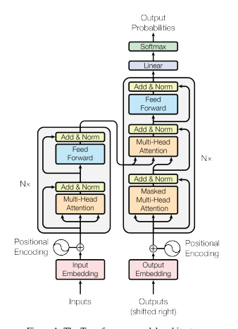
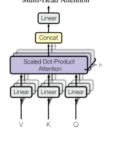
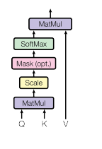
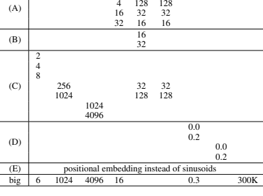
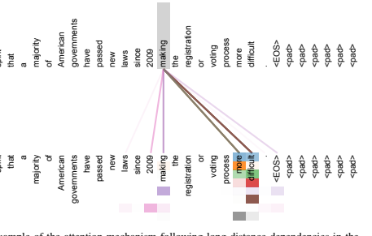
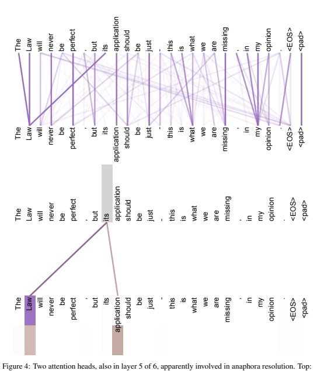
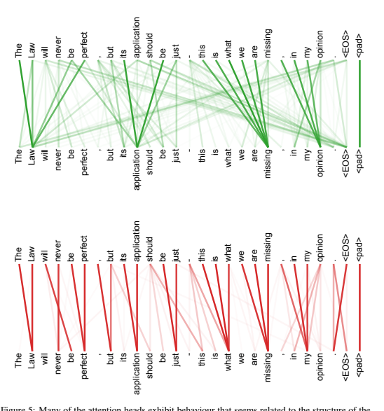

 attention mechanism to draw global dependencies between input and output.

The Transformer allows for significantly more parallelization and can reach a new state of the art in translation quality after being trained for as little as twelve hours on eight P100 GPUs.

## 2 Background

The goal of reducing sequential computation also forms the foundation of the Extended Neural GPU
[16], ByteNet [18] and ConvS2S [9], all of which use convolutional neural networks as basic building block, computing hidden representations in parallel for all input and output positions. In these models, the number of operations required to relate signals from two arbitrary input or output positions grows in the distance between positions, linearly for ConvS2S and logarithmically for ByteNet. This makes it more difficult to learn dependencies between distant positions [12]. In the Transformer this is reduced to a constant number of operations, albeit at the cost of reduced effective resolution due to averaging attention-weighted positions, an effect we counteract with Multi-Head Attention as described in section 3.2.

Self-attention, sometimes called intra-attention is an attention mechanism relating different positions of a single sequence in order to compute a representation of the sequence. Self-attention has been used successfully in a variety of tasks including reading comprehension, abstractive summarization, textual entailment and learning task-independent sentence representations [4, 27, 28, 22].

End-to-end memory networks are based on a recurrent attention mechanism instead of sequencealigned recurrence and have been shown to perform well on simple-language question answering and language modeling tasks [34].

To the best of our knowledge, however, the Transformer is the first transduction model relying entirely on self-attention to compute representations of its input and output without using sequencealigned RNNs or convolution. In the following sections, we will describe the Transformer, motivate self-attention and discuss its advantages over models such as [17, 18] and [9].

## 3 Model Architecture

Most competitive neural sequence transduction models have an encoder-decoder structure [5, 2, 35].

Here, the encoder maps an input sequence of symbol representations (x1*, ..., x*n) to a sequence of continuous representations z = (z1*, ..., z*n). Given z, the decoder then generates an output sequence (y1*, ..., y*m) of symbols one element at a time. At each step the model is auto-regressive
[10], consuming the previously generated symbols as additional input when generating the next.

The image is a diagram of the Transformer model architecture, which is a type of neural network used in natural language processing tasks. The diagram is divided into two main sections: the encoder and the decoder. Each section consists of multiple layers, with the encoder having six identical layers and the decoder having six identical layers as well.

The encoder layers are composed of two sub-layers: a multi-head self-attention mechanism and a simple, positionwise fully connected feed-forward network. Both sub-layers are followed by a residual connection and layer normalization. The output of each sub-layer is LayerNorm(x + Sublayer(x)), where Sublayer(x) is the function implemented by the sub-layer itself. The dimension of the outputs from these sub-layers is dmodel = 512.

The decoder layers also have three sub-layers: the first two are identical to the encoder's sub-layers, and the third sub-layer performs multi-head attention over the output of the encoder stack. Similar to the encoder, the decoder's sub-layers are also followed by a residual connection and layer normalization. The output of each sub-layer is LayerNorm(x + Sublayer(x)), where Sublayer(x) is the function implemented by the sub-layer itself. The dimension of the outputs from these sub-layers is also dmodel = 512.

The diagram uses various colors to distinguish between different components of the model. The lines connecting the components are black, and the text within the diagram is white. The overall structure of the diagram is designed to provide a clear visual representation of how the Transformer model processes input and generates output.

The Transformer follows this overall architecture using stacked self-attention and point-wise, fully connected layers for both the encoder and decoder, shown in the left and right halves of Figure 1, respectively.

## 3.1 Encoder And Decoder Stacks

Encoder: The encoder is composed of a stack of N = 6 identical layers. Each layer has two sub-layers. The first is a multi-head self-attention mechanism, and the second is a simple, positionwise fully connected feed-forward network. We employ a residual connection [11] around each of the two sub-layers, followed by layer normalization [1]. That is, the output of each sub-layer is LayerNorm(x + Sublayer(x)), where Sublayer(x) is the function implemented by the sub-layer itself. To facilitate these residual connections, all sub-layers in the model, as well as the embedding layers, produce outputs of dimension dmodel = 512.

Decoder: The decoder is also composed of a stack of N = 6 identical layers. In addition to the two sub-layers in each encoder layer, the decoder inserts a third sub-layer, which performs multi-head attention over the output of the encoder stack. Similar to the encoder, we employ residual connections around each of the sub-layers, followed by layer normalization. We also modify the self-attention sub-layer in the decoder stack to prevent positions from attending to subsequent positions. This masking, combined with fact that the output embeddings are offset by one position, ensures that the predictions for position i can depend only on the known outputs at positions less than i.

## 3.2 Attention

An attention function can be described as mapping a query and a set of key-value pairs to an output, where the query, keys, values, and output are all vectors. The output is computed as a weighted sum

The image is a diagram that illustrates the structure of the Transformer model's attention mechanism. The diagram shows how queries, keys, and values are processed in parallel to compute the attention function. The attention function is scaled by √
1 dk
to prevent the dot products from getting too large. The output of the attention function is then concatenated and projected to obtain the final values. The diagram also shows how multi-head attention works, with multiple attention heads processing the input simultaneously. The attention mechanism is used in three different ways in the Transformer model: encoder-decoder attention, self-attention, and multi-head attention.

of the values, where the weight assigned to each value is computed by a compatibility function of the query with the corresponding key.

## 3.2.1 Scaled Dot-Product Attention

We call our particular attention "Scaled Dot-Product Attention" (Figure 2). The input consists of queries and keys of dimension dk, and values of dimension dv. We compute the dot products of the query with all keys, divide each by √dk, and apply a softmax function to obtain the weights on the values.

In practice, we compute the attention function on a set of queries simultaneously, packed together into a matrix Q. The keys and values are also packed together into matrices K and V . We compute the matrix of outputs as:

Attention($Q,K,V$) = softmax($\frac{QK^{T}}{\sqrt{d_{k}}}$)$V$ (1)
The two most commonly used attention functions are additive attention [2], and dot-product (multiplicative) attention. Dot-product attention is identical to our algorithm, except for the scaling factor of √
1 dk
. Additive attention computes the compatibility function using a feed-forward network with a single hidden layer. While the two are similar in theoretical complexity, dot-product attention is much faster and more space-efficient in practice, since it can be implemented using highly optimized matrix multiplication code.

While for small values of dk the two mechanisms perform similarly, additive attention outperforms dot product attention without scaling for larger values of dk [3]. We suspect that for large values of dk, the dot products grow large in magnitude, pushing the softmax function into regions where it has extremely small gradients 4. To counteract this effect, we scale the dot products by √
1 dk
.

## 3.2.2 Multi-Head Attention

Instead of performing a single attention function with dmodel-dimensional keys, values and queries, we found it beneficial to linearly project the queries, keys and values h times with different, learned linear projections to dk, dk and dv dimensions, respectively. On each of these projected versions of queries, keys and values we then perform the attention function in parallel, yielding dv-dimensional 4To illustrate why the dot products get large, assume that the components of q and k are independent random variables with mean 0 and variance 1. Then their dot product, q · k =Pdk i=1 qiki, has mean 0 and variance dk.

output values. These are concatenated and once again projected, resulting in the final values, as depicted in Figure 2. Multi-head attention allows the model to jointly attend to information from different representation subspaces at different positions. With a single attention head, averaging inhibits this.

 MultiHead$(Q,K,V)=\text{Concat}(\text{head}_1,...,\text{head}_h)W^O$  >where $\text{head}_i=\text{Attention}(QW_i^Q,KW_i^K,VW_i^V)$. 
Where the projections are parameter matrices W
Q
i ∈ R
dmodel×dk , W K
i ∈ R
dmodel×dk , WV
i ∈ R
dmodel×dv and WO ∈ R
hdv×dmodel.

In this work we employ h = 8 parallel attention layers, or heads. For each of these we use dk = dv = dmodel/h = 64. Due to the reduced dimension of each head, the total computational cost is similar to that of single-head attention with full dimensionality.

## 3.2.3 Applications Of Attention In Our Model

The Transformer uses multi-head attention in three different ways:

- In "encoder-decoder attention" layers, the queries come from the previous decoder layer, and the memory keys and values come from the output of the encoder. This allows every positionsubsequent positions. This masking, combined with fact that the output embeddings are offset by one position, ensures that the predictions for position i can depend only on the known outputs at positions less than i.

## 3.2 Attention

An attention function can be described as mapping a query and a set of key-value pairs to an output, where the query, keys, values, and output are all vectors. The output is computed as a weighted sum

The image is a diagram that illustrates the structure of an attention mechanism in a neural network model. The diagram shows how queries, keys, and values are processed through multiple layers to produce an output. The attention mechanism is described as "Scaled Dot-Product Attention" and involves computing dot products between queries and keys, dividing by the square root of the key dimension, and applying a softmax function to obtain weights on the values. The diagram also shows how multi-head attention is implemented, where queries, keys, and values are linearly projected h times with different learned linear projections to dk, dk, and dv dimensions, respectively. The outputs from each head are concatenated and once again projected, resulting in the final values. The Transformer model uses this attention mechanism in three different ways: encoder-decoder attention, self-attention, and cross-attention. The diagram is color-coded, with different colors representing different components of the attention mechanism.

of the values, where the weight assigned to each value is computed by a compatibility function of the query with the corresponding key.

## 3.2.1 Scaled Dot-Product Attention

We call our particular attention "Scaled Dot-Product Attention" (Figure 2). The input consists of queries and keys of dimension dk, and values of dimension dv. We compute the dot products of the query with all keys, divide each by √dk, and apply a softmax function to obtain the weights on the values.

In practice, we compute the attention function on a set of queries simultaneously, packed together into a matrix Q. The keys and values are also packed together into matrices K and V . We compute the matrix of outputs as:

Attention($Q,K,V$) = softmax($\frac{QK^{T}}{\sqrt{d_{k}}}$)$V$ (1)
The two most commonly used attention functions are additive attention [2], and dot-product (multiplicative) attention. Dot-product attention is identical to our algorithm, except for the scaling factor of √
1 dk
. Additive attention computes the compatibility function using a feed-forward network with a single hidden layer. While the two are similar in theoretical complexity, dot-product attention is much faster and more space-efficient in practice, since it can be implemented using highly optimized matrix multiplication code.

While for small values of dk the two mechanisms perform similarly, additive attention outperforms dot product attention without scaling for larger values of dk [3]. We suspect that for large values of dk, the dot products grow large in magnitude, pushing the softmax function into regions where it has extremely small gradients 4. To counteract this effect, we scale the dot products by √
1 dk
.

## 3.2.2 Multi-Head Attention

Instead of performing a single attention function with dmodel-dimensional keys, values and queries, we found it beneficial to linearly project the queries, keys and values h times with different, learned linear projections to dk, dk and dv dimensions, respectively. On each of these projected versions of queries, keys and values we then perform the attention function in parallel, yielding dv-dimensional 4To illustrate why the dot products get large, assume that the components of q and k are independent random variables with mean 0 and variance 1. Then their dot product, q · k =Pdk i=1 qiki, has mean 0 and variance dk.

output values. These are concatenated and once again projected, resulting in the final values, as depicted in Figure 2. Multi-head attention allows the model to jointly attend to information from different representation subspaces at different positions. With a single attention head, averaging inhibits this.

 MultiHead$(Q,K,V)=\text{Concat}(\text{head}_1,...,\text{head}_h)W^O$  >where $\text{head}_i=\text{Attention}(QW_i^Q,KW_i^K,VW_i^V)$. 
Where the projections are parameter matrices W
Q
i ∈ R
dmodel×dk , W K
i ∈ R
dmodel×dk , WV
i ∈ R
dmodel×dv and WO ∈ R
hdv×dmodel.

In this work we employ h = 8 parallel attention layers, or heads. For each of these we use dk = dv = dmodel/h = 64. Due to the reduced dimension of each head, the total computational cost is similar to that of single-head attention with full dimensionality.

## 3.2.3 Applications Of Attention In Our Model

The Transformer uses multi-head attention in three different ways:

- In "encoder-decoder attention" layers, the queries come from the previous decoder layer, and the memory keys and values come from the output of the encoder. This allows every position WMT 2014 English-to-French translation task, our big model achieves a BLEU score of 41.0, outperforming all of the previously published single models, at less than 1/4 the training cost of the previous state-of-the-art model. The Transformer (big) model trained for English-to-French used dropout rate P*drop* = 0.1, instead of 0.3.

For the base models, we used a single model obtained by averaging the last 5 checkpoints, which were written at 10-minute intervals. For the big models, we averaged the last 20 checkpoints. We used beam search with a beam size of 4 and length penalty α = 0.6 [38]. These hyperparameters were chosen after experimentation on the development set. We set the maximum output length during inference to input length + 50, but terminate early when possible [38].

Table 2 summarizes our results and compares our translation quality and training costs to other model architectures from the literature. We estimate the number of floating point operations used to train a model by multiplying the training time, the number of GPUs used, and an estimate of the sustained single-precision floating-point capacity of each GPU 5.

## 6.2 Model Variations

To evaluate the importance of different components of the Transformer, we varied our base model in different ways, measuring the change in performance on English-to-German translation on the 5We used values of 2.8, 3.7, 6.0 and 9.5 TFLOPS for K80, K40, M40 and P100, respectively.

Table 3: Variations on the Transformer architecture. Unlisted values are identical to those of the base model. All metrics are on the English-to-German translation development set, newstest2013. Listed perplexities are per-wordpiece, according to our byte-pair encoding, and should not be compared to per-word perplexities.

N dmodel dff h dk dv P*drop* ϵlstrain PPL BLEU params

steps (dev) (dev) ×106

base 6 512 2048 8 64 64 0.1 0.1 100K 4.92 25.8 65

The image is a screenshot of a research paper discussing the performance of a Transformer model in English-to-French translation and English constituency parsing tasks. The image contains text that describes the experiments conducted on the Transformer architecture, including variations in attention heads, key and value dimensions, dropout rate, and positional encoding. The text also presents results from these experiments in tables, showing perplexities, BLEU scores, and other metrics. The image is structured with different sections for each task, and the text is primarily in black color on a white background. There are no images or graphics within the image; it is purely textual.

1 512 512 5.29 24.9 4 128 128 5.00 25.5 32 5.01 25.4 60 256 32 32 5.75 24.5 28 1024 128 128 4.66 26.0 168 1024 5.12 25.4 53 4096 4.75 26.2 90 0.0 5.77 24.6 0.2 4.95 25.5 0.0 4.67 25.3 0.2 5.47 25.7
development set, newstest2013. We used beam search as described in the previous section, but no checkpoint averaging. We present these results in Table 3.

In Table 3 rows (A), we vary the number of attention heads and the attention key and value dimensions, keeping the amount of computation constant, as described in Section 3.2.2. While single-head attention is 0.9 BLEU worse than the best setting, quality also drops off with too many heads.

In Table 3 rows (B), we observe that reducing the attention key size dk hurts model quality. This suggests that determining compatibility is not easy and that a more sophisticated compatibility function than dot product may be beneficial. We further observe in rows (C) and (D) that, as expected, bigger models are better, and dropout is very helpful in avoiding over-fitting. In row (E) we replace our sinusoidal positional encoding with learned positional embeddings [9], and observe nearly identical results to the base model.

## 6.3 English Constituency Parsing

To evaluate if the Transformer can generalize to other tasks we performed experiments on English constituency parsing. This task presents specific challenges: the output is subject to strong structural constraints and is significantly longer than the input. Furthermore, RNN sequence-to-sequence models have not been able to attain state-of-the-art results in small-data regimes [37].

We trained a 4-layer transformer with d*model* = 1024 on the Wall Street Journal (WSJ) portion of the Penn Treebank [25], about 40K training sentences. We also trained it in a semi-supervised setting, using the larger high-confidence and BerkleyParser corpora from with approximately 17M sentences [37]. We used a vocabulary of 16K tokens for the WSJ only setting and a vocabulary of 32K tokens for the semi-supervised setting.

We performed only a smating of the ACL, pages 433–440. ACL, July 2006.

[30] Ofir Press and Lior Wolf. Using the output embedding to improve language models. *arXiv* preprint arXiv:1608.05859, 2016.

[31] Rico Sennrich, Barry Haddow, and Alexandra Birch. Neural machine translation of rare words with subword units. *arXiv preprint arXiv:1508.07909*, 2015.

[32] Noam Shazeer, Azalia Mirhoseini, Krzysztof Maziarz, Andy Davis, Quoc Le, Geoffrey Hinton, and Jeff Dean. Outrageously large neural networks: The sparsely-gated mixture-of-experts layer. *arXiv preprint arXiv:1701.06538*, 2017.

[33] Nitish Srivastava, Geoffrey E Hinton, Alex Krizhevsky, Ilya Sutskever, and Ruslan Salakhutdinov. Dropout: a simple way to prevent neural networks from overfitting. Journal of Machine Learning Research, 15(1):1929–1958, 2014.
[34] Sainbayar Sukhbaatar, Arthur Szlam, Jason Weston, and Rob Fergus. End-to-end memory networks. In C. Cortes, N. D. Lawrence, D. D. Lee, M. Sugiyama, and R. Garnett, editors, Advances in Neural Information Processing Systems 28, pages 2440–2448. Curran Associates, Inc., 2015.

[35] Ilya Sutskever, Oriol Vinyals, and Quoc VV Le. Sequence to sequence learning with neural networks. In *Advances in Neural Information Processing Systems*, pages 3104–3112, 2014.
[36] Christian Szegedy, Vincent Vanhoucke, Sergey Ioffe, Jonathon Shlens, and Zbigniew Wojna.

Rethinking the inception architecture for computer vision. *CoRR*, abs/1512.00567, 2015.

[37] Vinyals & Kaiser, Koo, Petrov, Sutskever, and Hinton. Grammar as a foreign language. In Advances in Neural Information Processing Systems, 2015.

[38] Yonghui Wu, Mike Schuster, Zhifeng Chen, Quoc V Le, Mohammad Norouzi, Wolfgang Macherey, Maxim Krikun, Yuan Cao, Qin Gao, Klaus Macherey, et al. Google's neural machine translation system: Bridging the gap between human and machine translation. *arXiv preprint* arXiv:1609.08144, 2016.
[39] Jie Zhou, Ying Cao, Xuguang Wang, Peng Li, and Wei Xu. Deep recurrent models with fast-forward connections for neural machine translation. *CoRR*, abs/1606.04199, 2016.

[40] Muhua Zhu, Yue Zhang, Wenliang Chen, Min Zhang, and Jingbo Zhu. Fast and accurate shift-reduce constituent parsing. In Proceedings of the 51st Annual Meeting of the ACL (Volume 1: Long Papers), pages 434–443. ACL, August 2013.

## Attention Visualizations Input-Input Layer5

Itisinthis spirit thata

The image appears to be a visual representation of attention mechanisms in neural networks. The image is divided into three sections, each representing a different aspect of attention mechanisms.

The first section shows a flow chart with various nodes and arrows connecting them. This flow chart represents the process of attention mechanisms in neural networks. The nodes likely represent different layers or components of the network, while the arrows indicate the flow of information between these components.

The second section displays a bar graph with multiple bars of varying heights. This graph likely represents the attention mechanism's ability to focus on different parts of the input data. The height of each bar may correspond to the importance or relevance of that particular part of the input data.

The third section contains a series of images labeled as "12\_image\_0.png", "13\_image\_0.png", and "14\_image\_0.png". These images are likely visual representations of attention mechanisms in action, showing how the network focuses on specific parts of the input data.

Overall, the image seems to be an educational tool or visualization aid for understanding how attention mechanisms work within neural networks.

ting of the ACL, pages 433–440. ACL, July 2006.

[30] Ofir Press and Lior Wolf. Using the output embedding to improve language models. *arXiv* preprint arXiv:1608.05859, 2016.

[31] Rico Sennrich, Barry Haddow, and Alexandra Birch. Neural machine translation of rare words with subword units. *arXiv preprint arXiv:1508.07909*, 2015.

[32] Noam Shazeer, Azalia Mirhoseini, Krzysztof Maziarz, Andy Davis, Quoc Le, Geoffrey Hinton, and Jeff Dean. Outrageously large neural networks: The sparsely-gated mixture-of-experts layer. *arXiv preprint arXiv:1701.06538*, 2017.

[33] Nitish Srivastava, Geoffrey E Hinton, Alex Krizhevsky, Ilya Sutskever, and Ruslan Salakhutdinov. Dropout: a simple way to prevent neural networks from overfitting. Journal of Machine Learning Research, 15(1):1929–1958, 2014.
[34] Sainbayar Sukhbaatar, Arthur Szlam, Jason Weston, and Rob Fergus. End-to-end memory networks. In C. Cortes, N. D. Lawrence, D. D. Lee, M. Sugiyama, and R. Garnett, editors, Advances in Neural Information Processing Systems 28, pages 2440–2448. Curran Associates, Inc., 2015.

[35] Ilya Sutskever, Oriol Vinyals, and Quoc VV Le. Sequence to sequence learning with neural networks. In *Advances in Neural Information Processing Systems*, pages 3104–3112, 2014.
[36] Christian Szegedy, Vincent Vanhoucke, Sergey Ioffe, Jonathon Shlens, and Zbigniew Wojna.

Rethinking the inception architecture for computer vision. *CoRR*, abs/1512.00567, 2015.

[37] Vinyals & Kaiser, Koo, Petrov, Sutskever, and Hinton. Grammar as a foreign language. In Advances in Neural Information Processing Systems, 2015.

[38] Yonghui Wu, Mike Schuster, Zhifeng Chen, Quoc V Le, Mohammad Norouzi, Wolfgang Macherey, Maxim Krikun, Yuan Cao, Qin Gao, Klaus Macherey, et al. Google's neural machine translation system: Bridging the gap between human and machine translation. *arXiv preprint* arXiv:1609.08144, 2016.
[39] Jie Zhou, Ying Cao, Xuguang Wang, Peng Li, and Wei Xu. Deep recurrent models with fast-forward connections for neural machine translation. *CoRR*, abs/1606.04199, 2016.

[40] Muhua Zhu, Yue Zhang, Wenliang Chen, Min Zhang, and Jingbo Zhu. Fast and accurate shift-reduce constituent parsing. In Proceedings of the 51st Annual Meeting of the ACL (Volume 1: Long Papers), pages 434–443. ACL, August 2013.

## Attention Visualizations Input-Input Layer5

Itisinthis spirit thata

The image appears to be a visual representation of attention mechanisms in neural networks, specifically focusing on the attention heads in layer 5 of an architecture. The top part of the image shows a network diagram with multiple layers and connections between nodes, which are likely to represent neurons or units within the network. The purple lines indicate the flow of information or attention between these nodes.

The bottom section of the image contains text that seems to be references to various research papers related to neural networks and attention mechanisms. These references suggest that the image is likely used in an academic or research context to illustrate the concept of attention in neural networks.

The image also includes a caption that reads "Attention Visualizations Input-Input Layer5," which further indicates that the visualization is focused on the attention mechanism within the input layer of a neural network architecture.

In summary, the image is a visual representation of attention mechanisms in neural networks, specifically highlighting the attention heads in layer 5. It is accompanied by references to research papers that likely provide more context or background on the topic.

ting of the ACL, pages 433–440. ACL, July 2006.

[30] Ofir Press and Lior Wolf. Using the output embedding to improve language models. *arXiv* preprint arXiv:1608.05859, 2016.

[31] Rico Sennrich, Barry Haddow, and Alexandra Birch. Neural machine translation of rare words with subword units. *arXiv preprint arXiv:1508.07909*, 2015.

[32] Noam Shazeer, Azalia Mirhoseini, Krzysztof Maziarz, Andy Davis, Quoc Le, Geoffrey Hinton, and Jeff Dean. Outrageously large neural networks: The sparsely-gated mixture-of-experts layer. *arXiv preprint arXiv:1701.06538*, 2017.

[33] Nitish Srivastava, Geoffrey E Hinton, Alex Krizhevsky, Ilya Sutskever, and Ruslan Salakhutdinov. Dropout: a simple way to prevent neural networks from overfitting. Journal of Machine Learning Research, 15(1):1929–1958, 2014.
[34] Sainbayar Sukhbaatar, Arthur Szlam, Jason Weston, and Rob Fergus. End-to-end memory networks. In C. Cortes, N. D. Lawrence, D. D. Lee, M. Sugiyama, and R. Garnett, editors, Advances in Neural Information Processing Systems 28, pages 2440–2448. Curran Associates, Inc., 2015.

[35] Ilya Sutskever, Oriol Vinyals, and Quoc VV Le. Sequence to sequence learning with neural networks. In *Advances in Neural Information Processing Systems*, pages 3104–3112, 2014.
[36] Christian Szegedy, Vincent Vanhoucke, Sergey Ioffe, Jonathon Shlens, and Zbigniew Wojna.

Rethinking the inception architecture for computer vision. *CoRR*, abs/1512.00567, 2015.

[37] Vinyals & Kaiser, Koo, Petrov, Sutskever, and Hinton. Grammar as a foreign language. In Advances in Neural Information Processing Systems, 2015.

[38] Yonghui Wu, Mike Schuster, Zhifeng Chen, Quoc V Le, Mohammad Norouzi, Wolfgang Macherey, Maxim Krikun, Yuan Cao, Qin Gao, Klaus Macherey, et al. Google's neural machine translation system: Bridging the gap between human and machine translation. *arXiv preprint* arXiv:1609.08144, 2016.
[39] Jie Zhou, Ying Cao, Xuguang Wang, Peng Li, and Wei Xu. Deep recurrent models with fast-forward connections for neural machine translation. *CoRR*, abs/1606.04199, 2016.

[40] Muhua Zhu, Yue Zhang, Wenliang Chen, Min Zhang, and Jingbo Zhu. Fast and accurate shift-reduce constituent parsing. In Proceedings of the 51st Annual Meeting of the ACL (Volume 1: Long Papers), pages 434–443. ACL, August 2013.

## Attention Visualizations Input-Input Layer5

Itisinthis spirit thata

The image appears to be a visual representation of attention mechanisms in neural networks, specifically focusing on the structure of the attention mechanism. The top part of the image shows a series of green lines connecting various phrases, suggesting a network of attention between different parts of the input and output layers. The bottom part of the image displays a similar network but with red lines, indicating another aspect or layer of attention. The phrases connected by these lines suggest that the model is paying attention to certain parts of the input when generating the output.

The image also includes a reference to "Figure 5: Many of the attention heads exhibit behaviour that seems related to the structure of the attention mechanism." This suggests that the image is part of a larger study or paper discussing the behavior of attention heads in neural networks. The references at the bottom indicate that this image is likely from a research paper or academic publication, citing various studies and papers related to neural networks and attention mechanisms.

