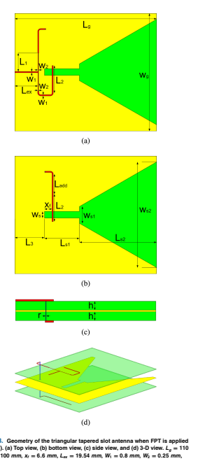
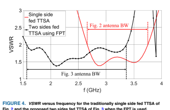
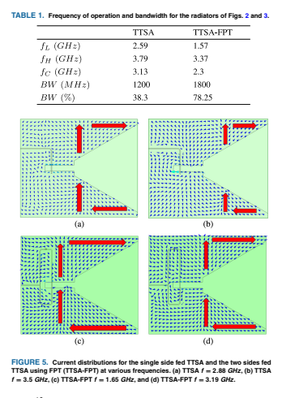
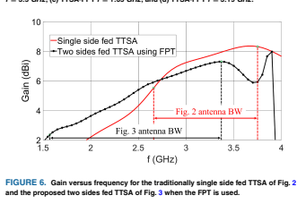
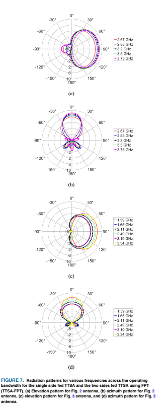

Received 2 October 2023; accepted 24 October 2023. Date of publication 2 November 2023; date of current version 21 November 2023.

Digital Object Identifier 10.1109/OJAP.2023.3329762

# Increasing The Bandwidth Of Wideband Antennas Using The Frequency Pulling Technique

ANASTASIOS G. KOUTINOS (Member, IEEE), CONSTANTINOS L. ZEKIOS (Senior Member, IEEE),
AND STAVROS V. GEORGAKOPOULOS **(Senior Member, IEEE)**
College of Engineering and Computing, Florida International University, Miami, FL 33174, USA
CORRESPONDING AUTHOR: A. G. KOUTINOS (e-mail: akoutino@fiu.edu)
This work was supported by the Air Force Office of Scientific Research under Grant FA9550-21-1-0309 and Grant FA9550-19-1-0290.

ABSTRACT Frequency pulling technique (FPT) is a recently developed method for increasing the bandwidth (BW) of microstrip antennas. It is based on the insertion loss methodology used for the design of bandpass filters. Namely, to apply this technique, the resonators in a bandpass filter are replaced with antennas that have identical equivalent resonant circuits. Also, all the equivalent resonant circuits can represent symmetrical feeding points of a single antenna. Therefore, when these circuits are properly connected in accordance with the FPT rules, they create a matching network that increases the BW of a single antenna. However, prior studies on this method are limited to (1) narrowband antenna designs,
(2) antennas with feeding points located at the same plane, and (3) feeding networks implemented as single feeding lines (e.g., microstrip lines) which have introduced several limitations and design complexities.

In this work, we address these challenges by (1) extending FPT to wideband designs, (2) using feeding points located at different planes, and (3) designing feeding networks as unequal power dividers. Such networks not only simplify the design complexities associated with the traditional approach but also offer the capability to apply FPT to non-planar designs (e.g., 3D antenna configurations). To demonstrate the latter, we properly engineer a triangular tapered slot antenna, feeding it with a coupled microstrip line.

As a result, the bandwidth of our modeled antenna increases from 34.51% to 78.25%, demonstrating excellent agreement between simulated and measured results. INDEX TERMS Antenna theory, antenna feed, bandwidth enhancement, compact antennas, patch antennas, wideband matching.

## I. Introduction

TECHNIQUES for increasing the bandwidth (BW) of antennas have been extensively explored since the inception of antennas. Notably, the first horn antenna was created by Bose in 1897, who introduced the concept of tapering a waveguide [1], while Barrow invented in 1933 the first modern horn antenna, [2]. Theoretical studies by Wheeler [3] and Chu [4] in 1947 and 1948, respectively, showed that increasing the size of a radiator leads to an increase in its bandwidth. In 1978, Gibson invented the Vivaldi antenna [5], which exhibited increased BW by appropriately tapering the antenna's aperture.

Also, various techniques have been developed to enhance the bandwidth of microstrip antennas. For instance, Pozar in [6] demonstrated that increasing the thickness of a printed antenna and decreasing its dielectric constant can improve its bandwidth. Kala and Pant [7] obtained a 6% bandwidth in the case of a planar-rectangular patch antenna by using an L-shaped probe excitation. Ansari et al. [8] introduced a three-layer patch antenna topology that showed a bandwidth of 42.7%, while Perli and Rao [9] used a characteristic mode analysis on a microstrip patch antenna to excite multiple modes and achieve a 70% bandwidth. Ollikainen and Vainikainen [10] divided a wide patch antenna into one active and two parasitically coupled ones to achieve an
-c 2023 The Authors. This work is licensed under a Creative Commons Attribution 4.0 License. For more information, see https://creativecommons.org/licenses/by/4.0/
8.4% bandwidth, and Rahman and Stuchly [11] increased the bandwidth of a square patch antenna by 2.5 times using asymmetries.1 Recently, Jang et al. [12] proposed an E-shape patch antenna and achieved a 25% bandwidth using an L-shaped probe located under the patch. Similarly, Xiao et al. [13] proposed a magnetoelectric dipole antenna with 61.7% bandwidth using a similar approach. Finally, Sun and Luk [14] replaced the typical metallic L-shaped probe introduced in [7] with a water-based one to create an almost completely transparent antenna, which achieves a 42.6% bandwidth.

The method of differential feeding is another approach commonly used to improve the bandwidth of various printed antennas. For example, Chen and Yang [15]
designed a filtering antenna with a 20.7% bandwidth, while Shamsaee Malfajani et al. [16] achieved a 23% bandwidth with their cavity-backed dielectric resonator antenna.

Locatelli et al. [17] obtained a 51.75% bandwidth with their dual monopoles, and Tu et al. [18] achieved a bandwidth of 126% with their co-planar waveguide (CPW) tapered slot antenna. Wang and Wu [19] used both common and differential modes to design a sub-6 GHz antenna with a 44.5% bandwidth, while Liu et al. [20] proposed a deployable differentially fed dual-polarized patch antenna that exhibited a 16% bandwidth.

Another technique for increasing the bandwidth of printed antennas is based on precise modifications to their radiating surfaces. This could be accomplished by creating slots on the radiating aperture. For example, Lian et al., achieved a greater than 40% bandwidth by using an X-type slot, as described in [21]. Similarly, Liu et al., achieved a BW of 122% by cutting a part of the ground plane and the opposite corners of a patch antenna [22]. Another approach is the design of cavity-backed antennas, such as the works presented in [16] and [23], that achieved a 26% and 20.36%
fractional bandwidth, respectively.

Even though several methods have been able to increase the bandwidth of specific antennas, it has not been possible to systematically apply them to broaden the bandwidth of any antenna geometry. Specifically, there has not been until recently a methodology that allows designers to increase the bandwidth of any antenna. To achieve this, we recently introduced a technique called the frequency pulling technique
(FPT) in [24]. Specifically, we showed that by feeding a microstrip patch antenna with a single line at multiple symmetric feeding points we can increase its bandwidth multiple times.2 However, this prior study had some limitations: (1) it was focused on narrowband designs, (2) all feeding points were located at the same plane, and (3) a single feeding line was used, introducing specific design complexities that could only be addressed with the use of optimization. In this work, we address these challenges by (1) extending our technique to wideband designs, (2) using feeding points located at different planes, and (3) designing a feeding network as an unequal power divider, which (a) simplifies the design complexity of our traditional approach by introducing additional design-related degrees of freedom, and (b) gives the ability to applying FPT to non-planar designs (e.g., 3D antenna designs).

Our paper is organized as follows. Section II provides a short review of the FPT methodology. Section III described the antenna geometry that was chosen. Sections IV present our simulated and measured results, respectively. Finally, Section V provides our conclusions.

## Ii. Frequency Pulling Technique Overview

For completeness, this section provides an overview of the traditional frequency pulling technique. A more detailed analysis can be found in [24]. The technique assumes that the radiating element operates at a single mode and can be fed at N symmetric points. The use of symmetric feed points is crucial for the success of the technique to ensure that all the points excite the same antenna mode. Next, the desired bandwidth increase (e.g., two times, ..., N times) is defined.

Once the N symmetric feed points have been identified, the following steps are conducted:
Step 1: Create a Chebychev equal-ripple response Nthorder bandpass filter using the insertion loss method. The filter consists of lumped components that include in-series and in-parallel resonators, as shown in Fig. 1(a). The ripplelevel must be 0.45 dB or lower to ensure S11 ≤ −10 dB throughout the passband.

Step 2: Use 90o impedance inverters (refer to Fig. 1(b)),
to convert the in-series resonators to shuntconnected parallel resonators. Each resonator should have a resistor to account for its losses.

Step 3: Observe that the microstrip patch antenna's equivalent circuit comprises of resonant R, L,
and C components connected in parallel, as shown in [25, Ch. 14 and Fig. 14.4b]. Thus, each resonant circuit from the filter design process in Step 2 can be interpreted as a microstrip patch antenna with different feeding points, as depicted in Fig. 1(c).

Step 4: Select one of the feeding points to be the input impedance (Zin) of the equivalent filter and choose another feeding point to be the output impedance (*Zout*) of the equivalent filter. To prevent reflections and achieve perfect matching, set the characteristic impedance (Zch) of the filter to be equal to both the input and output filter impedances, such that Zin = Zout = Zch.

Step 5: Use the equivalent filter design created in Step 2 and develop a feed network that connects all of the feeding points to each other, as shown in Fig. 1(d). The input impedance of the feeding network (or the equivalent filter) is the input impedance of the radiating element.

Notably, Fig. 1 illustrates how FPT is applied to an antenna with two feed points. The feeding network can be realized as an unequal power divider, which is indicated by the black frame in Fig. 1(b). The divider can have different output amplitudes, phases, or both. Fig. 1(e) shows the schematic of the feeding network when it is realized as a power divider.

## Iii. Geometry Of The Triangular Tapered Slot Antenna

In this work, we extend the FPT to wideband designs. Specifically, for our analysis, we use the triangular tapered slot antenna (TTSA). The TTSA is a Vivaldi antenna with an exponential rate of zero, as Shin in [26] showed; therefore, it can be fed using a coupled microstrip line rather than a tapered microstrip line with a flared stub used in traditional Vivaldi elements. Our TTSA design is shown in Fig. 2.

This antenna has low complexity as it consists of a ground plane with a triangular slot ending in a rectangular slot on one side of the substrate, and a coupled microstrip feed line located on the opposite side. The substrate used for this design is a Rogers RO4003 dielectric substrate with
-r = 3.55, tanδ = 0.0027, and thickness h = 0.508 mm.

Notably, optimization was used to determine parameters, such as the exact position and total length of the microstrip line. To apply the FPT method to our antenna, it is necessary to feed it through a point that is symmetric to the first point. However, in the traditional FPT approach all feeding points are located at the same plane. Here, we follow a fundamentally different approach. Specifically, by properly engineering our antenna, we create two symmetric points as part of two different planes. This simple yet elegant modification is very significant suggesting that we can manipulate any given structure, and with the proper modifications, we can effectively establish symmetric points that, when needed,

can be utilized to apply FPT and increase the bandwidth of any antenna. Namely, to achieve this, a second substrate, identical to the first one, is placed below the ground plane.

This creates a three-layer structure, where the tapered slot is sandwiched between two substrate layers. Notably, unlike other antennas, covering the radiating element in our antenna with a dielectric material does not cause any problems, since it is designed to have end-fire characteristics. Once the feeding points of our antenna are identified, the proper feeding network needs to be designed. Traditionally, the FPT methodology employs a single line (e.g., a microstrip line), designed to pass through each feeding point. However, in our case, this form of feeding network is not applicable. To address

this challenge, we reimagine the conventional FPT feeding network and replace it with an unequal power divider.

This novel network not only simplifies the design complexity associated with the traditional single-fed FPT approach, but also broadens the applicability of FPT to non-planar antenna designs, such as 3D antenna structures. The latter, however, is out of the scope of this work and it will be addressed in the future. Therefore, for this particular design, the feeding network is an unequal power divider located on the top and bottom layers of our studied geometry. This divider is made up of two microstrip lines of 50 Ohm each, coupled to the radiating slot, and each line is connected to a λg/4 (λg|@fc=2.5 Ghz = 64 mm) impedance inverter that is terminated to a characteristic impedance of 100 Ohm.

The two microstrip lines then connect to another 50 Ohm microstrip line, which can be connected to an SMA. The top and bottom parts of the divider are connected using a via, and one of the 50 Ohm lines is split into two halves. This line has a different length compared to its counterpart, which ensures the required phase difference. The antenna geometry, along with all the necessary dimensions, is shown in Fig. 3.

We call this antenna TTSA-FPT and it is important to note that, apart from its double thickness due to the second substrate, the footprint of this antenna (where we apply the FPT)
remains the same with the one of our original antenna. The VSWR and bandwidth of the triangular tapered slot antenna before and after applying the FPT are compared in Fig. 4 and Table 1, respectively. Namely, in Table 1 the lowest, central, and highest frequency of operation of each antenna are tabulated along with their corresponding absolute and fractional bandwidths. As it is observed, by applying our FPT method, the TTSA doubles its bandwidth.3 This is expected based on the FPT theory, since we utilized two symmetric feed points in our TTSA design with the FPT [24].

Finally, to further examine the behavior of our proposed design, Fig. 5 compares the current distributions of the single side fed TTSA and the two sides fed TTSA at several frequencies.

3. In this work, the bandwidth of operation uses the threshold of VSRW = 2.

Namely, the blue arrows are used to show the current distribution while the red arrows are used to show the current path that the distribution follows. As it can be seen, all distributions are identical to each other across all frequencies and for both designs. Therefore, it is evident that both designs operate at the same mode. In addition, to investigate the radiation characteristics of the TTSA, before and after we apply the FPT, Fig. 6 shows the gain and Fig. 7 shows the elevation and azimuth radiation patterns of both antennas at various frequencies across their corresponding bandwidths.

Our results show that the TTSA designed using the FPT
not only exhibits double the bandwidth of the TTSA, but

also maintains consistent radiation characteristics across this larger bandwidth.

IV.  EXPERIMENTAL VALIDATION To validate our findings, we utilized our in-house LPKF
Protolaser equipment to fabricate the tapered slot antenna

shown in Fig. 8 [27]. Notably, a via was used in our design to establish electrical connection between the different layers of our TTSA structure.

Fig. 9 compares the simulated and measured VSWR, and Fig. 10 compares the simulated and measured gain and efficiency, respectively. Excellent agreement is observed in all cases. Our results show that very good agreement is exhibited between our simulated and measured results. The slight shift in the frequencies of the two reflection coefficient responses can be attributed to potential variations in the dielectric constant of the simulated and measured substrates.

It should be noted that in our simulations, we used a Rogers RO4003C substrate with a dielectric constant of -r = 3.55.

However, according to the manufacturer, the dielectric constant of the Rogers RO4003C laminate can vary within a range of approximately 3.38 to 3.55. Notably, based on the responses of Fig. 9, the fabricated antenna looks to operate in a slightly wider bandwidth compared to the simulated one.

Specifically, it looks to also operate at frequencies between 3.37 GHz and 3.55 GHz. This behavior, however, is not surprising and is attributed to potential losses introduced to our antenna due to the in-house fabrication we conducted. The latter can be verified, by the gain and efficiency responses shown in Fig. 10, where a notable gain and efficiency drop is observed at these frequencies. Nevertheless, this is of no concern, as these frequencies are considered out-of-band, as discussed above. Finally, Figs. 11 and 12 compare the simulated and measured Co-pol and X-pol radiation patterns

at different frequencies (e.g., 1.59 GHz, 1.65 GHz, 2.11 GHz, 2.49 GHz, 3.19 GHz, and 3.34 GHz) across its bandwidth of operation showing a very good agreement overall.

The minor discrepancies observed between simulated and measured results, at some frequencies of the azimuth radiation pattern, are solely attributed to imperfections due to the in-house fabrication we conducted.

## V. Conclusion

In this work we improved our recently developed methodology.

FPT
Previous research was limited to
(1) narrowband antenna designs, (2) antennas with feeding points located at the same plane, and (3) feeding networks implemented as single feeding lines. In this work, we addressed these challenges and we (1) extended FPT to wideband designs, (2) used feeding points located at different planes, and (3) designed feeding networks as unequal power dividers. Specifically, we properly engineered a triangular tapered slot antenna and we fed it with a coupled microstrip line following the FPT methodology. As a result, we doubled the bandwidth of our TTSA. Notably, this bandwidth increase was achieved while maintaining the antenna's footprint and its radiation efficiency. Our simulations and measurements clearly proved the ability of FPT to increase the bandwidth of wideband antennas without compromising their radiation performance.

## References

[1] D. T. Emerson, "The work of Jagadis Chandra Bose: 100 years of millimeter-wave research," IEEE Trans. Microw. Theory Tech. , vol. 45, no. 12, pp. 2267-2273, Dec. 1997.
[2] K. S. Packard, "The origin of waveguides: A case of multiple rediscovery," *IEEE Trans. Microw. Theory Tech.*, vol. 32, no. 9, pp. 961–969, Sep. 1984.

[3] H. A. Wheeler, "Fundamental limitations of small antennas," *Proc.*
IRE, vol. 35, no. 12, pp. 1479–1484, Dec. 1947.

[4] L. J. Chu, "Physical limitations of omni-directional antennas," J. Appl.

Phys., vol. 19, pp. 1163–1175, Dec. 1948.

[5] P. J. Gibson, "The Vivaldi aerial," in *Proc. 9th Eur. Microw. Conf.*,
1979, pp. 101–105.

[6] D. M. Pozar, "Microstrip antennas," *Proc. IEEE*, vol. 80, no. 1, pp. 79–91, Jan. 1992.

[7] P. Kala and R. Pant, "L-probe fed planar-rectangular microstrip patch antenna mounted on a cylindrical ground surface," Int. J. Microw. Opt.

Technol., vol. 5, pp. 58–65, Mar. 2010.

[8] J. A. Ansari, N. P. Yadav, A. Mishra, P. Singh, and B. R. Vishvakarma,
"Analysis of multilayer rectangular patch antenna for broadband operation," *Wireless Pers. Commun.*, vol. 62, pp. 315–327, Jan. 2012.

[9] B. R. Perli and A. M. Rao, "Characteristic mode analysis of wideband microstrip antenna," *Prog. Electr. Res. C*, vol. 97, pp. 201–212, Jan. 2019.

[10] J. Ollikainen and P. Vainikainen, "Radiation and bandwidth characteristics of two planar multistrip antennas for mobile communication systems," in Proc. VTC '98. 48th IEEE Veh. Technol. Conf. Pathway Glob. Wireless Revol. (Cat. No. 98CH36151), 1998, pp. 1186–1190.

[11] M. Rahman and M. A. Stuchly, "Dual-polarization broadband patch antenna," *Microw. Opt. Technol. Lett.*, vol. 22, no. 6, pp. 414–420, 1999.

[12] T. H. Jang, K. P. Jung, and C. S. Park, "Broadband millimeter-wave antenna in package with L-probed E-shaped patch covering 57 GHz to 71 GHz," *IEEE Trans. Antennas Propag.*, vol. 71, no. 1, pp. 89–98, Jan. 2023.

[13] Z. Xiao, Y. Pan, X. Liu, and K. W. Leung, "A wideband magnetoelectric dipole antenna with wide beamwidth for millimeter-wave applications," *IEEE Antennas Wireless Propag. Lett.*, vol. 22, pp. 918–922, 2023.

[14] J. Sun and K.-M. Luk, "A fully transparent wideband water patch antenna with L-shaped feed," *IEEE Open J. Antennas Propag.*, vol. 2, pp. 968–975, 2021.

[15] B.-J. Chen and X.-S. Yang, "Compact dual-polarized filtering antenna based on differential feeding and double-layer metasurface," IEEE Trans. Antennas Propag., vol. 71, no. 1, pp. 1065–1070, Jan. 2023.

[16] R. Shamsaee Malfajani, J.-J. Laurin, and M. S. Sharawi, "Wideband substrate integrated cavity-backed dielectric resonator antenna at sub-6-GHz band," *IEEE Open J. Antennas Propag.*, vol. 4, pp. 60–68, 2023.

[17] A. Locatelli et al., "A planar, differential, and directive ultrawideband antenna," *IEEE Trans. Antennas Propag.*, vol. 58, no. 7, pp. 2439–2442, Jul. 2010.

[18] Z.-H. Tu, W.-A. Li, and Q.-X. Chu, "Single-layer differential CPWfed notch-band tapered-slot UWB antenna," IEEE Antennas Wireless Propag. Lett., vol. 13, pp. 1296–1299, 2014.

[19] H. Wang and P. Wu, "Wideband MIMO antennas for 5G mobile terminals," *IEEE Open J. Antennas Propag.*, vol. 4, pp. 74–80, 2023.

[20] A. Liu, J. Lu, P. K. Tan, and T. H. Gan, "A deployable wideband differential-fed dual-polarized patch antenna array," IEEE Open J.

Antennas Propag., vol. 4, pp. 141–150, 2023.

[21] R. Lian, Z. Wang, Y. Yin, J. Wu, and X. Song, "Design of a lowprofile dual-polarized stepped slot antenna array for base station,"
IEEE Antennas Wireless Propag. Lett., vol. 15, pp. 362–365, 2016.

[22] W. Liu, Y. Yin, W. Xu, and S. Zuo, "Compact open-slot antenna with bandwidth enhancement," *IEEE Antennas Wireless Propag. Lett.*,
vol. 10, pp. 850–853, 2011.

[23] X.-C. Wang, Y.-J. Xia, J.-H. Yang, and W.-Z. Lu, "Wideband highgain circularly polarized substrate integrated cavity antenna array for millimeter-wave applications," *IEEE Trans. Antennas Propag.*, vol. 71, no. 1, pp. 1041–1046, Jan. 2023.

[24] A. G. Koutinos, G. A. Kyriacou, J. L. Volakis, and M. T. Chryssomallis, "Bandwidth enhancement of antennas designed by band-pass filter synthesis due to frequency pulling techniques,"
IET Microw., Antennas Propag., vol. 16, no. 1, pp. 1–17, 2022.

[25] C. A. Balanis, *Antenna Theory: Analysis and Design*, 4th ed. Hoboken, NJ, USA: Wiley 2016.

[26] J. Shin and D. H. Schaubert, "A parameter study of stripline-fed Vivaldi notch-antenna arrays," *IEEE Trans. Antennas Propag.*, vol. 47, no. 5, pp. 879–886, May 1999.

[27] (LPKF Laser Electron. Co., Ltd, Garbsen, Germany). *Lpkf Protolaser* s4. Accessed: Aug. 18, 2023. [Online]. Available: https://www.lpkf. com/en/industries-technologies/research-in-house-pcb-prototyping/ products/lpkf-protolaser-s4 ANASTASIOS G. KOUTINOS (Member, IEEE)

 received the Diploma degree in electrical and computer engineering, the M.S. degree (with Hons.) in electrical and computer engineering communication and satellite telecommunication systems, and the Ph.D. degree (with Hons.) in electrical and computer engineering from the Democritus University of Thrace, Xanthi, Greece, in 2014, 2015, and 2022, respectively.

He has been a Postdoctoral Researcher with the Transforming Antennas Center, Florida International University since May 2022. His research is focused on the design of small antennas, bandwidth enhancement techniques, and miniaturization methods for RF devices. His research interests include RF-front-end design, communication and radar systems, and biomedical applications.

CONSTANTINOS L. ZEKIOS (Senior Member,

IEEE) received the Diploma degree (with Hons.)
in electrical and computer engineering, the M.S. degree (with Hons.) in electrical and computer engineering communication and satellite telecommunication systems, and the Ph.D. degree (with Hons.) in electrical and computer engineering from the Democritus University of Thrace, Xanthi, Greece, in 2008, 2011, and 2015, respectively.

He was a Postdoctoral Researcher with the Electrical and Computer Engineering Department, University of Massachusetts Amherst, Amherst, MA, USA, from January 2016 to May 2018, a Fellow Postdoctoral Researcher with the Transforming Antennas Center, Florida International University from May 2018 to August 2020, and a Research Assistant Professor with the Department of Electrical and Computer Engineering, Florida International University, Miami, FL,
USA, from September 2020 to July 2022, where he is currently an Assistant Professor with the Department of Electrical and Computer Engineering. His main research interests include theoretical and computational electromagnetics, optimization methods, antennas and antenna arrays, electromagnetic surfaces, beamforming networks, microwave engineering, and photonics.

STAVROS V. GEORGAKOPOULOS (Senior

Member, IEEE) received the Diploma degree in electrical engineering from the University of Patras, Patras, Greece, in June 1996, and the M.S. and Ph.D. degrees in electrical engineering from Arizona State University, Tempe, AZ, USA,
in 1998 and 2001, respectively.

From 2001 to 2007, he held a position as the Principal Engineer with SV Microwave, Inc. Since 2007, he has been with the Department of Electrical and Computer Engineering, Florida International University, Miami, FL, USA, where he is currently a Professor, the Director of the Transforming Antennas Center (a research center on foldable/origami, physically reconfigurable, and deployable antennas), and the Director of the RF Communications, Millimeter-Waves, and Terahertz Lab. His current research interests relate to novel antennas, arrays, RFID, microwave and RF systems, novel sensors, and wireless powering of portable, and wearable and implantable devices.

Dr. Georgakopoulos received the 2015 FIU President's Council Worlds Ahead Faculty Award, which is the highest honor FIU extends to a faculty member for excelling in research, teaching, mentorship, and service.

He served as an Associate Editor for the IEEE TRANSACTIONS ON
ANTENNAS AND PROPAGATION from 2013 to 2019, and currently serving as an Associate Editor for the IEEE OPEN JOURNAL OF ANTENNAS AND
PROPAGATION since 2019.