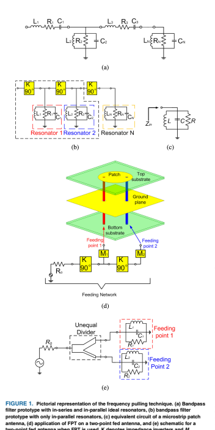
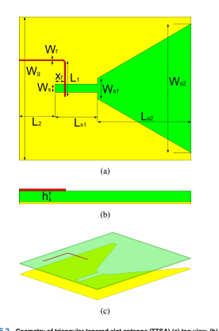
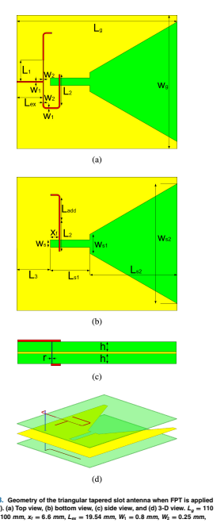
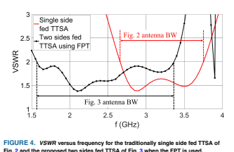
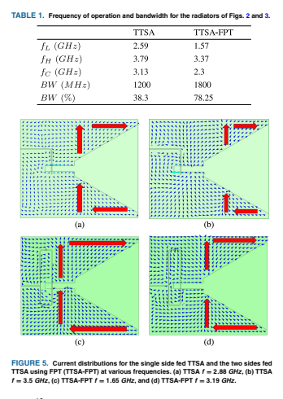
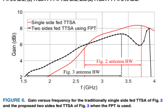
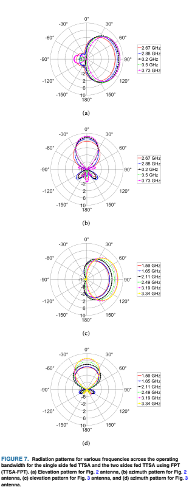
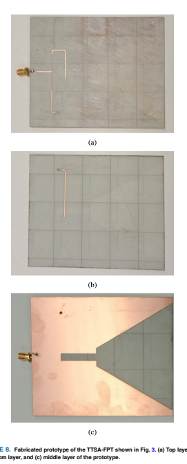
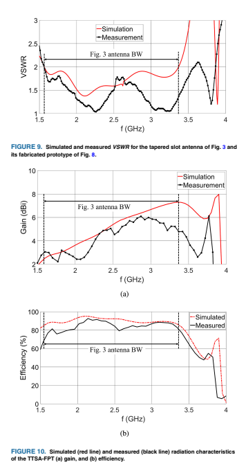
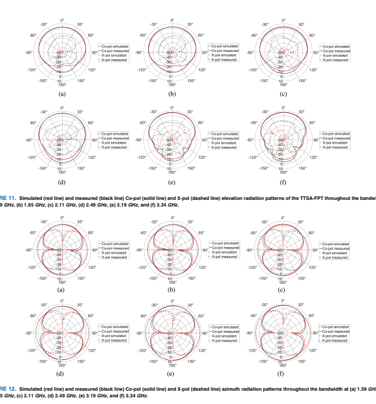

 N times) is defined.

Once the N symmetric feed points have been identified, the following steps are conducted:
Step 1: Create a Chebychev equal-ripple response Nthorder bandpass filter using the insertion loss method. The filter consists of lumped components that include in-series and in-parallel resonators, as shown in Fig. 1(a). The ripplelevel must be 0.45 dB or lower to ensure S11 ≤ −10 dB throughout the passband.

Step 2: Use 90o impedance inverters (refer to Fig. 1(b)),
to convert the in-series resonators to shuntconnected parallel resonators. Each resonator should have a resistor to account for its losses.

Step 3: Observe that the microstrip patch antenna's equivalent circuit comprises of resonant R, L,
and C components connected in parallel, as shown in [25, Ch. 14 and Fig. 14.4b]. Thus, each resonant circuit from the filter design process in Step 2 can be interpreted as a microstrip patch antenna with different feeding points, as depicted in Fig. 1(c).

Step 4: Select one of the feeding points to be the input impedance (Zin) of the equivalent filter and choose another feeding point to be the output impedance (*Zout*) of the equivalent filter. To prevent reflections and achieve perfect matching, set the characteristic impedance (Zch) of the filter to be equal to both the input and output filter impedances, such that Zin = Zout = Zch.

Step 5: Use the equivalent filter design created in Step 2 and develop a feed network that connects all of the feeding points to each other, as shown in Fig. 1(d). The input impedance of the feeding network (or the equivalent filter) is the input impedance of the radiating element.

Notably, Fig. 1 illustrates how FPT is applied to an antenna with two feed points. The feeding network can be realized as an unequal power divider, which is indicated by the black frame in Fig. 1(b). The divider can have different output amplitudes, phases, or both. Fig. 1(e) shows the schematic of the feeding network when it is realized as a power divider.

The image is a scientific diagram that illustrates the process of designing a bandpass filter with N symmetric feed points and its application to a triangular tapered slot antenna (TTSA). The diagram is divided into several parts, each representing different steps in the design process.

Part (a) shows a schematic of a bandpass filter with N symmetric feed points. It includes various components such as inductors (L), capacitors (C), and resistors (R), connected in a specific configuration to form the filter.

Part (b) depicts the equivalent circuit of a microstrip patch antenna, which is used as a model for the resonant circuits in the filter design. The antenna's equivalent circuit consists of resistors (R), inductors (L), and capacitors (C) connected in parallel.

Part (c) presents a pictorial representation of the frequency pulling technique, which involves converting in-series resonators to shunt-connected parallel resonators using 90° impedance inverters. The diagram also shows the equivalent filter design and the unequal power divider feeding network.

Part (d) illustrates the unequal power divider feeding network, which is realized as a power divider. This network connects all the symmetric feed points to each other and provides the input impedance of the radiating element.

Part (e) shows the schematic of the feeding network when it is realized as a power divider. The power divider has different output amplitudes and phases.

The image is primarily composed of black lines on a white background, with various colors used to distinguish between different components and layers in the diagrams. The text is in black and provides context and explanation for the diagrams.

## Iii. Geometry Of The Triangular Tapered Slot Antenna

In this work, we extend the FPT to wideband designs. Specifically, for our analysis, we use the triangular tapered slot antenna (TTSA). The TTSA is a Vivaldi antenna with an exponential rate of zero, as Shin in [26] showed; therefore, it can be fed using a coupled microstrip line rather than a tapered microstrip line with a flared stub used in traditional Vivaldi elements. Our TTSA design is shown in Fig. 2.

This antenna has low complexity as it consists of a ground plane with a triangular slot ending in a rectangular slot on one side of the substrate, and a coupled microstrip feed line located on the opposite side. The substrate used for this design is a Rogers RO4003 dielectric substrate with
-r = 3.55, tanδ = 0.0027, and thickness h = 0.508 mm.

Notably, optimization was used to determine parameters, such as the exact position and total length of the microstrip line. To apply the FPT method to our antenna, it is necessary to feed it through a point that is symmetric to the first point. However, in the traditional FPT approach all feeding points are located at the same plane. Here, we follow a fundamentally different approach. Specifically, by properly engineering our antenna, we create two symmetric points as part of two different planes. This simple yet elegant modification is very significant suggesting that we can manipulate any given structure, and with the proper modifications, we can effectively establish symmetric points that, when needed,

can be utilized to apply FPT and increase the bandwidth of any antenna. Namely, to achieve this, a second substrate, identical to the first one, is placed below the ground plane.

This creates a three-layer structure, where the tapered slot is sandwiched between two substrate layers. Notably, unlike other antennas, covering the radiating element in our  N times) is defined.

Once the N symmetric feed points have been identified, the following steps are conducted:
Step 1: Create a Chebychev equal-ripple response Nthorder bandpass filter using the insertion loss method. The filter consists of lumped components that include in-series and in-parallel resonators, as shown in Fig. 1(a). The ripplelevel must be 0.45 dB or lower to ensure S11 ≤ −10 dB throughout the passband.

Step 2: Use 90o impedance inverters (refer to Fig. 1(b)),
to convert the in-series resonators to shuntconnected parallel resonators. Each resonator should have a resistor to account for its losses.

Step 3: Observe that the microstrip patch antenna's equivalent circuit comprises of resonant R, L,
and C components connected in parallel, as shown in [25, Ch. 14 and Fig. 14.4b]. Thus, each resonant circuit from the filter design process in Step 2 can be interpreted as a microstrip patch antenna with different feeding points, as depicted in Fig. 1(c).

Step 4: Select one of the feeding points to be the input impedance (Zin) of the equivalent filter and choose another feeding point to be the output impedance (*Zout*) of the equivalent filter. To prevent reflections and achieve perfect matching, set the characteristic impedance (Zch) of the filter to be equal to both the input and output filter impedances, such that Zin = Zout = Zch.

Step 5: Use the equivalent filter design created in Step 2 and develop a feed network that connects all of the feeding points to each other, as shown in Fig. 1(d). The input impedance of the feeding network (or the equivalent filter) is the input impedance of the radiating element.

Notably, Fig. 1 illustrates how FPT is applied to an antenna with two feed points. The feeding network can be realized as an unequal power divider, which is indicated by the black frame in Fig. 1(b). The divider can have different output amplitudes, phases, or both. Fig. 1(e) shows the schematic of the feeding network when it is realized as a power divider.

The image is a scientific paper discussing the application of Frequency Planar Transformation (FPT) to antenna design. The paper is divided into three sections, each with its own sub-sections and figures.

Section I is titled "Frequency Planar Transformation (FPT) Method for Antenna Design" and includes three subsections: (a), (b), and (c). Subsection (a) shows a schematic diagram of a Chebychev equal-ripple response Nth-order bandpass filter with in-series and in-parallel resonators. Subsection (b) illustrates the use of 90° impedance inverters to convert in-series resonators to shunt-connected parallel resonators. Subsection (c) depicts the equivalent circuit of a microstrip patch antenna comprising resonant R, L, and C components connected in parallel.

Section II is titled "Geometry Of The Triangular Tapered Slot Antenna" and includes two subsections: (a) and (b). Subsection (a) shows the schematic of the triangular tapered slot antenna (TTSA) with a coupled microstrip feed line. Subsection (b) presents the TTSA design on a Rogers RO4003 dielectric substrate with specific parameters such as r = 3.55, tanδ = 0.0027, and thickness h = 0.508 mm.

Section III discusses the extension of FPT to wideband designs using the TTSA. It mentions that the TTSA can be fed using a coupled microstrip line rather than a tapered microstrip line with a flared stub used in traditional Vivaldi elements. The section also describes the optimization process to determine the parameters of the microstrip line and the creation of symmetric points through engineering modifications.

The images are technical diagrams and schematics related to antenna design and FPT. The colors used are mainly black and white, with some red lines indicating different components or connections in the diagrams.

## Iii. Geometry Of The Triangular Tapered Slot Antenna

In this work, we extend the FPT to wideband designs. Specifically, for our analysis, we use the triangular tapered slot antenna (TTSA). The TTSA is a Vivaldi antenna with an exponential rate of zero, as Shin in [26] showed; therefore, it can be fed using a coupled microstrip line rather than a tapered microstrip line with a flared stub used in traditional Vivaldi elements. Our TTSA design is shown in Fig. 2.

This antenna has low complexity as it consists of a ground plane with a triangular slot ending in a rectangular slot on one side of the substrate, and a coupled microstrip feed line located on the opposite side. The substrate used for this design is a Rogers RO4003 dielectric substrate with
-r = 3.55, tanδ = 0.0027, and thickness h = 0.508 mm.

Notably, optimization was used to determine parameters, such as the exact position and total length of the microstrip line. To apply the FPT method to our antenna, it is necessary to feed it through a point that is symmetric to the first point. However, in the traditional FPT approach all feeding points are located at the same plane. Here, we follow a fundamentally different approach. Specifically, by properly engineering our antenna, we create two symmetric points as part of two different planes. This simple yet elegant modification is very significant suggesting that we can manipulate any given structure, and with the proper modifications, we can effectively establish symmetric points that, when needed,

can be utilized to apply FPT and increase the bandwidth of any antenna. Namely, to achieve this, a second substrate, identical to the first one, is placed below the ground plane.

This creates a three-layer structure, where the tapered slot is sandwiched between two substrate layers. Notably, unlike other antennas, covering the radiating element in our  N times) is defined.

Once the N symmetric feed points have been identified, the following steps are conducted:
Step 1: Create a Chebychev equal-ripple response Nthorder bandpass filter using the insertion loss method. The filter consists of lumped components that include in-series and in-parallel resonators, as shown in Fig. 1(a). The ripplelevel must be 0.45 dB or lower to ensure S11 ≤ −10 dB throughout the passband.

Step 2: Use 90o impedance inverters (refer to Fig. 1(b)),
to convert the in-series resonators to shuntconnected parallel resonators. Each resonator should have a resistor to account for its losses.

Step 3: Observe that the microstrip patch antenna's equivalent circuit comprises of resonant R, L,
and C components connected in parallel, as shown in [25, Ch. 14 and Fig. 14.4b]. Thus, each resonant circuit from the filter design process in Step 2 can be interpreted as a microstrip patch antenna with different feeding points, as depicted in Fig. 1(c).

Step 4: Select one of the feeding points to be the input impedance (Zin) of the equivalent filter and choose another feeding point to be the output impedance (*Zout*) of the equivalent filter. To prevent reflections and achieve perfect matching, set the characteristic impedance (Zch) of the filter to be equal to both the input and output filter impedances, such that Zin = Zout = Zch.

Step 5: Use the equivalent filter design created in Step 2 and develop a feed network that connects all of the feeding points to each other, as shown in Fig. 1(d). The input impedance of the feeding network (or the equivalent filter) is the input impedance of the radiating element.

Notably, Fig. 1 illustrates how FPT is applied to an antenna with two feed points. The feeding network can be realized as an unequal power divider, which is indicated by the black frame in Fig. 1(b). The divider can have different output amplitudes, phases, or both. Fig. 1(e) shows the schematic of the feeding network when it is realized as a power divider.

## Iii. Geometry Of The Triangular Tapered Slot Antenna

In this work, we extend the FPT to wideband designs. Specifically, for our analysis, we use the triangular tapered slot antenna (TTSA). The TTSA is a Vivaldi antenna with an exponential rate of zero, as Shin in [26] showed; therefore, it can be fed using a coupled microstrip line rather than a tapered microstrip line with a flared stub used in traditional Vivaldi elements. Our TTSA design is shown in Fig. 2.

This antenna has low complexity as it consists of a ground plane with a triangular slot ending in a rectangular slot on one side of the substrate, and a coupled microstrip feed line located on the opposite side. The substrate used for this design is a Rogers RO4003 dielectric substrate with
-r = 3.55, tanδ = 0.0027, and thickness h = 0.508 mm.

Notably, optimization was used to determine parameters, such as the exact position and total length of the microstrip line. To apply the FPT method to our antenna, it is necessary to feed it through a point that is symmetric to the first point. However, in the traditional FPT approach all feeding points are located at the same plane. Here, we follow a fundamentally different approach. Specifically, by properly engineering our antenna, we create two symmetric points as part of two different planes. This simple yet elegant modification is very significant suggesting that we can manipulate any given structure, and with the proper modifications, we can effectively establish symmetric points that, when needed,

The image is a scientific paper discussing the application of Frequency Planar Transformation (FPT) to antenna design. The paper includes several figures and diagrams that illustrate the process of creating a Chebychev equal-ripple response Nth-order bandpass filter, converting it to a microstrip patch antenna equivalent circuit, and developing a feed network for the antenna. The images show various stages of the design process, including the filter design, the conversion to an antenna equivalent circuit, and the final feed network. The text provides a detailed explanation of the steps involved in applying FPT to antenna design, emphasizing the importance of symmetric feed points and the use of a three-layer structure to achieve wideband designs. The paper also mentions the use of optimization to determine parameters such as the position and total length of the microstrip line.

can be utilized to apply FPT and increase the bandwidth of any antenna. Namely, to achieve this, a second substrate, identical to the first one, is placed below the ground plane.

This creates a three-layer structure, where the tapered slot is sandwiched between two substrate layers. Notably, unlike other antennas, covering the radiating element in our antenna with a dielectric material does not cause any problems, since it is designed to have end-fire characteristics. Once the feeding points of our antenna are identified, the proper feeding network needs to be designed. Traditionally, the FPT methodology employs a single line (e.g., a microstrip line), designed to pass through each feeding point. However, in our case, this form of feeding network is not applicable. To address

The image is a scientific paper discussing the design and experimental validation of a novel feeding network for a tapered slot antenna (TTSA). The paper presents a method called "unequal power divider" to simplify the design complexity associated with traditional single-fed FPT approach. The antenna geometry, along with all the necessary dimensions, is shown in Fig. 3. The VSWR and bandwidth of the triangular tapered slot antenna before and after applying the FPT are compared in Fig. 4 and Table 1, respectively. The paper also includes radiation characteristics across various frequencies in Figs. 6 and 7. The experimental validation was done using LPKF Protolaser equipment, as shown in Fig. 8, and the simulated and measured VSWR are compared in Fig. 9. The text is technical and focused on the methodology and results of the antenna design.

this challenge, we reimagine the conventional FPT feeding network and replace it with an unequal power divider.

This novel network not only simplifies the design complexity associated with the traditional single-fed FPT approach, but also broadens the applicability of FPT to non-planar antenna designs, such as 3D antenna structures. The latter, however, is out of the scope of this work and it will be addressed in the future. Therefore, for this particular design, the feeding network is an unequal power divider located on the top and bottom layers of our studied geometry. This divider is made up of two microstrip lines of 50 Ohm each, coupled to the radiating slot, and each line is connected to a λg/4 (λg|@fc=2.5 Ghz = 64 mm) impedance inverter that is terminated to a characteristic impedance of 100 Ohm.

The two microstrip lines then connect to another 50 Ohm microstrip line, which can be connected to an SMA. The top and bottom parts of the divider are connected using a via, and one of the 50 Ohm lines is split into two halves. This line has a different length compared to its counterpart, which ensures the required phase difference. The antenna geometry, along with all the necessary dimensions, is shown in Fig. 3.

We call this antenna TTSA-FPT and it is important to note that, apart from its double thickness due to the second substrate, the footprint of this antenna (where we apply the FPT)
remains the same with the one of our original antenna. The VSWR and bandwidth of the triangular tapered slot antenna before and after applying the FPT are compared in Fig. 4 and Table 1, respectively. Namely, in Table 1 the lowest, central, and highest frequency of operation of each antenna are tabulated along with their corresponding absolute and fractional bandwidths. As it is observed, by applying our FPT method, the TTSA doubles its bandwidth.3 This is expected based on the FPT theory, since we utilized two symmetric feed points in our TTSA design with the FPT [24].

Finally, to further examine the behavior of our proposed design, Fig. 5 compares the current distributions of the single side fed TTSA and the two sides fed TTSA at several frequencies.

3. In this work, the bandwidth of operation uses the threshold of VSRW = 2.

Namely, the blue arrows are used to show the current distribution while the red arrows are used to show the current path that the distribution follows. As it can be seen, all distributions are identical to each other across all frequencies and for both designs. Therefore, it is evident that both designs operate at the same mode. In addition, to investigate the radiation characteristics of the TTSA, before and after we apply the FPT, Fig. 6 shows the gain and Fig. 7 shows the elevation and azimuth radiation patterns of both antennas at various frequencies across their corresponding bandwidths.

Our results show that the TTSA designed using the FPT
not only exhibits double the bandwidth of the TTSA, but

also maintains consistent radiation characteristics across this larger bandwidth.

IV.  EXPERIMENTAL VALIDATION To validate our findings, we utilized our in-house LPKF
Protolaser equipment to fabricate the tapered slot antenna

shown in Fig. 8 [27]. Notably, a via was used in our design to establish electrical connection between the different layers of our TTSA structure.

Fig. 9 compares the simulated and measured VSWR, and Fiantenna with a dielectric material does not cause any problems, since it is designed to have end-fire characteristics. Once the feeding points of our antenna are identified, the proper feeding network needs to be designed. Traditionally, the FPT methodology employs a single line (e.g., a microstrip line), designed to pass through each feeding point. However, in our case, this form of feeding network is not applicable. To address

this challenge, we reimagine the conventional FPT feeding network and replace it with an unequal power divider.

This novel network not only simplifies the design complexity associated with the traditional single-fed FPT approach, but also broadens the applicability of FPT to non-planar antenna designs, such as 3D antenna structures. The latter, however, is out of the scope of this work and it will be addressed in the future. Therefore, for this particular design, the feeding network is an unequal power divider located on the top and bottom layers of our studied geometry. This divider is made up of two microstrip lines of 50 Ohm each, coupled to the radiating slot, and each line is connected to a λg/4 (λg|@fc=2.5 Ghz = 64 mm) impedance inverter that is terminated to a characteristic impedance of 100 Ohm.

The two microstrip lines then connect to another 50 Ohm microstrip line, which can be connected to an SMA. The top and bottom parts of the divider are connected using a via, and one of the 50 Ohm lines is split into two halves. This line has a different length compared to its counterpart, which ensures the required phase difference. The antenna geometry, along with all the necessary dimensions, is shown in Fig. 3.

We call this antenna TTSA-FPT and it is important to note that, apart from its double thickness due to the second substrate, the footprint of this antenna (where we apply the FPT)
remains the same with the one of our original antenna. The VSWR and bandwidth of the triangular tapered slot antenna before and after applying the FPT are compared in Fig. 4 and Table 1, respectively. Namely, in Table 1 the lowest, central, and highest frequency of operation of each antenna are tabulated along with their corresponding absolute and fractional bandwidths. As it is observed, by applying our FPT method, the TTSA doubles its bandwidth.3 This is expected based on the FPT theory, since we utilized two symmetric feed points in our TTSA design with the FPT [24].

Finally, to further examine the behavior of our proposed design, Fig. 5 compares the current distributions of the single side fed TTSA and the two sides fed TTSA at several frequencies.

3. In this work, the bandwidth of operation uses the threshold of VSRW = 2.

The image is a scientific paper discussing the design and experimental validation of a tapered slot antenna (TTSA) with a novel feeding network called Frequency Planar Tapered Slot Antenna (FPT). The paper includes several figures and tables that illustrate various aspects of the antenna's design, such as its geometry, frequency of operation, bandwidth, and radiation characteristics. The images are technical in nature, showing diagrams of the antenna's structure, current distributions, and radiation patterns. The text provides a detailed explanation of the antenna's design process, including the use of an unequal power divider for the FPT, and compares the simulated and measured results to validate the findings. The paper is likely to be of interest to researchers and engineers working on antenna design and microwave technology.

Namely, the blue arrows are used to show the current distribution while the red arrows are used to show the current path that the distribution follows. As it can be seen, all distributions are identical to each other across all frequencies and for both designs. Therefore, it is evident that both designs operate at the same mode. In addition, to investigate the radiation characteristics of the TTSA, before and after we apply the FPT, Fig. 6 shows the gain and Fig. 7 shows the elevation and azimuth radiation patterns of both antennas at various frequencies across their corresponding bandwidths.

Our results show that the TTSA designed using the FPT
not only exhibits double the bandwidth of the TTSA, but

also maintains consistent radiation characteristics across this larger bandwidth.

IV.  EXPERIMENTAL VALIDATION To validate our findings, we utilized our in-house LPKF
Protolaser equipment to fabricate the tapered slot antenna

shown in Fig. 8 [27]. Notably, a via was used in our design to establish electrical connection between the different layers of our TTSA structure.

Fig. 9 compares the simulated and measured VSWR, and Fiantenna with a dielectric material does not cause any problems, since it is designed to have end-fire characteristics. Once the feeding points of our antenna are identified, the proper feeding network needs to be designed. Traditionally, the FPT methodology employs a single line (e.g., a microstrip line), designed to pass through each feeding point. However, in our case, this form of feeding network is not applicable. To address

this challenge, we reimagine the conventional FPT feeding network and replace it with an unequal power divider.

This novel network not only simplifies the design complexity associated with the traditional single-fed FPT approach, but also broadens the applicability of FPT to non-planar antenna designs, such as 3D antenna structures. The latter, however, is out of the scope of this work and it will be addressed in the future. Therefore, for this particular design, the feeding network is an unequal power divider located on the top and bottom layers of our studied geometry. This divider is made up of two microstrip lines of 50 Ohm each, coupled to the radiating slot, and each line is connected to a λg/4 (λg|@fc=2.5 Ghz = 64 mm) impedance inverter that is terminated to a characteristic impedance of 100 Ohm.

The two microstrip lines then connect to another 50 Ohm microstrip line, which can be connected to an SMA. The top and bottom parts of the divider are connected using a via, and one of the 50 Ohm lines is split into two halves. This line has a different length compared to its counterpart, which ensures the required phase difference. The antenna geometry, along with all the necessary dimensions, is shown in Fig. 3.

We call this antenna TTSA-FPT and it is important to note that, apart from its double thickness due to the second substrate, the footprint of this antenna (where we apply the FPT)
remains the same with the one of our original antenna. The VSWR and bandwidth of the triangular tapered slot antenna before and after applying the FPT are compared in Fig. 4 and Table 1, respectively. Namely, in Table 1 the lowest, central, and highest frequency of operation of each antenna are tabulated along with their corresponding absolute and fractional bandwidths. As it is observed, by applying our FPT method, the TTSA doubles its bandwidth.3 This is expected based on the FPT theory, since we utilized two symmetric feed points in our TTSA design with the FPT [24].

Finally, to further examine the behavior of our proposed design, Fig. 5 compares the current distributions of the single side fed TTSA and the two sides fed TTSA at several frequencies.

3. In this work, the bandwidth of operation uses the threshold of VSRW = 2.

The image appears to be a scientific paper or report discussing the design and experimental validation of a tapered slot antenna (TTSA) using a novel feeding network called the unequal power divider. The text describes the design process, including the use of a non-planar antenna structure and the application of the FPT method. The paper includes several figures that illustrate the antenna design, current distribution, radiation patterns, and VSWR measurements. The images are likely to be graphs or plots showing the performance of the antennas in terms of gain, bandwidth, and radiation characteristics. The text also mentions the use of LPKF Protolaser equipment for fabricating the antenna and comparing simulated and measured results.

Namely, the blue arrows are used to show the current distribution while the red arrows are used to show the current path that the distribution follows. As it can be seen, all distributions are identical to each other across all frequencies and for both designs. Therefore, it is evident that both designs operate at the same mode. In addition, to investigate the radiation characteristics of the TTSA, before and after we apply the FPT, Fig. 6 shows the gain and Fig. 7 shows the elevation and azimuth radiation patterns of both antennas at various frequencies across their corresponding bandwidths.

Our results show that the TTSA designed using the FPT
not only exhibits double the bandwidth of the TTSA, but

also maintains consistent radiation characteristics across this larger bandwidth.

IV.  EXPERIMENTAL VALIDATION To validate our findings, we utilized our in-house LPKF
Protolaser equipment to fabricate the tapered slot antenna

shown in Fig. 8 [27]. Notably, a via was used in our design to establish electrical connection between the different layers of our TTSA structure.

Fig. 9 compares the simulated and measured VSWR, and Fiantenna with a dielectric material does not cause any problems, since it is designed to have end-fire characteristics. Once the feeding points of our antenna are identified, the proper feeding network needs to be designed. Traditionally, the FPT methodology employs a single line (e.g., a microstrip line), designed to pass through each feeding point. However, in our case, this form of feeding network is not applicable. To address

this challenge, we reimagine the conventional FPT feeding network and replace it with an unequal power divider.

This novel network not only simplifies the design complexity associated with the traditional single-fed FPT approach, but also broadens the applicability of FPT to non-planar antenna designs, such as 3D antenna structures. The latter, however, is out of the scope of this work and it will be addressed in the future. Therefore, for this particular design, the feeding network is an unequal power divider located on the top and bottom layers of our studied geometry. This divider is made up of two microstrip lines of 50 Ohm each, coupled to the radiating slot, and each line is connected to a λg/4 (λg|@fc=2.5 Ghz = 64 mm) impedance inverter that is terminated to a characteristic impedance of 100 Ohm.

The two microstrip lines then connect to another 50 Ohm microstrip line, which can be connected to an SMA. The top and bottom parts of the divider are connected using a via, and one of the 50 Ohm lines is split into two halves. This line has a different length compared to its counterpart, which ensures the required phase difference. The antenna geometry, along with all the necessary dimensions, is shown in Fig. 3.

We call this antenna TTSA-FPT and it is important to note that, apart from its double thickness due to the second substrate, the footprint of this antenna (where we apply the FPT)
remains the same with the one of our original antenna. The VSWR and bandwidth of the triangular tapered slot antenna before and after applying the FPT are compared in Fig. 4 and Table 1, respectively. Namely, in Table 1 the lowest, central, and highest frequency of operation of each antenna are tabulated along with their corresponding absolute and fractional bandwidths. As it is observed, by applying our FPT method, the TTSA doubles its bandwidth.3 This is expected based on the FPT theory, since we utilized two symmetric feed points in our TTSA design with the FPT [24].

Finally, to further examine the behavior of our proposed design, Fig. 5 compares the current distributions of the single side fed TTSA and the two sides fed TTSA at several frequencies.

3. In this work, the bandwidth of operation uses the threshold of VSRW = 2.

Namely, the blue arrows are used to show the current distribution while the red arrows are used to show the current path that the distribution follows. As it can be seen, all distributions are identical to each other across all frequencies and for both designs. Therefore, it is evident that both designs operate at the same mode. In addition, to investigate the radiation characteristics of the TTSA, before and after we apply the FPT, Fig. 6 shows the gain and Fig. 7 shows the elevation and azimuth radiation patterns of both antennas at various frequencies across their corresponding bandwidths.

Our results show that the TTSA designed using the FPT
not only exhibits double the bandwidth of the TTSA, but

The image appears to be a scientific paper or report, focusing on the design and experimental validation of a tapered slot antenna (TSA) using a novel feeding network method. The paper discusses the use of an unequal power divider in the feeding network, which is a departure from traditional single-fed FPT approaches. The antenna geometry is shown in Fig. 3, and the VSWR and bandwidth are compared before and after applying the FPT in Fig. 4 and Table 1. The paper also includes radiation characteristics across various frequencies, shown in Figs. 6 and 7. The experimental validation section mentions the use of LPKF Protolaser equipment for fabrication and compares simulated and measured VSWR in Fig. 9. The images included in the paper are likely to be figures that support the text, such as antenna designs, radiation patterns, and measurement results.

also maintains consistent radiation characteristics across this larger bandwidth.

IV.  EXPERIMENTAL VALIDATION To validate our findings, we utilized our in-house LPKF
Protolaser equipment to fabricate the tapered slot antenna

shown in Fig. 8 [27]. Notably, a via was used in our design to establish electrical connection between the different layers of our TTSA structure.

Fig. 9 compares the simulated and measured VSWR, and Fiantenna with a dielectric material does not cause any problems, since it is designed to have end-fire characteristics. Once the feeding points of our antenna are identified, the proper feeding network needs to be designed. Traditionally, the FPT methodology employs a single line (e.g., a microstrip line), designed to pass through each feeding point. However, in our case, this form of feeding network is not applicable. To address

this challenge, we reimagine the conventional FPT feeding network and replace it with an unequal power divider.

This novel network not only simplifies the design complexity associated with the traditional single-fed FPT approach, but also broadens the applicability of FPT to non-planar antenna designs, such as 3D antenna structures. The latter, however, is out of the scope of this work and it will be addressed in the future. Therefore, for this particular design, the feeding network is an unequal power divider located on the top and bottom layers of our studied geometry. This divider is made up of two microstrip lines of 50 Ohm each, coupled to the radiating slot, and each line is connected to a λg/4 (λg|@fc=2.5 Ghz = 64 mm) impedance inverter that is terminated to a characteristic impedance of 100 Ohm.

The two microstrip lines then connect to another 50 Ohm microstrip line, which can be connected to an SMA. The top and bottom parts of the divider are connected using a via, and one of the 50 Ohm lines is split into two halves. This line has a different length compared to its counterpart, which ensures the required phase difference. The antenna geometry, along with all the necessary dimensions, is shown in Fig. 3.

We call this antenna TTSA-FPT and it is important to note that, apart from its double thickness due to the second substrate, the footprint of this antenna (where we apply the FPT)
remains the same with the one of our original antenna. The VSWR and bandwidth of the triangular tapered slot antenna before and after applying the FPT are compared in Fig. 4 and Table 1, respectively. Namely, in Table 1 the lowest, central, and highest frequency of operation of each antenna are tabulated along with their corresponding absolute and fractional bandwidths. As it is observed, by applying our FPT method, the TTSA doubles its bandwidth.3 This is expected based on the FPT theory, since we utilized two symmetric feed points in our TTSA design with the FPT [24].

Finally, to further examine the behavior of our proposed design, Fig. 5 compares the current distributions of the single side fed TTSA and the two sides fed TTSA at several frequencies.

3. In this work, the bandwidth of operation uses the threshold of VSRW = 2.

Namely, the blue arrows are used to show the current distribution while the red arrows are used to show the current path that the distribution follows. As it can be seen, all distributions are identical to each other across all frequencies and for both designs. Therefore, it is evident that both designs operate at the same mode. In addition, to investigate the radiation characteristics of the TTSA, before and after we apply the FPT, Fig. 6 shows the gain and Fig. 7 shows the elevation and azimuth radiation patterns of both antennas at various frequencies across their corresponding bandwidths.

Our results show that the TTSA designed using the FPT
not only exhibits double the bandwidth of the TTSA, but

also maintains consistent radiation characteristics across this larger bandwidth.

IV.  EXPERIMENTAL VALIDATION To validate our findings, we utilized our in-house LPKF
Protolaser equipment to fabricate the tapered slot antenna

The image is a compilation of four figures related to the design and experimental validation of a tapered slot antenna (TTSA) using a novel feeding network called unequal power divider. The figures are labeled as (a), (b), (c), and (d).

Figure (a) shows the top view of the antenna with a copper wire on top of a substrate, indicating the feeding point.

Figure (b) depicts the bottom layer of the antenna with a copper wire on top of a different substrate, suggesting the other feeding point.

Figure (c) presents the side view of the antenna with a copper wire on top of a substrate, showing the connection between the two layers.

Figure (d) displays the current distribution of the single side fed TTSA and the two sides fed TTSA at several frequencies, with blue arrows indicating the current distribution and red arrows showing the current path.

The text accompanying the figures provides context for the images, discussing the design process, the use of an unequal power divider instead of a traditional single-fed FPT approach, and the experimental validation of the design using LPKF Protolaser equipment. It also mentions the comparison of VSWR and bandwidth before and after applying the FPT, as well as the radiation characteristics of the antennas.

shown in Fig. 8 [27]. Notably, a via was used in our design to establish electrical connection between the different layers of our TTSA structure.

Fig. 9 compares the simulated and measured VSWR, and Fig. 10 compares the simulated and measured gain and efficiency, respectively. Excellent agreement is observed in all cases. Our results show that very good agreement is exhibited between our simulated and measured results. The slight shift in the frequencies of the two reflection coefficient responses can be attributed to potential variations in the dielectric constant of the simulated and measured substrates.

It should be noted that in our simulations, we used a Rogers RO4003C substrate with a dielectric constant of -r = 3.55.

The image is a scientific report that presents the results of simulations and measurements for a tapered slot antenna. The report includes three figures: Figure 9 shows the simulated and measured VSWR (voltage standing wave ratio) for the tapered slot antenna at different frequencies, indicating the antenna's bandwidth. Figure 10 compares the simulated and measured gain and efficiency of the antenna, with a slight shift in frequency due to potential variations in the dielectric constant of the substrates used. Figure 11 and 12 compare the simulated and measured Co-pol (co-polarized) and X-pol (cross-polarized) radiation patterns at various frequencies across the antenna's bandwidth.

The text provides context for the images, discussing the limitations of previous research on antenna design and the improvements made in this work. It mentions the use of a Rogers RO4003C substrate with a dielectric constant range of approximately 3.38 to 3.55, and how the fabricated antenna operates slightly wider than the simulated one. The report concludes by stating that the methodology improved the antenna's bandwidth without compromising its radiation performance.

However, according to the manufacturer, the dielectric constant of the Rogers RO4003C laminate can vary within a range of approximately 3.38 to 3.55. Notably, based on the responses of Fig. 9, the fabricated antenna looks to operate in a slightly wider bandwidth compared to the simulated one.

Specifically, it looks to also operate at frequencies between 3.37 GHz and 3.55 GHz. This behavior, however, is not surprising and is attributed to potential losses introduced to our antenna due to the in-house fabrication we conducted. The latter can be verified, by the gain and efficiency responses shown in Fig. 10, where a notable gain and efficiency drop is observed at these frequencies. Nevertheless, this is of no concern, as these frequencies are considered out-of-band, as discussed above. Finally, Figs. 11 and 12 compare the simulated and measured Co-pol and X-pol radiation patterns

at different frequencies (e.g., 1.59 GHz, 1.65 GHz, 2.11 GHz, 2.49 GHz, 3.19 GHz, and 3.34 GHz) across its bandwidth of operation showing a very good agreement overall.

The minor discrepancies observed between simulated and measured results, at some frequencies of the azimuth radiation pattern, are solely attributed to imperfections due to the in-house fabrication we conducted.

## V. Conclusion

In this work we improved our recently developed methodology.

FPT
Previous research was limited to
(1) narrowband antenna designs, (2) antennas with feeding points located at the same plane, and (3) feeding networks implemented as single feeding lines. In this work, we addressed these challenges and we (1) extended FPT to wideband designs, (2) used feeding points located at different planes, and (3) designed feeding networks as unequal power dividers. Specifically, we properly engineered a triangular tapered slot antenna and we fed it with a coupled microstrip line following the FPT methodology. As a result, we doubled the bandwidth of our TTSA. Notably, this bandwidth increase was achieved while maintaining the antenna's footprint and its radiation efficiency. Our simulations and measurements clearly proved the ability of FPT to increase the bandwidth of wideband antennas without compromising their radiation performance.

## References

[1] D. T. Emerson, "The work of Jagadis Chandra Bose: 100 years of millimeter-wave research," IEEE Trans. Microw. Theory Tech. , vol. 45, no. 12, pp. 2267-2273, Dec. 1997.
[2] K. S. Packard, "The origin of waveguides: A case of multiple rediscovery," *IEEE Trans. Microw. Theory Tech.*, vol. 32, no. 9, pp. 961–969, Sep. 1984.

[3] H. A. Wheeler, "Fundamental limitations of small antennas," *Proc.*
IRE, vol. 35, no. 12, pp. 1479–1484, Dec. 1947.

[4] L. J. Chu, "Physical limitations of omni-directional antennas," J. Appl.

Phys., vol. 19, pp. 1163–1175, Dec. 1948.

[5] P. J. Gibson, "The Vivaldi aerial," in *Proc. 9th Eur. Microw. Conf.*,
1979, pp. 101–105.

[6] D. M. Pozar, "Microstrip antennas," *Proc. IEEE*, vol. 80, no. 1, pp. 79–91, Jan. 1992.

[7] P. Kala and R. Pant, "L-probe fed planar-rectangular microstrip patch antenna mounted on a cylindrical ground surface," Int. J. Microw. Opt.

Technol., vol. 5, pp. 58–65, Mar. 2010.

[8] J. A. Ansari, N. P. Yadav, A. Mishra, P. Singh, and B. R. Vishvakarma,
"Analysis of multilayer rectangular patch antenna for broadband operation," *Wireless Pers. Commun.*, vol. 62, pp. 315–327, Jan. 2012g. 10 compares the simulated and measured gain and efficiency, respectively. Excellent agreement is observed in all cases. Our results show that very good agreement is exhibited between our simulated and measured results. The slight shift in the frequencies of the two reflection coefficient responses can be attributed to potential variations in the dielectric constant of the simulated and measured substrates.

It should be noted that in our simulations, we used a Rogers RO4003C substrate with a dielectric constant of -r = 3.55.

However, according to the manufacturer, the dielectric constant of the Rogers RO4003C laminate can vary within a range of approximately 3.38 to 3.55. Notably, based on the responses of Fig. 9, the fabricated antenna looks to operate in a slightly wider bandwidth compared to the simulated one.

Specifically, it looks to also operate at frequencies between 3.37 GHz and 3.55 GHz. This behavior, however, is not surprising and is attributed to potential losses introduced to our antenna due to the in-house fabrication we conducted. The latter can be verified, by the gain and efficiency responses shown in Fig. 10, where a notable gain and efficiency drop is observed at these frequencies. Nevertheless, this is of no concern, as these frequencies are considered out-of-band, as discussed above. Finally, Figs. 11 and 12 compare the simulated and measured Co-pol and X-pol radiation patterns

The image is a compilation of various graphs and figures related to antenna design and simulation. It appears to be a research paper or report that discusses the development and testing of a triangular tapered slot antenna (TTSA) using a coupled microstrip line feeding network following the Frequency Planar Transformation (FPT) methodology. The images show simulated and measured results for different frequencies, including gain and efficiency responses, radiation patterns, and reflection coefficient responses. The text provides context for the images, explaining the purpose of the research, the methodology used, and the results obtained. The figures are labeled with letters (a-f) and numbers (1-12), indicating different sections or types of data presented in the report. The colors used in the graphs are primarily red and black, with some blue accents. The text is in English and is written in a technical and academic style.

at different frequencies (e.g., 1.59 GHz, 1.65 GHz, 2.11 GHz, 2.49 GHz, 3.19 GHz, and 3.34 GHz) across its bandwidth of operation showing a very good agreement overall.

The minor discrepancies observed between simulated and measured results, at some frequencies of the azimuth radiation pattern, are solely attributed to imperfections due to the in-house fabrication we conducted.

## V. Conclusion

In this work we improved our recently developed methodology.

FPT
Previous research was limited to
(1) narrowband antenna designs, (2) antennas with feeding points located at the same plane, and (3) feeding networks implemented as single feeding lines. In this work, we addressed these challenges and we (1) extended FPT to wideband designs, (2) used feeding points located at different planes, and (3) designed feeding networks as unequal power dividers. Specifically, we properly engineered a triangular tapered slot antenna and we fed it with a coupled microstrip line following the FPT methodology. As a result, we doubled the bandwidth of our TTSA. Notably, this bandwidth increase was achieved while maintaining the antenna's footprint and its radiation efficiency. Our simulations and measurements clearly proved the ability of FPT to increase the bandwidth of wideband antennas without compromising their radiation performance.

## References

[1] D. T. Emerson, "The work of Jagadis Chandra Bose: 100 years of millimeter-wave research," IEEE Trans. Microw. Theory Tech. , vol. 45, no. 12, pp. 2267-2273, Dec. 1997.
[2] K. S. Packard, "The origin of waveguides: A case of multiple rediscovery," *IEEE Trans. Microw. Theory Tech.*, vol. 32, no. 9, pp. 961–969, Sep. 1984.

[3] H. A. Wheeler, "Fundamental limitations of small antennas," *Proc.*
IRE, vol. 35, no. 12, pp. 1479–1484, Dec. 1947.

[4] L. J. Chu, "Physical limitations of omni-directional antennas," J. Appl.

Phys., vol. 19, pp. 1163–1175, Dec. 1948.

[5] P. J. Gibson, "The Vivaldi aerial," in *Proc. 9th Eur. Microw. Conf.*,
1979, pp. 101–105.

[6] D. M. Pozar, "Microstrip antennas," *Proc. IEEE*, vol. 80, no. 1, pp. 79–91, Jan. 1992.

[7] P. Kala and R. Pant, "L-probe fed planar-rectangular microstrip patch antenna mounted on a cylindrical ground surface," Int. J. Microw. Opt.

Technol., vol. 5, pp. 58–65, Mar. 2010.

[8] J. A. Ansari, N. P. Yadav, A. Mishra, P. Singh, and B. R. Vishvakarma,
"Analysis of multilayer rectangular patch antenna for broadband operation," *Wireless Pers. Commun.*, vol. 62, pp. 315–327, Jan. 2012.

[9] B. R. Perli and A. M. Rao, "Characteristic mode analysis of wideband microstrip antenna," *Prog. Electr. Res. C*, vol. 97, pp. 201–212, Jan. 2019.

[10] J. Ollikainen and P. Vainikainen, "Radiation and bandwidth characteristics of two planar multistrip antennas for mobile communication systems," in Proc. VTC '98. 48th IEEE Veh. Technol. Conf. Pathway Glob. Wireless Revol. (Cat. No. 98CH36151), 1998, pp. 1186–1190.

[11] M. Rahman and M. A. Stuchly, "Dual-polarization broadband patch antenna," *Microw. Opt. Technol. Lett.*, vol. 22, no. 6, pp. 414–420, 1999.

[12] T. H. Jang, K. P. Jung, and C. S. Park, "Broadband millimeter-wave antenna in package with L-probed E-shaped patch covering 57 GHz to 71 GHz," *IEEE Trans. Antennas Propag.*, vol. 71, no. 1, pp. 89–98, Jan. 2023.

[13] Z. Xiao, Y. Pan, X. Liu, and K. W. Leung, "A wideband magnetoelectric dipole antenna with wide beamwidth for millimeter-wave applications," *IEEE Antennas Wireless Propag. Lett.*, vol. 22, pp. 918–922, 2023.

[14] J. Sun and K.-M. Luk, "A fully transparent wideband water patch antenna with L-shaped feed," *IEEE Open J. Antennas Propag.*, vol. 2, pp. 968–975, 2021.

[15] B.-J. Chen and X.-S. Yang, "Compact dual-polarized filtering antenna based on differential feeding and double-layer metasurface," IEEE Trans. Antennas Propag., vol. 71, no. 1, pp. 1065–1070, Jan. 2023.

[16] R. Shamsaee Malfajani, J.-J. Laurin, and M. S. Sharawi, "Wideband substrate integrated cavity-backed dielectric resonator antenna at sub-6-GHz band," *IEEE Open J. Antennas Propag.*, vol. 4, pp. 60–68, 2023.

[17] A. Locatelli et al., "A planar, differential, and directive ultrawideband antenna," *IEEE Trans. Antennas Propag.*, vol. 58, no. 7, pp. 2439–2442, Jul. 2010.

[18] Z.-H. Tu, W.-A. Li, and Q.-X. Chu, "Single-layer differential CPWfed notch-band tapered-slot UWB antenna," IEEE Antennas Wireless Propag. Lett., vol. 13, pp. 1296–1299, 2014.

[19] H. Wang and P. Wu, "Wideband MIMO antennas for 5G mobile terminals," *IEEE Open J. Antennas Propag.*, vol. 4, pp. 74–80, 2023.

[20] A. Liu, J. Lu, P. K. Tan, and T. H. Gan, "A deployable wideband differential-fed dual-polarized patch antenna array," IEEE Open J.

Antennas Propag., vol. 4, pp. 141–150, 2023.

[21] R. Lian, Z. Wang, Y. Yin, J. Wu, and X. Song, "Design of a lowprofile dual-polarized stepped slot antenna array for base station,"
IEEE Antennas Wireless Propag. Lett., vol. 15, pp. 362–365, 2016.

[22] W. Liu, Y. Yin, W. Xu, and S. Zuo, "Compact open-slot antenna with bandwidth enhancement," *IEEE Antennas Wireless Propag. Lett.*,
vol. 10, pp. 850–853, 2011.

[23] X.-C. Wang, Y.-J. Xia, J.-H. Yang, and W.-Z. Lu, "Wideband highgain circularly polarized substrate integrated cavity antenna array for millimeter-wave applications," *IEEE Trans. Antennas Propag.*, vol. 71, no. 1, pp. 1041–1046, Jan. 2023.

[24] A. G. Koutinos, G. A. Kyriacou, J. L. Volakis, and M. T. Chryssomallis, "Bandwidth enhancement of antennas designed by band-pass filter synthesis due to frequency pulling techniques,"
IET Microw., Antennas Propag., vol. 16, no. 1, pp. 1–17, 2022.

[25] C. A. Balanis, *Antenna Theory: Analysis and Design*, 4th ed. Hoboken, NJ, USA: Wiley 2016.

[26] J. Shin and D. H. Schaubert, "A parameter study of stripline-fed Vivaldi notch-antenna arrays," *IEEE Trans. Antennas Propag.*, vol. 47, no. 5, pp. 879–886, May 1999.

[27] (LPKF Laser Electron. Co., Ltd, Garbsen, Germany). *Lpkf Protolaser* s4. Accessed: Aug. 18, 2023. [Online]. Available: https://www.lpkf. com/en/industries-technologies/research-in-house-pcb-prototyping/ products/lpkf-protolaser-s4 ANASTASIOS G. KOUTINOS (Member, IEEE)

The image is a screenshot of a webpage that contains a list of references to research papers on antenna design and analysis. The references are numbered from 9 to 25, and they cover topics such as wideband microstrip antennas, radiation characteristics of planar multistrip antennas, dual-polarization broadband patch antennas, and wideband magnetoelectric dipole antennas. The references are from various journals and conferences, including IEEE Transactions on Antennas and Propagation, Progress in Electromagnetics Research C, and IEEE Open Journal on Antennas and Propagation.

The image also includes a photograph of a man with a beard and bald head, who appears to be the author of one of the papers listed. The text "ANASTASIOS G. KOUTINOS (Member, IEEE)" suggests that this is his name and he is a member of the Institute of Electrical and Electronics Engineers (IEEE). The image also contains a logo for LPKF Laser Electron. Co., Ltd, which is likely related to the research or publication of the papers listed.
 received the Diploma degree in electrical and computer engineering, the M.S. degree (with Hons.) in electrical and computer engineering communication and satellite telecommunication systems, and the Ph.D. degree (with Hons.) in electrical and computer engineering from the Democritus University of Thrace, Xanthi, Greece, in 2014, 2015, and 2022, respectively.

He has been a Postdoctoral Researcher with the Transforming Antennas Center, Florida International University since May 2022. His research is focused on the design of small antennas, bandwidth enhancement techniques, and miniaturization methods for RF devices. His research interests include RF-front-end design, communication and radar systems, and biomedical applications.

CONSTANTINOS L. ZEKIOS (Senior Member,

The image is a screenshot of a webpage that contains information about three individuals who have made significant contributions to the field of electrical and computer engineering. The first person, Constantin Zekios, has received degrees from Democritus University of Thrace in Xanthi, Greece, and has been involved in research related to small antennas, bandwidth enhancement techniques, and miniaturization methods for RF devices. He has held various positions at universities and research centers, including Florida International University.

The second person, Stavros V. Georgakopoulos, has also received degrees from the University of Patras and Arizona State University. He has held positions as a Principal Engineer with SV Microwave, Inc., and is currently a Professor at Florida International University. His research interests include novel antennas, arrays, RFID, microwave and RF systems, novel sensors, and wireless powering of portable, and wearable and implantable devices. He has received awards for his work and has served as an Associate Editor for IEEE journals.

The image includes photographs of the two individuals, along with their names, titles, and affiliations. The text is primarily in black font on a white background, with some red accents. The images are also in color, with one being a close-up of a man's face and the other being a full-body shot of a man. The overall structure of the image is a list format, with each individual having their own section.

IEEE) received the Diploma degree (with Hons.)
in electrical and computer engineering, the M.S. degree (with Hons.) in electrical and computer engineering communication and satellite telecommunication systems, and the Ph.D. degree (with Hons.) in electrical and computer engineering from the Democritus University of Thrace, Xanthi, Greece, in 2008, 2011, and 2015, respectively.

He was a Postdoctoral Researcher with the Electrical and Computer Engineering Department, University of Massachusetts Amherst, Amherst, MA, USA, from January 2016 to May 2018, a Fellow Postdoctoral Researcher with the Transforming Antennas Center, Florida International University from May 2018 to August 2020, and a Research Assistant Professor with the Department of Electrical and Computer Engineering, Florida International University, Miami, FL,
USA, from September 2020 to July 2022, where he is currently an Assistant Professor with the Department of Electrical and Computer Engineering. His main research interests include theoretical and computational electromagnetics, optimization methods, antennas and antenna arrays, electromagnetic surfaces, beamforming networks, microwave engineering, and photonics.

STAVROS V. GEORGAKOPOULOS (Senior

Member, IEEE) received the Diploma degree in electrical engineering from the University of Patras, Patras, Greece, in June 1996, and the M.S. and Ph.D. degrees in electrical engineering from Arizona State University, Tempe, AZ, USA,
in 1998 and 2001, respectively.

From 2001 to 2007, he held a position as the Principal Engineer with SV Microwave, Inc. Since 2007, he has been with the Department of Electrical and Computer Engineering, Florida International University, Miami, FL, USA, where he is currently a Professor, the Director of the Transforming Antennas Center (a research center on foldable/origami, physically reconfigurable, and deployable antennas), and the Director of the RF Communications, Millimeter-Waves, and Terahertz Lab. His current research interests relate to novel antennas, arrays, RFID, microwave and RF systems, novel sensors, and wireless powering of portable, and wearable and implantable devices.

Dr. Georgakopoulos received the 2015 FIU President's Council Worlds Ahead Faculty Award, which is the highest honor FIU extends to a faculty member for excelling in research, teaching, mentorship, and service.

He served as an Associate Editor for the IEEE TRANSACTIONS ON
ANTENNAS AND PROPAGATION from 2013 to 2019, and currently serving as an Associate Editor for the IEEE OPEN JOURNAL OF ANTENNAS AND
PROPAGATION since 2019.nthi, Greece, in 2014, 2015, and 2022, respectively.

He has been a Postdoctoral Researcher with the Transforming Antennas Center, Florida International University since May 2022. His research is focused on the design of small antennas, bandwidth enhancement techniques, and miniaturization methods for RF devices. His research interests include RF-front-end design, communication and radar systems, and biomedical applications.

CONSTANTINOS L. ZEKIOS (Senior Member,

IEEE) received the Diploma degree (with Hons.)
in electrical and computer engineering, the M.S. degree (with Hons.) in electrical and computer engineering communication and satellite telecommunication systems, and the Ph.D. degree (with Hons.) in electrical and computer engineering from the Democritus University of Thrace, Xanthi, Greece, in 2008, 2011, and 2015, respectively.

He was a Postdoctoral Researcher with the Electrical and Computer Engineering Department, University of Massachusetts Amherst, Amherst, MA, USA, from January 2016 to May 2018, a Fellow Postdoctoral Researcher with the Transforming Antennas Center, Florida International University from May 2018 to August 2020, and a Research Assistant Professor with the Department of Electrical and Computer Engineering, Florida International University, Miami, FL,
USA, from September 2020 to July 2022, where he is currently an Assistant Professor with the Department of Electrical and Computer Engineering. His main research interests include theoretical and computational electromagnetics, optimization methods, antennas and antenna arrays, electromagnetic surfaces, beamforming networks, microwave engineering, and photonics.

STAVROS V. GEORGAKOPOULOS (Senior

The image is a screenshot of a webpage that contains information about three individuals who have made significant contributions to the field of electrical and computer engineering. The first person, Constantin Zekios, has received degrees from Democritus University of Thrace in Xanthi, Greece, and has been involved in research related to small antennas, bandwidth enhancement techniques, and miniaturization methods for RF devices. He has held various positions at universities and research centers in the US and Greece.

The second person, Stavros V. Georgakopoulos, has also received degrees from the University of Patras and Arizona State University. He has worked as a Principal Engineer and is currently a Professor at Florida International University, where he directs research centers and labs focused on antennas, arrays, RFID, microwave and RF systems, novel sensors, and wireless powering of portable, wearable, and implantable devices. He has received awards for his work and has served as an Associate Editor for IEEE journals.

The image includes photographs of the individuals and their respective degrees and affiliations. The text is primarily in English, with some Greek words included. The colors used in the image are mostly black and white, with some blue accents in the background.

Member, IEEE) received the Diploma degree in electrical engineering from the University of Patras, Patras, Greece, in June 1996, and the M.S. and Ph.D. degrees in electrical engineering from Arizona State University, Tempe, AZ, USA,
in 1998 and 2001, respectively.

From 2001 to 2007, he held a position as the Principal Engineer with SV Microwave, Inc. Since 2007, he has been with the Department of Electrical and Computer Engineering, Florida International University, Miami, FL, USA, where he is currently a Professor, the Director of the Transforming Antennas Center (a research center on foldable/origami, physically reconfigurable, and deployable antennas), and the Director of the RF Communications, Millimeter-Waves, and Terahertz Lab. His current research interests relate to novel antennas, arrays, RFID, microwave and RF systems, novel sensors, and wireless powering of portable, and wearable and implantable devices.

Dr. Georgakopoulos received the 2015 FIU President's Council Worlds Ahead Faculty Award, which is the highest honor FIU extends to a faculty member for excelling in research, teaching, mentorship, and service.

He served as an Associate Editor for the IEEE TRANSACTIONS ON
ANTENNAS AND PROPAGATION from 2013 to 2019, and currently serving as an Associate Editor for the IEEE OPEN JOURNAL OF ANTENNAS AND
PROPAGATION since 2019.