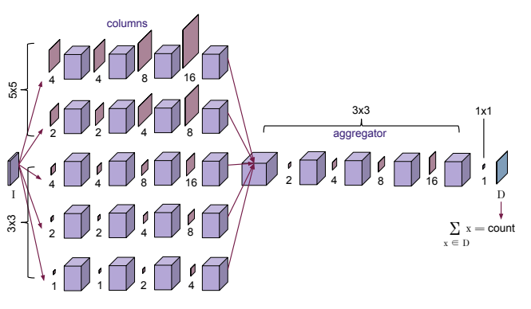
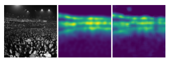
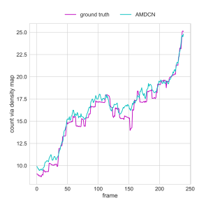
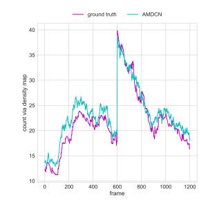
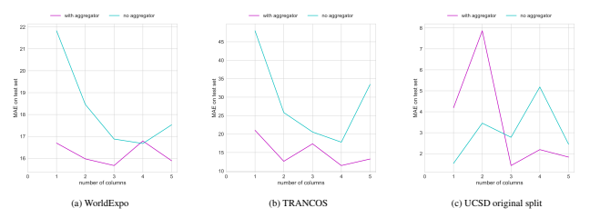

ow that the minimal annotation of a single dot blurred by a Gaussian kernel produces a sufficient density map to train a network to count. All of the counting methods that we examine as well as the method we use in

The image is a schematic representation of a neural network architecture designed for crowd counting. It shows a series of layers that process input data, starting with "columns" and ending with an "aggregator" layer. The columns are represented as 3D cubes, indicating the spatial dimensions of the input data. Each column appears to be processed by a series of convolutional layers, which are depicted as horizontal lines connecting the columns. The aggregator layer is shown as a single layer that takes inputs from multiple columns and produces a final output. The overall structure suggests a multi-scale approach to processing images, where different scales of information are extracted and aggregated to produce a density map for counting purposes. The colors used in the image are primarily shades of purple and pink, with text annotations providing additional context and details about the network architecture.

D
our paper follow this method of producing a density map via regression. This is particularly advantageous because a sufficiently accurate regressor can also locate the objects in the image via this method. However, the Lempitsky paper ignores the issue of perspective scaling and other scaling issues. The work of [27] introduces CNNs (convolutional neural networks) for the purposes of crowd counting, but performs regression on similarly scaled image patches.

These issues are addressed by the work of [18]. Rubio et al. show that a fully convolutional neural network can be used to produce a supervised regressor that produces density maps as in [15]. They further demonstrate a method dubbed HydraCNN which essentially combines multiple convolutional networks that take in differently scaled image patches in order to incorporate multiscale, global information from the image. The premise of this method is that a single regressor will fail to accurately represent the difference in values of the features of an image caused by perspective shifts (scaling effects) [18].

However, the architectures of both [18] and [27] are not fully convolutional due to requiring multiple image patches and, as discussed in [25], the experiments of [11, 17] and [9, 12, 16] leave it unclear as to whether rescaling patches of the image is truly necessary in order to solve dense prediction problems via convolutional neural networks. Moreover, these approaches seem to saturate in performance at three columns, which means the network is extracting information from fewer scales. The work of [25] proposes the use of dilated convolutions as a simpler alternative that does not require sampling of rescaled image patches to provide global, scale-aware information to the network. A fully convolutional approach to multiscale counting has been proposed by [28], in which a multicolumn convolutional network gathers features of different scales by using convolutions of increasing kernel sizes from column to column instead of scaling image patches. Further, DeepLab has used dilated convolutions in multiple columns to extract scale information for segmentation [8]. We build on these approaches with our aggregator module as described in Section 3.1, which should allow for extracting information from more scales.

It should be noted that other methods of counting exist, including training a network to recognize deep object features via only providing the counts of the objects of interest in an image [21] and using CNNs (convolutional neural networks) along with boosting in order to improve the results

of regression for production of density maps [24]. In the same spirit, [4] combines deep and shallow convolutions within the same network, providing accurate counting of dense objects (e.g. the UCF50 crowd dataset).

In this paper, however, we aim to apply the dilated convolution method of [25], which has shown to be able to incorporate multiscale perspective information without using multiple inputs or a complicated network architecture, as well as the multicolumn approach of [8, 28] to aggregate multiscale information for the counting problem.

## 3. Method 3.1. Dilated Convolutions For Multicolumn Networks

We propose the use of dilated convolutions as an attractive alternative to the architecture of the HydraCNN
[18], which seems to saturate in performance at 3 or more columns. We refer to our proposed network as the aggregated multicolumn dilated convolution network1, henceforth shortened as the AMDCN. The architecture of the AMDCN is inspired by the multicolumn counting network of [28]. Extracting features from multiple scales is a good idea when attempting to perform perspective-free countingow that the minimal annotation of a single dot blurred by a Gaussian kernel produces a sufficient density map to train a network to count. All of the counting methods that we examine as well as the method we use in

D
our paper follow this method of producing a density map via regression. This is particularly advantageous because a sufficiently accurate regressor can also locate the objects in the image via this method. However, the Lempitsky paper ignores the issue of perspective scaling and other scaling issues. The work of [27] introduces CNNs (convolutional neural networks) for the purposes of crowd counting, but performs regression on similarly scaled image patches.

These issues are addressed by the work of [18]. Rubio et al. show that a fully convolutional neural network can be used to produce a supervised regressor that produces density maps as in [15]. They further demonstrate a method dubbed HydraCNN which essentially combines multiple convolutional networks that take in differently scaled image patches in order to incorporate multiscale, global information from the image. The premise of this method is that a single regressor will fail to accurately represent the difference in values of the features of an image caused by perspective shifts (scaling effects) [18].

However, the architectures of both [18] and [27] are not fully convolutional due to requiring multiple image patches and, as discussed in [25], the experiments of [11, 17] and [9, 12, 16] leave it unclear as to whether rescaling patches of the image is truly necessary in order to solve dense prediction problems via convolutional neural networks. Moreover, these approaches seem to saturate in performance at three columns, which means the network is extracting information from fewer scales. The work of [25] proposes the use of dilated convolutions as a simpler alternative that does not require sampling of rescaled image patches to provide global, scale-aware information to the network. A fully convolutional approach to multiscale counting has been proposed by [28], in which a multicolumn convolutional network gathers features of different scales by using convolutions of increasing kernel sizes from column to column instead of scaling image patches. Further, DeepLab has used dilated convolutions in multiple columns to extract scale information for segmentation [8]. We build on these approaches with our aggregator module as described in Section 3.1, which should allow for extracting information from more scales.

It should be noted that other methods of counting exist, including training a network to recognize deep object features via only providing the counts of the objects of interest in an image [21] and using CNNs (convolutional neural networks) along with boosting in order to improve the results

The image appears to be a visual representation of the concept of density maps and their use in crowd counting. It shows three different images: the first is a grayscale photo of a crowd, the second is a heat map with yellow and blue areas indicating density, and the third is another heat map with varying shades of purple and blue. The text accompanying the images discusses various methods for crowd counting using convolutional neural networks (CNNs) and regression techniques. It mentions the use of density maps produced by regression and the challenges of perspective scaling and other scaling issues. The text also references specific papers and research that have addressed these issues, such as the work of [18], [27], [25], and [28]. The focus is on the use of dilated convolutions and multicolumn networks to extract multiscale information without requiring multiple inputs or a complicated network architecture.

of regression for production of density maps [24]. In the same spirit, [4] combines deep and shallow convolutions within the same network, providing accurate counting of dense objects (e.g. the UCF50 crowd dataset).

In this paper, however, we aim to apply the dilated convolution method of [25], which has shown to be able to incorporate multiscale perspective information without using multiple inputs or a complicated network architecture, as well as the multicolumn approach of [8, 28] to aggregate multiscale information for the counting problem.

## 3. Method 3.1. Dilated Convolutions For Multicolumn Networks

We propose the use of dilated convolutions as an attractive alternative to the architecture of the HydraCNN
[18], which seems to saturate in performance at 3 or more columns. We refer to our proposed network as the aggregated multicolumn dilated convolution network1, henceforth shortened as the AMDCN. The architecture of the AMDCN is inspired by the multicolumn counting network of [28]. Extracting features from multiple scales is a good idea when attempting to perform perspective-free countingrowd Counting

Results are shown in Table 3 and Figure 3. We see that the "original" split as defined by the creators of the dataset in [5] and used in [28] gives us somewhat worse results for counting on this dataset. Results were consistent over multiple trainings. Again, including the perspective map does not seem to increase performance on this dataset. Despite this, we see in Table 3 and Figure 3 that the results are comparable to the state of the art. In fact, for two of the splits, our proposed network beats the state of the art. For the upscale split, the AMDCN is the state of the art by a large relative margin. This is compelling because it shows that accurate perspective-free counting can be achieved without

| Method                                        | GAME   | GAME   | GAME   | GAME   |       |       |
|-----------------------------------------------|--------|--------|--------|--------|-------|-------|
| (L=0)                                         | (L=1)  | (L=2)  | (L=3)  |        |       |       |
| AMDCN                                         | 9.77   | 13.16  | 15.00  | 15.87  |       |       |
| [18]                                          | 10.99  | 13.75  | 16.69  | 19.32  |       |       |
| [15]                                          | +      | SIFT   | 13.76  | 16.72  | 20.72 | 24.36 |
| from [14] [13] + RGB Norm + Filters from [14] | 17.68  | 19.97  | 23.54  | 25.84  |       |       |
| HOG-2                                         | 13.29  | 18.05  | 23.65  | 28.41  |       |       |
| from [14]                                     |        |        |        |        |       |       |

creating image pyramids or requiring perspective maps as labels using the techniques presented by the AMDCN.

## 4.4. Worldexpo '10 Crowd Counting

Our network performs reasonably well on the more challenging WorldExpo dataset. While it does not beat the state of the art, our results are comparable. What is more, we do not need to use the perspective maps to obtain these results.

As seen in Table 4, the AMDCN is capable of incorporating the perspective effects without scaling the Gaussians with perspective information. This shows that it is possible to achieve counting results that approach the state of the art with much simpler labels for the counting training data.

## 4.5. Ablation Studies

We report the results of the ablation studies in Figure 4. We note from these plots that while there is variation in performance, a few trends stand out. Most importantly, the lowest errors are consistently with a combination of a larger number of columns and including the aggregator module.

Notably for the TRANCOS dataset, including the aggregator consistently improves performance. Generally, the aggregator tends to decrease the variance in performance of the network. Some of the variance that we see in the plots can be explained by: (1) for lower numbers of columns, including an aggregator is not as likely to help as there is not much separation of multiscale information across columns and (2) for the UCSD dataset, there is less of a perspective effect than TRANCOS and WorldExpo so a simpler network is more likely to perform comparably to a larger network. These results verify the notion that using more columns increases accuracy, and also support our justification for the use of the aggregator module.

The image is a graphical representation of the performance of different methods on crowd counting tasks. It shows the results for various datasets, including GAME, TRANCOS, and WorldExpo '10. The graph has two axes: the vertical axis represents the count via density map, and the horizontal axis represents the frame. There are multiple lines representing different methods, with varying shades of pink and blue indicating different data points or methods. The legend in the bottom left corner explains the meaning behind each line, such as "AMDCN (without perspective information)" or "[18] (with perspective information)". The overall structure of the image is designed to compare and contrast the performance of these methods across different datasets.

| Method                                  | maximal   | downscale   | upscale   | minimal   | original   |
|-----------------------------------------|-----------|-------------|-----------|-----------|------------|
| AMDCN (without perspective information) | 1.63      | 1.43        | 0.63      | 1.71      | 1.74       |
| AMDCN (with perspective information)    | 1.60      | 1.24        | 1.37      | 1.59      | 1.72       |
| [18] (with perspective information)     | 1.65      | 1.79        | 1.11      | 1.50      | -          |
| [18] (without perspectirowd Counting

Results are shown in Table 3 and Figure 3. We see that the "original" split as defined by the creators of the dataset in [5] and used in [28] gives us somewhat worse results for counting on this dataset. Results were consistent over multiple trainings. Again, including the perspective map does not seem to increase performance on this dataset. Despite this, we see in Table 3 and Figure 3 that the results are comparable to the state of the art. In fact, for two of the splits, our proposed network beats the state of the art. For the upscale split, the AMDCN is the state of the art by a large relative margin. This is compelling because it shows that accurate perspective-free counting can be achieved without

| Method                                        | GAME   | GAME   | GAME   | GAME   |       |       |
|-----------------------------------------------|--------|--------|--------|--------|-------|-------|
| (L=0)                                         | (L=1)  | (L=2)  | (L=3)  |        |       |       |
| AMDCN                                         | 9.77   | 13.16  | 15.00  | 15.87  |       |       |
| [18]                                          | 10.99  | 13.75  | 16.69  | 19.32  |       |       |
| [15]                                          | +      | SIFT   | 13.76  | 16.72  | 20.72 | 24.36 |
| from [14] [13] + RGB Norm + Filters from [14] | 17.68  | 19.97  | 23.54  | 25.84  |       |       |
| HOG-2                                         | 13.29  | 18.05  | 23.65  | 28.41  |       |       |
| from [14]                                     |        |        |        |        |       |       |

creating image pyramids or requiring perspective maps as labels using the techniques presented by the AMDCN.

## 4.4. Worldexpo '10 Crowd Counting

Our network performs reasonably well on the more challenging WorldExpo dataset. While it does not beat the state of the art, our results are comparable. What is more, we do not need to use the perspective maps to obtain these results.

As seen in Table 4, the AMDCN is capable of incorporating the perspective effects without scaling the Gaussians with perspective information. This shows that it is possible to achieve counting results that approach the state of the art with much simpler labels for the counting training data.

## 4.5. Ablation Studies

We report the results of the ablation studies in Figure 4. We note from these plots that while there is variation in performance, a few trends stand out. Most importantly, the lowest errors are consistently with a combination of a larger number of columns and including the aggregator module.

Notably for the TRANCOS dataset, including the aggregator consistently improves performance. Generally, the aggregator tends to decrease the variance in performance of the network. Some of the variance that we see in the plots can be explained by: (1) for lower numbers of columns, including an aggregator is not as likely to help as there is not much separation of multiscale information across columns and (2) for the UCSD dataset, there is less of a perspective effect than TRANCOS and WorldExpo so a simpler network is more likely to perform comparably to a larger network. These results verify the notion that using more columns increases accuracy, and also support our justification for the use of the aggregator module.

The image is a visual representation of the performance of different methods on crowd counting tasks. It shows two lines, one for the "ground truth" and another for the "AMDCN" method. The x-axis represents the frame number, while the y-axis represents the count via density map. The graph indicates that the AMDCN method performs better than the ground truth in some frames, while in others, it underperforms. The image also includes text that provides context about the data presented, such as the source of the data and the methods used.

| Method                                  | maximal   | downscale   | upscale   | minimal   | original   |
|-----------------------------------------|-----------|-------------|-----------|-----------|------------|
| AMDCN (without perspective information) | 1.63      | 1.43        | 0.63      | 1.71      | 1.74       |
| AMDCN (with perspective information)    | 1.60      | 1.24        | 1.37      | 1.59      | 1.72       |
| [18] (with perspective information)     | 1.65      | 1.79        | 1.11      | 1.50      | -          |
| [18] (without perspective information)  | 2.22      | 1.93        | 1.37      | 2.38      | -          |
| [15]                                    | 1.70      | 1.28        | 1.59      | 2.02      | -          |
| [13]                                    | 1.70      | 2.16        | 1.61      | 2.20      | -          |
| [19]                                    | 1.43      | 1.30        | 1.59      | 1.62      | -          |
| [2]                                     | 1.24      | 1.31        | 1.69      | 1.49      | -          |
| [27]                                    | 1.70      | 1.26        | 1.59      | 1.52      | 1.60       |
| [28]                                    | -         | -           | -         | -         | 1.07       |
| [1, 28]                                 | -         | -           | -         | -         | 2.16       |
| [7]                                     | -         | -           | -         | -         | 2.25       |
| [5]                                     | -         | -           | -         | -         | 2.24       |
| [6]                                     | -         | -           | -         | -         | 2.07       |

## 5. Conclusion 5.1. Summary

We have proposed the use of aggregated multicolumn dilated convolutions, the AMDCN, as an alternative to the HydraCNN [18] or multicolumn CNN [28] for the vision task of counting objects in images. Inspired by the multicolumn approach to multiscale problems, we also employ dilations to increase the receptive field of our columns. We then aggregate this multiscale information using another series of dilated convolutions to enable a wide network and detect features at more scales. This method takes advantage of the ability of dilated convolutions to provide exponentially increasing receptive fields. We have performed experiments on the challenging UCF crowd counting dataset, the TRANCOS traffic dataset, multiple splits of the UCSD
crowd counting dataset, and the WorldExpo crowd counting dataset.

The image is a screenshot of a research paper or report discussing the use of a neural network architecture called AMDCN (Aggregated Multicolumn Dilated Convolutional Network) for object counting in images. The architecture is compared to other approaches such as HydraCNN and multicolumn CNN, and its performance is evaluated on various datasets including WorldExpo, TRANCOS, UCSD original split, and UCF crowd counting dataset.

The image contains three graphs labeled (a), (b), and (c), which represent the Mean Absolute Error (MAE) results for different methods applied to the mentioned datasets. Each graph has a title indicating the dataset it corresponds to, and the bars within each graph represent the MAE values for different methods. The methods are listed with their corresponding MAE values, and some methods have additional information provided in brackets.

The text below the graphs provides a summary of the research, highlighting the advantages of the AMDCN approach over others, particularly when perspective information is not available. It also suggests potential future work directions, such as applying the method to object segmentation and single image depth map prediction tasks.

The color scheme of the image includes a white background with black text for the main content, and the graphs have a white background with blue bars representing the MAE values. The title of the report is "AMDCN: Aggregated Multicolumn Dilated Convolutional Network for Object Counting in Images," and the authors' names are mentioned at the bottom of the image.

| Method                              | MAE   |
|-------------------------------------|-------|
| AMDCN (without perspective information)                                     | 16.6  |
| AMDCN (with perspective information)                                     | 14.9  |
| LBP+RR [28] (with perspective information)                                     | 31.0  |
| MCNN [28] (with perspective information)                                     | 11.6  |
| [27] (with perspective information) | 12.9  |

We obtain superior or comparable results in most of these datasets. The AMDCN is capable of outperforming these approaches completely especially when perspective information is not provided, as in UCF and TRANCOS. These results show that the AMDCN performs surprisingly well and is also robust to scale effects. Further, our ablation study of removing the aggregator network shows that using more columns and an aggregator provides the best accuracy for counting - especially so when there is no perspective information.

## 5.2. Future Work

In addition to an analysis of performance on counting, a density regressor can also be used to locate objects in the image. As mentioned previously, if the regressor is accurate and precise enough, the resulting density map can be used to locate the objects in the image. We expect that in order to do this, one must regress each object to a single point rather than a region specified by a Gaussian. Perhaps this might be accomplished by applying non-maxima suppression to the final layer activations.

Indeed, the method of applying dilated filters to a multicolumn convolutional network in order to enable extracting features of a large number of scales can be applied to various other dense prediction tasks, such as object segmentation at multiple scales or single image depth map prediction.

Though we have only conducted experiments on counting and used 5 columns, the architecture presented can be extended and adapted to a var