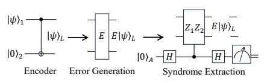
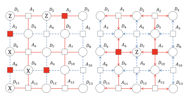
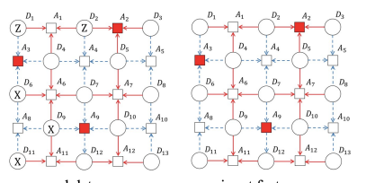
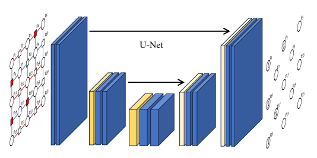

r error correction.

The image is a schematic representation of the process of quantum error correction, specifically illustrating the surface code protocol. The diagram consists of several elements connected by lines and arrows, indicating the flow of operations in the error correction process.

At the top left corner, there is a box labeled "Encoder" with an arrow pointing to a box labeled "Error Generation." This suggests that the encoder is used to add redundancy to the qubits before errors are introduced. Below this, there is another box labeled "Syndrome Extraction," which implies that after errors are generated, a syndrome is extracted to correct them.

In the center of the image, there is a large box labeled "Error Correction." Inside this box, there are two smaller boxes labeled "Stabilizer Z1Z2" and "Ancilla Qubit A." These boxes are connected by arrows, indicating the interaction between the stabilizer and ancilla qubit during the error correction process.

The stabilizer box contains a diagram showing two qubits labeled "Z1" and "Z2," connected by a line labeled "E|ψ⟩L," which represents the error operation on the logical state. The ancilla qubit box contains a diagram showing a single qubit labeled "A" connected to the stabilizer qubits via a line labeled "H," representing the Hadamard gate operation.

The overall structure of the image suggests a step-by-step process of quantum error correction, starting with encoding, followed by error generation, syndrome extraction, and finally error correction using stabilizers and ancilla qubits. The colors used in the image are primarily black and white, with red arrows and lines indicating the flow of operations.

Figure 1: Illustration of syndrome extraction inspired by [29]. We first add a redundancy qubit |0⟩2 on |ψ⟩1 to create a logical state |ψ⟩L. Then some errors (denoted E) are applied on |ψ⟩L to get E|ψ⟩L. After that, we use stabilizer Z1Z2 controlled by ancilla qubit A to extract the syndrome.

Due to the no-cloning theorem for quantum states [24, 37], we cannot replicate quantum states for error correction. Besides, in classical systems, we can measure arbitrary properties of the bit register without corrupting the stored information. However, measurements on the qubits during error correction must be meticulously selected for quantum codes since an improper measurement can cause the wavefunction to erase the encoded data [29].

## 2.3 Quantum Error Correction

Error correction in traditional bits is realized by adding redundancy. Similarly, we can add redundancy in quantum codes to expand the Hilbert space for quantum error correction. Considering |ψ⟩ = α|0⟩ + β|1⟩,
we use two-qubit encoder to add redundancy and |ψ⟩ can be rewritten as:

$$|\psi\rangle_{L}=$$
$|1\rangle L\,$. 
|ψ⟩L = α|00⟩ + β|11⟩ = α|0⟩L + β|1⟩L. (6)
Therefore, after encoding, a logical qubit can be parameterized as a four-dimensional Hilbert space:

$$|\psi\rangle_{L}\in{\mathcal{H}}_{4}=$$

|ψ⟩L ∈ H4 = span{|00⟩, |01⟩, |10⟩, |11⟩}. (7)
But the logical qubit is defined in a two-dimensional subspace of this extended Hilbert space:

$$\rangle,|01\rangle,|10\rangle,|11\rangle\}.$$
$$|\psi\rangle_{L}\in{\mathcal{C}}=\operatorname{span}\{|00\rangle,|11\rangle\}\subset{\mathcal{H}}_{4},$$
|ψ⟩L ∈ C = span{|00⟩, |11*⟩} ⊂ H*4, (8)
where C is the code space. If we add an X-error on the first qubit of |ψ⟩L, the resulting state is

$$\left(7\right)$$
it of $|\psi\rangle_L$, the resulting state is. 
$$X_{1}|\psi\rangle_{L}=\alpha|10\rangle+\beta|01\rangle.$$
X1|ψ⟩L = α|10⟩ + β|01⟩. (9)
Such a state occupies a new subspace:

$\left(8\right)$. 
$\left(\mathfrak{g}\right)$ . 
$$X_{1}|\psi\rangle_{L}\in{\mathcal{F}}\subset{\mathcal{H}}_{4},$$
$\left(10\right)$. 
$\mathcal{I}$. 
$\square$
X1|ψ⟩L *∈ F ⊂ H*4, (10)
where F is the error subspace. Thus, if the qubit |ψ⟩L is not corrupted, it occupies the subspace C. After the X1 error, it occupies the subspace F. Obviously, C and F are mutually orthogonal. Consequently, we can use a projective measurement to distinguish which subspace the logical qubit occupies without destroying the encoded quantum information. We can perform a projective measurement Z1Z2 on a logical state and get a (+1) eigenvalue:
Z1Z2|ψ⟩L = Z1Z2(α|00⟩ + β|11⟩) = (+1)|ψ⟩L, (11)
where Z1Z2 operator is called stabilizer since it does not change the logical qubit [16]. But Z1Z2 operator projects the errored states, X1|ψ⟩L and X2|ψ⟩L onto the (-1) eigenspace. Note that the coefficients α and β are not changed. Then, we use ancilla qubit to extract the syndrome for quantum error correction.

The process of quantum error correction is illustrated in Figure 1. First, we add a redundancy qubit to obtain a logical state. After this, some errors are applied to this state. We then utilize stabilizers to extract the syndrome for error correction.

## 2.4 Surface Code

The widely used quantum error correction protocol for experiments is surface code [11, 32, 29]. The surface code is defined on a two-dimensional square lattice [4] with (2d − 1) × (2d − 1) vertices, where d is

ral data input feature groundtruth the distance of the code. Data and ancilla qubits are placed at the vertices, which are connected by the edges. We use an example in Figure 2 to illustrate the structure and elements of a surface code.

In this figure, ancilla qubit A 2 is connected to data qubits D 2 , D 3 , and D 5 via red edges. These connections signify the underlying relationships between these qubits and allow the ancilla qubit to measure stabr error correction.

Figure 1: Illustration of syndrome extraction inspired by [29]. We first add a redundancy qubit |0⟩2 on |ψ⟩1 to create a logical state |ψ⟩L. Then some errors (denoted E) are applied on |ψ⟩L to get E|ψ⟩L. After that, we use stabilizer Z1Z2 controlled by ancilla qubit A to extract the syndrome.

Due to the no-cloning theorem for quantum states [24, 37], we cannot replicate quantum states for error correction. Besides, in classical systems, we can measure arbitrary properties of the bit register without corrupting the stored information. However, measurements on the qubits during error correction must be meticulously selected for quantum codes since an improper measurement can cause the wavefunction to erase the encoded data [29].

## 2.3 Quantum Error Correction

Error correction in traditional bits is realized by adding redundancy. Similarly, we can add redundancy in quantum codes to expand the Hilbert space for quantum error correction. Considering |ψ⟩ = α|0⟩ + β|1⟩,
we use two-qubit encoder to add redundancy and |ψ⟩ can be rewritten as:

$$|\psi\rangle_{L}=$$
$|1\rangle L\,$. 
|ψ⟩L = α|00⟩ + β|11⟩ = α|0⟩L + β|1⟩L. (6)
Therefore, after encoding, a logical qubit can be parameterized as a four-dimensional Hilbert space:

$$|\psi\rangle_{L}\in{\mathcal{H}}_{4}=$$

|ψ⟩L ∈ H4 = span{|00⟩, |01⟩, |10⟩, |11⟩}. (7)
But the logical qubit is defined in a two-dimensional subspace of this extended Hilbert space:

$$\rangle,|01\rangle,|10\rangle,|11\rangle\}.$$
$$|\psi\rangle_{L}\in{\mathcal{C}}=\operatorname{span}\{|00\rangle,|11\rangle\}\subset{\mathcal{H}}_{4},$$
|ψ⟩L ∈ C = span{|00⟩, |11*⟩} ⊂ H*4, (8)
where C is the code space. If we add an X-error on the first qubit of |ψ⟩L, the resulting state is

$$\left(7\right)$$
it of $|\psi\rangle_L$, the resulting state is. 
$$X_{1}|\psi\rangle_{L}=\alpha|10\rangle+\beta|01\rangle.$$
X1|ψ⟩L = α|10⟩ + β|01⟩. (9)
Such a state occupies a new subspace:

$\left(8\right)$. 
$\left(\mathfrak{g}\right)$ . 
$$X_{1}|\psi\rangle_{L}\in{\mathcal{F}}\subset{\mathcal{H}}_{4},$$
$\left(10\right)$. 
$\mathcal{I}$. 
$\square$
X1|ψ⟩L *∈ F ⊂ H*4, (10)
where F is the error subspace. Thus, if the qubit |ψ⟩L is not corrupted, it occupies the subspace C. After the X1 error, it occupies the subspace F. Obviously, C and F are mutually orthogonal. Consequently, we can use a projective measurement to distinguish which subspace the logical qubit occupies without destroying the encoded quantum information. We can perform a projective measurement Z1Z2 on a logical state and get a (+1) eigenvalue:
Z1Z2|ψ⟩L = Z1Z2(α|00⟩ + β|11⟩) = (+1)|ψ⟩L, (11)
where Z1Z2 operator is called stabilizer since it does not change the logical qubit [16]. But Z1Z2 operator projects the errored states, X1|ψ⟩L and X2|ψ⟩L onto the (-1) eigenspace. Note that the coefficients α and β are not changed. Then, we use ancilla qubit to extract the syndrome for quantum error correction.

The process of quantum error correction is illustrated in Figure 1. First, we add a redundancy qubit to obtain a logical state. After this, some errors are applied to this state. We then utilize stabilizers to extract the syndrome for error correction.

## 2.4 Surface Code

The widely used quantum error correction protocol for experiments is surface code [11, 32, 29]. The surface code is defined on a two-dimensional square lattice [4] with (2d − 1) × (2d − 1) vertices, where d is

The image is a visual representation of the process of syndrome extraction in quantum error correction, inspired by [29]. It illustrates the concept of adding redundancy qubits to create logical states and using stabilizers to extract syndromes for error correction. The image is divided into two main sections: the top section shows the logical state |ψ⟩L with ancilla qubit A and stabilizer Z1Z2, while the bottom section shows the error subspace F after an X1 error on the first qubit of |ψ⟩L.

The top section has a series of qubits labeled from D1 to D13, with ancilla qubit A positioned at the center. The stabilizer Z1Z2 is represented by a red square connecting qubits D1 and D2. The logical state |ψ⟩L is depicted as a combination of |00⟩ and |11⟩, indicating the superposition of states in a four-dimensional Hilbert space.

The bottom section shows the effect of an X1 error on the first qubit of |ψ⟩L, resulting in a new logical state occupying a different subspace F. The stabilizer Z1Z2 is still present, but it projects the logical state onto the (-1) eigenspace.

The image uses a color scheme of white for the qubits, red for the stabilizer Z1Z2, and blue for the ancilla qubit A. The text in the image provides context and explains the concepts being illustrated, such as the no-cloning theorem, quantum error correction, and the surface code.

ral data input feature groundtruth the distance of the code. Data and ancilla qubits are placed at the vertices, which are connected by the edges. We use an example in Figure 2 to illustrate the structure and elements of a surface code.

In this figure, ancilla qubit A 2 is connected to data qubits D 2 , D 3 , and D 5 via red edges. These connections signify the underlying relationships between these qubits and allow the ancilla qubit to measure stabr error correction.

Figure 1: Illustration of syndrome extraction inspired by [29]. We first add a redundancy qubit |0⟩2 on |ψ⟩1 to create a logical state |ψ⟩L. Then some errors (denoted E) are applied on |ψ⟩L to get E|ψ⟩L. After that, we use stabilizer Z1Z2 controlled by ancilla qubit A to extract the syndrome.

Due to the no-cloning theorem for quantum states [24, 37], we cannot replicate quantum states for error correction. Besides, in classical systems, we can measure arbitrary properties of the bit register without corrupting the stored information. However, measurements on the qubits during error correction must be meticulously selected for quantum codes since an improper measurement can cause the wavefunction to erase the encoded data [29].

## 2.3 Quantum Error Correction

Error correction in traditional bits is realized by adding redundancy. Similarly, we can add redundancy in quantum codes to expand the Hilbert space for quantum error correction. Considering |ψ⟩ = α|0⟩ + β|1⟩,
we use two-qubit encoder to add redundancy and |ψ⟩ can be rewritten as:

$$|\psi\rangle_{L}=$$
$|1\rangle L\,$. 
|ψ⟩L = α|00⟩ + β|11⟩ = α|0⟩L + β|1⟩L. (6)
Therefore, after encoding, a logical qubit can be parameterized as a four-dimensional Hilbert space:

$$|\psi\rangle_{L}\in{\mathcal{H}}_{4}=$$

|ψ⟩L ∈ H4 = span{|00⟩, |01⟩, |10⟩, |11⟩}. (7)
But the logical qubit is defined in a two-dimensional subspace of this extended Hilbert space:

$$\rangle,|01\rangle,|10\rangle,|11\rangle\}.$$
$$|\psi\rangle_{L}\in{\mathcal{C}}=\operatorname{span}\{|00\rangle,|11\rangle\}\subset{\mathcal{H}}_{4},$$
|ψ⟩L ∈ C = span{|00⟩, |11*⟩} ⊂ H*4, (8)
where C is the code space. If we add an X-error on the first qubit of |ψ⟩L, the resulting state is

$$\left(7\right)$$
it of $|\psi\rangle_L$, the resulting state is. 
$$X_{1}|\psi\rangle_{L}=\alpha|10\rangle+\beta|01\rangle.$$
X1|ψ⟩L = α|10⟩ + β|01⟩. (9)
Such a state occupies a new subspace:

$\left(8\right)$. 
$\left(\mathfrak{g}\right)$ . 
$$X_{1}|\psi\rangle_{L}\in{\mathcal{F}}\subset{\mathcal{H}}_{4},$$
$\left(10\right)$. 
$\mathcal{I}$. 
$\square$
X1|ψ⟩L *∈ F ⊂ H*4, (10)
where F is the error subspace. Thus, if the qubit |ψ⟩L is not corrupted, it occupies the subspace C. After the X1 error, it occupies the subspace F. Obviously, C and F are mutually orthogonal. Consequently, we can use a projective measurement to distinguish which subspace the logical qubit occupies without destroying the encoded quantum information. We can perform a projective measurement Z1Z2 on a logical state and get a (+1) eigenvalue:
Z1Z2|ψ⟩L = Z1Z2(α|00⟩ + β|11⟩) = (+1)|ψ⟩L, (11)
where Z1Z2 operator is called stabilizer since it does not change the logical qubit [16]. But Z1Z2 operator projects the errored states, X1|ψ⟩L and X2|ψ⟩L onto the (-1) eigenspace. Note that the coefficients α and β are not changed. Then, we use ancilla qubit to extract the syndrome for quantum error correction.

The process of quantum error correction is illustrated in Figure 1. First, we add a redundancy qubit to obtain a logical state. After this, some errors are applied to this state. We then utilize stabilizers to extract the syndrome for error correction.

## 2.4 Surface Code

The widely used quantum error correction protocol for experiments is surface code [11, 32, 29]. The surface code is defined on a two-dimensional square lattice [4] with (2d − 1) × (2d − 1) vertices, where d is

The image is a visual representation of the process of syndrome extraction in quantum error correction, inspired by [29]. It shows a logical state |ψ⟩L being corrupted by an error E to get E|ψ⟩L. The stabilizer Z1Z2 is used to extract the syndrome for error correction. The image is structured with qubits represented as vertices and errors and stabilizers represented by edges. The ancilla qubit A is connected to data qubits via red edges, indicating the measurement process. The image also includes a surface code example in Figure 2, which illustrates the structure and elements of a surface code.

ral data input feature groundtruth the distance of the code. Data and ancilla qubits are placed at the vertices, which are connected by the edges. We use an example in Figure 2 to illustrate the structure and elements of a surface code.

In this figure, ancilla qubit A 2 is connected to data qubits D 2 , D 3 , and D 5 via red edges. These connections signify the underlying relationships between these qubits and allow the ancilla qubit to measure stabr error correction.

Figure 1: Illustration of syndrome extraction inspired by [29]. We first add a redundancy qubit |0⟩2 on |ψ⟩1 to create a logical state |ψ⟩L. Then some errors (denoted E) are applied on |ψ⟩L to get E|ψ⟩L. After that, we use stabilizer Z1Z2 controlled by ancilla qubit A to extract the syndrome.

Due to the no-cloning theorem for quantum states [24, 37], we cannot replicate quantum states for error correction. Besides, in classical systems, we can measure arbitrary properties of the bit register without corrupting the stored information. However, measurements on the qubits during error correction must be meticulously selected for quantum codes since an improper measurement can cause the wavefunction to erase the encoded data [29].

## 2.3 Quantum Error Correction

Error correction in traditional bits is realized by adding redundancy. Similarly, we can add redundancy in quantum codes to expand the Hilbert space for quantum error correction. Considering |ψ⟩ = α|0⟩ + β|1⟩,
we use two-qubit encoder to add redundancy and |ψ⟩ can be rewritten as:

$$|\psi\rangle_{L}=$$
$|1\rangle L\,$. 
|ψ⟩L = α|00⟩ + β|11⟩ = α|0⟩L + β|1⟩L. (6)
Therefore, after encoding, a logical qubit can be parameterized as a four-dimensional Hilbert space:

$$|\psi\rangle_{L}\in{\mathcal{H}}_{4}=$$

|ψ⟩L ∈ H4 = span{|00⟩, |01⟩, |10⟩, |11⟩}. (7)
But the logical qubit is defined in a two-dimensional subspace of this extended Hilbert space:

$$\rangle,|01\rangle,|10\rangle,|11\rangle\}.$$
$$|\psi\rangle_{L}\in{\mathcal{C}}=\operatorname{span}\{|00\rangle,|11\rangle\}\subset{\mathcal{H}}_{4},$$
|ψ⟩L ∈ C = span{|00⟩, |11*⟩} ⊂ H*4, (8)
where C is the code space. If we add an X-error on the first qubit of |ψ⟩L, the resulting state is

$$\left(7\right)$$
it of $|\psi\rangle_L$, the resulting state is. 
$$X_{1}|\psi\rangle_{L}=\alpha|10\rangle+\beta|01\rangle.$$
X1|ψ⟩L = α|10⟩ + β|01⟩. (9)
Such a state occupies a new subspace:

$\left(8\right)$. 
$\left(\mathfrak{g}\right)$ . 
$$X_{1}|\psi\rangle_{L}\in{\mathcal{F}}\subset{\mathcal{H}}_{4},$$
$\left(10\right)$. 
$\mathcal{I}$. 
$\square$
X1|ψ⟩L *∈ F ⊂ H*4, (10)
where F is the error subspace. Thus, if the qubit |ψ⟩L is not corrupted, it occupies the subspace C. After the X1 error, it occupies the subspace F. Obviously, C and F are mutually orthogonal. Consequently, we can use a projective measurement to distinguish which subspace the logical qubit occupies without destroying the encoded quantum information. We can perform a projective measurement Z1Z2 on a logical state and get a (+1) eigenvalue:
Z1Z2|ψ⟩L = Z1Z2(α|00⟩ + β|11⟩) = (+1)|ψ⟩L, (11)
where Z1Z2 operator is called stabilizer since it does not change the logical qubit [16]. But Z1Z2 operator projects the errored states, X1|ψ⟩L and X2|ψ⟩L onto the (-1) eigenspace. Note that the coefficients α and β are not changed. Then, we use ancilla qubit to extract the syndrome for quantum error correction.

The process of quantum error correction is illustrated in Figure 1. First, we add a redundancy qubit to obtain a logical state. After this, some errors are applied to this state. We then utilize stabilizers to extract the syndrome for error correction.

## 2.4 Surface Code

The widely used quantum error correction protocol for experiments is surface code [11, 32, 29]. The surface code is defined on a two-dimensional square lattice [4] with (2d − 1) × (2d − 1) vertices, where d is

The image is a visual representation of the process of quantum error correction, specifically illustrating the surface code protocol. The image consists of a series of figures and diagrams that explain the concept of adding redundancy to qubits for error correction.

In Figure 1, there is an illustration of syndrome extraction inspired by [29]. It shows a logical state |ψ⟩L being corrupted by an error E, resulting in E|ψ⟩L. A stabilizer Z1Z2 controlled by an ancilla qubit A is used to extract the syndrome.

Figure 2 is an example of a surface code structure. It shows data qubits D 2, D 3, D 5, D 6, D 7, D 9, D 10, D 11, and D 12 connected by red edges to an ancilla qubit A 2. The connections signify the underlying relationships between these qubits and allow the ancilla qubit to measure stabilizers.

The text accompanying the images explains the concept of quantum error correction, the use of stabilizers, and the surface code protocol. It discusses how adding redundancy in quantum codes can expand the Hilbert space for error correction and how projective measurements can distinguish between subspaces without destroying encoded quantum information. The surface code is described as a widely used quantum error correction protocol for experiments, defined on a two-dimensional square lattice with (2d - 1) × (2d - 1) vertices, where d is the distance of the code.

ral data input feature groundtruth the distance of the code. Data and ancilla qubits are placed at the vertices, which are connected by the edges. We use an example in Figure 2 to illustrate the structure and elements of a surface code.

In this figure, ancilla qubit A 2 is connected to data qubits D 2 , D 3 , and D 5 via red edges. These connections signify the underlying relationships between these qubits and allow the ancilla qubit to measure stabbel vector is Yk = [0, 1, 0, 0]T. If a Z error is detected in vk, the label vector becomes Yk = [0, 0, 1, 0]T. If both X and Z errors exist in vk, the label vector is set as Yk = [0, 0, 0, 1]T.

## 2.6 Related Work

While traditional error-correction methods, often referred to as decoders, such as the minimum weight perfect matching (MWPM) [7], have shown promise, they face scalability challenges on larger quantum systems [35]. It is important for error correction schemes to detect errors efficiently within a limited time budget to guarantee quantum computing's practical application. Furthermore, as quantum computers expand in scale, these schemes should work on more quantum bits. Given its computational complexity, MWPM fails to be used in larger quantum computers [4].

To address the limitations of MWPM, recent advancements have introduced data-driven QEC schemes.

Most data-driven QEC schemes employ neural network architectures like multilayer perceptron (MLP) [6]
or convolutional neural networks (CNN) [4], which have shown success in quantum error correction.

In general, these models fall into two categories: low-level and high-level ML-based decoding schemes.

Low-level decoders are designed to detect and correct errors in data qubits, whereas high-level decoders aim to correct logical errors incorporated by low-level decoders [2, 33]. Besides, some scalable and fast decoders [33, 14] have been proposed for large-scale surface codes. Despite these promising advances, current methods exhibit significant limitations, primarily due to a lack of modelling of long-range dependency.

The image is a schematic representation of a quantum error correction (QEC) process. It shows a series of layers that are likely part of a neural network architecture used for QEC. The layers are represented by blue blocks, with the input layer on the left and the output layer on the right. Each block represents a layer in the network, and the arrows indicate the flow of information from one layer to the next.

The top left corner of the image contains a label "U-Net," which suggests that this particular architecture is a U-Net, a type of convolutional neural network known for its ability to handle spatial hierarchies in data. The bottom right corner has a reference to "Figure 2," indicating that this image is part of a larger document or presentation.

The text accompanying the image provides context for the U-Net's role in QEC. It discusses the limitations of traditional error-correction methods like minimum weight perfect matching (MWPM) and introduces data-driven QEC schemes that use neural network architectures like MLP and CNN. The text also mentions the concept of long-range dependency learning for more accurate error detection within quantum computing systems.

The image serves as a visual aid to help explain the concept of using ancilla qubits, which are not immediately adjacent but farther apart, to offer supplementary information for error detection in data qubits. The illustration shows how syndromes in ancilla qubits can provide contextual information about potential errors in data qubits, which is crucial for effective QEC.

To address this issue, this work introduces a new perspective to understanding QEC to fill this research gap. While syndromes in ancilla qubits traditionally stem from errors in adjacent data qubits within the surface code, our findings indicate that long-range ancilla qubits, which are not immediately adjacent but are farther apart, can offer supplementary information. This can help dismiss certain incorrect predictions for error detection in data qubits. Thus, we rely on the implicit long-range relationship between data qubits and remote ancilla qubits to improve error detection performance. Correspondingly, we curate a benchmark to evaluate the performance of existing machine learning methods to capture these long-range dependencies. More specifically, seven popular deep learning algorithms, including CNN [20], Graph Convolutional Network (GCN) [19], Multi-Scale Graph Neural Networks (MultiGNN) [1], GCN with Initial residual & Identity mapping (GCNII) [5], U-Net [31], GraphTransformer [38], and Approximate Personalized Propagation of Neural Predictions (APPNP) [12], are evaluated in the experiments.

## 3 Implicit Long-Range Dependency Learning For Quantum Error Correction 3.1 Intuition

In this section, we delve into the underlying intuition of exploiting context information from distant ancilla qubits for more accurate error detection within quantum computing systems. Consider the illustrative example on the right of Figure 2. Within this figure, syndromes are detected in both ancilla qubits A6 and A7. An error occurring within data qubits D4, D6, D7, or D9 could lead to a syndrome in A6. Hence, the syndrome information in A6 is insufficient to deduce an error's position. However, the absence of a syndrome in A1 or A11 presents additional critical context information that must not be overlooked. By aggregating this contextual information, that is, recognizing that there is no syndrome in A1 or A11, we gain implicit long-range dependency for error correction in D7. Specifically, this long-range dependency contextual information allows us to confidently rule out the scenario where D4, D6, or D9 are in an error state.

This example serves to highlight the complexity of error detection in quantum systems. It is not merely about identifying where syndromes have occurred but also about understanding where they have in Figure 4, is an extension of convolutional neural network architecture used primarily for image segmentation tasks in computer vision. It consists of a contracting path to capture context and a symmetric expanding path to enable precise localization. The U-Net leverages encoder-decoder architectures, where the encoder and decoder perform downsampling and upsampling, respectively. It is widely used in medical image analysis and other image segmentation applications [21].

Due to its downsampling and upsampling operations, we can not only aggregate information from distant ancilla qubits but also maintain the consistent size of the surface code.

Graph Convolutional Network (GCN). Graph convolutional network (GCN) [18] is one of the earliest and most widely used graph neural networks. The main idea is to iteratively update the node

The image is a scientific illustration that represents the architecture of various graph neural network models. The models depicted are U-Net, Graph Convolutional Network (GCN), GCNII, Approximate Personalized Propagation of Neural Predictions (APPNP), and Multi-Scale Graph Neural Networks (Multi-GNNs). Each model is represented by a diagram showing the flow of information through layers, with nodes representing data points or qubits in a quantum computing context.

The U-Net model is shown as having an encoder-decoder structure, with contracting and expanding paths to capture context and enable precise localization. The GCN model is illustrated as a graph neural network that iteratively updates node representations by aggregating information from neighbors. The GCNII model extends the traditional GCN with initial residual and identity mapping techniques. The APPNP model uses PageRank-inspired message passing strategy to aggregate information from higher-order neighbors. Lastly, the Multi-GNNs model adopts a concatenation-style design to exploit higher-order information from distant ancilla qubits.

The image also includes a table that compares the overall accuracy of these models on different distances (3, 5, 7) and different probabilities of X and Z error in data qubits. The table shows the percentage of accuracy for each model under different conditions, with the best method highlighted in bold and statistically significantly better methods than CNN underlined.

$$(18)^{\frac{1}{2}}$$
(l)), $\downarrow$. 

$=\;\sigma\,\square$  . 
representation by aggregating the information from its neighbors. The updating rule of GCN for the l-th layer is H(l) = σDe − 12 Ae De − 12 H(l−1)W(l), (17)
where A ∈ {0, 1}
|V |×|V |is the adjacency matrix of the graph G, Ae = A + I, I is identity matrix, De is the diagonal node degree matrix of Ae , σ is activation function, e.g., Tanh, ReLU [27]. Within the l-th layer, W(l) ∈ R
d×dis the learnable weight matrix to transform the embedding, d is the dimension of embedding, L is the depth of GCN. The i-th row of H(l) denotes an embedding vector of the i-th node.

The illustration of GCN can be found in Figure 5. All the graph neural networks in this paper use the same mathematical notations.

GCNII. It is well known that stacking multiple graph convolutional network layers causes oversmoothing, which suggests node representations converge to a similar vector after undergoing multi-layer aggregation. To alleviate this, GCN with Initial residual & Identity mapping (GCNII) [5] extends the traditional GCN with initial residual and Identity mapping techniques, as illustrated in Figure 5. The l-th layer of GCNII is

$$\mathbf{H}^{(l)}=\sigma\left(\left(\left(1-\alpha_{l}\right)\tilde{\mathbf{D}}^{-{\frac{1}{2}}}\tilde{\mathcal{A}}\tilde{\mathbf{D}}^{-{\frac{1}{2}}}\mathbf{H}^{(l-1)}+\alpha_{l}\mathbf{H}^{(0)}\right)\left(\left(1-\beta_{l}\right)\mathbf{I}+\beta_{l}\mathbf{W}^{(l)}\right)\right),$$

where αl decides the extent of initial residual connection and βlis for residual connection. The definition of σ, De , H(l), Ae ,W(l) are same as GCN.

APPNP. Approximate personalized propagation of neural predictions (APPNP) [12, 13] is a variant of graph neural network that leverages PageRank-inspired message passing strategy [30]. The main idea of APPNP is to exploit graph diffusion [13] to aggregate information from higher-order neighbors. The update rule of the l-th layer is

$$=\sigma((1-\alpha){\hat{\mathbf{I}}}$$
$\square$
H(l) = σ(1 − α)De − 12 Ae De − 12 H(l−1)W(l) + αH(0)W(l), (19)
where α represents transport probability. The definition of σ, De , H(l), Ae ,W(l) are same as GCN.

Multi-Scale Graph Neural Networks (Multi-GNNs). In contrast to APPNP, multi-scale GNNs [1] adopt a concatenation-style design to exploit higher-order information from distant ancilla qubits. The

$$(20)^{\frac{1}{2}}$$

$$(22)$$

Table 1: Overall Accuracy (%). p is the probability of X and Z error in data qubits. OOM is the out-of-memory error. For each task, we highlight the best method in bold. We underline the statistically significantly better (pass the t-test, i.e., p-value<0.05) methods than CNN, the best existing method [4].

Distance 3 5 7

p 0.005 0.01 0.05 0.005 0.01 0.05 0.005 0.01 0.05

CNN 99.14 98.48 91.63 99.19 98.35 91.24 99.39 98.73 91.14

U-Net 99.94 99.78 95.23 99.95 99.81 95.88 99.96 99.83 95.98

GCN 99.72 99.66 95.01 99.94 99.77 95.72 99.94 99.79 95.69

GCNII 99.94 99.78 95.06 99.96 99.80 95.65 99.95 99.82 95.68

APPNP 99.51 98.84 90.41 99.71 99.33 91.32 99.71 99.45 9in Figure 4, is an extension of convolutional neural network architecture used primarily for image segmentation tasks in computer vision. It consists of a contracting path to capture context and a symmetric expanding path to enable precise localization. The U-Net leverages encoder-decoder architectures, where the encoder and decoder perform downsampling and upsampling, respectively. It is widely used in medical image analysis and other image segmentation applications [21].

Due to its downsampling and upsampling operations, we can not only aggregate information from distant ancilla qubits but also maintain the consistent size of the surface code.

Graph Convolutional Network (GCN). Graph convolutional network (GCN) [18] is one of the earliest and most widely used graph neural networks. The main idea is to iteratively update the node

$$(18)^{\frac{1}{2}}$$
(l)), $\downarrow$. 

$=\;\sigma\,\square$  . 
representation by aggregating the information from its neighbors. The updating rule of GCN for the l-th layer is H(l) = σDe − 12 Ae De − 12 H(l−1)W(l), (17)
where A ∈ {0, 1}
|V |×|V |is the adjacency matrix of the graph G, Ae = A + I, I is identity matrix, De is the diagonal node degree matrix of Ae , σ is activation function, e.g., Tanh, ReLU [27]. Within the l-th layer, W(l) ∈ R
d×dis the learnable weight matrix to transform the embedding, d is the dimension of embedding, L is the depth of GCN. The i-th row of H(l) denotes an embedding vector of the i-th node.

The illustration of GCN can be found in Figure 5. All the graph neural networks in this paper use the same mathematical notations.

GCNII. It is well known that stacking multiple graph convolutional network layers causes oversmoothing, which suggests node representations converge to a similar vector after undergoing multi-layer aggregation. To alleviate this, GCN with Initial residual & Identity mapping (GCNII) [5] extends the traditional GCN with initial residual and Identity mapping techniques, as illustrated in Figure 5. The l-th layer of GCNII is

$$\mathbf{H}^{(l)}=\sigma\left(\left(\left(1-\alpha_{l}\right)\tilde{\mathbf{D}}^{-{\frac{1}{2}}}\tilde{\mathcal{A}}\tilde{\mathbf{D}}^{-{\frac{1}{2}}}\mathbf{H}^{(l-1)}+\alpha_{l}\mathbf{H}^{(0)}\right)\left(\left(1-\beta_{l}\right)\mathbf{I}+\beta_{l}\mathbf{W}^{(l)}\right)\right),$$

where αl decides the extent of initial residual connection and βlis for residual connection. The definition of σ, De , H(l), Ae ,W(l) are same as GCN.

APPNP. Approximate personalized propagation of neural predictions (APPNP) [12, 13] is a variant of graph neural network that leverages PageRank-inspired message passing strategy [30]. The main idea of APPNP is to exploit graph diffusion [13] to aggregate information from higher-order neighbors. The update rule of the l-th layer is

$$=\sigma((1-\alpha){\hat{\mathbf{I}}}$$
$\square$
H(l) = σ(1 − α)De − 12 Ae De − 12 H(l−1)W(l) + αH(0)W(l), (19)
where α represents transport probability. The definition of σ, De , H(l), Ae ,W(l) are same as GCN.

Multi-Scale Graph Neural Networks (Multi-GNNs). In contrast to APPNP, multi-scale GNNs [1] adopt a concatenation-style design to exploit higher-order information from distant ancilla qubits. The

The image is a schematic representation of various graph neural network architectures used in computer vision and machine learning. It illustrates the flow of information through these networks, highlighting the key components such as multi-head self-attention, feature fusion networks (FFN), and residual connections. The image also includes a table comparing the overall accuracy of different methods on tasks with varying distances and error probabilities. The colors used are primarily blue, green, and red, with black text for clarity. The image serves as an educational tool to explain complex concepts in a visually accessible manner.

$$(20)^{\frac{1}{2}}$$

$$(22)$$

Table 1: Overall Accuracy (%). p is the probability of X and Z error in data qubits. OOM is the out-of-memory error. For each task, we highlight the best method in bold. We underline the statistically significantly better (pass the t-test, i.e., p-value<0.05) methods than CNN, the best existing method [4].

Distance 3 5 7

p 0.005 0.01 0.05 0.005 0.01 0.05 0.005 0.01 0.05

CNN 99.14 98.48 91.63 99.19 98.35 91.24 99.39 98.73 91.14

U-Net 99.94 99.78 95.23 99.95 99.81 95.88 99.96 99.83 95.98

GCN 99.72 99.66 95.01 99.94 99.77 95.72 99.94 99.79 95.69

GCNII 99.94 99.78 95.06 99.96 99.80 95.65 99.95 99.82 95.68

APPNP 99.51 98.84 90.41 99.71 99.33 91.32 99.71 99.45 92.33

Multi-GNN 99.80 99.52 94.39 99.87 99.51 95.08 99.93 99.70 95.07

GraphTransformer 99.94 99.78 95.05 99.95 99.82 95.84 99.96 99.81 OOM

architecture can be formulated as:

## H(L) = ΣhaxA2X A3X| . . . |Alx Iw, (20)

where W ∈ R
d×cis the trainable weight matrix, | denotes the concatenation. The definition of H(l), A, σ are same as GCN.

Graph Transformer. Transformer [34], illustrated in Figure 6, is one of the most powerful neural structures, finding applications across diverse fields like natural language processing and computer vision. Notably, its prowess extends to graph-structured data, with recent implementations yielding impressive results [38]. In our study, we delve into the efficacy of the Graph Transformer [38] in the context of QEC. A typical Graph Transformer layer comprises a self-attention mechanism coupled with a position-wise feed-forward network (FFN). When given hidden states as input, represented by H =
nH
(l)
0
, H
(l)
1
, *· · ·* , H
(l)
(2d−1)2 ofor the l-th layer of the Graph Transformer, we employ learnable query, key, and value parameter (WQ,WK,WV ) to transform H(l−1) and yield query, key and value matrices:
Q(l) = H(l−1)WQ, K(l) = H(l−1)WK, V(l) = H(l−1)WV . (21)
The intuition behind query and key matrices (Q(l) and K(l)) is to compute the attention scores A(l)[34].

Then, A(l) aggregate information from V(l),

$$\mathbf{\mathcal{A}}_{(l)}=\frac{\mathbf{Q}_{(l)}\mathbf{K}_{(l)}^{\top}}{\sqrt{d_{K}}},\ \mathbf{H}^{(l)}=\mathrm{FFN}(\mathrm{softmax}(\mathbf{\mathcal{A}}_{(l)}\mathbf{V}_{(l)})).$$  The definition of $\mathbf{H}^{(l)}$ are same as GCN. softmax is an activation function [27].  
√dK, H(l) = FFN(softmax(A(l)V(l))). (22)

## 4 Experiments 4.1 Data Construction

The surface code we use can be illustrated as a grid-like structure, as shown in Figure 2. Errors may occur in the data qubits (depicted as circles), which then cause corresponding syndromes in the ancilla

Distance 3 5 7

p 0.005 0.01 0.05 0.005 0.01 0.05 0.005 0.01 0.05

CNN 14.95 25.39 20.43 18.90 18.37 17.43 40.50 39.25 15.65

U-Net 96.79 93.55 71.03 97.36 93.73 70.42 97.29 95.07 69.49

GCN 89.76 87.18 67.41 95.95 93.91 66.47 96.93 92.54 68.47

GCNII 96.69 93.22 75.14 97.29 95.85 68.67 97.51 94.33 67.16

APPNP 52.53 44.71 6.03 73.63 71.56 26.90 81.28 78.86 61.17

Multi-GNN 81.75 78.63 56.81 88.90 79.89 61.60 95.75 89.17 59.53

The image is a screenshot of a research paper or report that discusses the performance of various machine learning models on quantum error correction (QEC). The title "GraphTransformer" suggests that the focus is on a specific type of neural network architecture. The image contains three graphs, each representing the accuracy of different models over varying distances and probabilities (p) of errors.

The first graph shows the accuracy of CNN, U-Net, GCN, GCNII, APPNP, Multi-GNN, and GraphTransformer models at distances 3, 5, and 7 with error probabilities p = 0.005, 0.01, and 0.05. Each model's accuracy is represented by a line graph with data points corresponding to their performance at these settings.

The second graph repeats the same models but with a different set of data points for each model, indicating a different set of results or parameters used in the experiment.

The third graph is similar to the first one but includes only the Multi-GNN and GraphTransformer models. It also shows the accuracy of these models at the same distances and error probabilities.

The text below the graphs provides context and explains the methodology behind the experiments. It mentions the use of a surface code as a grid-like structure to simulate errors and syndromes in the data qubits and ancilla qubits. The process involves generating errors, extracting syndromes, structuring the data, and handling degeneracy. The text also refers to the use of learnable query, key, and value parameter matrices in the Graph Transformer model.

The overall layout of the image is structured with clear headings, graphs, and explanatory text, making it easy to understand the research findings presented.

qubits (denoted as boxes). Besides, different error types cause the corresponding syndrome through red/blue lines. To evaluate the performance of different machine learning models on quantum error correction, we simulate the errors within the surface code and obtain data for training, validation, and testing. Following [29, 4], our data construction process evolves through the following steps:

1. Error Generation: X and Z errors in the data qubit are generated based on a probability p. In general, the probability p is a small number since the probability that an error occurs is also small.

2. Syndrome Extraction: When these errors occur, we employ a stabilizer to identify and extract the corresponding syndrome from the ancilla qubits connected to the data qubits.

3. Data Structuring: The detected syndrome serves as the input features for our learning algorithm, with the corresponding errors in the data qubits acting as the output labels. This allows us to learn the error patterns inherent in the surface code.

4. Handling Degeneracy: A distinguishing feature of the surface code is its degeneracy, implying that multiple unique error patterns can yield the same syndrome. To manage this, we opt for the set with the fewest errors for our training input whenever different patterns generate identical syndromes. This selection is underpinned by the assumption that quantum errors are infrequent. However, in the testing phase, we generate the surface code without accounting for this degeneracy. This approach pushes our models to generalize more effectively for the unpred                             |
| %                                  | modulo operator                                                              |
| p                                  | the probability of X and Z error in data qubits                              |

## A Dataset Details

For the training dataset, we produce either 1,000,000 or 10,000,000 surface codes, selecting the one with the fewest errors for a given syndrome setup. We opt for a larger simulation size of 10,000,000 when the distance is 3 due to the limited number of selected surface codes. For other distances, we generate 1,000,000 surface codes. Table 5 reports the details of the simulation.

| Distance                                                                                                                                                                        | 3      | 5      | 7       |        |        |         |        |        |
|---------------------------------------------------------------------------------------------------------------------------------------------------------------------------------|--------|--------|---------|--------|--------|---------|--------|--------|
| p=0.005                                                                                                                                                                         | p=0.01 | p=0.05 | p=0.005 | p=0.01 | p=0.05 | p=0.005 | p=0.01 | p=0.05 |
| Simulation 10,000,000 10,000,000 10,000,000 1,000,000 1,000,000 1,000,000 1,000,000 1,000,000 1,000,000 Training 1,057 1,588 4,044 10,950 41,885 619,937 50,221 179,702 969,688 |        |        |         |        |        |         |        |        |

The dataset statistics can be found in Table 6.

## B Additional Empirical Results: Over-Smoothing Analysis For Qec

In graph neural networks such as GCN and GCNII, the input is a graph structure, our goal is to learn a representation for each node in the graph. Over-smoothing suggests that node representations converge to the same vector and thus become indistinguishable after many-layer graph convolution [39]. In this section, we delve into the influence of depth (number of hidden layers) of GCN and GCNII on QEC's performance. As illustrated in Figure 8, the phenomenon of over-smoothing is evident in QEC as well.

| Distance                                                                                                                                                                                            | 3      | 5      | 7       |        |        |         |        |         |         |
|-----------------------------------------------------------------------------------------------------------------------------------------------------------------------------------------------------|--------|--------|---------|--------|--------|---------|--------|---------|---------|
| p=0.005                                                                                                                                                                                             | p=0.01 | p=0.05 | p=0.005 | p=0.01 | p=0.05 | p=0.005 | p=0.01 | p=0.05  |         |
| Training                                                                                                                                                                                            | 1,057  | 1,588  | 4,044   | 10,950 | 41,885 | 619,937 | 50,221 | 179,702 | 969,688 |
| Validation 1,000,000 1,000,000 1,000,000 1,000,000 1,000,000 1,000,000 1,000,000 1,000,000 1,000,000 Test 1,000,000 1,000,000 1,000,000 1,000,000 1,000,000 1,000,000 1,000,000 1,000,000 1,000,000 |        |        |         |        |        |         |        |         |         |

The image is a graphical representation of the performance of two graph neural network models, GCN and GCNII, across different distances (3, 5, 7) and error correction rates (p=0.005, p=0.01, p=0.05). The x-axis represents the depth of the networks, which is the number of hidden layers. The y-axis shows the error correction rate, with three lines representing the performance of each model at different error correction rates.

For both models, as the depth increases, the error correction rate initially improves but then declines. The peak performance for GCN occurs at a depth of 32, after which it drops to zero. In contrast, GCNII maintains a higher error correction rate even at a depth of 32, suggesting that the initial residual connection in GCNII helps mitigate the over-smoothing effect. The color coding in the legend indicates the model type, with orange for GCN and blue for GCNII.

As we increase the depth of GCN, its performance peaks and subsequently declines. With a depth of 32 in GCN, the error correction rate drops to zero. However, due to the initial residual connection in GCNII, its performance 