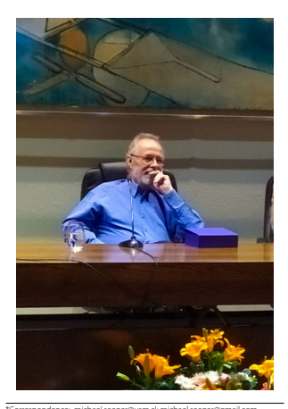

EDITORIAL
Open Access

# An Exploration Of Microbial Response To Stressors With Prof. Claudio C. Vásquez Guzmán

Michael Seeger1*, Raymond J. Turner2 and Mauricio González3

*Correspondence: michael.seeger@usm.cl; michael.seeger@gmail.com
1 Laboratorio de Microbiología Molecular y Biotecnología Ambiental, Departamento de Química & Centro de Biotecnología Dr. Daniel Alkalay Lowitt, Universidad Técnica Federico Santa María, Avenida España 1680, Valparaiso, Chile Full list of author information is available at the end of the article Microorganisms, particularly bacteria, are the major species on the planet, considered to be up to 98% of all species. Bacteria have evolved impressive responses to various stressors, which have been essential for the adaptation and evolution of microorganisms and colonization of a wide range of environments. Tis special issue of Biological Research on microbial response to stressors is a tribute of the Chilean and international scientifc community to the late Professor Claudio C. Vásquez Guzmán 
(1952–2020) who dedicated his career in environmental microbiology and biochemistry to the study of bacterial stress response, particularly that of metal ion stress.

Microbes were the frst living cells on Earth. Tey have co-evolved with the planet and thus have experienced a wide range of geological changes that have produced a wide variety of ecological niches and stressors. Stressors to microbial life include expected physical and chemical concerns such as: temperature, pressure, redox state, pH, ionic strength, osmolarity, UV light exposure and shear forces. Additionally, other stressors exist such as low availability of key nutrients, carbon sources, scarcity in electron acceptors, antimicrobial compounds, and also anthropogenicproduced or released pollutants that include toxic metals.

A wide range of natural extreme environments that are inhabited by extreme microorganisms are present world-wide. However, Chile has remarkable diversity, from the Atacama Desert and Altiplano highlands in the North to Patagonia and Antarctic regions in the South, and from South Pacifc and Rapa Nui Island in the West to the Andes Mountains in the East [1]. In addition, polluted environments due to anthropogenic activities (e.g., 
mining, petroleum transport and processing, chemical 
© The Author(s) 2022. **Open Access** This article is licensed under a Creative Commons Attribution 4.0 International License, which permits use, sharing, adaptation, distribution and reproduction in any medium or format, as long as you give appropriate credit to the original author(s) and the source, provide a link to the Creative Commons licence, and indicate if changes were made. The images or other third party material in this article are included in the article's Creative Commons licence, unless indicated otherwise in a credit line to the material. If material is not included in the article's Creative Commons licence and your intended use is not permitted by statutory regulation or exceeds the permitted use, you will need to obtain permission directly from the copyright holder. To view a copy of this licence, visit http://creativecommons.org/licenses/by/4.0/. The Creative Commons Public Domain Dedication waiver (http://creativeco mmons.org/publicdomain/zero/1.0/) applies to the data made available in this article, unless otherwise stated in a credit line to the data.

industries, agriculture, forestry, and aquaculture) generate extreme conditions and are of increasing concern. 

As such, Chilean scientists have explored such niches in various felds, particularly microbiology.

Stress from such sources is a curious phenomenon for microbes. Microbes acquired tolerance mechanisms towards various geological epoch stressors, which may or may not be present in the Anthropocene [2]. Certainly, unique physiologies from evolved genomics exist for those species remaining in extreme ecological niches similar to those of the early Earth. Yet new challenging niche environments now exist that have more rapidly been established due to human activities, making this feld of study extremely interesting.

Generally, bacteria deal with such stressors by living in a surface attached or agglomeration community referred to as a bioflm. Bioflms have the characteristic phenotype of tolerating a wide range of stressors from the environment [3]. However, bacteria may prefer to migrate from a stressful niche or the presence of toxic molecules or heavy metals [4]. Beyond this, individual strains have evolved specialized genes coding for defned stress resistance determinants. Such determinants are often carried on mobile genetic elements allowing for exchange and optimization of use within a microbial community.

Resistance towards stressors such as temperature, pH, 
ionic strength and osmolarity are typically from a wide range of physiological adaptations. From presence of unique lipids, transporters, chaperones, and the evolved sequences of the proteins that are exposed to the stress. Systematic environmental microbiology followed up by molecular microbial research has led to advances in understanding such stress responses. Tese studies have also led to outstanding biotechnological advances such as thermostable DNA polymerases, enzymes for green-chemistry that work at alkali and acidic pH or in extremes of ionic strength, synthesis of special biomolecules (e.g., antioxidants) and biopolymers such as polyhydroxyalkanoates, microorganisms and extremophiles for the clean-up of polluted environments [5] and the protection and alleviation of stress in plants [6].

Organic molecules as stressors come in many forms including, but not limited to: chemical modifcations of natural antibiotics, a wide range of chemically synthesized antiseptics, biocides, herbicides and a plethora of pollutants. Te diverse genetic diversity of the remarkable number of microbial species on the planet usually means that a species somewhere has evolved the ability to use such compounds as a carbon and/or energy source. Metabolic genes and mechanisms for such activities have been studied since the 1970s when scientists began to realize that microbes are remarkable chemists. Bioflms also provide strategies to survive in polluted environments [7]. Tis provides us with the feld of bioremediation to clean up the sloppiness of the industrial activity. However, xenobiotic pollutants are of concern as they have been modifed with atoms and bonds that are not within the natural enzymatic realm. It is thus impressive how well many microbes tolerate such challenges via changes in membrane composition, through efux pumps, or via biotransformation and biodegradation using evolved metabolic enzymes and pathways [8]. Organisms as diverse as bacteria, yeast, and mammals share a requirement for the regulation of cellular content of essential metals to ensure correct function of several metal-binding proteins, like copper, iron, nickel, and zinc. Recently, molecular approaches have led to the discovery of diverse mechanisms underlying metal homeostasis [9]. We now have an understanding of some of the processes involved in metal uptake, transport, and removal, and are beginning to understand the regulation of these processes [9, 10]. For toxicity we tend to see modes of physiological disturbance including: disrupting essential metal homeostasis, displacing essential metals in enzymes, disruption of cytochromes and/or [Fe–S] centres releasing iron that catalyses Fenton reactions generating reactive oxygen species. Most stressors lead to some amount of ROS production, but metals that can catalyse the reactions lead to high ROS loads that damage DNA, proteins, and membranes. To prevent the consequences of metal overload, living organisms have evolved molecular mechanisms that regulate uptake, intracellular trafc, storage, and efux, reduction/oxidation to change species, chemical modifcation, sequestration, repair of damage (typically from ROS) [11–14]. Response to metal stress has seen increased interest in regard to microbiology in mine leachates and tailing ponds, bioleaching in high-value metal mining, to new directions of using nonessential metals as antimicrobials or using microbes to produce metal nanomaterials [15, 16]. Regardless, there is still far more to learn about the mechanisms of toxicity and resistance for specifc metals in selected strains, particularly how bacteria survive metal pollutants [17].

From above we see the importance of this feld. As such, many microbiologists, whether clinical, environmental, or molecular fnd themselves studying microbial response and tolerance to stressors at one time or another in their carriers. Te late Professor Claudio Christian Vásquez Guzmán was a prominent and talented scientist from Chile. Claudio Vásquez studied biochemistry at the Universidad de Chile (1977) and received his Ph.D in Biological Sciences from the Pontifcia Universidad Católica de Chile (1983). He started his academic career as an Assistant Professor at Universidad de Chile (1985–1988), continued as an Associate Professor at Universidad de Talca 
(1988–2005), and became a Full Professor at Universidad de Santiago de Chile (2005–2020). During his academic career, Claudio and his team published close to 100 internationally recognized papers, and trained an important number of researchers and students including 6 postdoctoral researchers, 28 Ph.D, 9 M.Sc, and 44 undergraduate students. He also infuenced and mentored junior scientists from around the world. Several of his former trainees have contributed to this special issue. We acknowledge his disciples and colleagues, and particularly Felipe Arenas, José Manuel Pérez-Donoso and Claudia Saavedra, for their generous support and for providing valuable information and the photo for this special issue.

Claudio was a generous colleague and friend that always provided helpful and creative scientifc advice, sharing with generosity his knowledge and experience, and mentoring on how to proceed given diverse scientifc challenges.

Michael Seeger: Prof. Claudio Vasquez was my professor in a molecular biology course I took in 1987 as part of my major in biochemistry at Universidad de Chile. It was a diffcult time to live in Chile, as it had been controlled by a brutal dictatorship since 1973. Claudio Vasquez, along with his colleague Enrique Gonzalez (Kiko), were a dynamic team of professors that were often smiling and fascinated us. Tey taught molecular biology, its theory and new experimental techniques, and always encouraged and maintained friendly relationships with undergraduate students. Michael Seeger and Mauricio González: Later, we cooperated with Claudio in diverse national scientifc symposia and meetings, as members of local evaluation committees for funding (Fondecyt), and a number of Ph.D theses committees. Raymond J. 

Turner: My interactions with Prof. Vásquez fall in the area of tellurite resistance and related microbial biochemistry and physiology. We communicated often during the 2000s, soon after I started my position at the University of Calgary, Canada. He was a tough reviewer of my manuscripts for sure, and it was through the personal communications that he helped mentor me to bring my research on tellurite resistance mechanisms to a higher level. Claudio never hesitated to reply to an email of questions and concerns. Trough an invitation to contribute a review on tellurium microbiology for a special edition of *Tellurium* in biological systems 10 years after the Fukushima disaster [18], we were able to work together and highlight the discoveries of various enzymes and biochemical processes involved in tellurite-microbe interaction.

Te nine articles of this special issue of *Biological Research* address biochemical and genetic determinants of microbial response and tolerance to stressors in diferent biological models and environmental contexts. Individual articles provide a broad exploration of our current knowledge of response to stressors, with a special emphasis on metal metabolism and toxic compounds. Beginning with genomic approaches, the reader will be provided insights about transcriptional regulation activated in response to stressors by examining the OxyR and SoxR transcriptional regulators and genetic regulation process using OmpX porin in response to hydrogen peroxide stress as a model. Based on the best available scientifc evidence, the cellular mechanism of tellurite control is reviewed, including a study on how tellurite reduction contributes to tolerance against tellurite in a bacterial model. Another two studies examine the basic molecular and cellular mechanism of copper homeostasis. Te results suggest that tolerance to copper excess requires a combination of metabolic capabilities, such as inorganic polyphosphate and cobalamin metabolism. From biochemical studies, we also see the multiple dimensions and interrelations of metals (such as lithium and chromate) and metalloids to mechanisms of tolerance and antibiotic resistance. Under real-world conditions, studies using single bacterial models need to be complemented with the exploration of microbial response to stressors using metagenomics approaches. In this context, the results presented in this special issue include information on human gut microbiota associated with chronic kidney disease focusing on resistance to metal(loid)s and antibiotics of microorganisms. Also, at the metagenomics level, an interesting study reports the taxonomic and functional characterization of bacterial communities inhabiting Li-rich extreme environments in the Atacama salt fat. Finally, the special issue contains an article that addresses the challenges to fnding molecular targets related to pathogeny, virulence, and survival that could be useful in designing new prophylactic or therapeutic strategies against aquatic pathogenic bacteria important to the health and productive aspects of Chilean salmon farming. Although much has been learned, we still have been unable to entirely characterize the full spectrum of response to stressors that are exhibited by the high diversity of members of the bacterial domain.

Tis special issue highlights the feld of microbial stress responses with novel contributions from colleagues and former trainees of Professor Claudio C. Vásquez Guzmán as a tribute to his legacy. Te scientifc and academic career and the valuable lessons of Professor Claudio C. 

Vásquez Guzmán illuminate the present and future studies of microbial stress in diverse felds.

## Declarations Author Details

1Laboratorio de Microbiología Molecular y Biotecnología Ambiental, Departamento de Química & Centro de Biotecnología Dr. Daniel Alkalay Lowitt, Universidad Técnica Federico Santa María, Avenida España 1680, Valparaiso, Chile. 2Department of Biological Sciences, University of Calgary, Calgary, AB, 
Canada. 3Laboratorio de Bioinformática y Expresión Génica, INTA, Universidad de Chile, Santiago, Chile. References 1. Orellana R, Macaya C, Bravo G, Dorochesi F, Cumsille A, Valencia R, Rojas C, Seeger M. Living at the frontiers of life: extremophiles in Chile and their potential for bioremediation. Front Microbiol. 2018;9:1–24.

2. Gillings MR, Paulsen IT. Microbiology of the Anthropocene. Anthropocene. 2014;5:1–9.

3. Rode DKH, Singh PK, Drescher K. Multicellular and unicellular responses of microbial bioflms to stress. Biol Chem. 2020;401:1365–74.

4. Alviz-Gazitua P, Fuentes-Alburquenque S, Rojas LA, Turner RJ, Guiliani N, 
Seeger M. The response of Cupriavidus *metallidurans* CH34 to cadmium involves inhibition of the initiation of bioflm formation, decrease in intracellular c-di-GMP levels and a novel metal regulated phosphodiesterase. 

Front Microbiol. 2019;10:1499.

5. Durán RE, Méndez V, Barra-Sanhueza B, Rodríguez-Castro L, Salvà-Serra F, 
Moore ERB, Castro-Nallar E, Seeger M. Genomic and physiological traits of the marine bacterium *Alcaligenes aquatilis* QD168 isolated from Quintero Bay, Central Chile, reveal a robust adaptive response to environmental stressors. Front Microbiol. 2019;10:528.

6. Vega-Celedón P, Bravo G, Velásquez A, Cid FP, Valenzuela M, Ramírez I, 
Vasconez IN, Álvarez I, Jorquera MA, Seeger M. Microbial diversity of psychrotolerant bacteria isolated from wild fora of Andes Mountains and Patagonia of Chile towards the selection of plant growth-promoting bacterial consortia to alleviate cold stress in plants. Microorganisms. 2021;9:538.

7. Demeter MA, Lemire JA, Turner RJ, Harrison JJ. Chapter 3: Bioflm survival strategies in polluted environments. In: Lear G, editor. Bioflms in bioremediation: current research and emerging technologies. Norfolk: Caster Academic Press; 2016. p. 43–56.

8. Chain P, Denef V, Konstantinidis K, Vergez L, Agulló L, Latorre Reyes V, 
Hauser L, Córdova M, Gómez L, González M, Land M, Lao V, Larimer F, LiPuma J, Mahenthiralingam E, Malfatti S, Marx C, Parnell J, Ramette A, Richardson P, Seeger M, Smith D, Spilker T, Sul W-J, Tsoi T, Ulrico L, Zhulin I, Tiedje J. Burkholderia xenovorans LB400 harbors a multireplicon, 9.7 M bp genome shaped for versatility. Proc Nat Acad Sci USA. 

2006;113:15280–7.

9. Chandrangsu P, Rensing C, Helmann JD. Metal homeostasis and resistance in bacteria. Nat Rev Microbiol. 2017;15:338–50.

10. Niño-Martínez N, Salas Orozco MF, Martínez-Castañón GA, Torres Méndez F, Ruiz F. Molecular mechanisms of bacterial resistance to metal and metal oxide nanoparticles. Int J Mol Sci. 2019;20:2808.

11. Calderón IL, Arenas FA, Pérez JM, Fuentes DE, Araya MA, Saavedra CP, Tantaleán JC, Pichuantes SE, Youderian PA, Vásquez CC. Catalases are NAD(P)
H-dependent tellurite reductases. PLoS ONE. 2006;1:e70.

12. Lemire J, Harrison JJ, Turner RJ. Antimicrobial activity of metals: 
mechanisms, molecular targets and applications. Nat Rev Microbiol. 2013;11:371–84.

13. Morales EH, Pinto CA, Luraschi R, Muñoz-Villagrán CM, Nelson J, Arenas FA, Piotrowski JS, Myers CL, Mori H, Vásquez CC. The antibacterial metalloid tellurite halts heme biosynthesis and kills *E. coli* independent of ROS. 

Nat Commun. 2017;8:15320.

14. Pérez JM, Arenas FA, Pradenas GA, Sandoval JM, Vásquez CC. YqhD exhibits aldehyde reductase activity and protects *Escherichia coli* from harmful lipid peroxidation-derived aldehydes. J Biol Chem. 2008;283:7346–53.

15. Figueroa M, Fernández V, Arenas-Salinas M, Ahumada D, Muñoz-Villagrán C, Cornejo F, Vargas E, Latorre MA, Morales E, Vásquez CC, Arenas FA. Synthesis of metal(loid) nanostructures by environmental multi-metal(loid) 
resistant bacteria and metal(loid)-reducing favoproteins. Front Microbiol. 2018;9:959.

16. Li X, Xu H, Chen ZS, Chen G. Biosynthesis of nanoparticles by microorganisms and their applications. J Nanomater. 2011;2011:1–16.

17. Frankel ML, Booth SC, Turner RJ. How bacteria are afected by toxic metal release. In: Izatt RM, editor. Metal sustainability: global challenges, consequences, and prospects. Hoboken: Wiley; 2016. p. 253–67.

18. Presentato A, Turner RJ, Vasquez CC, Yurkov V, Zannoni D. Telluritedependent blackening of bacteria is out from the dark-age! (special edition "Tellurium in biological and environmental systems: after Fukushima"). Environ Chem. 2019;16:266–88.

## Publisher'S Note

Springer Nature remains neutral with regard to jurisdictional claims in published maps and institutional afliations.

Ready to submit y submit your research ? Choose BMC and benefit from: 
- fast, convenient online submission - thorough peer review by experienced researchers in your field
- rapid publication on acceptance
- support for research data, including large and complex data types
- gold Open Access which fosters wider collaboration and increased citations - maximum visibility for your research: over 100M website views per year At BMC, research is always in progress.

 Learn more biomedcentral.com/submissions