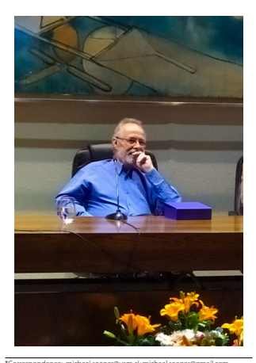

EDITORIAL
Open Access

# An Exploration Of Microbial Response To Stressors With Prof. Claudio C. Vásquez Guzmán

Michael Seeger1*, Raymond J. Turner2 and Mauricio González3

The image is a screenshot of an article from the journal "Biological Research". The article is titled "An Exploration Of Microbial Response To Stressors With Prof. Claudio C. Vásquez Guzmán" and it discusses the microbial response to various stressors, particularly in the context of Chilean environments. The article is written by Michael Seeger, Raymond J. Turner, and Mauricio González.

The image shows a photograph of a man sitting at a desk with a phone to his ear. He is wearing a blue shirt and glasses. The background of the photo is blurred, but it appears to be an indoor setting with a painting on the wall.

The text in the image provides information about the article's focus on the study of bacterial stress response, particularly that of metal ion stress. It mentions the diversity of extreme environments in Chile and the anthropogenic-produced or released pollutants that include toxic metals. The article also discusses the unique physiologies and genomics of microorganisms remaining in extreme ecological niches similar to those mentioned.

The image also includes a Creative Commons license information and a credit line for the photograph used in the article.

*Correspondence: michael.seeger@usm.cl; michael.seeger@gmail.com
1 Laboratorio de Microbiología Molecular y Biotecnología Ambiental, Departamento de Química & Centro de Biotecnología Dr. Daniel Alkalay Lowitt, Universidad Técnica Federico Santa María, Avenida España 1680, Valparaiso, Chile Full list of author information is available at the end of the article Microorganisms, particularly bacteria, are the major species on the planet, considered to be up to 98% of all species. Bacteria have evolved impressive responses to various stressors, which have been essential for the adaptation and evolution of microorganisms and colonization of a wide range of environments. Tis special issue of Biological Research on microbial response to stressors is a tribute of the Chilean and international scientifc community to the late Professor Claudio C. Vásquez Guzmán 
(1952–2020) who dedicated his career in environmental microbiology and biochemistry to the study of bacterial stress response, particularly that of metal ion stress.

Microbes were the frst living cells on Earth. Tey have co-evolved with the planet and thus have experienced a wide range of geological changes that have produced a wide variety of ecological niches and stressors. Stressors to microbial life include expected physical and chemical concerns such as: temperature, pressure, redox state, pH, ionic strength, osmolarity, UV light exposure and shear forces. Additionally, other stressors exist such as low availability of key nutrients, carbon sources, scarcity in electron acceptors, antimicrobial compounds, and also anthropogenicproduced or released pollutants that include toxic metals.

A wide range of natural extreme environments that are inhabited by extreme microorganisms are present world-wide. However, Chile has remarkable diversity, from the Atacama Desert and Altiplano highlands in the North to Patagonia and Antarctic regions in the South, and from South Pacifc and Rapa Nui Island in the West to the Andes Mountains in the East [1]. In addition, polluted environments due to anthropogenic activities (e.g., 
mining, petroleum transport and processing, chemical 
© The Author(s) 2022. **Open Access** This article is licensed under a Creative Commons Attribution 4.0 International License, which permits use, sharing, adaptation, distribution and reproduction in any medium or format, as long as you give appropriate credit to the original author(s) and the source, provide a link to the Creative Commons licence, and indicate if changes were made. The images or other third party material in this article are included in the article's Creative Commons licence, unless indicated otherwise in a credit line to the material. If material is not included in the article's Creative Commons licence and your intended use is not permitted by statutory regulation or exceeds the permitted use, you will need to obtain permission directly from the copyright holder. To view a copy of this licence, visit http://creativecommons.org/licenses/by/4.0/. The Creative Commons Public Domain Dedication waiver (http://creativeco mmons.org/publicdomain/zero/1.0/) applies to the data made available in this article, unless otherwise stated in a credit line to the data.

industries, agriculture, forestry, and aquaculture) generate extreme conditions and are of increasing concern. 

As such, Chilean scientists have explored such niches in various felds, particularly microbiology.

Stress from such sources is a curious phenomenon for microbes. Microbes acquired tolerance mechanisms towards various geological epoch stressors, which may or may not be present in the Anthropocene [2]. Certainly, unique physiologies from evolved genomics exist for those species remaining in extreme ecological niches similar to thosethe marine bacterium *Alcaligenes aquatilis* QD168 isolated from Quintero Bay, Central Chile, reveal a robust adaptive response to environmental stressors. Front Microbiol. 2019;10:528.

6. Vega-Celedón P, Bravo G, Velásquez A, Cid FP, Valenzuela M, Ramírez I, 
Vasconez IN, Álvarez I, Jorquera MA, Seeger M. Microbial diversity of psychrotolerant bacteria isolated from wild fora of Andes Mountains and Patagonia of Chile towards the selection of plant growth-promoting bacterial consortia to alleviate cold stress in plants. Microorganisms. 2021;9:538.

7. Demeter MA, Lemire JA, Turner RJ, Harrison JJ. Chapter 3: Bioflm survival strategies in polluted environments. In: Lear G, editor. Bioflms in bioremediation: current research and emerging technologies. Norfolk: Caster Academic Press; 2016. p. 43–56.

8. Chain P, Denef V, Konstantinidis K, Vergez L, Agulló L, Latorre Reyes V, 
Hauser L, Córdova M, Gómez L, González M, Land M, Lao V, Larimer F, LiPuma J, Mahenthiralingam E, Malfatti S, Marx C, Parnell J, Ramette A, Richardson P, Seeger M, Smith D, Spilker T, Sul W-J, Tsoi T, Ulrico L, Zhulin I, Tiedje J. Burkholderia xenovorans LB400 harbors a multireplicon, 9.7 M bp genome shaped for versatility. Proc Nat Acad Sci USA. 

2006;113:15280–7.

9. Chandrangsu P, Rensing C, Helmann JD. Metal homeostasis and resistance in bacteria. Nat Rev Microbiol. 2017;15:338–50.

10. Niño-Martínez N, Salas Orozco MF, Martínez-Castañón GA, Torres Méndez F, Ruiz F. Molecular mechanisms of bacterial resistance to metal and metal oxide nanoparticles. Int J Mol Sci. 2019;20:2808.

11. Calderón IL, Arenas FA, Pérez JM, Fuentes DE, Araya MA, Saavedra CP, Tantaleán JC, Pichuantes SE, Youderian PA, Vásquez CC. Catalases are NAD(P)
H-dependent tellurite reductases. PLoS ONE. 2006;1:e70.

12. Lemire J, Harrison JJ, Turner RJ. Antimicrobial activity of metals: 
mechanisms, molecular targets and applications. Nat Rev Microbiol. 2013;11:371–84.

13. Morales EH, Pinto CA, Luraschi R, Muñoz-Villagrán CM, Nelson J, Arenas FA, Piotrowski JS, Myers CL, Mori H, Vásquez CC. The antibacterial metalloid tellurite halts heme biosynthesis and kills *E. coli* independent of ROS. 

Nat Commun. 2017;8:15320.

14. Pérez JM, Arenas FA, Pradenas GA, Sandoval JM, Vásquez CC. YqhD exhibits aldehyde reductase activity and protects *Escherichia coli* from harmful lipid peroxidation-derived aldehydes. J Biol Chem. 2008;283:7346–53.

15. Figueroa M, Fernández V, Arenas-Salinas M, Ahumada D, Muñoz-Villagrán C, Cornejo F, Vargas E, Latorre MA, Morales E, Vásquez CC, Arenas FA. Synthesis of metal(loid) nanostructures by environmental multi-metal(loid) 
resistant bacteria and metal(loid)-reducing favoproteins. Front Microbiol. 2018;9:959.

16. Li X, Xu H, Chen ZS, Chen G. Biosynthesis of nanoparticles by microorganisms and their applications. J Nanomater. 2011;2011:1–16.

17. Frankel ML, Booth SC, Turner RJ. How bacteria are afected by toxic metal release. In: Izatt RM, editor. Metal sustainability: global challenges, consequences, and prospects. Hoboken: Wiley; 2016. p. 253–67.

18. Presentato A, Turner RJ, Vasquez CC, Yurkov V, Zannoni D. Telluritedependent blackening of bacteria is out from the dark-age! (special edition "Tellurium in biological and environmental systems: after Fukushima"). Environ Chem. 2019;16:266–88.

## Publisher'S Note

Springer Nature remains neutral with regard to jurisdictional claims in published maps and institutional afliations.

Ready to submit y submit your research ? Choose BMC and benefit from: 
- fast, convenient online submission - thorough peer review by experienced researchers in your field
- rapid publication on acceptance
- support for research data, including large and complex data types
- gold Open Access which fosters wider collaboration and increased citations - maximum visibility for your research: over 100M website views per year At BMC, research is always in progress.

The image is a screenshot of a webpage from BMC, which is likely a publisher for scientific research. The text on the image provides information about various studies related to bacteria and their responses to environmental stressors, metal resistance, and the synthesis of metal(loid) nanostructures by microorganisms. The studies mentioned are from different years and publications, such as Frontiers in Microbiology, Microorganisms, and Environmental Chemistry. The image also includes a logo of BMC, which is blue and black in color, and a call-to-action section encouraging researchers to submit their research to BMC, highlighting benefits such as fast online submission, thorough peer review, rapid publication, support for research data, gold Open Access, and maximum visibility for research.
 Learn more biomedcentral.com/submissions