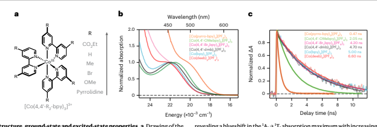
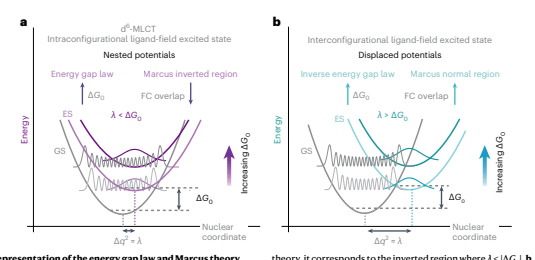
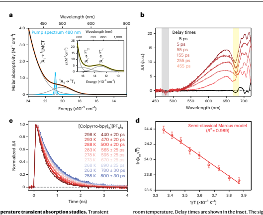
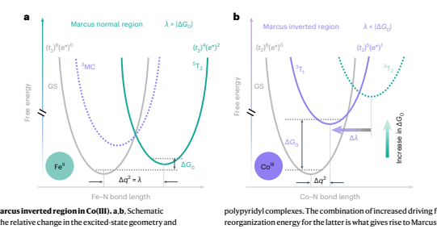
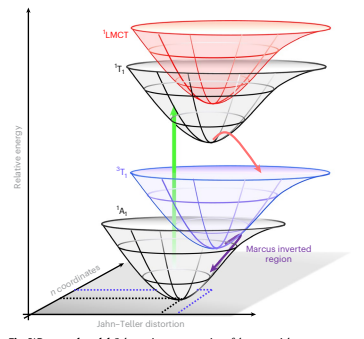
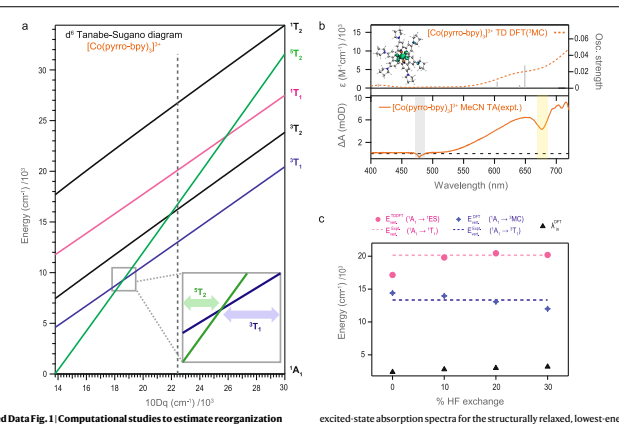

# Establishing The Origin Of Marcus-Inverted-Region Behaviour In The Excited-State Dynamics Of Cobalt(Iii) Polypyridyl Complexes

| Received: 18 September 2023 Accepted: 24 May 2024 Published online: xx xx xxxx  Check for updates   |
|-----------------------------------------------------------------------------------------------------|

Atanu Ghosh   , Jonathan T. Yarranton    **& James K. McCusker** 
Growing interest in the use of frst-row transition metal complexes in a number of applied contexts—including but not limited to photoredox catalysis and solar energy conversion—underscores the need for a detailed understanding of their photophysical properties. A recent focus on ligand-feld photocatalysis using cobalt(III) polypyridyls in particular has unlocked unprecedented excited-state reactivities. Photophysical studies on Co(III) chromophores in general are relatively uncommon, and so here we carry out a systematic study of a series of Co(III) polypyridyl complexes in order to delineate their excited-state dynamics. Compounds with varying ligand-feld strengths were prepared and studied using variable-temperature ultrafast transient absorption spectroscopy. Analysis of the data establishes that the ground-state recovery dynamics are operating in the Marcus inverted region, in stark contrast to what is typically observed in other frst-row metal complexes. The analysis has further revealed the underlying reasons driving this excited-state behaviour, thereby enabling potential advancements in the targeted use of the Marcus inverted region for a variety of photolytic applications.

The photophysical properties of transition metal-based complexes have been studied extensively for decades due in part to their pivotal role in light-enabled chemical processes ranging from solar energy conversion strategies to photoredox catalysis1–6. Despite this success, recently considerable attention has been placed on sustainability and scalability for chemical transformations; in transition metal chemistry, this largely requires a shift in focus to the more abundant and cheaper elements of the first transition series7–11. While this has resulted in exciting and potentially transformative developments in areas such as catalysis6, the replacement of chromophores based on Ru and Ir (for example, with first-row analogues to effect analogous excited-state chemistry) has proven to be considerably more challenging.

The primary difficulty stems from fundamental differences in electronic structure that impact non-radiative decay dynamics due to the presence of lower-lying ligand-field states (that is, 'd–d' states)7,12–17. 

These metal-centred excited states are characterized by a rearrangement of electrons within the d-orbital manifold as opposed to a formal separation of charge, which substancially changes the landscape in terms of the type of excited-state chemistry that can be anticipated. 

Indeed, with a number of notable exceptions involving Cr(III) (ref. 18), 
chemical platforms have been only recently developed that are providing promise along these lines19.

Among the other first-row transition metal complexes, low-spin d6-Fe(II) complexes have garnered considerable attention. For Fe(II) 
polypyridyl complexes (for example, [Fe(bpy)3]
2+, where bpy is 2,2'-bipyridine), the initially formed metal-to-ligand charge-transfer 
(MLCT) excited state decays on a sub-100 fs timescale to the ligand-field manifold, ultimately forming a high-spin S = 2 species 

(the 5T2 ligand-field state)20. While such ligand-field excited states have been shown to engage in bimolecular electron-transfer chemistry21, the relatively low energy coupled with an ~1 ns lifetime limits the utility of such compounds for bimolecular photochemical transformations in particular. Several approaches have emerged to alter the excited-state energetic profile of these complexes22–28, but such efforts are hampered by the inability to assess the energies of ligand-field states in chromophores whose absorption spectra are dominated by much more intense MLCT features in the visible region21. In the case of Fe(II) complexes, we have shown that this problem can be circumvented by using isoelectronic low-spin d6-Co(III) complexes29. 

The ligand-to-metal charge-transfer (LMCT) absorptions characteristic of Co(III) complexes are dramatically blueshifted relative to their MLCT counterparts in Fe(II), thereby revealing the previously obscured ligand-field absorption features associated with the d6 configuration. Observations of spin-allowed (1A1 → 1T1) and spin-forbidden 
(
1A1 → 3T1, 1A1 → 3T2) transitions were successfully leveraged to explicitly determine the relevant ligand-field parameters of a series of Co(III) compounds.

Having such quantitative information concerning the ligandfield excited states of these compounds—and given recent examples of Co(III)-based complexes as photocatalysts30–35—we wanted to probe the photo-induced dynamics of these compounds. A surprisingly small number of ultrafast photophysical studies of Co(III) complexes exist36–43. Recently, we reported excited-state lifetimes of a family of tris-bipyridyl-based Co(III) complexes35 where a striking correlation between increasing excited-state lifetime with increasing ligand-field strength was observed, a phenomenology consistent with dynamics occurring in the Marcus inverted region. However, these room temperature kinetic data alone are not conclusive for establishing inverted-region behaviour, nor do they provide insight as to its origins. We therefore carried out a thorough photophysical study on a series of Co(III) 
complexes using variable-temperature transient absorption spectroscopy. Analysis of these data using several non-radiative decay theories—most notably semi-classical Marcus theory—provide vital insights into the nature of the lowest-energy excited states of these compounds, insights that allow us to draw definitive conclusions concerning the inverted-region hypothesis. Furthermore, the results allowed us to identify the reason why inverted behaviour is observed for this class of compounds as opposed to the normal region dynamics seen for isoelectronic Fe(II) complexes. We believe these results open the door to exploiting this phenomenon in a broader range of applications involving light-to-chemical energy conversion strategies.

## Results And Discussion

The structures of tris-bipyridyl Co(III) complexes studied here are shown in Fig. 1a. All compounds possess low-spin, d6 configurations29 and their visible absorption spectra are plotted in Fig. 1b. The systematic shift in the absorption maximum reflects an increase in the ligand-field strength across the series, with values of 10Dq, the ligand-field splitting parameter, ranging from 22,440 cm–1 in the case of [Co(pyrro-bpy)3]
(PF6)3 to 24,620 cm–1 for [Co(deeb)3](PF6)3 (where pyrro-bpy and deeb are 4,4′-di-pyrrolodine-2,2′-bipyridine and 4,4′-di-ethylcarboxylate2,2′-bipyridine, respectively; Supplementary Table 1).

## Transient Absorption Spectroscopy

The absence of overlapping charge-transfer features in the visible region of these Co(III) complexes allows for direct excitation into the 1A1 → 1T1 transition: we therefore bypass the charge-transfer manifold entirely, allowing us to focus exclusively on dynamics occurring within the metal-centred ligand-field manifold of the compounds. As an initial probe, we carried out ultrafast time-resolved absorption measurements at room temperature on all six complexes to assess the overall timescale of their ground-state recovery dynamics. The data, which we reported recently35 but have replotted in Fig. 1c for convenience, recover fully to the baseline and therefore represent a completely reversible photophysical process.

The trend in excited-state lifetime (Supplementary Table 1) varies systematically, suggesting a clear correlation between the observed excited-state lifetime and the magnitude of 10Dq. Specifically, the data reveal that an inverse relationship exists between the magnitude of 10Dq and the rate constant for ground-state recovery: as 10Dq increases, the rate constant for excited-state relaxation back to the ground state decreases. While this type of behaviour is commonly observed for complexes such as ruthenium(II) polypyridyls 
(for example, [Ru(bpy)3]
2+), where relaxation of the lowest-energy 3MLCT excited state follows the so-called energy gap law44, this was a wholly unexpected result for these d6-Co(III) complexes due to the interconfigurational nature of all of the ligand-field excited states for a d6 configuration.

To appreciate this latter point, recall that the energy gap law is based on straightforward arguments stemming from non-radiative decay theory as depicted schematically in Fig. 2 (ref. 45). When the zero-point energy difference between the ground state and lowest-energy excited state is larger than the energy, reflecting structural differences between their equilibrium geometries (Fig. 2a), 
non-radiative decay theory predicts a decrease in the rate constant for conversion from the upper state to the lower state with an increasing energy gap due to the decrease in the overlap between the ground 

vibrational wavefunction of the excited state and excited vibrational wavefunctions of the ground state. As discussed in greater detail below, this phenomenology is identical to the so-called inverted region from the Marcus theory, wherein the rate constant decreases with increasing 
'driving force' for the reaction (that is, ground-state recovery). In the case of compounds like [Ru(bpy)3]
2+, where the equilibrium geometries of the 3MLCT state and 1A1 ground state are nearly identical46, one does indeed observe an increase in excited-state lifetime with increasing excited-state energy, consistent with this picture47–49.

The situation for Co(III) is fundamentally different due to the fact that the excited states driving the dynamics reflected in Fig. 1c are ligand-field in nature as opposed to charge-transfer. More specifically, because the ground state of a (nominally) octahedral, low-spin d6 complex is characterized by a filled t2g subshell, that is, (t2g)
6, all of the excited states associated with a low-spin, d6 ground-state configuration will have electrons in the sigma anti-bonding eg* orbitals. 

This will inexorably give rise to notable differences in the equilibrium geometries of the ground and excited states and is generally expected to lead to a picture more in line with that depicted in Fig. 2b. In this so-called inverse energy gap law regime (that is, the Marcus normal region), an increase in excited-state energy will lead to a faster rate of excited-state decay.

Variable-temperature time-resolved spectroscopy While the data shown in Fig. 1c are strongly suggestive of Marcus-inverted-region behaviour, this result is not conclusive. One can envision circumstances across a series of compounds which, if the relative magnitudes of driving force (ΔG0) and reorganization energy (λ) vary in just the correct manner, a trend like that shown in Supplementary Table 1 could arise (at least in principle). We sought to apply variable-temperature time-resolved spectroscopy to our series of Co(III) polypyridyl complexes both to substantiate our hypothesis concerning Marcus-inverted-region behaviour for the non-radiative ground-state recovery dynamics of this system and to identify its origin.

We have carried out these studies on four of the six members of the series, but for the sake of clarity we will provide a detailed discussion of the analysis of the data acquired for one member of the series—[Co(pyrro-bpy)3](PF6)3—with the understanding that the same protocol was applied to the other compounds. The electronic absorption spectrum of [Co(pyrro-bpy)3](PF6)3 collected in acetonitrile solvent is shown in Fig. 3a, superimposed on which is the spectral profile of the pump centred at 480 nm that was used for photoexcitation. As discussed above, the data acquired at 720 nm could be fit to a single-exponential kinetic model, yielding a time constant of 470 ± 20 ps, which was attributed to the relaxation of the lowest-energy excited state back to the ground state (Fig. 3c). The ground-state absorption feature centred near 350 nm is assigned to a 1A1 → 1LMCT 
absorption, which tails into the visible region and does overlap to some extent with the 1A1 → 1T1 absorption that is our primary interest (Supplementary Fig. 2). To ensure that the ground-state recovery dynamics are indeed reflecting processes associated with the ligand-field manifold, we performed time-resolved absorption measurements as a function of excitation wavelength across the 1A1 → 1T1 absorption envelope (Supplementary Fig. 3). On the high-energy side, this results in considerable absorption into the LMCT transition, while on the low-energy side the 1T1 state is exclusively populated. While differences in the observed kinetics were noted at very early time delays (that is, 
<1 ps; Supplementary Fig. 4), the ground-state recovery dynamics were found to be independent of both excitation and probe wavelength (Supplementary Tables 2 and 3). This observation supports the notion that the process we are monitoring is indeed occurring between ligand-field excited state(s) and the ground state and does not involve the charge-transfer manifold in any way. Ground-state recovery dynamics of [Co(pyrro-bpy)3](PF6)3 were acquired in a CH3CN 
solution as a function of temperature in increments of 5 K between 258 K and 298 K following ligand-field photoexcitation (Fig. 3c); at each temperature point, the data were well described by simple, single-exponential kinetics.

Variable-temperature kinetics data can be modelled in a variety of ways depending on what sort of information is being sought. A detailed description of all the models used to fit variable-temperature data is in the Methods; in short, we used an Arrhenius model, simple transition state theory (that is, the Eyring equation) and semi-classical Marcus theory to understand the excited-state dynamics of this system.

The simplest of these is the Arrhenius model (equation (1)):

$$k_{\mathrm{{nr}}}=A\mathrm{exp}\left(-{\frac{E_{\mathrm{{a}}}}{k_{\mathrm{{B}}}T}}\right)$$
) (1)

where knr is the non-radiative decay constant (that is, the observed decay constant kobs for our non-emissive compounds), A is the pre-exponential factor (also known as the frequency factor), Ea is the activation energy and kB and T are the Boltzmann constant and absolute temperature, respectively. As evident from the data in Fig. 3c, the time constant for ground-state recovery increases with decreasing temperature, indicating the presence of an activation energy for this process. Fitting the data for [Co(pyrro-bpy)3]
3+ using equation (1), the activation energy was determined to be 850 ± 50 cm–1 (Supplementary Fig. 9). 

Considering that the so-called 'typical' reaction, in which a rate constant doubles upon increasing the temperature from 300 K to 310 K, 
corresponds to an Arrhenius activation energy of ~4,000 cm–1, the value obtained for [Co(pyrro-bpy)3]
3+ represents a small but nevertheless easily measurable barrier for ground-state recovery from the compound's lowest-energy ligand-field excited state.

The Eyring equation frames the relaxation process in terms of free energy of activation (ΔG‡), thereby providing insight into the activation enthalpy (ΔH‡) and entropy (ΔS‡) associated with ground-state recovery according to equation (2):

$$k_{\rm nr}=\kappa\frac{k_{\rm B}T}{h}\exp\left(-\frac{\Delta G^{\ddagger}}{k_{\rm B}T}\right)=\kappa\frac{k_{\rm B}T}{h}\exp\left(\frac{\Delta S^{\ddagger}}{k_{\rm B}}\right)\exp\left(-\frac{\Delta H^{\ddagger}}{k_{\rm B}T}\right)\tag{2}$$

where κ is the transmission coefficient and h is Planck's constant. For 
[Co(pyrro-bpy)3]
3+, the activation enthalpy and activation entropy were determined to be 655 ± 40 cm–1 and –3.30 ± 0.15 cm–1 K–1, respectively 
(Supplementary Fig. 8).

More relevant to our discussion is the transformation of equation 
(2) into semi-classical Marcus theory, equation (3):

$$k_{\rm nr}=\frac{2\pi}{\hbar}|H_{\rm ab}|^{2}\frac{1}{\sqrt{4\pi\hbar k_{\rm B}T}}\exp\left[-\frac{\left(\Delta G_{0}+\lambda\right)^{2}}{4\lambda k_{\rm B}T}\right]\tag{3}$$

where ΔG0 is driving force, λ represents reorganization energy, ħ is the reduced Planck's constant and Hab is a constant that quantifies the electronic coupling between the two states involved in the process. 

Multiplying equation (3) through by T1/2 and taking the natural log allows us to rearrange the semi-classical Marcus expression into a form more amenable for fitting variable-temperature data of the kind illustrated in Fig. 3c (equation (4)):

$$\ln\left(k_{\rm nr}\sqrt{T}\right)=\ln\left(\frac{2\pi}{\hbar}|H_{\rm ab}|^{2}\frac{1}{\sqrt{4\pi\hbar k_{\rm B}}}\right)-\left[\frac{\left(\Delta G_{0}+\lambda\right)^{2}}{4\lambda k_{\rm B}T}\right].\tag{4}$$

Table 1 | Arrhenius, Eyring and Marcus parameters associated with ground-state recovery from the lowest-energy ligand-field excited state of a series of Co(III) polypyridyl complexes

| Complex                                                                                                                                                                                                                                                                      | Ligand-field  transition,  1 A1 → 3 T1 (cm–1)   | Arrhenius model   | Eyring model             | ΔG0 (cm–1) a   | Semi-classical Marcus modelb   |             |
|------------------------------------------------------------------------------------------------------------------------------------------------------------------------------------------------------------------------------------------------------------------------------|-------------------------------------------------|-------------------|--------------------------|----------------|--------------------------------|-------------|
| Ea (cm–1)                                                                                                                                                                                                                                                                    | ΔS‡  (cm–1 K–1), ΔH‡  (cm–1)                    | Hab (cm–1)        | λ (cm–1)                 |                |                                |             |
| [Co(pyrro-bpy)3] 3+                                                                                                                                                                                                                                                          | 13,010                                          | 850 ± 50          | –3.30 ± 0.15, 655 ± 40   | –10,100        | 25.5 ± 1.0                     | 5,700 ± 500 |
| [Co(4,4′-OMebpy)3] 3+                                                                                                                                                                                                                                                        | 13,650                                          | 1,050 ± 50        | –3.50 ± 0.10, 900 ± 30   | –10,500        | 20.0 ± 2.0                     | 5,600 ± 500 |
| 3+                                                                                                                                                                                                                                                                           | 14,430                                          | 1,150 ± 50        | –3.80 ± 0.15, 950 ± 40   | –10,650        | 18.2 ± 1.5                     | 5,500 ± 500 |
| [Co(4,4′-Br2bpy)3] [Co(4,4′-deeb)3] 3+                                                                                                                                                                                                                                       | 14,910                                          | 1,200 ± 50        | –3.93 ± 0.15, 1,010 ± 40 | –10,900        | 16.5 ± 1.5                     | 5,500 ± 500 |
| a ΔG0 was obtained from DFT-derived single-point energy calculations on optimized ground and excited states. b Hab and λ were obtained from fits of the experimental data to semi-classical  Marcus theory (equation (4)) using the corresponding DFT-calculated ΔG0 values. |                                                 |                   |                          |                |                                |             |

Although the variable-temperature excited-state relaxation data for [Co(pyrro-bpy)3]
3+ are clearly well described by equation 
(4), extracting specific values for these parameters is not possible from the fit alone as we have only two experimental observables 
(that is, knr and temperature) and three unknowns (ΔG0, λ and Hab). 

The ground-state absorption spectrum of the compound provides us with sufficient information to determine the energies of all of the ligand-field excited states, but these correspond to so-called vertical energies, not the zero-point energy of the structurally relaxed state that is relevant for assessing ΔG0. Moreover, since these Co(III) complexes are non-emissive and the energies of ligand-field excited states cannot be approximated using electrochemistry in the same manner as charge-transfer states, there is no experimental probe at our disposal to determine the values of any of these parameters via an independent measurement. We must therefore look to theory to gain the insight necessary to analyse the data in Fig. 3d in greater depth.

## Computational Studies: Assessing The Marcus Parameters

Details concerning the density functional theory (DFT) calculations are provided in the Methods and Supplementary Section 10. Briefly, our approach involves computationally determining the zero-point free energy difference between the ground state and the lowest-energy ligand-field excited state (that is, ΔG0): by combining this information with calculated vertical transition energies (benchmarked against our experimental ground-state absorption data; Methods), we can estimate the reorganization energy associated with ground-state recovery.

Regarding the identity of the lowest-energy ligand-field excited state, the two candidates based on inspection of the Tanabe–Sugano diagram we constructed for [Co(pyrro-bpy)3]
3+ from the experimental electronic absorption spectrum (Extended Data Fig. 1) are the 3T1 and 5T2 ligand-field states. In this regard, it is important to note that not only is the activation entropy obtained from the Eyring analysis a negative number (Supplementary Fig. 8 and Table 1)— consistent with the expected decrease in molecular volume upon relaxation back to the low-spin ground state—the magnitude of ΔS‡
of –3.30 ± 0.15 cm–1 is roughly half of what has been reported for isoelectronic Fe(II)-based spin-crossover complexes50,51. The fact that the latter corresponds to a conversion from a nominally (t2)
4(e*)2 configuration to the (t2)
6(e*)0 ground state, and that the 3T1 state is best described as (t2)
5(e*)1, suggests that the dynamics in our system involve the 3T1 ligand-field excited state. Recently, the ligand-field state dynamics of the Co(III)-based tetra-metallic oxo cluster [CoIII4O4]
(OAc)4(py)4 (where OAc is acetate and py is pyridine) have been examined by Vura-Weis and coworkers using spin-sensitive M2,3-edge X-ray absorption near-edge structure (XANES) spectroscopy52. The analysis of the ~80 ps ground-state recovery dynamics of that compound was most consistent with the lowest-energy excited state corresponding to the 3T1 state. The magnitude of the ligand-field splitting parameter 10Dq for this compound was determined to be 17,100 cm–1, which is smaller than the 10Dq values for all of the Co(III) polypyridyl complexes we have examined.

As will become evident in the sections to follow, we do believe that the lowest-energy excited state of [Co(pyrro-bpy)3]
3+ (as well as the other members of the series) is indeed the 3T1 state, a conclusion that has important implications for explaining the behaviour we observe concerning the ground-state recovery dynamics of these compounds. For the sake of clarity, we will therefore proceed with the analysis to follow based on such an assignment; however, a parallel analysis assuming the 5T2 state (which leads to internally inconsistent conclusions) is provided in Supplementary Section 12.

The driving force is straightforward to calculate, since it is simply the difference in energy between the equilibrium structures of the ground and excited ligand-field states in question: for 
[Co(pyrro-bpy)3]
3+, a value of –10,100 ± 550 cm–1 is found for the 3T1 state, indicating that the zero-point energy of the structurally relaxed 3T1 state sits 10,100 cm–1 above the ground state (Methods for details). 

Using this value for ΔG0, we can now deconvolve the two contributions to the slope of the ln(knr√T) versus 1/T plot shown in Fig. 3d. The quadratic nature of the exponential term gives two possible values for the reorganization energy: λ = 18,400 ± 600 cm–1 and λ = 5,700 ± 500 cm–1. 

Clearly, the second solution is very much in line with the one derived from the calculations (Methods), particularly when one considers the fact that the calculated value of 3,000 cm–1 corresponds only to the inner-sphere portion of the total reorganization energy (that is, structural changes of the molecule only), whereas the experimental value of λ will reflect both inner-sphere and outer-sphere (that is, solvent) 
contributions. Additional guidance can be gleaned from other experimental reports concerning reorganization energies on different (but related) chemical systems (Supplementary Section 11)53. Our experimental data, when combined with the results from our DFT calculations, therefore lead to the conclusion that λ = 5,700 ± 500 cm–1 is the correct solution for the fit shown in Fig. 3d. When this value is combined with the driving force of –10,100 ± 550 cm–1, we can state with a high degree of confidence that the relaxation dynamics of [Co(pyrro-bpy)3]
3+
lie firmly in the Marcus inverted region, where λ < |ΔG0|.

The preceding discussion focused almost exclusively on the properties of [Co(pyrro-bpy)3]
3+, but analogous studies were carried out on three additional members of the series of compounds shown in Fig. 1a: 
these data are summarized in Table 1. Inspection of the data shows remarkable consistency in the magnitude of the reorganization energy. 

Given the fact that compositional changes in the molecule involve substitutions on the periphery of the bipyridyl rings (that is, relatively removed from the primary coordination sphere about the metal centre), this invariance in the fitted value of λ bolsters our confidence in the veracity of our analysis. Variations in the lifetime at room temperature were alluded to previously in this Article, but now in addition we see that the Arrhenius activation energy shows a systematic increase with increasing zero-point energy difference between the ground state and lowest-lying excited state. This is precisely the phenomenology one would expect in the Marcus inverted region, that is, an increasing barrier (and thus a longer excited-state lifetime) as the driving force for the increases in reaction.

## Origin Of The Inverted-Region Behaviour

Since the intercept from equation (4) is proportional to |Hab| 2/√λ, a reliable value for λ now allows us to estimate the magnitude of electronic coupling between the 3T1 and 1A1 states as 25.5 ± 1.0 cm–1; the 
(relatively) high degree of precision for this number stems from the quartic relationship between Hab and λ, giving rise to a fairly narrow range of values for Hab that are consistent with the experimental data. 

We note that this is substantially larger than what has been reported for excited-state/ground-state coupling in Fe(II) polypyridyls (~5 cm–1; ref. 54), a fact that we believe adds critical support to our assignment of the 3T1 term as the lowest-energy excited state of [Co(pyrro-bpy)3]
3+.

It is not only the increase in the magnitude of Hab relative to what is observed for Fe(II) analogues that we consider important, but also the trend we observe as a function of driving force. As indicated previously, it is well-established that the ground-state recovery process in Fe(II) polypyridyl complexes corresponds to a 5T2 → 1A1 conversion, a process wherein the spin of the system changes by two units (that is, S = 2 for the 5T2 excited state to S = 0 for the 1A1 ground state). There is no matrix element that allows one to directly couple two electronic states that differ by two spin quanta, so the coupling needed to effect ground-state recovery in these systems represents a second-order interaction whereby the 5T2 state couples with a (non-thermally accessed) S = 1 state (for example, the 3T1 state), which in turn couples to the S = 0 ground state. Because of the combined effect of the second-order coupling and the relative energy differences between the 5T2/
3T1 and 3T1/
1A1 gaps (Extended Data Fig. 1), the magnitude of Hab is (1) 
small and (2) expected to slightly increase with increasing ligand-field strength. This is clearly at odds with the data obtained on our series of Co(III) complexes listed in Table 1, which necessitates that another mechanism must be considered.

Carrying out the same analysis for relaxation proceeding from the 3T1 state, the expected trend in Hab is fundamentally different. 

First, one can directly couple states characterized by S = 1 and S = 0, so the magnitude of the interaction will be intrinsically larger than a second-order interaction (at least qualitatively). More importantly, the fact that the two states would be directly interacting with each other means that the trend in the magnitude of the coupling constant should conform to simple perturbation theory; that is, as the states get further apart in energy, the degree to which they interact should decrease. This is precisely what we observe when we look at the value of Hab as a function of 10Dq: as the ligand-field strength increases across the series, the magnitude of Hab systematically decreases. This trend indicates the presence of direct coupling between the ground state and the lowest-energy excited state in these Co(III) polypyridyl compounds. 

We view this as additional compelling evidence that the ground-state recovery dynamics of these chromophores do, indeed proceed from the 3T1 ligand-field excited state.

With this assignment in hand, we can now consider its consequence with regard to Marcus-normal-region versus Marcus-inverted-region behaviour. We have previously demonstrated that, all other things being equal, replacement of Fe(II) for Co(III) results in an ~3,000 cm–1 increase in the magnitude of 10Dq (ref. 29). This corresponds to a shift to the right in the context of a Tanabe–Sugano diagram but more importantly as a vertical displacement of the zero-point energy of the lowest-energy excited state when viewed in terms of potential energy surfaces (Fig. 4). If the excited electronic state of a given Co(III) 
complex was the same as for its Fe(II) analogue, the reorganization energy associated with excited-state relaxation would be expected to be roughly the same. Put another way, if the horizontal displacement of the ground-state and excited-state potential energy surfaceswhich is a proxy for the reorganization energy—was unperturbed, whether the increase in 10Dq would be sufficient to transition from the Marcus-normal-region behaviour to the inverted behaviour that we observe (Fig. 4a) would be an open question. However, the increase in 10Dq is only part of the story. As mentioned previously, the 5T2 state derives from a (t2)
4(e*)2 configuration, whereas the 3T1 state corresponds to (t2)
5(e*)1 configuration. The reduction in sigma anti-bonding character of the latter is the reason why the reorganization energy determined for the Co(III) complexes is roughly half of that found for Fe(II). What this means in the context of the potential energy surface diagram for the system is a diagonal shift in the relative position of the lowest-energy excited state, that is, an increase in zero-point energy coupled with a decrease in the horizontal separation between the two potentials (Fig. 4b). Our assessment of the situation for ground-state recovery in the Co(III) complexes studied herein is summarized in Fig. 5.

## Conclusions

Variable-temperature ultrafast time-resolved absorption spectroscopy has been combined with DFT in an effort to understand the origin of the photophysical behaviour associated with ground-state recovery dynamics of a series of Co(III) tris-bipyridyl complexes. The experimental data were analysed through the lens of non-radiative decay theories ranging from a simple Arrhenius model to semi-classical Marcus theory. 

Fig. 5 | Proposed model. Schematic representation of the potential energy surface diagram for the excited-state relaxation process of Co(III) tris-bipyridyl complexes subsequent to 1A1 → 1T1 ligand-field photoexcitation. Ground-state recovery dynamics proceed from the 3T1 ligand-field excited state with a balance of free energy difference and reorganization energy that places the process firmly in the Marcus inverted region. The n-coordinates represent all potential normal mode vibrations which are not coupled to Jahn–Teller distortion coordinate and the dotted lines are used to show the structural changes and the solid arrows represent the state conversion process after photoexcitation.

When combined with the results of DFT calculations benchmarked with experimental spectroscopic data, values for the driving force 
(ΔG0) and reorganization energy (λ) were obtained that indicated the magnitude of ΔG0 across the series was nearly twofold larger than the reorganization energy, thereby confirming Marcus-inverted-region behaviour. Moreover, both the magnitude of Hab and its variation as a function of driving force strongly implicated the 3T1 ligand-field excited state as the lowest-energy excited state of all compounds in the series, in contrast to the 5T2 state in isoelectronic Fe(II) polypyridyls. This change in the nature of the lowest-energy excited statewhich leads to smaller reorganization energies—coupled with a larger zero-point energy difference conspire to place the excited-state relaxation dynamics of Co(III) polypyridyl complexes in the Marcus inverted region.

While there is clearly room for improvement in certain aspects of this class of chromophores when considering future applications 
(for example, increased absorption cross-sections, excitation wavelengths that extend to longer wavelengths in the visible and enhanced excited-state lifetimes, to name a few)55, we believe that the fundamental photophysical properties of these simple Co(III) polypyridyl complexes that we have delineated in this report can serve as a roadmap for designing next generation photocatalysts that can leverage new opportunities afforded by accessing the Marcus inverted region in this manner.

## Online Content

Any methods, additional references, Nature Portfolio reporting summaries, source data, extended data, supplementary information, acknowledgements, peer review information; details of author contributions and competing interests; and statements of data and code availability are available at https://doi.org/10.1038/s41557-024-01564-3.

## References

1. Juris, A. et al. Ru(II) polypyridine complexes: photophysics, photochemistry, eletrochemistry, and chemiluminescence. Coord. Chem. Rev. 84, 85–277 (1988).

2. Dixon, I. M. et al. A family of luminescent coordination compounds: iridium(III) polyimine complexes. *Chem. Soc. Rev.* 29, 385–391 (2000).

3. Lytle, F. E. & Hercules, D. M. Luminescence of tris (2,2′-bipyridine) 
ruthenium(II) dichloride. *J. Am. Chem. Soc.* 646, 253–257 (1968).

4. Arias-Rotondo, D. M. & McCusker, J. K. The photophysics of photoredox catalysis: a roadmap for catalyst design. *Chem. Soc.* Rev. 45, 5803–5820 (2016).

5. de Groot, L. H. M., Ilic, A., Schwarz, J. & Wärnmark, K. Iron photoredox catalysis–past, present, and future. *J. Am. Chem. Soc.* 145, 9369–9388 (2023).

6. Twilton, J. et al. The merger of transition metal and photocatalysis. *Nat. Rev. Chem.* 1, 0052 (2017).

7. McCusker, J. K. Electronic structure in the transition metal block and its implications for light harvesting. *Science* 363, 484–488 
(2019).

8. Wegeberg, C. & Wenger, O. S. Luminescent first-row transition metal complexes. *JACS Au* 1, 1860–1876 (2021).

9. Beaudelot, J. et al. Photoactive copper complexes: properties and applications. *Chem. Rev.* 122, 16365–16609 (2022).

10. Sinha, N., Wegeberg, C., Häussinger, D., Prescimone, A. & 
Wenger, O. S. Photoredox-active Cr(0) luminophores featuring photophysical properties competitive with Ru(II) and Os(II) complexes. *Nat. Chem.* 15, 1730–1736 (2023).

11. Herr, P., Kerzig, C., Larsen, C. B., Häussinger, D. & Wenger, O. S. 

Manganese(I) complexes with metal-to-ligand charge transfer luminescence and photoreactivity. *Nat. Chem.* 13, 956–962 (2021).

12. Smeigh, A. L., Creelman, M., Mathies, R. A. & McCusker, J. K. 

Femtosecond time-resolved optical and Raman spectroscopy of photoinduced spin crossover: temporal resolution of low-to-high spin optical switching. *J. Am. Chem. Soc.* 130, 14105–14107 (2008).

13. McCusker, J. K. et al. Subpicosecond 1MLCT→5T2 intersystem crossing of low-spin polypyridyl ferrous complexes. *J. Am. Chem.* Soc. 115, 298–307 (1993).

14. McCusker, J. K., Rheingold, A. L. & Hendrickson, D. N. 

Variable-temperature studies of laser-initiated 5T2 → 1A1 intersystem crossing in spin-crossover complexes: empirical correlations between activation parameters and ligand structure in a series of polypyridyl ferrous complexes. *Inorg. Chem.* 35, 2100–2112 (1996).

15. Monat, J. E. & McCusker, J. K. Femtosecond excited-state dynamics of an iron(II) polypyridyl solar cell sensitizer model. J. Am. Chem. Soc. 122, 4092–4097 (2000).

16. Bressler, C. et al. Femtosecond XANES study of the light-induced spin crossover dynamics in an iron(II) complex. *Science* 323, 489–492 (2009).

17. Zhang, K., Ash, R., Girolami, G. S. & Vura-Weis, J. Tracking the metal-centered triplet in photoinduced spin crossover of 
[Fe(phen)3]
2+ with tabletop femtosecond M-edge X-ray absorption near-edge structure spectroscopy. *J. Am. Chem. Soc.* 141, 17180–17188 (2019).

18. Kitzmann, W. R. & Heinze, K. Charge-transfer and spin-flip states: 
Thriving as complements. *Angew. Chem. Int. Ed.* 62, 1–17 (2023).

19. Dorn, M. et al. in *Comprehensive Inorganic Chemistry III* 3rd edn, 707−788 (Elsevier, 2023).

20. Zhang, W. et al. Tracking excited-state charge and spin dynamics in iron coordination complexes. *Nature* 509, 345–348 (2014).

21. Woodhouse, M. D. & McCusker, J. K. Mechanistic origin of photoredox catalysis involving iron(II) polypyridyl chromophores. 

J. Am. Chem. Soc. 142, 16229–16233 (2020).

22. Liu, Y. et al. Towards longer-lived metal-to-ligand charge transfer states of iron(II) complexes: an N-heterocyclic carbene approach. Chem. Commun. 49, 6412–6414 (2013).

23. Fredin, L. A. et al. Exceptional excited-state lifetime of an iron(II)–
N-heterocyclic carbene complex explained. *J. Phys. Chem. Lett.* 5, 2066–2071 (2014).

24. Chábera, P. et al. FeII hexa N-heterocyclic carbene complex with a 528 ps metal-to-ligand charge-transfer excited-state lifetime. J. Phys. Chem. Lett. 9, 459–463 (2018).

25. Paulus, B. C., Nielsen, K. C., Tichnell, C. R., Carey, M. C. & 
McCusker, J. K. A modular approach to light capture and synthetic tuning of the excited-state properties of Fe(II)-based chromophores. *J. Am. Chem. Soc.* 143, 8086–8098 (2021).

26. Mukherjee, S., Bowman, D. N. & Jakubikova, E. Cyclometalated Fe(II) complexes as sensitizers in dye-sensitized solar cells. Inorg. Chem. 54, 560–569 (2015).

27. Braun, J. D. et al. Iron(II) coordination complexes with panchromatic absorption and nanosecond charge-transfer excited state lifetimes. *Nat. Chem.* 11, 1144–1150 (2019).

28. Steube, J. et al. Excited-state kinetics of an air-stable cyclometalated iron(II) complex. *Chem. Eur. J.* 25, 11826–11830 (2019).

29. Yarranton, J. T. & McCusker, J. K. Ligand-field spectroscopy of Co(III) complexes and the development of a spectrochemical series for low-spin d6 charge-transfer chromophores. J. Am. 

Chem. Soc. 144, 12488–12500 (2022).

30. Alowakennu, M. M., Ghosh, A. & McCusker, J. K. Direct evidence for excited ligand field state-based oxidative photoredox chemistry of a cobalt(III) polypyridyl photosensitizer. J. Am. Chem. Soc. 145, 20786–20791 (2023).

31. Kalsi, D., Dutta, S., Barsu, N., Rueping, M. & Sundararaju, B. 

Room-temperature C–H bond functionalization by merging cobalt and photoredox catalysis. *ACS Catal.* 8, 8115–8120 (2018).

32. Pal, A. K., Li, C., Hanan, G. S. & Zysman‐Colman, E. Blue‐emissive cobalt(III) complexes and their use in the photocatalytic trifluoromethylation of polycyclic aromatic hydrocarbons. Angew. Chem. Int. Ed. 57, 8027–8031 (2018).

33. Zhang, P. et al. Mass production of a single-atom cobalt photocatalyst for high-performance visible-light photocatalytic CO2 reduction. *J. Mater. Chem. A* 9, 26286–26297 (2021).

34. Zhang, G. et al. External oxidant-free oxidative cross-coupling: 
a photoredox cobalt-catalyzed aromatic C–H thiolation for constructing C–S bonds. *J. Am. Chem. Soc.* 137, 9273–9280 (2015).

35. Chan, A. Y. et al. Exploiting the Marcus inverted region for first-row transition metal-based photoredox catalysis. *Science* 382, 191–197 (2023).

36. Langford, C. H., Group, H. E., Malkhasian, A. Y. S. & Sharma, D. 

K. Subnanosecond transients in the spectra of cobalt(III) amine complexes. *J. Am. Chem. Soc.* 106, 2727–2728 (1984).

37. Ferrari, L. et al. A fast transient absorption study of Co(AcAc)3. 

Front. Chem. 7, https://doi.org/10.3389/fchem.2019.00348 (2019).

38. Kaufhold, S. et al. Microsecond photoluminescence and photoreactivity of a metal-centered excited state in a hexacarbene–Co(III) complex. *J. Am. Chem. Soc.* 143, 1307–1312 
(2021).

39. Gray, B. & Beach, N. A. The electronic structures of octahedral metal complexes. I. Metal hexacarbonyls and hexacyanides. 

J. Am. Chem. Soc. 85, 2922–2927 (1963).

40. Miskowski, V. M., Gray, H. B., Wilson, R. B. & Solomon, E. I. Position of the 3T1g ←1A1g transition in hexacyanocobaltate(III). Analysis of absorption and emission results. *Inorg. Chem.* 18, 1410–1412 (1978).

41. McCusker, J. K., Walda, K. N., Magde, D. & Hendrickson, D. N. 

Picosecond excited-state dynamics in octahedral cobalt(III) 
complexes: intersystem crossing versus internal conversion. Inorg. Chem. 32, 394–399 (1993).

42. Viaene, L., D'Olieslager, J., Ceulemans, A. & Vanquickenborne, L. 

G. Excited-state spectroscopy of hexacyanocobaltate(III). J. Am. Chem. Soc. 101, 1405–1409 (1979).

43. Sinha, N., Wegeberg, C., Prescimone, A. & Wenger, O. S. Cobalt(III) 
carbene complex with an electronic excited-state structure similar to cyclometalated iridium(III) compounds. J. Am. Chem. 

Soc. 144, 9859–9873 (2022).

44. Caspar, J. V., Kober, E. M., Sullivan, B. P. & Meyer, T. J. Application of the energy gap law to the decay of charge-transfer excited states. *J. Am. Chem. Soc.* 104, 91–95 (1982).

45. Englman, R. & Jortner, J. The energy gap law for radiationless transitions in large molecules. *Mol. Phys.* 18, 285–287 (1970).

46. Bressler, C. & Chergui, M. Ultrafast X-ray absorption spectroscopy. 

Chem. Rev. 104, 1781–1812 (2004).

47. Damrauer, N. H., Boussie, T. R., Devenney, M. & McCusker, J. K. 

Efects of intraligand electron delocalization, steric tuning, and excited-state vibronic coupling on the photophysics of aryl-substituted bipyridyl complexes of Ru(II). *J. Am. Chem. Soc.* 119, 8253–8268 (1997).

48. Strouse, G. F. et al. Influence of electronic delocalization in metal-to-ligand charge transfer excited states. *Inorg. Chem.* 34, 473–487 (1995).

49. Bozzi, A. S. & Rocha, W. R. Calculation of excited state internal conversion rate constant using the one-efective mode Marcus-Jortner-Levich theory. *J. Chem. Theory Comput.* 19, 2316–2326 (2023).

50. Al-Obaidi, A. H. R. et al. Structural and kinetic studies of spin crossover in an iron(II) complex with a novel tripodal ligand. Inorg. Chem. 35, 5055–5060 (1996).

51. McGarvey, J. J., Lawthers, I., Heremans, K. & Toftlund, H. 

Spin-state relaxation dynamics in iron(II) complexes: solvent on the activation and reaction and volumes for the 1A ⇌ 5T 
interconversion. *J. Chem. Soc. Chem. Commun.* 29, 1575–1576 (1990).

52. Shari'Ati, Y. & Vura-Weis, J. Ballistic ΔS = 2 intersystem crossing in a cobalt cubane following ligand-field excitation probed by extreme ultraviolet spectroscopy. *Phys. Chem. Chem. Phys.* 23, 26990–26996 (2021).

53. Xie, Y., Baillargeon, J. & Hamann, T. W. Kinetics of regeneration and recombination reactions in dye-sensitized solar cells employing cobalt redox shuttles. *J. Phys. Chem. C* 119, 28155–28166 (2015).

54. Carey, M. C., Adelman, S. L. & McCusker, J. K. Insights into the excited state dynamics of Fe(II) polypyridyl complexes from variable-temperature ultrafast spectroscopy. *Chem. Sci.* 10, 134–144 (2019).

55. Yaltseva, P. & Wenger, O. S. Photocatalysis gets energized by abundant metals. *Science* 382, 153–154 (2023).

Publisher's note Springer Nature remains neutral with regard to jurisdictional claims in published maps and institutional afiliations. Springer Nature or its licensor (e.g. a society or other partner) holds exclusive rights to this article under a publishing agreement with the author(s) or other rightsholder(s); author self-archiving of the accepted manuscript version of this article is solely governed by the terms of such publishing agreement and applicable law. © The Author(s), under exclusive licence to Springer Nature Limited 2024

## Methods

Variable-temperature transient absorption spectroscopy Variable-temperature kinetic data can be modelled in a variety of ways depending on what sort of information is being sought. While the specific expressions stemming from these various models differ, those reliant on the Born–Oppenheimer approximation all have the general form shown in equation (5):

$$k_{\mathrm{{nr}}}=C\times T^{n}\exp\left(-{\frac{\Delta E}{k_{\mathrm{{B}}}T}}\right)$$
kBT ) (5)
where the rate constant is expressed as the product of (1) an electronic term C × Tn (where C is a constant(s) and the value of n is model dependent) and (2) a nuclear term, which is associated with a barrier (ΔE) that follows Boltzmann-like statistics. The simplest of these is the Arrhenius model shown in equation (1), where knr is the non-radiative decay constant, A is the pre-exponential factor (also known as the frequency factor), Ea is the activation energy and kB and T are the Boltzmann constant and absolute temperature, respectively; referencing back to equation (1), this model is obtained for n = 0. A plot of ln(knr) 
versus 1/T yields a straight line with an intercept of ln(A) and slope corresponding to –Ea/kB.

While the Arrhenius model provides useful information concerning the potential energy landscape associated with excited-state relaxation, its empirical nature prevents more detailed insight into the electronic structure of the compound that gives rise to those fitted parameters. The next level of sophistication is transition state theory, which can be derived from statistical mechanics and recasts the parameters describing temperature-dependent kinetics in terms of free energy. The Eyring equation, shown in equation (2), breaks the problem down in terms of enthalpies and entropies and corresponds to n = 1 in equation (1). A plot of ln(knr/T) versus 1/T again yields a linear relationship with a slope now defined by the activation enthalpy (ΔH‡), 
while the intercept reflects a convolution of the activation entropy 
(ΔS‡) and the so-called transmission coefficient (κ). The latter is often assumed to have a value of 1, which allows for a determination of ΔS‡ and corresponds to the adiabatic limit in the vernacular of non-radiative decay theory.

More relevant to our discussion is the transformation of equation (2) into semi-classical Marcus theory, wherein the activation free energy is replaced by the well-known Marcus relation that considers the combined influence of driving force (ΔG0) and reorganization energy (λ) in the nuclear term and introduces the Landau–Zener formalism56 to treat the electronic term quantum mechanically. This expression is shown in equation (3) where Hab is a constant that quantifies the electronic coupling between the two states involved in the process. Although Marcus theory was originally developed to describe outer-sphere electron-transfer processes, it is actually just a special case of the more general non-radiative decay theory and has been successfully applied to understand non-radiative kinetic processes in a wide variety of settings, including excited-state relaxation in transition metal complexes57,58. According to Marcus theory, the non-radiative rate constant has a quadratic relationship with driving force and reorganization that gives rise to three distinct regimes of behaviour. When the driving force is smaller in magnitude than the amount of energy required to structurally reorganize the system from the equilibrium configuration of the excited state to that of the ground state (that is, when |ΔG0| < λ; Fig. 2b), knr increases with increasing zero-point energy difference. This is referred to as the 'normal' region and corresponds to our intuition that, as the thermodynamic favourability of the reaction increases, the rate constant for the reaction also increases; this regime also corresponds to the 'inverse energy gap law' alluded to previously. 

When the free energy difference becomes equal in magnitude to the reorganization energy, the exponential term in equation (3) collapses to unity and the rate constant is dictated primarily by the electronic coupling between the two states (Hab). This is the 'barrierless' region and is characterized by a very weak, inverted temperature dependence in the rate constant that scales as T–1/2. Further increase in the driving force lead to the counterintuitive result of reintroducing the barrier: 
this is the 'inverted region' (that is, the energy gap law), where the rate constant starts to decrease again as the exergonicity of the reaction increases (that is, Fig. 2a). This is the revolutionary idea that Marcus presented more than 70 years ago59 that was ultimately verified in the classic work of Closs and Miller60,61. We note that the overall form of equation (3) is again reminiscent of equation (5) for n = –½ and a barrier described by the now well-known Marcus relation of (ΔG0 + λ)
2/4λ.

Multiplying equation (3) through by T1/2 and taking the natural log allows us to rearrange the semi-classical Marcus expression into a form more amenable for fitting variable-temperature data of the kind illustrated in Fig. 3c. This expression is shown in equation (4), where a plot of ln(knr√T ) versus 1/T produces the linear correlation shown in Fig. 3d. 

Equation (4) indicates that the slope of the plot contains information related to the driving force, ΔG0, which equates to the zero-point energy difference between the lowest-energy ligand-field excited state and the ground state, and the reorganization energy λ, which informs on the difference in the equilibrium geometries between those two states. 

The reorganization energy also contributes to the value of the intercept, although this parameter from the fit is dominated by the magnitude of the electronic coupling (Hab).

Computational details for assessing reorganization energy The geometry of the singlet ground state of [Co(pyrro-bpy)3]
3+ was optimized using the B3LYP functional and incorporating empirical dispersion corrections (that is, B3LYP + D2). The optimized structure compared favourably with the experimentally determined single-crystal X-ray structure29, with average Co–N bond lengths that differed on the order of only 1% between the experimental and optimized structures. 

Equilibrium geometries for the lowest-energy triplet and quintet spin states, which will ultimately allow us to assess relative zero-point energies of the excited states, were also optimized. As expected, both are ligand-field in nature as illustrated in the spin density map shown in Extended Data Fig. 1b (inset) and Supplementary Fig. 17f. The optimized triplet geometry was found to be Jahn–Teller distorted, consistent with expectations for a multielectronic term state deriving from a 
(t2)
5(e*)1 configuration. The equilibrium geometry of the quintet state was found to be more symmetric, again consistent with the (t2)
4(e*)2 configuration, where the degeneracy needed to effect a Jahn–Teller distortion exists only in the weakly anti-bonding π-symmetry t2 orbitals. Additional details concerning these optimized geometries can be found in Supplementary Table 7.

Since it is well known that the inclusion of Hartree–Fock (HF) 
exchange preferentially stabilizes high-spin configurations62, we sought to create tailored B3LYP functionals by taking advantage of the experimental data we possessed on the electronic structure of 
[Co(pyrro-bpy)3]
3+ from steady-state absorption spectroscopy. Using the experimentally determined 1A1 → 1T1 and spin-forbidden 1A1 → 3T1 absorption maxima as reference points, we carried out calculations in which the percentage of HF exchange incorporated into the functional was varied in the range of 0–30%. As shown in Extended Data Fig. 1c, we found that for [Co(pyrro-bpy)3]
3+, inclusion of 20% HF exchange 
(which corresponds to the unmodified B3LYP functional) resulted in the best agreement between experiment and the calculated vertical energies; 20% also proved to be optimal for the other members of the series. Single-point energies on the geometry-optimized structures were therefore calculated using 20% HF exchange to obtain computed zero-point free energies for the 1A1, 3T1 and 5T2 states. These calculations indicated that the S = 1 state was the lowest-energy excited state, with the S = 2 (that is, 5T2) state lying substancially higher.

The reorganization energy was described by Marcus as the amount of energy required to modify the geometry of the system from that of the initial state to that of the final state without actually undergoing the transformation. Conceptually, this equates to moving along the potential energy surface corresponding to the 'reactant' (in our case the lowest-energy ligand-field excited state) from its equilibrium geometry at the minimum of its potential energy surface to a configuration corresponding to the equilibrium geometry of the 'product' (that is, the ground state). This can be simulated computationally by simply taking the difference between the optimized, zero-point energy of the excited ligand-field state at its equilibrium geometry and the energy of that same electronic state upon excitation from the ground state 
(that is, the Franck–Condon state). The latter can be determined computationally but is also available for our compounds experimentally, as it corresponds to the 770 nm maximum of the 1A1 → 3T1 absorption feature observed in the compound's electronic absorption spectrum 
(Fig. 3a, inset)29. Both of these approaches yield a very similar value of ~3,000 cm–1 (0.37 eV; Supplementary Table 9). We note that these calculated differences are virtually insensitive to the percentage of HF exchange incorporated into the functional (Extended Data Fig. 1c), an observation that provides us with added confidence in the conclusions being drawn from the calculations.

To gain further insight into the degree to which the solvent may be influencing the excited-state dynamics in our system, we carried out measurements on [Co(pyrro-bpy)3]
3+ in a series of different solvents covering a broad range of static dielectric constants (for example, from 9.00 for dichloromethane to 47.24 for dimethyl sulfoxide). As expected, the ligand-field absorption band (1A1 → 1T1) was found to be largely insensitive to changes in the solvent due to its localization on the metal centre (Supplementary Fig. 6). The normalized transient absorption kinetic traces following photoexcitation at 510 nm are shown in Supplementary Fig. 6b; a plot of ground-state recovery time constants as a function of static dielectric constant as well as solvent polarizability are shown in Supplementary Fig. 6c,d, respectively. 

The data, while not exhibiting a strong correlation to either of these macroscopic solvent properties, reveal variations in the kinetics suggestive of a small but nevertheless measurable contribution to the total reorganization energy for ground-state recovery from the solvent. This is qualitatively consistent with our previously published study on the influence of outer-sphere reorganization on ground-state recovery dynamics of [Fe(bpy)3]
2+, where a contribution from the solvent was attributed to differences in solvation due to the large volume change associated with the high-spin to low-spin conversion63.

## Data Availability

All the data that support the findings of this study are provided via Figshare at https://doi.org/10.6084/m9.figshare.25803085 (ref. 64). 

Source data are provided with this paper.

## References

56. Zener, C. Non-adiabatic crossing of energy levels. *Proc. R. Soc.* 
Lond. A 132, 696–702 (1932).

57. Sutin, N. Nuclear, electronic, and frequency factors in electron-transfer reactions. *Acc. Chem. Res.* 15, 275–282 (1982).

58. Buhks, E., Navon, G., Bixon, M. & Jortner, J. Spin conversion processes in solutions. *J. Am. Chem. Soc.* 102, 2918–2923 (1980).

59. Marcus, R. A. On the theory of oxidation‐reduction reactions involving electron transfer. I. *J. Chem. Phys.* 24, 966–978 (1956).

60. Miller, J. R., Calcaterra, L. T. & Closs, G. L. Intramolecular long-distance electron transfer in radical anions. The efects of free energy and solvent on the reaction rates. *J. Am. Chem. Soc.* 106, 3047–3049 (1984).

61. Closs, G. L. & Miller, J. R. Intramolecular long-distance electron transfer in organic molecules. *Science* 240, 440–447 (1988).

62. Bowman, D. N. & Jakubikova, E. Low-spin versus high-spin ground state in pseudo-octahedral iron complexes. *Inorg. Chem.* 51, 6011–6019 (2012).

63. Miller, J. N. & McCusker, J. K. Outer-sphere efects on ligand-field excited-state dynamics: solvent dependence of high-spin to low-spin conversion in [Fe(bpy)3]
2+. *Chem. Sci.* 11, 5191–5204 
(2020).

64. Ghosh, A., Yarranton, J. T. & McCusker, J. K. Data for 'Establishing the origin of Marcus-inverted-region behavior in the excited-state dynamics of cobalt(III) polypyridyl complexes'. *Figshare* https://doi.org/10.6084/m9.figshare.25803085 (2024).

## Acknowledgements

We thank E. Jakubikova and M. Deegbey from North Carolina State University for helpful discussions and suggestions. We also thank C. Larsen from University of Auckland for providing a useful new perspective on the Marcus analysis that we allude to in the main text and incorporated into the ESI. This work was supported in part through computational resources and services provided by the Institute for Cyber-Enabled Research at Michigan State University. The research was generously supported by the Chemical Sciences, Geosciences, and Biosciences Division, Ofice of Basic Energy Sciences, Ofice of Science, US Department of Energy under grant no. DE-FG0201ER15282.

## Author Contributions

A.G. performed the transient absorption experiments and analysed the data, performed the DFT calculations and created all the figures. J.T.Y synthesized the compounds. All authors contributed to the writing of the. J.K.M directed the project.

## Competing Interests

The authors declare no competing interests.

## Additional Information

Extended data is available for this paper at https://doi.org/10.1038/s41557-024-01564-3. Supplementary information The online version contains supplementary material available at https://doi.org/10.1038/s41557-024-01564-3. Correspondence and requests for materials should be addressed to James K. McCusker. Peer review information *Nature Chemistry* thanks Christopher Larsen and the other, anonymous, reviewer(s) for their contribution to the peer review of this work. Reprints and permissions information is available at www.nature.com/reprints.

energy. (a) Tanabe-Sugano diagram appropriate for [Co(pyrro·bpy),](PF,),
based on the ligand-field analysis described in ref. 29 . The diagram was constructing using the experimentally determined Racah B and C parameter values of 480 cm 3 and 3430 cm 3 , respectively. The vertical dashed line corresponds to the value of 10 Dq found for [Co(pyrro-bpy)د [PFدو It should be emphasized that these diagrams reflect vertical transition energies, not the zero-point energy of a given excited state that ultimately determines which state lies lowest in energy. Inset: An expanded view of the region near the crossing point between the 5 T 2 and 3 T 2 ligand-field excited states. ( b ) Comparison between time-resolved absorption spectra obtained from a singular value decomposition analysis of the experimental transient absorption data and TD-DFT-computed S=1 (2MC) excited state. Inset: Spin density associated with the 3MC ligandfield excited state derived from DFT calculations carried out at the optimized equilibrium geometry, showing localization of the spin density predominantly on the metal center. Positive (excess α) and negative (excess β) spin density