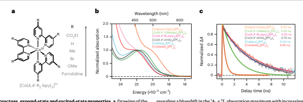
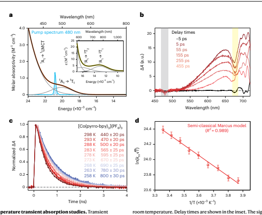
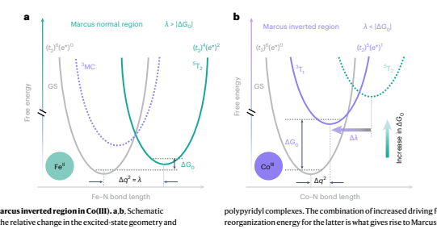
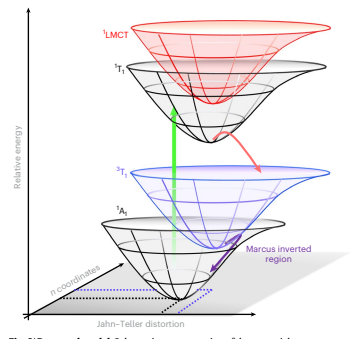

# Establishing The Origin Of Marcus-Inverted-Region Behaviour In The Excited-State Dynamics Of Cobalt(Iii) Polypyridyl Complexes

| Received: 18 September 2023 Accepted: 24 May 2024 Published online: xx xx xxxx  Check for updates   |
|-----------------------------------------------------------------------------------------------------|

Atanu Ghosh   , Jonathan T. Yarranton    **& James K. McCusker** 
Growing interest in the use of frst-row transition metal complexes in a number of applied contexts—including but not limited to photoredox catalysis and solar energy conversion—underscores the need for a detailed understanding of their photophysical properties. A recent focus on ligand-feld photocatalysis using cobalt(III) polypyridyls in particular has unlocked unprecedented excited-state reactivities. Photophysical studies on Co(III) chromophores in general are relatively uncommon, and so here we carry out a systematic study of a series of Co(III) polypyridyl complexes in order to delineate their excited-state dynamics. Compounds with varying ligand-feld strengths were prepared and studied using variable-temperature ultrafast transient absorption spectroscopy. Analysis of the data establishes that the ground-state recovery dynamics are operating in the Marcus inverted region, in stark contrast to what is typically observed in other frst-row metal complexes. The analysis has further revealed the underlying reasons driving this excited-state behaviour, thereby enabling potential advancements in the targeted use of the Marcus inverted region for a variety of photolytic applications.

The photophysical properties of transition metal-based complexes have been studied extensively for decades due in part to their pivotal role in light-enabled chemical processes ranging from solar energy conversion strategies to photoredox catalysis1–6. Despite this success, recently considerable attention has been placed on sustainability and scalability for chemical transformations; in transition metal chemistry, this largely requires a shift in focus to the more abundant and cheaper elements of the first transition series7–11. While this has resulted in exciting and potentially transformative developments in areas such as catalysis6, the replacement of chromophores based on Ru and Ir (for example, with first-row analogues to effect analogous excited-state chemistry) has proven to be considerably more challenging.

The primary difficulty stems from fundamental differences in electronic structure that impact non-radiative decay dynamics due to the presence of lower-lying ligand-field states (that is, 'd–d' states)7,12–17. 

These metal-centred excited states are characterized by a rearrangement of electrons within the d-orbital manifold as opposed to a formal separation of charge, which substancially changes the landscape in terms of the type of excited-state chemistry that can be anticipated. 

Indeed, with a number of notable exceptions involving Cr(III) (ref. 18), 
chemical platforms have been only recently developed that are providing promise along these lines19.

Among the other first-row transition metal complexes, low-spin d6-Fe(II) complexes have garnered considerable attention. For Fe(II) 
polypyridyl complexes (for example, [Fe(bpy)3]
2+, where bpy is 2,2'-bipyridine), the initially formed metal-to-ligand charge-transfer 
(MLCT) excited state decays on a sub-100 fs timescale to the ligand-field manifold, ultimately forming a high-spin S = 2 species 

The image appears to be a scientific paper discussing the photophysical properties of cobalt(III) polypyridyl complexes. The paper is likely titled "Establishing The Origin Of Marcus-Inverted-Region Behaviour In The Excited-State Dynamics Of Cobalt(III) Polypyridyl Complexes" and includes the names Atanu Ghosh, Jonathan T. Yarranton, and James K. McCusker as authors. The abstract suggests that the study focuses on the excited-state dynamics of these complexes using ultrafast transient absorption spectroscopy and aims to understand the underlying reasons for their behavior in the Marcus inverted region.

The image contains three figures labeled 'a', 'b', and 'c'. Figure 'a' seems to be a chemical structure diagram of a cobalt(III) polypyridyl complex, while figure 'b' shows a graph with an energy axis ranging from 0 to 600 nm and a normalized absorption axis ranging from 0 to 1. The graph has a peak around 400 nm, indicating the absorption spectrum of the complex. Figure 'c' also appears to be a graph with an energy axis ranging from 0 to 1000 nm and a normalized absorption axis ranging from 0 to 1. This graph shows multiple peaks, suggesting different absorption features or transitions.

The text in the image provides context for the research, mentioning the importance of understanding the photophysical properties of transition metal-based complexes for various applications. It discusses the challenges associated with replacing chromophores based on Ru and Ir with first-row analogues due to differences in electronic structure and non-radiative decay dynamics. The paper highlights the study of cobalt(III) polypyridyl complexes and their excited-state dynamics, particularly focusing on the Marcus inverted region behavior.

(the 5T2 ligand-field state)20. While such ligand-field excited states have been shown to engage in bimolecular electron-transfer chemistry21, the relatively low energy coupled with an ~1 ns lifetime limits the utility of such compounds for bimolecular photochemical transformations in particular. Several approaches have emerged to alter the excited-state energetic profile of these complexes22–28, but such efforts are hampered by the inability to assess the energiof 10Dq. Specifically, the data reveal that an inverse relationship exists between the magnitude of 10Dq and the rate constant for ground-state recovery: as 10Dq increases, the rate constant for excited-state relaxation back to the ground state decreases. While this type of behaviour is commonly observed for complexes such as ruthenium(II) polypyridyls 
(for example, [Ru(bpy)3]
2+), where relaxation of the lowest-energy 3MLCT excited state follows the so-called energy gap law44, this was a wholly unexpected result for these d6-Co(III) complexes due to the interconfigurational nature of all of the ligand-field excited states for a d6 configuration.

To appreciate this latter point, recall that the energy gap law is based on straightforward arguments stemming from non-radiative decay theory as depicted schematically in Fig. 2 (ref. 45). When the zero-point energy difference between the ground state and lowest-energy excited state is larger than the energy, reflecting structural differences between their equilibrium geometries (Fig. 2a), 
non-radiative decay theory predicts a decrease in the rate constant for conversion from the upper state to the lower state with an increasing energy gap due to the decrease in the overlap between the ground 

The image is a scientific figure from a research paper discussing the non-radiative decay dynamics of d6-Co(III) complexes. The figure is divided into two parts, labeled as (a) and (b), which represent different scenarios in the energy gap law for non-radiative decay.

Part (a) shows an interconfigurational ligand-field excited state with nested potentials. It includes a diagram of the energy gap law, where the ground state (GS) and excited states (ES) are depicted with their respective energy levels. The diagram also shows the Marcus inverted region, where the rate constant decreases with increasing driving force (ΔG0).

Part (b) shows an interconfigurational ligand-field excited state with displaced potentials. Similar to part (a), it includes a diagram of the energy gap law, but with the ground state and excited states shown with different energy levels. This part represents the inverse energy gap law regime, where an increase in excited-state energy leads to a faster rate of excited-state decay.

Both parts of the figure are color-coded to distinguish between the ground state (GS) and excited states (ES). The text accompanying the figure provides context and explains the relationship between the energy gap law and the rate constant for ground-state recovery in the context of the energy gap law.

vibrational wavefunction of the excited state and excited vibrational wavefunctions of the ground state. As discussed in greater detail below, this phenomenology is identical to the so-called inverted region from the Marcus theory, wherein the rate constant decreases with increasing 
'driving force' for the reaction (that is, ground-state recovery). In the case of compounds like [Ru(bpy)3]
2+, where the equilibrium geometries of the 3MLCT state and 1A1 ground state are nearly identical46, one does indeed observe an increase in excited-state lifetime with increasing excited-state energy, consistent with this picture47–49.

The situation for Co(III) is fundamentally different due to the fact that the excited states driving the dynamics reflected in Fig. 1c are ligand-field in nature as opposed to charge-transfer. More specifically, because the ground state of a (nominally) octahedral, low-spin d6 complex is characterized by a filled t2g subshell, that is, (t2g)
6, all of the excited states associated with a low-spin, d6 ground-state configuration will have electrons in the sigma anti-bonding eg* orbitals. 

This will inexorably give rise to notable differences in the equilibrium geometries of the ground and excited states and is generally expected to lead to a picture more in line with that depicted in Fig. 2b. In this so-called inverse energy gap law regime (that is, the Marcus normal region), an increase in excited-state energy will lead to a faster rate of excited-state decay.

Variable-temperature time-resolved spectroscopy While the data shown in Fig. 1c are strongly suggestive of Marcus-inverted-region behaviour, this result is not conclusive. One can envision circumstances across a series of compounds which, if the relative magnitudes of driving force (ΔG0) and reorganization energy (λ) vary in just the correct manner, a trend like that shown in Supplementary Table 1 could arise (at least in principle). We sought to apply variable-temperature time-resolved spectroscopy to our series of Co(III) polypyridyl complexes both to substantiate our hypothesis concerning Marcus-inverted-region behaviour for the non-radiative ground-state recovery dynamics of this system and to identify its origin.

We have carried out these studies on four of the six members of the series, but for the sake of clarity we will provide a detailed discussion of the analysis of the data acquired for one member of the series—[Co(pyrro-bpy)3](PF6)3—with the understanding that the same protocol was applied to the other compounds. The electronic absorption spectrum of [Co(pyrro-bpy)3](PF6)3 collected in acetonitrile solvent is shown in Fig. 3a, superimposed on which is the spectral profile of the pump centred at 480 nm that was used for photoexcitation. As discussed above, the data acquired at 720 nm could be fit to a single-exponential kinetic model, yielding a time constant of 470 ± 20 ps, which was attributed to the relaxation of the lowest-energy excited state back to the ground state (Fig. 3c). The ground-state absorption feature centred near 350 nm is assigned to a 1A1 → 1LMCT 
absorption, which tails into the visible region and does overlap to some extent with the 1A1 → 1T1 absorption that is our primary interest (Supplementary Fig. 2). To ensure that the ground-state recovery dynamics are indeed reflecting processes associated with the ligand-field manifold, we performed time-resolved absorption measurements as a function of excitation wavelength across the 1A1 → 1T1 absorption envelope (Supplementary Fig. 3). On the high-energy side, this results in considerable absorption into the LMCT transition, while on the low-energy side the 1T1 state is exclusively populated. While differences in the observed kinetics were noted at very early time delays (that is, 
<1 ps; Supplementary Fig. 4), the ground-state recovery dynamics were found to be independent of both excitation and probe wavelength (Supplementary Tables 2 and 3). This observation supports the notion that the process we are monitoring is indeed occurring between ligand-field excited state(s) and the ground state and does not involve the charge-transfer manifold in any way. Ground-state recovery dynamics of [Co(pyrro-bpy)3](PF6)3 were acquired in a CH3CN 
solution as a function of temperature in increments of 5 K between 258 K and 298 K following ligand-field photoexcitation (Fig. 3c); at each temperature point, the data were well described by simple, single-exponential kinetics.

Variable-temperature kinetics data can be modelled in a variety of ways depending on what sort of information is being sought. A detailed description of all the models used to fit variable-temperature data is in the Methods; in short, we used an Arrhenius model, simple transition state theory (that is, the Eyring equation) and semi-classical Marcus theory to understand the excited-state dynamics of this system.

The simplest of these is the Arrhenius model (equation (1)):

$$k_{\mathrm{{nr}}}=A\mathrm{exp}\left(-{\frac{E_{\mathrm{{a}}}}{k_{\mathrm{{B}}}T}}\right)$$
) (1)

The image is a scientific figure from a research paper that presents data related to the photoexcitation and relaxation dynamics of a compound, specifically [Co(pyrro-bpy)3](PF6)3. The figure is divided into four parts: 

1. Part (a) shows a pump-probe spectroscopy setup with a pump spectrum centered at 480 nm and a probe spectrum ranging from 450 to 800 nm. The graph displays the normalized absorption change (ΔA/A) as a function of time delay and wavelength. There is an inset graph showing the pump spectrum and the absorption change over time.

2. Part (b) presents a semi-classical Marcus model for the relaxation process. It includes a graph plotting ln(knr) against 1/T, where knr is the non-radiative decay constant and T is the temperature. The graph shows a linear relationship with a slope corresponding to the activation energy.

3. Part (c) depicts the variable-temperature kinetics data for [Co(pyrro-bpy)3](PF6)3. It shows the time constant for ground-state recovery increasing with decreasing temperature, indicating the presence of an activation energy for this process.

4. Part (d) is not described in the context provided.

The image uses a color scheme of black text on a white background, with graphs in various colors such as red, blue, and yellow. The graphs are detailed and precise, with axes labeled and data points plotted. The overall structure of the image is scientific and informative, designed to convey complex data in a clear and concise manner.

where knr is the non-radiative decay constant (that is, the observed decay constant kobs for our non-emissive compounds), A is the pre-exponential factor (also known as the frequency factor), Ea is the activation energy and kB and T are the Boltzmann constant and absolute temperature, respectively. As evident from the data in Fig. 3c, the time constant for ground-state recovery increases with decreasing temperature, indicating the presence of an activation energy for this process. Fitting the data for [Co(pyrro-bpy)3]
3+ using equation (1), the activation energy was determined to be 850 ± 50 cm–1 (Supplementary Fig. 9). 

Considering that the so-called 'typical' reaction, in which a rate constant doubles upon increasing the temperature from 300 K to 310 K, 
corresponds to an Arrhenius activation energy of ~4,000 cm–1, the value obtained for [Co(pyrro-bpy)3]
3+ represents a small but nevertheless easily measurable barrier for ground-state recovery from the compound's lowest-energy ligand-field excited state.

The Eyring equation frames the relaxation process in terms of free energy of activation (ΔG‡), thereby providing insight into the activation enthalpy (ΔH‡) and entropy (ΔS‡) associated with ground-state recovery according to equation (2):

$$k_{\rm nr}=\kappa\frac{k_{\rm B}T}{h}\exp\left(-\frac{\Delta G^{\ddagger}}{k_{\rm B}T}\right)=\kappa\frac{k_{\rm B}T}{h}\exp\left(\frac{\Delta S^{\ddagger}}{k_{\rm B}}\right)\exp\left(-\frac{\Delta H^{\ddagger}}{k_{\rm B}T}\right)\tag{2}$$

where κ is the transmission coefficient and h is Planck's constant. For 
[Co(pyrro-bpy)3]
3ined to be 17,100 cm–1, which is smaller than the 10Dq values for all of the Co(III) polypyridyl complexes we have examined.

As will become evident in the sections to follow, we do believe that the lowest-energy excited state of [Co(pyrro-bpy)3]
3+ (as well as the other members of the series) is indeed the 3T1 state, a conclusion that has important implications for explaining the behaviour we observe concerning the ground-state recovery dynamics of these compounds. For the sake of clarity, we will therefore proceed with the analysis to follow based on such an assignment; however, a parallel analysis assuming the 5T2 state (which leads to internally inconsistent conclusions) is provided in Supplementary Section 12.

The driving force is straightforward to calculate, since it is simply the difference in energy between the equilibrium structures of the ground and excited ligand-field states in question: for 
[Co(pyrro-bpy)3]
3+, a value of –10,100 ± 550 cm–1 is found for the 3T1 state, indicating that the zero-point energy of the structurally relaxed 3T1 state sits 10,100 cm–1 above the ground state (Methods for details). 

Using this value for ΔG0, we can now deconvolve the two contributions to the slope of the ln(knr√T) versus 1/T plot shown in Fig. 3d. The quadratic nature of the exponential term gives two possible values for the reorganization energy: λ = 18,400 ± 600 cm–1 and λ = 5,700 ± 500 cm–1. 

Clearly, the second solution is very much in line with the one derived from the calculations (Methods), particularly when one considers the fact that the calculated value of 3,000 cm–1 corresponds only to the inner-sphere portion of the total reorganization energy (that is, structural changes of the molecule only), whereas the experimental value of λ will reflect both inner-sphere and outer-sphere (that is, solvent) 
contributions. Additional guidance can be gleaned from other experimental reports concerning reorganization energies on different (but related) chemical systems (Supplementary Section 11)53. Our experimental data, when combined with the results from our DFT calculations, therefore lead to the conclusion that λ = 5,700 ± 500 cm–1 is the correct solution for the fit shown in Fig. 3d. When this value is combined with the driving force of –10,100 ± 550 cm–1, we can state with a high degree of confidence that the relaxation dynamics of [Co(pyrro-bpy)3]
3+
lie firmly in the Marcus inverted region, where λ < |ΔG0|.

The preceding discussion focused almost exclusively on the properties of [Co(pyrro-bpy)3]
3+, but analogous studies were carried out on three additional members of the series of compounds shown in Fig. 1a: 
these data are summarized in Table 1. Inspection of the data shows remarkable consistency in the magnitude of the reorganization energy. 

Given the fact that compositional changes in the molecule involve substitutions on the periphery of the bipyridyl rings (that is, relatively removed from the primary coordination sphere about the metal centre), this invariance in the fitted value of λ bolsters our confidence in the veracity of our analysis. Variations in the lifetime at room temperature were alluded to previously in this Article, but now in addition we see that the Arrhenius activation energy shows a systematic increase with increasing zero-point energy difference between the ground state and lowest-lying excited state. This is precisely the phenomenology one would expect in the Marcus inverted region, that is, an increasing barrier (and thus a longer excited-state lifetime) as the driving force for the increases in reaction.

The image is a scientific figure that accompanies a research article. It consists of two parts labeled as "a" and "b". Part "a" shows a schematic representation of the Marcus normal region, GS (ground state), and various energy levels and transitions involving ligands and metal complexes. Part "b" depicts a similar schematic for the Marcus inverted region, with different energy levels and transitions. The colors used are primarily shades of blue and green, with text in black. The text provides context to the figure, discussing the calculation of driving force, reorganization energy, and the relationship between these parameters and the observed relaxation dynamics of a cobalt complex. The image is likely to be found in a scientific journal or report.

## Origin Of The Inverted-Region Behaviour

Since the intercept from equation (4) is proportional to |Hab| 2/√λ, a reliable value for λ now allows us to estimate the magnitude of electronic coupling between the 3T1 and 1A1 states as 25.5 ± 1.0 cm–1; the 
(relatively) high degree of precision for this number stems from the quartic relationship between However, the increase in 10Dq is only part of the story. As mentioned previously, the 5T2 state derives from a (t2)
4(e*)2 configuration, whereas the 3T1 state corresponds to (t2)
5(e*)1 configuration. The reduction in sigma anti-bonding character of the latter is the reason why the reorganization energy determined for the Co(III) complexes is roughly half of that found for Fe(II). What this means in the context of the potential energy surface diagram for the system is a diagonal shift in the relative position of the lowest-energy excited state, that is, an increase in zero-point energy coupled with a decrease in the horizontal separation between the two potentials (Fig. 4b). Our assessment of the situation for ground-state recovery in the Co(III) complexes studied herein is summarized in Fig. 5.

## Conclusions

Variable-temperature ultrafast time-resolved absorption spectroscopy has been combined with DFT in an effort to understand the origin of the photophysical behaviour associated with ground-state recovery dynamics of a series of Co(III) tris-bipyridyl complexes. The experimental data were analysed through the lens of non-radiative decay theories ranging from a simple Arrhenius model to semi-classical Marcus theory. 

The image is a scientific diagram that represents the potential energy surface diagram for the excited-state relaxation process of Co(III) tris-bipyridyl complexes after 1A1 → 1T1 ligand-field photoexcitation. The diagram is structured with three conical intersections labeled as 'LMCT', '3T1', and '5T2', which represent different electronic states of the complex. The diagram also includes arrows indicating the state conversion process after photoexcitation, and dotted lines suggesting structural changes. The diagram is color-coded, with red, blue, and black cones representing different states. The text provides context to the diagram, discussing the experimental data analysis, theoretical models, and the implications of the results for the design of next-generation photocatalysts. The image is part of a scientific report on the photophysical behavior of Co(III) tris-bipyridyl complexes and their potential applications.

Fig. 5 | Proposed model. Schematic representation of the potential energy surface diagram for the excited-state relaxation process of Co(III) tris-bipyridyl complexes subsequent to 1A1 → 1T1 ligand-field photoexcitation. Ground-state recovery dynamics proceed from the 3T1 ligand-field excited state with a balance of free energy difference and reorganization energy that places the process firmly in the Marcus inverted region. The n-coordinates represent all potential normal mode vibrations which are not coupled to Jahn–Teller distortion coordinate and the dotted lines are used to show the structural changes and the solid arrows represent the state conversion process after photoexcitation.

When combined with the results of DFT calculations benchmarked with experimental spectroscopic data, values for the driving force 
(ΔG0) and reorganization energy (λ) were obtained that indicated the magnitude of ΔG0 across the series was nearly twofold larger than the reorganization energy, thereby confirming Marcus-inverted-region behaviour. Moreover, both the magnitude of Hab and its variation as a function of driving force strongly implicated the 3T1 ligand-field excited state as the lowest-energy excited state of all compounds in the series, in contrast to the 5T2 state in isoelectronic Fe(II) polypyridyls. This change in the nature of the lowest-energy excited statewhich leads to smaller reorganization energies—coupled with a larger zero-point energy difference conspire to place the excited-state relaxation dynamics of Co(III) polypyridyl complexes in the Marcus inverted region.

While there is clearly room for improvement in certain aspects of this class of chromophores when considering future applications 
(for example, increased absorption cross-sections, excitation wavelengths that extend to longer wavelengths in the visible and enhanced excited-state lifetimes, to name a few)55, we believe that the fundamental photophysical properties of these simple Co(III) polypyridyl complexes that we have delineated in this report can serve as a roadmap for designing next generation photocatalysts that can leverage new opportunities afforded by accessing the Marcus inverted region in this manner.

## Online Content

Any methods, additional references, Nature Portfolio reporting summaries, source data, extended data, supplementary information, acknowledgements, peer review information; details of author contributions and competing interests; and statements of data and code availability are available at https://doi.org/10.1038/s41557-024-01564-3.

## References

1. Juris, A. et al. Ru(II) polypyridine complexes: photophysics, photochemistry, eletrochemistry, and chemiluminescence. Coord. Chem.fice of Science, US Department of Energy under grant no. DE-FG0201ER15282.

## Author Contributions

A.G. performed the transient absorption experiments and analysed the data, performed the DFT calculations and created all the figures. J.T.Y synthesized the compounds. All authors contributed to the writing of the. J.K.M directed the project.

## Competing Interests

The authors declare no competing interests.

## Additional Information

Extended data is available for this paper at https://doi.org/10.1038/s41557-024-01564-3. Supplementary information The online version contains supplementary material available at https://doi.org/10.1038/s41557-024-01564-3. Correspondence and requests for materials should be addressed to James K. McCusker. Peer review information *Nature Chemistry* thanks Christopher Larsen and the other, anonymous, reviewer(s) for their contribution to the peer review of this work. Reprints and permissions information is available at www.nature.com/reprints.

The image is a scientific figure that appears to be from a research paper. It consists of several parts, each representing different aspects of the study. The main title suggests that the figure is related to computational studies to estimate reorganization energy in a chemical context.

Part A of the figure shows a Tanabe-Sugano diagram for [Co(pyrro-bpy)2](PF6), which is a complex with a specific ligand-field analysis. The diagram plots energy against wavelength, indicating the vertical transition energies of the complex. There's a note that these diagrams reflect vertical transition energies and not the zero-point energy of a given excited state.

Part B presents a comparison between time-resolved absorption spectra obtained from experimental data and theoretical calculations (TD-DFT). This part includes an inset showing the spin density associated with the 3MC ligand-field excited state derived from DFT calculations at the optimized equilibrium geometry.

Part C seems to be a graph comparing the energy of different states, but the details are not clear from the provided text.

The bottom of the image contains a reference to the source of the data, acknowledgments, and a note about the availability of extended data and correspondence information.

The colors used in the figure are mainly grayscale, with black lines on a white background, and some colored insets. The text is primarily in black, with some red accents.

energy. (a) Tanabe-Sugano diagram appropriate for [Co(pyrro·bpy),](PF,),
based on the ligand-field analysis described in ref. 29 . The diagram was constructing using the experimentally determined Racah B and C parameter values of 480 cm 3 and 3430 cm 3 , respectively. The vertical dashed line corresponds to the value of 10 Dq found for [Co(pyrro-bpy)د [PFدو It should be emphasized that these diagrams reflect vertical transition energies, not the zero-point energy of a given excited state that ultimately determines which state lies lowest in energy. Inset: An expanded view of the region near the crossing point between the 5 T 2 and 3 T 2 ligand-field excited states. ( b ) Comparison between time-resolved absorption spectra obtained from a singular value decomposition analysis of the experimental transient absorption data and TD-DFT-computed S=1 (2MC) excited state. Inset: Spin density associated with the 3MC ligandfield excited state derived from DFT calculations carried out at the optimized equilibrium geometry, showing localization of the spin density predominantly on the metal center. Positive (excess α) and negative (excess β) spin density