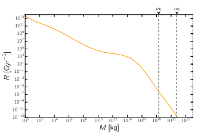
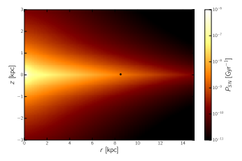

c species survived. 

However, around 90% of bony fish species survived14 and deep ocean creatures were largely unaffected by the event. We estimate an upper bound for the energy deposited by an asteroid of mass Ma as being its free-fall energy from infinity to the surface of the planet E=1/2Ma(v∞2+ve 2), where *ve p* = 2 / GM Rp is the escape velocity of the planet (ve ≈ 11.2 kms−1 for Earth), and v∞ is given by Öpik's close encounter theory15. In order to raise the ocean's temperature by T, we require an asteroid of mass

## Α = + .

∞

## M T

v v M 2(2) ae 2 2 p To annihilate tardigrades on Earth we require a mass over ∼1.7×1018 kg. The largest observed asteroids in the Solar System are Vesta and Pallas, with masses of 2.7×1020 kg and 2.2×1020 kg respectively. There are only 17 other known asteroids of sufficient mass, and a few dwarf planets, the most massive ones being Eris and Pluto, whose masses are 1.7×1022 kg and 1.3×1022 kg respectively. We reiterate that our estimate of the required energy is conservative–it is likely that it would take a significantly more massive impact as ocean heat would only be a fraction of the total energy. Since we consider Earth-like planets, the order of magnitude of this mass does not vary greatly between the largest and smallest planets–if oceans constitute an equal fraction of mass this changes by less than an order of magnitude.

In Fig. 1 we present a model for the impact rate of asteroids as a function of the mass. This is based on the extrapolation of relation between crater diameter and impact rate16. The mass of the object is related to crater diameter following ref. 17, assuming asteroids with density ρ~5 g cm−3 entering the atmosphere with incidence angle of 90° with respect to the normal. In reality, most asteroids have ρ≈2 g cm−3, and in the case of comets this value is even lower, being the value here assumed a conservative assumption. This is highly dependent on the asteroid distribution in our Solar System–we assume in the absence of other evidence, that other systems are similar, however this remains to be verified.

The bulk of the energy output of a supernova is carried by the shock wave. To give an upper bound on the range at which a supernova would remove all life from the planet, we assume that the shock wave carries all the energy released. The fraction of energy incident on a planet of radius Rp at a distance d from the supernova is given by the fraction of the sphere of radius d which is covered by the planet's surface πR d p /(4 ) π 2 2 . To raise the temperature of a planet by T, we would require a supernova within a distance d given:

The image appears to be a scientific graph titled "Cumulative impact rate per year for different masses of asteroids." It is a log-log plot with the x-axis labeled as "M [kg]" and the y-axis labeled as "R [Gyr^-1]." The graph shows a decreasing trend in the cumulative impact rate as the mass of the asteroid increases. There are dashed vertical lines indicating the minimum mass needed for complete sterilization, assuming a typical asteroid density. The text above the graph provides context, discussing the survival rates of various species after an event, the energy required to raise ocean temperatures by a certain degree, and the likelihood of complete sterilization due to impacts from asteroids or supernovae. The text also mentions the distances at which such events would need to occur to have a significant effect on Earth's oceans and life forms.

Figure 1. The cumulative impact rate per year for different masses of asteroids. This follows the parameterisation given in ref. 25 up to M=1015 kg; for M>1015 kg the impact rate is inferred following ref. 16. 

Dashed vertical lines indicate the minimum mass needed for complete sterilisation assuming a typical asteroid with density (ρ=2000 kg/m3). The lower bound (m1) is that which could cause boiling of the oceans if the entirety of its energy were converted into heat spread homogeneously throughout the Earth's oceans. The upper bound (m1) is the mass of an asteroid whose impact crater is equal to the size of the planet, causing complete destruction. Here we find that even with the most conservative bound, the likelihood of complete sterilisation is lower than around 10−5 over the lifetime of the planet.

For the Earth, this sterilisation distance is around 0.04pc, far closer than the closest stars, Proxima Centauri. 

Were a supernova to occur at that distance, the ocean temperature would only rise by about 0.1°C. Furthermore, although there is a dependence on the mass of the planet, this dependence is quite weak. Note that none of the stars in the Alpha Centauri system are large enough to go supernova. The nearest potential supernova is the IK Pegasi system, approximately 45pc away, which is three orders of magnitude farther than the estimated sterilisation radius.

To assess the relative risk faced by any planet in our galaxy, we approximate the odds of a close enough supernova happening over a timespan of 109 years. We find the expected number of stars of sufficient mass within the sterilisation distance of a planet, and the odds that one of these stars goes supernova. The galactic habitable zones, regions wherein complex life may evolve, depends on the occurrence rate of supernovae. A detailed simulation-based study was done by Lineweaver *et al*.

18. We evaluate the rate of SN at a position (r, z) (cylindrical coordinates) as follows:

$$=\left({\frac{3}{32\pi M_{p}^{1/2}\rho}}\right)^{\frac{1}{3}}\left({\frac{E_{s}}{\alpha C T}}\right)^{\frac{1}{2}}$$
$\overline{\phantom{\rule{0.000pt}{0ex}}}$
32 (3) SNp
$$)\tau^{-1}(m),$$
∫ = χ ξ τ− P r ⁎ ( , z d ) ( m m) ( n r, ) z m( ), (4) SN M
M 1
$$1=\chi\int_{M_{\mathrm{min}}}^{M_{\mathrm{max}}}d m\,\xi(m)n_{\mathrm{a}}$$

with n⁎ being the number density of stars19. Following ref. 19 we select *Mmin* = 8M and *Mmax* = 25M for supernova progenitors. ξ(m) and τ−1(m) are respectively the initial mass function and the lifetime of a star of mass m. 

This is normalised to the global supernova rate in the Milky Way20. The rate of supernovae explosions within the sterilisation radius (0.04pc) over 1 billion years is shown in Fig. 2, for differing galactic locations.

Because the nearest star is about 1.3pc away, we can conclude that Earth is located in a fortunate position. Near the galactic centre the density of stars increases and the probability of a SN sterilising life is higher. Nonetheless, this rate is almost insignificant even close to the galactic core, reaching only around 1% of planets being sterilised. The calculation for GRBs is similar to the one for SNe, but now we have to assume that the energy is collimated into in jets. As before, we assume the most pessimistic scenario–the smallest jet angle with the largest energy. The energy is typically the same as that of a supernova, 1044 J, but the jet angles can be as low as 2°, hence the energy incident on a target of radius r which lies entirely within the beam angle at a distance d is:
Hence for an increase of 100 °C in the ocean temperatures, we would need a GRB within about 13.8 pc; again, this is an upper limit. The rate of occurrence of short GRBs per volume in the universe is 0.04 Gpc−3 yr−1, and long GRBs is 0.15 Gpc−3 yr−1 6. We will restrict these occurrences to within galactic discs of stars, therefore we divide this by the product of the comoving number density of galaxies (≈107 Gpc−3) and the volume occupied of the galactic disc (1011pc3), we find that the rate is around 2×10−10 pc−3 Gyr−1, and hence the probability of a GRB within the a distance at which it would sterilise a planet, aligned such that one of the beams hit the planet is 3.2×10−10 Gyr−1. This number is extremely small and we can conclude that such event is unlikely.

$\frac{\pi r^-}{8\pi r^2}=$

## Π = Ω E E = Rdr D 10 J (5) Grb 2 2 62 2 2

The image is a scientific figure that represents the expected number of supernovae within the sterilisation sphere of radius 0.04 parsecs (pc) per billion years as a function of galactic position. The x-axis represents the distance from the galactic center in kiloparsecs (kpc), and the y-axis represents the distance above or below the galactic plane in kiloparsecs (kpc). The color gradient ranges from dark to light, indicating higher to lower values of supernova occurrences.

The black circle on the figure indicates the position of the Solar System. The text accompanying the figure explains that the rate of supernovae explosions within the sterilisation radius over 1 billion years is shown for different galactic locations. It also mentions that the calculation for gamma-ray bursts (GRBs) is similar to that for supernovae but involves assuming collimated energy jets. The text provides a detailed explanation of the calculations involved in determining the probability of a GRB sterilizing life, including the initial mass function, lifetime of stars, and global supernova rate in the Milky Way.

The figure is part of a study that evaluates the relative risk faced by any planet in our galaxy due to the occurrence of supernovae and GRBs. The study aims to determine the galactic habitable zones, regions where complex life may evolve, and how they depend on the occurrence rate of supernovae. The text references a detailed simulation-based study by Lineweaver et al.

Figure 2. The expected number of supernovae within the sterilisation sphere of radius 0.04pc per Gyr as a function of galactic position. The black circle indicates the position of the Solar System. Closer to the galactic centre the stellar density is higher, and thus the likelihood of encountering a nearby supernova increases. However, this density is only sufficient to give a total rate of around 0.01 expected events per billion years, and thus total sterilisation through supernovae is still an improbable event.

Planetary systems can also be disrupted by passing-by stars. The rate, R, of such encounters for a given stellar density, n∗, is R n = ⁎σv, (6)
where σ is the cross section to disrupt the orbit of the planet, and v the velocity of the star. Typically, v ≈ 40 km s−1. 

In the neighbourhood of the Solar System ∼ − − n⁎ 10 pc 3 319. In the case of Earth, σ ∼ − 10