Received: 06 February 2023, Accepted: 05 May 2023 Edited by: S.A. Cannas Licence: Creative Commons Attribution 4.0 DOI: https://doi.org/10.4279/PIP.150003

Study of hysteresis in the ferromagnetic random field 3-state clock model in two and three dimensional periodic lattices at zero temperature and in the presence of dilution and an absorbing state

## Elisheba Syiem1, R. S. Kharwanlang1∗

We numerically study hysteresis in the ferromagnetic random field 3-state clock model in two and three dimensional periodic lattices at zero temperature and in the zero frequency limit of the driving field. The on-site quenched disorders are continuous and are drawn from a uniform distribution. We numerically analyzed the effects of disorder on the dynamics of the model and hence on the shape of the hysteresis loops. We also study the model in the presence of dilution and an absorbing state.

## I Introduction

Hysteresis in quenched disordered systems has been the subject of numerous research studies over the past years [1, 2]. These studies are crucial because they offer a wealth of insights into the rich field of phenomena associated with nonlinear and random systems, and they also have numerous practical applications, for example in the magnetic recording industry [3–5]. Systems with quenched disorder often possess large number of metastable states that are separated from each other by energy barriers much larger than the thermal energy. The barriers have a distribution of heights that depends strongly on the details of the system. The metastable states correspond to local minima in the free-energy landscape of the system. The system remains trapped in a local minimum for a long time and is unable to attain thermal equilibrium over the practical time scale of interest. However the system can be driven from one metastable state to another by the applied external field. As the field is varied continuously, the response of the system consists of irregular jumps arising from the non-uniformity of barrier heights. This gives rise to Barkhausen noise. The non-equilibrium random-field Ising model at zero temperature was proposed by Sethna [6] to study hysteresis and phase transitions in systems with quenched disorder. The disorder in their model is characterized by on-site quenched random fields having a Gaussian distribution with mean value zero and standard deviation σ. The model is able not only to reproduce hysteresis loops that resemble the observed experimental loops but also provide an understanding of other aspects associated with it, for example, the Barkhausen noise, return point memory etc. The model also exhibits a nonequilibrium critical point σ = σc, h = hc at which the Barkhausen jumps become scale invariant. For σ < σc, there is a first order jump in the magnetization on each half of the hysteresis loop. As σ is increased, the size of the jump decreases continuously to zero at σc. In addition to this model, other spin models have also been formulated to study hysteresis and phase transitions in systems with quenched randomness [7–11]. The present work studies the zero temperature hysteresis in the random field 3state clock model and in the limit of zero frequency of the driving field. In our model the random field has a fixed magnitude, so we vary the ferromagnetic interaction J. We found that the response of a system to an applied field in the high J limit (low disorder) consists of first order jumps in the magnetization. As J is decreased, the size of the jump decreases gradually to zero at a particular value J = Jc and h = hc. The point (Jc, hc) marks the existence of a non-equilibrium critical point of the model. In the present work we focus on the analysis of the shape of hysteresis loops rather than estimating the value of the critical point Jc. The shape of the hysteresis loop has practical importance as it relates directly to the dissipation of energy in the system. We also found that at very high value of J, spins flipped directly from first state to third state and no spins flipped to the second state as the field was varied continuously from h = −∞ to h = ∞. In the present work we also study the effect on the hysteresis loop when dilution and an absorbing state are incorporated into the system.

An absorbing state is a state in which the spin degrees of freedom of the system remain frozen over the practical time scale of interest [12, 13]. In the present work, the second state is considered as an absorbing state. As the field is increased gradually from sufficiently large negative value, spins flipped from the first state to the second state or to the third state. The spins that had flipped to the second state remained frozen and could not leave the state throughout the entire journey of the applied field.

## Ii Model

The model is defined by the Hamiltonian,

$$H=-J\sum_{i,j}\vec{S_{i}}.\vec{S_{j}}-\sum_{i}\vec{h_{i}}.\vec{S_{i}}-\vec{h}.\sum_{i}\vec{S_{i}}\tag{1}$$

where S⃗iis a 2-component unit spin vector located at the site i. S⃗i can point along any of the three directions defined by the angles θ = θa, θ = θb and θ = θc that the spin vector makes with the
+x-axis. We set 2π/3 < θa ≤ π, π/3 < θb ≤ 2π/3, and 0 ≤ θc ≤ π/3 as shown in Fig. 1 below. At each site i there is a 2-component quenched random field unit vector ⃗hi. The vector ⃗hiis assumed to be continuous and it is defined by an angle αi

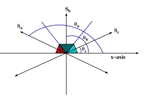 

(0 < αi < π) that it makes with the +x-axis.

The summation in the first term is over the nearest neighbors of the spin S⃗i. The uniform external field h, |
⃗h| = h is applied along the x-axis. J is the ferromagnetic interaction between spins (J > 0).

The first and the last terms in Eq. (1) favor parallel alignment of spins while the second term introduces disorder in the system, thereby making each spin point in the direction of the random field ⃗hi.

Writing Eq. (1) in terms of the effective local field
⃗fi acting at each site i,

$$\begin{array}{r c l}{{H}}&{{=}}&{{-\sum_{i}\vec{f}_{i}(t).\vec{S}_{i}(t);}}\\ {{}}&{{}}&{{}}\\ {{\vec{f}_{i}(t)}}&{{=}}&{{J\sum_{j}\vec{S}_{j}(t)+\vec{h}_{i}+\vec{h}}}&{{\quad\quad(2)}}\end{array}$$

At zero temperature, the energy of a spin, and hence that of the entire system, is minimum when each spin points along the direction of the local field ⃗fi at its site. Since |S⃗i| = 1, the state of each spin in the lattice at any applied field h is wholly ascertained by the direction ˆfi of the local field ⃗fi.

Let S
x j and S
y j denote the components of the spin S⃗j along the x-axis and the y-axis respectively and similarly let h x i and h y i be the components of the vector ⃗hi along the x-axis and the y-axis respectively. The x- component of ˆfiis

$$\left({\mathrm{3}}\right)$$
$$\cos\theta_{i}=\tag{3}$$ $$J\sum_{j}S_{j}^{x}+h_{i}^{x}+h$$ $$[(J\sum_{j}S_{j}^{x}+h_{i}^{x}+h)^{2}+(J\sum_{j}S_{j}^{y}+h_{i}^{y})^{2}]^{1/2}\,.$$

We are interested in looking only at the ordering of the spins along the field direction. Assuming no global ordering along the y-axis, we set Pj S
y j = 0.

Writing Eq. (3) in terms of the angles θ and α that the spin vector and the random field vector make with the +x-axis, we have

cos θi =
$$\begin{array}{c}J\sum_{j}\cos\theta_{j}+h+\cos\alpha_{i}\\ \cos\theta_{j}+h)^{2}+2(J\sum_{j}\cos\theta_{j}+h)\cos\alpha_{i}+1]^{1/2}\end{array}$$
[(JPj
(4)
As the field is continuously varied from h = −∞
to h = ∞, cos θiin Eq. (4) can take any values from −1 to +1. Since in our model the spin can take only three states, we set the states of the spin as follows:

$$\cos\theta_{i}=\left\{\begin{array}{l l}{{S_{a}=\cos\theta_{a}~{\mathrm{for}}}}\\ {{S_{b}=\cos\theta_{b}~{\mathrm{for}}}}\\ {{S_{c}=\cos\theta_{c}~{\mathrm{for}}}}\end{array}\right.$$

Sa = cos θa for cos π ≤ cos θi < cos(2π/3)
Sb = cos θb for cos(2π/3) ≤ cos θi < cos π/3 Sc = cos θc for cos π/3 ≤ cos θi ≤ cos 0
(5)
At any applied field value h, the state of a spin is represented either by a single projection Sa = cos θa or Sb = cos θb or Sc = cos θc. Furthermore, in a given state at h, Sa or Sb or Sc is a representative of the various projections/directions that the spin vector makes with the field direction in that state at h. Evidently, a spin that is stable in a given state at h can have a range of minimum energy values rather than a single value. For example, a spin that is stable at the third state Sc at h has minimum energy value ϵiin the range − cos θi ≤
ϵi ≤ − cos θi cos π/3. The range of ϵiis independent of the dimension of the lattice but the values of ϵiin the corresponding range are different for different dimensions of the lattice. For example in a cubic lattice (3D) the range of ϵiis the same as that of a square lattice (2D) but the values of ϵi are different from that of a square lattice as given by Eq. (4).

Rewriting Eq. (4),

$$\gamma_{i}(h)=\frac{A+\beta_{i}}{(A^{2}+2A\beta_{i}+1)^{\frac{1}{2}}}\tag{6}$$  where $A=J\sum_{j}\gamma_{j}(h)+h$; $\gamma_{i}=\cos\theta_{i}$; $\beta_{i}=\cos\alpha_{i}$; and $-1\leq\gamma_{i}\leq1$; $-1\leq\beta_{i}\leq1$.  Starting from a sufficiently large and negative ap 
Starting from a sufficiently large and negative applied field when all spins are in the first state Sa,

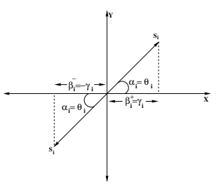

we increase the field in small steps. At each step, the dynamics given by Eq. (6) is applied recursively keeping h constant, until each spin in the lattice is oriented along the direction of the local field at its site and in line with Eq. (5). This results in a configuration of spins in the lattice consisting of spins that are stable in the first state Sa or the second state Sb or the third state Sc. It is a local minimum of the energy of the system within the approximation explained above and it represents a stable state of the system at zero temperature. At non-zero temperature it would become a metastable state if the barriers of thermal fluctuations are smaller than that of the quenched random fields. If, after a spin is relaxed, the energy at the neighboring spin increases, then the neighbor is relaxed in the next step. Holding h constant, we allow this process to continue till all spins are relaxed along the directions of their respective local fields. The fraction of unstable spins that are relaxed during this process determines the size of the avalanche. Keeping the applied field constant during the avalanche justifies the assumption that the frequency of the applied field is infinitely slow and that the spins are relaxed infinitely quickly as compared to the time of variation of the field. Writing Eq. (6) in terms of the random fields βi, 15  / 

$$\beta_{i}^{\pm}(\gamma_{i},A)=\tag{7}$$ $$-A(1-\gamma_{i}^{2})\pm\gamma_{i}(1-A^{2}+A^{2}\gamma_{i}^{2})^{\frac{1}{2}}$$  with $-(1-\gamma_{i}^{2})^{-\frac{1}{2}}\leq A\leq(1-\gamma_{i}^{2})^{-\frac{1}{2}}$. It is easy to see that,
$$\beta_{i}^{+}(\gamma_{i},A)=\beta_{i}^{-}(-\gamma_{i},A)$$ $$\beta_{i}^{+}(\gamma_{i},A)=-\beta_{i}^{-}(\gamma_{i},-A)\tag{8}$$

The geometrical picture of β
+ and β
− is shown in Fig. 2. For example, we consider A = 0, under this case, Eq. (6) gives θi = αi. This may be expected because a spin can now lower its energy only if it is aligned along the direction of the random field. Fig. 2 shows the projections β
+ and β
−
along the field direction. We choose to work with β
+
i
. For any given A value, it is seen from Eq. (7)
that β
+
j
(γj ) > β+
i
(γk) for γj > γk. In the present work, the random fields −∆ < β+
i < ∆ are continuous and are drawn from a uniform probability distribution,

$$p(\beta_{i})=\left\{\begin{array}{l l}{{\frac{1}{2\Delta}}}&{{\mathrm{if~-\Delta<\beta_{i}<\Delta}}}\\ {{0}}&{{\mathrm{otherwise}}}\end{array}\right.$$

## Iii Simulations

We increased the field slowly from h = −∞ to h = ∞ in small steps. Successively at each field step we run the dynamics described by Eq. (6) until all spins are stable. This drives the system through a succession of local minima. If on reversing the field from h = ∞, the system visited a sequence consisting of different local minima, the system is said to exhibit hysteresis. In the present work we are interested in studying the zero temperature hysteresis loops of the model in the two dimensional square lattice as well as in the three dimensional cubic lattice and in the presence of dilution and an absorbing state. We run the simulations with L = 3000 spins for 2D lattice and L = 1000 spins for 3D lattice. At each value of the applied field we averaged the magnetization per spin of the system over 10000 realizations of the random fields. We estimated the statistical error involved in our numerical calculations at several values of h. At each

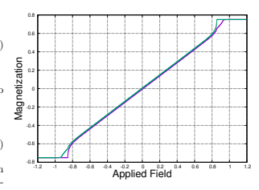

$$\left({\mathfrak{g}}\right)$$

h value, we binned the 10000 data of average magnetization into 100 bins, where each bin contains 100 data. From each bin we compute the average magnetization and estimate the error by calculating the standard deviation with respect to the average magnetization at h. The error computed is approximately 0.000367. At the starting field h = −∞, all spins are stable in the first state Sa. On increasing the field slowly, at some value h of the applied field, some spins may become unstable. This arises because the direction of the local fields at their sites no longer points along the directions relevant to state Sa. We call them the seed spins. The seed spins are relaxed either to the second state Sb or to the third state Sc depending on the direction of the local fields at their sites. The neighbors of seed spins may find themselves in a more favored position to become unstable and they are also relaxed. This leads to an avalanche of flipped spin at h. After the avalanche had stopped, we calculated the magnetization per spin at that value of the applied field. We found that at very small values of J, the hysteresis loop area is very small and has a constriction along the middle portion of the trajectory. These loops are called wasp-waisted hysteresis loops. The small hysteresis loop area can be attributed to the fact that at very low J, the disorder in the system is very strong and the spins act almost independently from each other.

Fig. 3 shows the magnetization of the system for a 2D lattice with L = 3000 at J = 0.1, and Fig. 4 shows the corresponding magnetization for

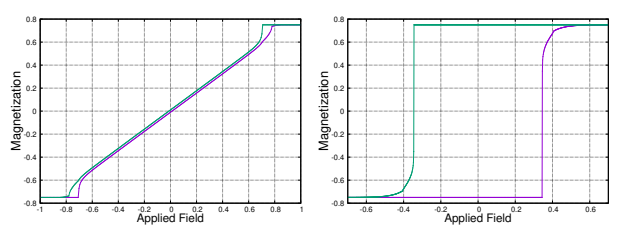

a 3D lattice with L = 1000 at J = 0.1. As J is increased further, the wasp-waisted shape of the loop disappears and we get the normal hysteresis loops as shown in Fig. 5 and Fig. 6. In Fig. 7 and Fig. 8, we plotted the hysteresis curves of the second state Sb in increasing (blue curve) and decreasing field (green curve) in 2D and 3D lattices and at J = 0.385 and J = 0.257, respectively. The separation of the two curves starts at h = 0. This can be understood as follows:
The field value at which spins start flipping from the first state Sa in the increasing field is given by h = −JP4 i=1 Sa − √1
(1−cos2 π/3)
and on decreasing the field from h = +∞ the dynamics starts at h
= −JP4 i=1 Sc + √1
(1−cos2 π/3)
. The seed spin in the increasing field has all nearest neighbors in the first state Sa while on decreasing the field, the neighbors of the seed spin are all in the third state Sc. Since Sa = −Sc, then from the above two equations we see that the separation starts at h = 0. The separation of the two curves increases as J is increased.

In our model the disorder is tuned by the ferromagnetic interaction J. As J increases, the disorder in the system decreases. We found that at high values of J, there is a first order jump in the magnetization and as we lower J the size of the jump decreases continuously to zero at a critical value Jc.

Jc marks the non-equilibrium critical point of the model. In the present work we are not in a position to determine the exact value of Jc numerically, but instead we identify the range within which the value of Jc lies. In Fig. 9 we show the hysteresis curves in increasing field for 2D lattice at J = 0.25
(violet), J = 0.3 (green) and J = 0.35 (light blue).

The hysteresis curve at J = 0.25 is continuous and the curve at J = 0.35 has a discontinuity. The corresponding value of Jc in 2D appears to lie between J = 0.25 and J = 0.35. Fig. 10 shows a similar behavior in 3D lattice for J = 0.1 (violet), J = 0.15
(green) and J = 0.2 (light blue). The value of Jc in this case appears to lie between J = .15 and J = .2.

The value of Jc in 3D is found to be lower than that in 2D. In Fig. 11 we plotted the minor hysteresis 

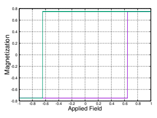

 15  / 

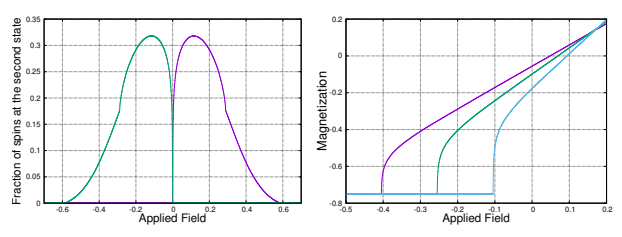

loops of the model along with the major hysteresis loop for the 2D lattice at J = 0.4. We increase the field slowly from h = −0.7 and reversed the field at a value h = 0.3 before the magnetization is saturated. The reversed curve touches the return major loop at h = −0.09. On increasing the field again from h = −0.09, the curve meets the point where it was last reversed at h = 0.3. A minor loop within a minor loop is also traced in Fig. 11. This shows that the model exhibits return point memory. The minor hysteresis loops for the 3D lattice at J = 0.22 is shown in Fig. 12.

At high value of J, for example at J = 1.54 in 2D lattice, spins from the first state flipped directly to the third state and no spin flipped to the second state. This can be explained below. In Fig. 13 we traced the random field profile from Eq. (7)
for spins in the 2D lattice and at J = 1.54. In this plot, for example at the h value along the red vertical line, CD gives the range of random fields where spins with one nearest neighbor in second state Sb and the remaining three in the first state Sa remain in the first state Sa at h. The range 

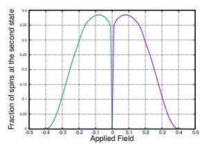 

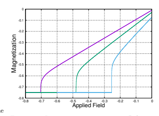

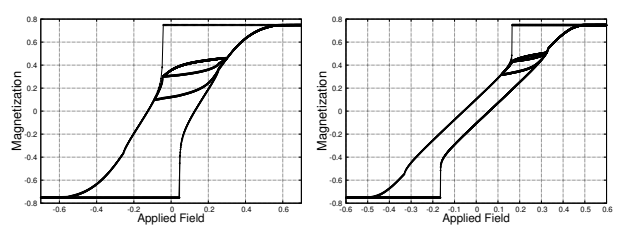

BC and AB give the values of random fields where such spins can flip to second state Sb and third state Sc at h respectively. As we increased the field slowly at J = 1.54, some spins with all neighbors in the first state Sa start flipping to second state at hs = −JP4 i=1 Sa − √1
(1−cos2 π/3)
≈ 3.465. This is shown in Fig. 13 when the red vertical line touches the light blue curve at h ≈ 3.465. We call these spins seed spins. The random field profile of seed spins is governed by the light blue curve in Fig. 13. After a seed spin is flipped, it may cause one of its neighbors to flip to third state if the random field of the neighbor is in the range AB. Once flipped to third state, the neighbor in question can then cause an avalanche that spans across the entire system, where spins can flip directly from the first state to the third state. This is because, at h = hs and J = 1.54, it can be seen from Eq. (6) that a spin with one neighbor in the third state and the remaining three neighbors in first state can always flip from the first state to the third state even if it has the minimum random field value β = −1. A
similar behavior is also seen in 3D lattice.

## I Hysteresis In The Presence Of Dilution And An Absorbing State

On diluting the lattice, most spins find themselves surrounded by vacancies. Vacancies are lattice sites that are not occupied by spins. At low dilution we observed that the behavior of the model is similar to that of the non-dilute model. In the limit of extreme dilution, hysteresis starts at a higher value of J as compared to that when there is no dilution. This is expected because the system is now punctuated by large numbers of isolated clusters of spins. These spins behave independently, as the field is continuously changing. In this limit there is no possibility of occurrence of avalanches that 

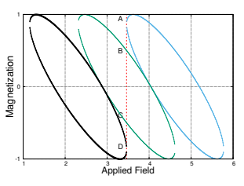

 
span across the entire system, and consequently no possibility of macroscopic jumps in magnetization, hence no possibility of critical behavior. Fig. 14 shows the trajectory of the fraction of spins at the second state in increasing and decreasing field in the 2D lattice at high dilution v0 = 0.8 and at J = 5.0, and Fig. 15 shows the magnetization plot in a 2D lattice at the same values v0 = 0.8 and at J = 5.0. As shown in Fig. 14, the trajectory of the system in increasing field as well as in decreasing field consists of two peaks. It starts with the big-

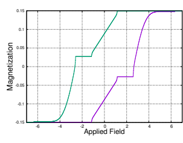

ger peak and then the smaller peak. The bigger peaks in the increasing and decreasing field overlapped with each other. This can be understood as follows.

In Fig. 16 we plotted Fig. 14 (in increasing field)
together with the random field profile given by Eq. (7) at J = 5.0. The green curve is the random field profile for spins with all nearest neighbors as vacancies and the violet curve is that for spins with one nearest neighbor in the first state and the other three as vacancies. In the increasing field, the dynamics start when spins with all nearest neighbors as vacancies start to flip from first state to the second state. This occurs at a field value h = −JPcos θj − √1
(1−cos2 π/3)
≈ −1.154 with cos θj = Sb. It is clearly seen from Fig. 16 that the bigger peak occurs due to the flipping of these isolated spins to the second state. Since these spins can flip independently from each other, their response to the field in increasing and decreasing trajectory is exactly the same. This explains the overlap of the bigger peak in increasing and decreasing field. The maximum value of the peak also occurs at a field value where the range of random fields accessible to these spins at the second state is maximum (green curve in Fig. 16).

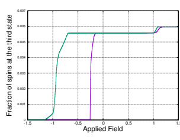 

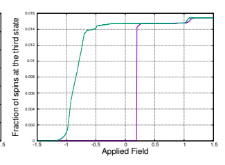 
At h = √1
(1−cos2 π/3)
= 1.154, no such spins remained in the second state and all of them had flipped to the third state. Similarly, the lower hysteresis loop in Fig. 15 below the plateau is due to the flipping of these spins from the second state to the third state. As the field is increased from h = 1.154, no spins flip until the point where spins with one nearest neighbor in the first state and whose remaining neighbors are vacancies start to flip at h = 2.596. This explains the presence of the plateau in the lower hysteresis loop in Fig. 15.

Similarly the plateau in the corresponding upper hysteresis curve in the reversing field can be explained from the reversed trajectory of the second state. A similar behavior is also observed in 3D lattice.

In the present work we also consider the case when the second state is an absorbing state. When a spin flipped to the absorbing state, it cannot leave the state even when the field is very strong. As such, spins in the absorbing state remained in that state throughout the entire journey of the applied field. Therefore in the increasing field spins can flip from first state to second state or from first state to third state while no spins can flip from second state to third state. Similarly, on reversing the field, spins from third state can flip to either second or first state while no spins can flip from second state to first state. We observed that the jump in magnetization, and hence the critical behavior of the system, occurs only in the increasing field. This is expected because when a spin flips in the increasing field it also causes an avalanche of flipped spins. On reversing the field, the spin cannot flip back unless the neighbors are flipped first. If a neighbor of a spin flipped to the absorbing state after the spin had flipped to the third state, then on reversing the field, the spin cannot flip back because its neighbor remained in the second state. Such a spin can flip back only by the influence of the field. And as the field is continuously varied, the spin of interest will flip back to the second state. Therefore, the presence of an absorbing state in our model prevents the occurrence of avalanches of flipped spins from the third state to the first state in the decreasing field. In Fig. 17 and Fig. 18 we plot the trajectory of the fraction of spins at the third state in the increasing as well as decreasing field in the 2D and 3D lattices, respectively, when the second state is an absorbing state at J = 0.3. As shown in the graphs, the hysteresis loops are asymmetric and have the wasp-waisted shape.

## Iv Discussion And Conclusions

We have presented in this work the numerical study of the zero temperature hysteresis of the random field 3-state clock model in two and three dimensional lattices and also incorporated the effect on the hysteresis loops when dilution and an absorbing state are present in the system. In this study, we observed that the presence of quenched disorder in the system has a strong effect on the shape of hysteresis loops as well as on its critical behavior. The shape of hysteresis loop is not universal; nonetheless, it has significance as it measures the amount of memory stored in the system. The presence of dilution breaks the system into isolated clusters of spins. The spins in this case act almost independently from each other. In the low dilution limit, the behavior of the model is qualitatively similar to the undiluted model. At high dilution, the model behaves differently. For example, as the field is increasing slowly from h = −∞ to h = ∞,
we found no first order jump in the magnetization.

The presence of dilution prevents the formation of an avalanche that would span across the system.

In the presence of an absorbing state, the critical behavior of the system is seen only in the increasing field, disappearing when the field is decreased slowly from h = ∞. The hysteresis loops in this case are asymmetrical and acquire a wasp-waisted shape. These loops are observed in many diverse systems, for example in magnetic rocks [14], shape memory alloy [15], martensites [16], etc. We have also studied the cases when θc(= −θa) takes any value 0 < θc *< π/*3. We observed that as θc is varied continuously from π/3 to zero, the range of Jc decreases towards Jc = 0 in 2D as well as in 3D lattice. The behavior of the model is qualitatively similar, though the distribution of random fields is drastically different in each case. We hope the work presented in this paper motivates further studies with more refined analysis.

[1] *The Science of Hysteresis*, edited by G
Bertotti and I Mayergoyz, Academic Press, Amsterdam, (2006).

[2] A P Young, *Spin glasses and random fields*,
World scientific, Singapore, (1997).

[3] A Mosder, K Takano, D T Margulies, et al.,
Magnetic recording: Advancing into the future, J. Phys. D., 35, R157, (2002).

[4] A Ali, T Shah, R Ullah, et al., *Review on recent progress in magnetic nano particles: Synthesis, Characterization and diverse applications*, Frontiers in Chemistry, 9, (2021).
[5] J I Martin, J Nogues, K Liu, J L Vicent, I
K Schuller, *Ordered magnetic nano structures:* fabrication and properties, J. Magn. Magn.

Mater., 256, 449, (2003).

[6] J P Sethna, K Dahmen, S Kartha, et al., Hysteresis and hierarchies: Dynamics of disorder-driven first-order phase transformations, Phys. Rev. Lett., 70, 3347, (1993).

[7] E Vives, J Goicoechea, J Ortin, A Planes, *Universality in models for disorder-induced phase* transitions, Phys. Rev. E, 52, R5, (1995).

[8] X P Qin, B Zheng, N J Zhou, Depinning phase transition in the two dimensional clock model with quenched randomness, Phys. Rev. E, 86, 031129, (2012).

[9] O D R Salmon, F D Nobre, Anisotropic fourstate clock model in the presence of random fields, Phys. Rev. E, 93, 022125, (2016).

[10] P Shukla, R S Kharwanlang, *Hysteresis* in random-field XY and Heisenberg models:
Mean-field theory and simulations at zero temperature, Phys. Rev. E, 81, 031106 (2010).

[11] P Shukla, R S Kharwanlang, *Critical hysteresis in random-field XY and Heisenberg models*,
Phys. Rev. E, 83, 011121 (2011).

[12] J Marro, R Dickman, *Non-equilibrium phase* transitions in lattice model, Cambridge University Press, Cambridge, (1999).

[13] H Hinrichsen, Nonequilibrium critical phenomena and phase transitions into the absorbing states, Adv. Phys., 49, 815, (2000).

[14] A P Roberts, C R Pike, K L Verosub, *First* order reversal curve diagrams: A new tool for characterizing magnetic properties of natural sample, J. Geophys. Res., 105, 28461, (2000).

[15] L Straka, O Heczko, N Lanska, *Magnetic properties of various martensitic phases in Ni-MnGa alloy*, IEEE Trans. Magn., 38, 5, (2002).

[16] J Goicoechea, J Ortin, *A random field 3-*
state spin model to simulate hysteresis and avalanches in martensitic transformations, J. Phys. IV (France), 05, C2, (1995).