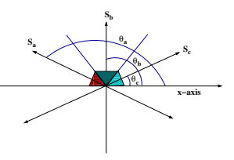
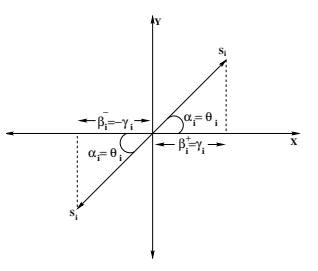
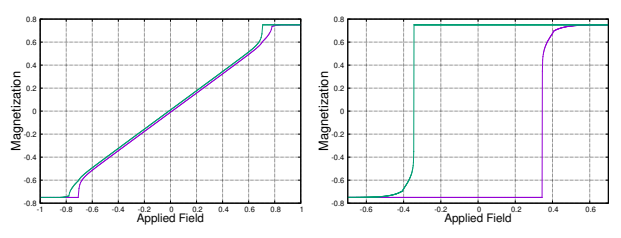
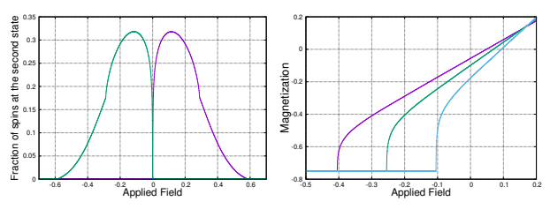
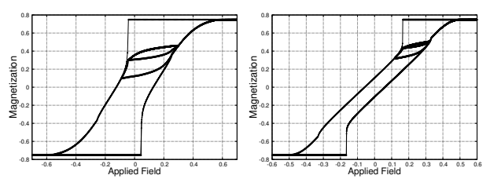
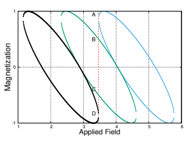
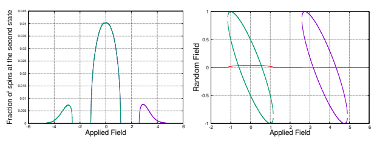

Received: 06 February 2023, Accepted: 05 May 2023 Edited by: S.A. Cannas Licence: Creative Commons Attribution 4.0 DOI: https://doi.org/10.4279/PIP.150003

The image is a screenshot of a scientific paper titled "Study of hysteresis in the ferromagnetic random field 3-state clock model in two and three dimensional periodic lattices at zero temperature and in the presence of dilution and an absorbing state". The paper is published on the website www.papersinphysics.org, as indicated by the URL in the top left corner. The ISSN number for the journal is provided as 1852-4249.

The main body of the image contains the abstract of the paper, which discusses the study of hysteresis in a specific type of spin model called the ferromagnetic random field 3-state clock model. This model is analyzed in two and three-dimensional periodic lattices at zero temperature and under the influence of a driving field. The abstract mentions that the on-site quenched disorders are continuous and drawn from a uniform distribution. It also states that the effects of disorder on the dynamics of the model and hence on the shape of the hysteresis loops are numerically analyzed. Additionally, the paper studies the model in the presence of dilution and an absorbing state.

The image also includes a figure (0_image_0.png) which is likely to be related to the content of the paper but the details of the figure are not described in the text provided. The abstract concludes with a brief summary of the paper's focus, which is on the analysis of the shape of hysteresis loops rather than estimating the value of the critical point Jc. The shape of the hysteresis loop is mentioned to have practical importance as it relates directly to the dissipation of energy in the system.

Study of hysteresis in the ferromagnetic random field 3-state clock model in two and three dimensional periodic lattices at zero temperature and in the presence of dilution and an absorbing state

## Elisheba Syiem1, R. S. Kharwanlang1∗

We numerically study hysteresis in the ferromagnetic random field 3-state clock model in two and three dimensional periodic lattices at zero temperature and in the zero frequency limit of the driving field. The on-site quenched disorders are continuous and are drawn from a uniform distribution. We numerically analyzed the effects of disorder on the dynamics of the model and hence on the shape of the hysteresis loops. We also study the model in the presence of dilution and an absorbing state.

## I Introduction

Hysteresis in quenched disordered systems has been the subject of numerous research studies over the past years [1, 2]. These studies are crucial because they offer a wealth of insights into the rich field of phenomena associated with nonlinear and random systems, and they also have numerous practical applications, for example in the magnetic recording industry [3–5]. Systems with quenched disorder often possess large number of metastable states that are separated from each other by energy barriers much larger than the thermal energy. The barriers have a distribution of heights that depends strongly on the details of the system. The metastable states correspond to local minima in the free-energy landscape of the system. The system remains trapped in a local minimum for a long time and is unable to attain thermal equilibrium over the practical time scale of interest. However the system can be driven from one metastable state to another by the applied external field. As the field is varied continuously, the response of the system consists of irregular jumps arising from the non-uniformity of barrier heights. This gives rise to Barkhausen noise. The non-equilibrium random-field Ising model at zero temperature was proposed by Sethna [6] to study hysteresis and phase transitions in systems with quenched disorder. The disorder in their model is characterized by on-site quenched random fields having a Gaussian distribution with mean value zero and standard deviation σ. The model is able not only to reproduce hysteresis loops that resemble the observed experimental loops but also provide an understanding of other aspects associated with it, for example, the Barkhausen noise, return point memory etc. The model also exhibits a nonequilibrium critical point σ = σc, h = hc at which the Barkhausen jumps become scale invariant. For σ < σc, there is a first order jump in the magnetization on each half of the hysteresis loop. As σ is increased, the size of the jump decreases continuously to zero at σc. In addition to this model, other spin models have also been formulated to study hysteresis and phase transitions in systems with quenched randomness [7–11]. The present work studies the zero temperature hysteresis in the random field 3state clock model and in the limit of zero frequency of the driving field. In our model the random field has a fixed magnitude, so we vary the ferromagnetic interaction J. We found that the response of a system to an applied field in the high J limit (low disorder) consists of first order jumps in the magnetization. As J is decreased, the size of the jump decreases gradually to zero at a particular value J = Jc and h = hc. The point (Jc, hc) marks the existence of a non-equilibrium critical point of the model. In the present work we focus on the analysis of the shape of hysteresis loops rather than estimating the value of the critical point Jc. The shape of the hysteresis loop has practical importance as it relates directly to the dissipation of energy in the system. We also found that at very high value of J, spins flipped directly from first state to third state and no spins flipped to the second state as the field was varied continuously from h = −∞ to h = ∞. In the present work we also study the effect on the hysteresis loop when dilution and an absorbing state are incorporated into the system.

An absorbing state is a state in which the spin degrees of freedom of the system remain frozen over the practical time scale of interest [12, 13]. In the present work, the second state is considered as an absorbing state. As the field is increased gradually from sufficiently large negative value, spins flipped from the first state to the second state or to the third state. The spins that had flipped to the second state remained frozen and could not leave the state throughout the entire journey of the applied field.

## Ii Model

The model is defined by the Hamiltonian,

$$H=-J\sum_{i,j}\vec{S_{i}}.\vec{S_{j}}-\sum_{i}\vec{h_{i}}.\vec{S_{i}}-\vec{h}.\sum_{i}\vec{S_{i}}\tag{1}$$

where S⃗iis a 2-component unit spin vector located at the site i. S⃗i can point along any of the three directions defined by the angles θ = θa, θ = θb and θ = θc that the spin vector makes with the
+x-axis. We set 2π/3 < θa ≤ π, π/3 < θb ≤ 2π/3, and 0 ≤ θc ≤ π/3 as shown in Fig. 1 below. At each site i there is a 2-component quenched random field unit vector ⃗hi. The vector ⃗hiis assumed to be continuous and it is defined by an angle αi

The image is a diagram representing the states of spins in a magnetic system. It shows three spin states, Sa, Sb, and Sc, each corresponding to a different angle θa, θb, and θc that the spin vector makes with the x-axis. The diagram is structured with axes labeled x-axis and y-axis, and the spin states are represented by colored regions (red, green, and blue) within the diagram. The text provides context for the model being described, including the Hamiltonian, the concept of an absorbing state, and the equations governing the behavior of the spins.
 

(0 < αi < π) that it makes with the +x-axis.

The summation in the first term is over the nearest neighbors of the spin S⃗i. The uniform external field h, |
⃗h| = h is applied along the x-axis. J is the ferromagnetic interaction between spins (J > 0).

The first and the last terms in Eq. (1) favor parallel alignment of spins while the second term introduces disorder in the system, thereby making each spin point in the direction of the random field ⃗hi.

Writing Eq. (1) in terms of the effective local field
⃗fi acting at each site i,

$$\begin{array}{r c l}{{H}}&{{=}}&{{-\sum_{i}\vec{f}_{i}(t).\vec{S}_{i}(t);}}\\ {{}}&{{}}&{{}}\\ {{\vec{f}_{i}(t)}}&{{=}}&{{J\sum_{j}\vec{S}_{j}(t)+\vec{h}_{i}+\vec{h}}}&{{\quad\quad(2)}}\end{array}$$

At zero temperature, the energy of a spin, and hence that of the entire system, is minimum when each spin points along the direction of the local field ⃗fi at its site. Since |S⃗i| = 1, the state of each spin in the lattice at any applied field h is wholly ascertained by the direction ˆfi of the local field ⃗fi.

Let S
x j and S
y j denote the components of the spin S⃗j along the x-axis and the y-axis respectively and similarly let h x i and h y i be the components of the vector ⃗hi along the x-axis and the y-axis respectively. The x- component of ˆfiis

$$\left({\mathrm{3}}\right)$$
$$\cos\theta_{i}=\tag{3}$$ $$J\sum_{j}S_{j}^{x}+h_{i}^{x}+h$$ $$[(J\sum_{j}S_{j}^{x}+h_{i}^{x}+h)^{2}+(J\sum_{j}S_{j}^{y}+h_{i}^{y})^{2}]^{1/2}\,.$$

We are interested in looking only at the ordering of the spins along the field direction. Assuming no global ordering along the y-axis, we set Pj S
y j = 0.

Writing Eq. (3) in terms of the angles θ and α that the spin vector and the random field vector make with the +x-axis, we have

cos θi =
$$\begin{array}{c}J\sum_{j}\cos\theta_{j}+h+\cos\alpha_{i}\\ \cos\theta_{j}+h)^{2}+2(J\sum_{j}\cos\theta_{j}+h)\cos\alpha_{i}+1]^{1/2}\end{array}$$
[(JPj
(4)
As the field is continuously varied from h = −∞
to h = ∞, cos θiin Eq. (4) can take any values from −1 to +1. Since in our model the spin can take only three states, we set the states of the spin as follows:

$$\cos\theta_{i}=\left\{\begin{array}{l l}{{S_{a}=\cos\theta_{a}~{\mathrm{for}}}}\\ {{S_{b}=\cos\theta_{b}~{\mathrm{for}}}}\\ {{S_{c}=\cos\theta_{c}~{\mathrm{for}}}}\end{array}\right.$$

Sa = cos θa for cos π ≤ cos θi < cos(2π/3)
Sb = cos θb for cos(2π/3) ≤ cos θi < cos π/3 Sc = cos θc for cos π/3 ≤ cos θi ≤ cos 0
(5)
At any applied field value h, the state of a spin is represented either by a single projection Sa = cos θa or Sb = cos θb or Sc = cos θc. Furthermore, in a given state at h, Sa or Sb or Sc is a representative of the various projections/directions that the spin vector makes with the field direction in that state at h. Evidently, a spin that is stable in a given state at h can have a range of minimum energy values rather than a single value. For example, a spin that is stable at the third state Sc at h has minimum energy value ϵiin the range − cos θi ≤
ϵi ≤ − cos θi cos π/3. The range of ϵiis independent of the dimension of the lattice but the values of ϵiin the corresponding range are different for different dimensions of the lattice. For example in a cubic lattice (3D) the range of ϵiis the same as that of a square lattice (2D) but the values of ϵi are different from that of a square lattice as given by Eq. (4).

Rewriting Eq. (4),

$$\gamma_{i}(h)=\frac{A+\beta_{i}}{(A^{2}+2A\beta_{i}+1)^{\frac{1}{2}}}\tag{6}$$  where $A=J\sum_{j}\gamma_{j}(h)+h$; $\gamma_{i}=\cos\theta_{i}$; $\beta_{i}=\cos\alpha_{i}$; and $-1\leq\gamma_{i}\leq1$; $-1\leq\beta_{i}\leq1$.  Starting from a sufficiently large and negative ap 
Starting from a sufficiently large and negative applied field when all spins are in the first state Sa,

The image is a scientific diagram that represents the concept of spin states in a lattice under the influence of an external magnetic field. The diagram shows three spin states, labeled as Sa, Sb, and Sc, which are represented by arrows pointing in different directions on the x-y plane. Each arrow has a corresponding angle θi associated with it, indicating the direction of the spin. The diagram also includes equations and text that describe the dynamics of the spins and the energy landscape of the system. The text explains how the spins are relaxed along the direction of their respective local fields to reach a stable state, and how the fraction of unstable spins determines the size of the avalanche. The image is a visual representation of the mathematical model described in the text.

we increase the field in small steps. At each step, the dynamics given by Eq. (6) is applied recursively keeping h constant, until each spin in the lattice is oriented along the direction of the local field at its site and in line with Eq. (5). This results in a configuration of spins in the lattice consisting of spins that are stable in the first state Sa or the second state Sb or the third state Sc. It is a local minimum of the energy of the system within the approximation explained above and it represents a stable state of the system at zero temperature. At non-zero temperature it would become a metastable state if the barriers of thermal fluctuations are smaller than that of the quenched random fields. If, after a spin is relaxed, the energy at the neighboring spin increases, then the neighbor is relaxed in the next step. Holding h constant, we allow this process to continue till all spins are relaxed along the directions of their respective local fields. The fraction of unstable spins that are relaxed during this process determines the size of the avalanche. Keeping the applied field constant during the avalanche justifies the assumption that the frequency of the applied field is infinitely slow and that the spins are relaxed infinitely quickly as compared to the time of variation of the field. Writing Eq. (6) in terms of the random fields βi, 15  / 

$$\beta_{i}^{\pm}(\gamma_{i},A)=\tag{7}$$ $$-A(1-\gamma_{i}^{2})\pm\gamma_{i}(1-A^{2}+A^{2}\gamma_{i}^{2})^{\frac{1}{2}}$$  with $-(1-\gamma_{i}^{2})^{-\frac{1}{2}}\leq A\leq(1-\gamma_{i}^{2})^{-\frac{1}{2}}$. It is easy to see that,
$$\beta_{i}^{+}(\gamma_{i},A)=\beta_{i}^{-}(-\gamma_{i},A)$$ $$\beta_{i}^{+}(\gamma_{i},A)=-\beta_{i}^{-}(\gamma_{i},-A)\tag{8}$$

The geometrical picture of β
+ and β
− is shown in Fig. 2. For example, we consider A = 0, under this case, Eq. (6) gives θi = αi. This may be expected because a spin can now lower its energy only if it is aligned along the direction of the random field. Fig. 2 shows the projections β
+ and β
−
along the field direction. We choose to work with β
+
i
. For any given A value, it is seen from Eq. (7)
that β
+
j
(γj ) > β+
i
(γk) for γj > γk. In the present work, the random fields −∆ < β+
i < ∆ are continuous and are drawn from a uniform probability distribution,

$$p(\beta_{i})=\left\{\begin{array}{l l}{{\frac{1}{2\Delta}}}&{{\mathrm{if~-\Delta<\beta_{i}<\Delta}}}\\ {{0}}&{{\mathrm{otherwise}}}\end{array}\right.$$

## Iii Simulations

We increased the field slowly from h = −∞ to h = ∞ in small steps. Successively at each field step we run the dynamics described by Eq. (6) until all spins are stable. This drives the system through a succession of local minima. If on reversing the field from h = ∞, the system visited a sequence consisting of different local minima, the system is said to exhibit hysteresis. In the present work we are interested in studying the zero temperature hysteresis loops of the model in the two dimensional square lattice as well as in the three dimensional cubic lattice and in the presence of dilution and an absorbing state. We run the simulations with L = 3000 spins for 2D lattice and L = 1000 spins for 3D lattice. At each value of the applied field we averaged the magnetization per spin of the system over 10000 realizations of the random fields. We estimated the statistical error involved in our numerical calculations at several values of h. At each

The image is a scientific figure that shows the magnetization of a spin system as a function of the applied magnetic field. The figure is divided into two parts, with the left side showing the magnetization for a 2D lattice and the right side showing the magnetization for a 3D lattice. Each part has a graph with the x-axis representing the applied field and the y-axis representing the magnetization per spin.

The graphs are color-coded to represent different states of the spins: blue for the first state Sa, green for the second state Sb, and purple for the third state Sc. The hysteresis loops are shown in different colors, with the wasp-waisted loops at low J values and normal hysteresis loops at higher J values.

The text accompanying the figure provides context and explains the significance of the results. It discusses the concept of hysteresis and how it arises from the sequence of local minima visited by the system as the field is reversed. The text also describes the simulation method used to obtain the data, including the number of spins, the averaging over realizations of random fields, and the estimation of statistical error.

The figure is meant to visually represent the behavior of the spin system under varying conditions of applied field and disorder (tuned by J). The results suggest that the system exhibits a transition from a wasp-waisted hysteresis loop to a normal hysteresis loop as J is increased. The critical value Jc is identified as the non-equilibrium critical point of the model, beyond which the first-order jump in magnetization disappears.

$$\left({\mathfrak{g}}\right)$$

h value, we binned the 10000 data of average magnetization into 100 bins, where each bin contains 100 data. From each bin we compute the average magnetization and estimate the error by calculating the standard deviation with respect to the average magnetization at h. The error computed is approximately 0.000367. At the starting field h = −∞, all spins are stable in the first state Sa. On increasing the field slowly, at some value h of the applied field, some spins may become unstable. This arises because the direction of the local fields at their sites no longer points along the directions relevant to state Sa. We call them the seed spins. The seed spins are relaxed either to the second state Sb or to the third state Sc depending on the direction of the local fields at their sites. The neighbors of seed spins may find themselves in a more favored position to become unstable and they are also relaxed. This leads to an avalanche of flipped spin at h. After the avalanche had stopped, we calculated the magnetization per spin at that value of the applied field. We found that at very small values of J, the hysteresis loop area is very small and has a constriction along the middle portion of the trajectory. These loops are called wasp-waisted hysteresis loops. The small hysteresis loop area can be attributed to the fact that at very low J, the disorder in the system is very strong and the spins act almost independently from each other.

Fig. 3 shows the magnetization of the system for a 2D lattice with L = 3000 at J = 0.1, and Fig. 4 shows the corresponding magnetization for

a 3D lattice with L = 1000 at J = 0.1. As J is increased further, the wasp-waisted shape of the loop disappears and we get the normal hysteresis loops as shown in Fig. 5 and Fig. 6. In Fig. 7 and Fig. 8, we plotted the hysteresis curves of the second state Sb in increasing (blue curve) and decreasing field (green curve) in 2D and 3D lattices and at J = 0.385 and J = 0.257, respectively. The separation of the two curves starts at h = 0. This can be understood as follows:
The field value at which spins start flipping from the first state Sa in the increasing field is given by h = −JP4 i=1 Sa − √1
(1−cos2 π/3)
and on decreasing the field from h = +∞ the dynamics starts at h
= −JP4 i=1 Sc + √1
(1−cos2 π/3)
. The seed spin in the increasing field has all nearest neighbors in the first state Sa while on decreasing the field, the neighbors of the seed spin are all in the third state Sc. Since Sa = −Sc, then from the above two equations we see that the separation starts at h = 0. The separation of the two curves increases as J is increased.

In our model the disorder is tuned by the ferromagnetic interaction J. As J increases, the disorder in the system decreases. We found that at high values of J, there is a first order jump in the magnetization and as we lower J the size of the jump decreases continuously to zero at a critical value Jc.

Jc marks the non-equilibrium critical point of the model. In the present work we are not in a position to determine the exact value of Jc numerically, but instead we identify the range within whichuccession of local minima. If on reversing the field from h = ∞, the system visited a sequence consisting of different local minima, the system is said to exhibit hysteresis. In the present work we are interested in studying the zero temperature hysteresis loops of the model in the two dimensional square lattice as well as in the three dimensional cubic lattice and in the presence of dilution and an absorbing state. We run the simulations with L = 3000 spins for 2D lattice and L = 1000 spins for 3D lattice. At each value of the applied field we averaged the magnetization per spin of the system over 10000 realizations of the random fields. We estimated the statistical error involved in our numerical calculations at several values of h. At each

$$\left({\mathfrak{g}}\right)$$

h value, we binned the 10000 data of average magnetization into 100 bins, where each bin contains 100 data. From each bin we compute the average magnetization and estimate the error by calculating the standard deviation with respect to the average magnetization at h. The error computed is approximately 0.000367. At the starting field h = −∞, all spins are stable in the first state Sa. On increasing the field slowly, at some value h of the applied field, some spins may become unstable. This arises because the direction of the local fields at their sites no longer points along the directions relevant to state Sa. We call them the seed spins. The seed spins are relaxed either to the second state Sb or to the third state Sc depending on the direction of the local fields at their sites. The neighbors of seed spins may find themselves in a more favored position to become unstable and they are also relaxed. This leads to an avalanche of flipped spin at h. After the avalanche had stopped, we calculated the magnetization per spin at that value of the applied field. We found that at very small values of J, the hysteresis loop area is very small and has a constriction along the middle portion of the trajectory. These loops are called wasp-waisted hysteresis loops. The small hysteresis loop area can be attributed to the fact that at very low J, the disorder in the system is very strong and the spins act almost independently from each other.

Fig. 3 shows the magnetization of the system for a 2D lattice with L = 3000 at J = 0.1, and Fig. 4 shows the corresponding magnetization for

The image is a composite of four graphs, each representing the magnetization of a spin system as a function of an applied magnetic field. The graphs are labeled from 3 to 8, indicating their sequence in the context provided. Each graph shows a hysteresis loop, which is a plot of magnetization versus magnetic field strength. The loops are characterized by the area enclosed within them, which represents the energy lost when the magnetic field is cycled through its range.

Graphs 3 and 4 show the magnetization for a two-dimensional (2D) lattice with L = 3000 spins at J = 0.1, where J represents the ferromagnetic interaction strength. Graphs 5 and 6 depict the magnetization for a three-dimensional (3D) lattice with L = 1000 spins at J = 0.1. Graphs 7 and 8 show the hysteresis curves of the second state (Sb) in increasing (blue curve) and decreasing field (green curve) in 2D and 3D lattices at J = 0.385 and J = 0.257, respectively.

The color scheme of the graphs is primarily green and blue, with the green line representing the increasing field curve and the blue line representing the decreasing field curve. The background is white, and the axes are labeled with "Applied Field" on the x-axis and "Magnetization" on the y-axis. The text accompanying the images provides context about the study of zero-temperature hysteresis loops in a spin model on a square lattice and cubic lattice, considering disorder and an absorbing state. It mentions the method of averaging magnetization over realizations of random fields, statistical error estimation, and the observation of wasp-waisted hysteresis loops at low J values, which become normal hysteresis loops as J increases. The text also discusses the critical point of the model, Jc, at which the size of the first-order jump in magnetization becomes zero.

a 3D lattice with L = 1000 at J = 0.1. As J is increased further, the wasp-waisted shape of the loop disappears and we get the normal hysteresis loops as shown in Fig. 5 and Fig. 6. In Fig. 7 and Fig. 8, we plotted the hysteresis curves of the second state Sb in increasing (blue curve) and decreasing field (green curve) in 2D and 3D lattices and at J = 0.385 and J = 0.257, respectively. The separation of the two curves starts at h = 0. This can be understood as follows:
The field value at which spins start flipping from the first state Sa in the increasing field is given by h = −JP4 i=1 Sa − √1
(1−cos2 π/3)
and on decreasing the field from h = +∞ the dynamics starts at h
= −JP4 i=1 Sc + √1
(1−cos2 π/3)
. The seed spin in the increasing field has all nearest neighbors in the first state Sa while on decreasing the field, the neighbors of the seed spin are all in the third state Sc. Since Sa = −Sc, then from the above two equations we see that the separation starts at h = 0. The separation of the two curves increases as J is increased.

In our model the disorder is tuned by the ferromagnetic interaction J. As J increases, the disorder in the system decreases. We found that at high values of J, there is a first order jump in the magnetization and as we lower J the size of the jump decreases continuously to zero at a critical value Jc.

Jc marks the non-equilibrium critical point of the model. In the present work we are not in a position to determine the exact value of Jc numerically, but instead we identify the range within which the value of Jc lies. In Fig. 9 we show the hysteresis curves in increasing field for 2D lattice at J = 0.25
(violet), J = 0.3 (green) and J = 0.35 (light blue).

The hysteresis curve at J = 0.25 is continuous and the curve at J = 0.35 has a discontinuity. The corresponding value of Jc in 2D appears to lie between J = 0.25 and J = 0.35. Fig. 10 shows a similar behavior in 3D lattice for J = 0.1 (violet), J = 0.15
(green) and J = 0.2 (light blue). The value of Jc in this case appears to lie between J = .15 and J = .2.

The value of Jc in 3D is found to be lower than that in 2D. In Fig. 11 we plotted the minor hysteresis 

The image is a series of scientific graphs and plots related to the study of hysteresis in magnetic materials. The first graph shows the magnetization versus applied field for different values of J, with the hysteresis loops clearly marked. The second graph appears to be a minor hysteresis loop within a major hysteresis loop, indicating return point memory. The third graph shows the random field profile for spins in a 2D lattice at high values of J, where seed spins flip to the second state and cause avalanches across the system. The fourth graph seems to be a continuation of the previous one, showing the behavior of the model at extreme dilution. The colors used are primarily shades of blue, green, and purple, with the text in black. The images are labeled with numbers and titles, suggesting they are part of a larger research paper or presentation.

 15  / 

loops of the model along with the major hysteresis loop for the 2D lattice at J = 0.4. We increase the field slowly from h = −0.7 and reversed the field at a value h = 0.3 before the magnetization is saturated. The reversed curve touches the return major loop at h = −0.09. On increasing the field again from h = −0.09, the curve meets the point where it was last reversed at h = 0.3. A minor loop within a minor loop is also traced in Fig. 11. This shows that the model exhibits return point memory. The minor hysteresis loops for the 3D lattice at J = 0.22 is shown in Fig. 12.

At high value of J, for example at J = 1.54 in 2D lattice, spins from the first state flipped directly to the third state and no spin flipped to the second state. This can be explained below. In Fig. 13 we traced the random field profile from Eq. (7)
for spins in the 2D lattice and at J = 1.54. In this plot, for example at the h value along the red vertical line, CD gives the range of random fields where spins with one nearest neighbor in second state Sb and the remaining three in the first state Sa remain in the first state Sa at h. The range 

 

BC and AB give the values of random fields where such spins can flip to second state Sb and third state Sc at h respectively. As we increased the field slowly at J = 1.54, some spins with all neighbors in the first state Sa start flipping to second state at hs = −JP4 i=1 Sa − √1
(1−cos2 π/3)
≈ 3.465. This is shown in Fig. 13 when the red vertical line touches the light blue curve at h ≈ 3.465. We call these spins seed spins. The random field profile of seed spins is governed by the light blue curve in Fig. 13. After a seed spin is flipped, it may cause one of its neighbors to flip to third state if the random field of the neighbor is in the range AB. Once flipped to third state, the neighbor in question can then cause an avalanche that spans across the entire system, where spins can flip directly from the first state to the third state. This is because, at h = hs and J = 1.54, it can be seen from Eq. (6) that a spin with one neighbor in the third state and the remaining three neighbors in first state can always flip from the first state to the third state even if it has the minimum random field value β = −1. A
similar behavior is also seen in 3D lattice.

## I Hysteresis In The Presence Of Dilution And An Absorbing State

On diluting the lattice, most spins find themselves surrounded by vacancies. Vacancies are lattice sites that are not occupied by spins. At low dilution we observed that the behavior of the model is similar to that of the non-dilute model. In the limit of extreme dilution, hysteresis starts at a higher value of J as compared to that when there is no dilution. This is expected because the system is now punctuated by large numbers of isolated clusters of spins. These spins behave independently, as the field is continuously changing. In this limit there is no possibility of occurrence of avalanches that 

 
span across the entire system, and consequently no possibility of macroscopic jumps in magnetization, hence no possibility of critical behavior. the value of Jc lies. In Fig. 9 we show the hysteresis curves in increasing field for 2D lattice at J = 0.25
(violet), J = 0.3 (green) and J = 0.35 (light blue).

The hysteresis curve at J = 0.25 is continuous and the curve at J = 0.35 has a discontinuity. The corresponding value of Jc in 2D appears to lie between J = 0.25 and J = 0.35. Fig. 10 shows a similar behavior in 3D lattice for J = 0.1 (violet), J = 0.15
(green) and J = 0.2 (light blue). The value of Jc in this case appears to lie between J = .15 and J = .2.

The value of Jc in 3D is found to be lower than that in 2D. In Fig. 11 we plotted the minor hysteresis 

 15  / 

The image is a compilation of four graphs, each representing different aspects of hysteresis behavior in a lattice model with varying parameters. The first graph (Fig. 9) shows the hysteresis curves for a 2D lattice at three different values of J (exchange interaction parameter). The second graph (Fig. 10) is similar but for a 3D lattice. Both graphs indicate that as J increases, the hysteresis loop becomes more pronounced and the value of Jc (critical value of J) shifts to higher values.

The third graph (Fig. 11) depicts the minor hysteresis loops for a 2D lattice at a higher value of J. It shows the behavior of the model when the field is reversed at a certain value, and the curve meets the point where it was last reversed before saturation. This graph also includes minor loops within minor loops, indicating return point memory.

The fourth graph (Fig. 13) is a random field profile for spins in a 2D lattice at a high value of J. It illustrates the range of random fields where spins remain in the first state or flip to the second or third state as the field is increased.

The text accompanying the images provides context and explains the behavior observed in the graphs. It discusses the effect of dilution on the hysteresis behavior and mentions the occurrence of avalanches in the system. The colors used in the graphs are not specified, but typically such scientific figures use a combination of black text and lines on a white background for clarity.

loops of the model along with the major hysteresis loop for the 2D lattice at J = 0.4. We increase the field slowly from h = −0.7 and reversed the field at a value h = 0.3 before the magnetization is saturated. The reversed curve touches the return major loop at h = −0.09. On increasing the field again from h = −0.09, the curve meets the point where it was last reversed at h = 0.3. A minor loop within a minor loop is also traced in Fig. 11. This shows that the model exhibits return point memory. The minor hysteresis loops for the 3D lattice at J = 0.22 is shown in Fig. 12.

At high value of J, for example at J = 1.54 in 2D lattice, spins from the first state flipped directly to the third state and no spin flipped to the second state. This can be explained below. In Fig. 13 we traced the random field profile from Eq. (7)
for spins in the 2D lattice and at J = 1.54. In this plot, for example at the h value along the red vertical line, CD gives the range of random fields where spins with one nearest neighbor in second state Sb and the remaining three in the first state Sa remain in the first state Sa at h. The range 

 

BC and AB give the values of random fields where such spins can flip to second state Sb and third state Sc at h respectively. As we increased the field slowly at J = 1.54, some spins with all neighbors in the first state Sa start flipping to second state at hs = −JP4 i=1 Sa − √1
(1−cos2 π/3)
≈ 3.465. This is shown in Fig. 13 when the red vertical line touches the light blue curve at h ≈ 3.465. We call these spins seed spins. The random field profile of seed spins is governed by the light blue curve in Fig. 13. After a seed spin is flipped, it may cause one of its neighbors to flip to third state if the random field of the neighbor is in the range AB. Once flipped to third state, the neighbor in question can then cause an avalanche that spans across the entire system, where spins can flip directly from the first state to the third state. This is because, at h = hs and J = 1.54, it can be seen from Eq. (6) that a spin with one neighbor in the third state and the remaining three neighbors in first state can always flip from the first state to the third state even if it has the minimum random field value β = −1. A
similar behavior is also seen in 3D lattice.

## I Hysteresis In The Presence Of Dilution And An Absorbing State

On diluting the lattice, most spins find themselves surrounded by vacancies. Vacancies are lattice sites that are not occupied by spins. At low dilution we observed that the behavior of the model is similar to that of the non-dilute model. In the limit of extreme dilution, hysteresis starts at a higher value of J as compared to that when there is no dilution. This is expected because the system is now punctuated by large numbers of isolated clusters of spins. These spins behave independently, as the field is continuously changing. In this limit there is no possibility of occurrence of avalanches that 

 
span across the entire system, and consequently no possibility of macroscopic jumps in magnetization, hence no possibility of critical behavior. the value of Jc lies. In Fig. 9 we show the hysteresis curves in increasing field for 2D lattice at J = 0.25
(violet), J = 0.3 (green) and J = 0.35 (light blue).

The hysteresis curve at J = 0.25 is continuous and the curve at J = 0.35 has a discontinuity. The corresponding value of Jc in 2D appears to lie between J = 0.25 and J = 0.35. Fig. 10 shows a similar behavior in 3D lattice for J = 0.1 (violet), J = 0.15
(green) and J = 0.2 (light blue). The value of Jc in this case appears to lie between J = .15 and J = .2.

The value of Jc in 3D is found to be lower than that in 2D. In Fig. 11 we plotted the minor hysteresis 

 15  / 

loops of the model along with the major hysteresis loop for the 2D lattice at J = 0.4. We increase the field slowly from h = −0.7 and reversed the field at a value h = 0.3 before the magnetization is saturated. The reversed curve touches the return major loop at h = −0.09. On increasing the field again from h = −0.09, the curve meets the point where it was last reversed at h = 0.3. A minor loop within a minor loop is also traced in Fig. 11. This shows that the model exhibits return point memory. The minor hysteresis loops for the 3D lattice at J = 0.22 is shown in Fig. 12.

At high value of J, for example at J = 1.54 in 2D lattice, spins from the first state flipped directly to the third state and no spin flipped to the second state. This can be explained below. In Fig. 13 we traced the random field profile from Eq. (7)
for spins in the 2D lattice and at J = 1.54. In this plot, for example at the h value along the red vertical line, CD gives the range of random fields where spins with one nearest neighbor in second state Sb and the remaining three in the first state Sa remain in the first state Sa at h. The range 

The image is a scientific figure that appears to be from a research paper or presentation. It consists of multiple graphs and plots that are related to the study of hysteresis in magnetic materials, specifically in 2D and 3D lattices with varying values of J (exchange interaction parameter) and h (magnetic field). The graphs show how the fraction of spins at the second state changes as the applied field is increased or decreased.

The first graph shows the hysteresis curves for different values of J in a 2D lattice. The curves are plotted against the applied field on the x-axis and the fraction of spins at the second state on the y-axis. The hysteresis loop is traced out as the field is increased and then decreased. The value of Jc, which seems to be a critical value of J where the behavior of the system changes, is indicated to lie between J = 0.25 and J = 0.35 for the 2D lattice.

The second graph shows similar behavior for a 3D lattice, with the hysteresis loops plotted for different values of J. The value of Jc in this case lies between J = 0.15 and J = 0.2.

The third graph shows minor hysteresis loops for the 2D lattice at J = 0.4. These loops represent the behavior of the system when the field is reversed at a certain value of h before saturation.

The fourth graph shows minor hysteresis loops for the 3D lattice at J = 0.22.

The fifth graph shows the random field profile for spins in the 2D lattice at J = 1.54. This profile indicates the range of random fields where spins can remain in the first state or flip to the second or third state as the field is increased.

The text accompanying the images provides context and explains the behavior of the system under different conditions, such as dilution and the presence of an absorbing state. It also discusses the role of seed spins and avalanches in the system's behavior.
 

BC and AB give the values of random fields where such spins can flip to second state Sb and third state Sc at h respectively. As we increased the field slowly at J = 1.54, some spins with all neighbors in the first state Sa start flipping to second state at hs = −JP4 i=1 Sa − √1
(1−cos2 π/3)
≈ 3.465. This is shown in Fig. 13 when the red vertical line touches the light blue curve at h ≈ 3.465. We call these spins seed spins. The random field profile of seed spins is governed by the light blue curve in Fig. 13. After a seed spin is flipped, it may cause one of its neighbors to flip to third state if the random field of the neighbor is in the range AB. Once flipped to third state, the neighbor in question can then cause an avalanche that spans across the entire system, where spins can flip directly from the first state to the third state. This is because, at h = hs and J = 1.54, it can be seen from Eq. (6) that a spin with one neighbor in the third state and the remaining three neighbors in first state can always flip from the first state to the third state even if it has the minimum random field value β = −1. A
similar behavior is also seen in 3D lattice.

## I Hysteresis In The Presence Of Dilution And An Absorbing State

On diluting the lattice, most spins find themselves surrounded by vacancies. Vacancies are lattice sites that are not occupied by spins. At low dilution we observed that the behavior of the model is similar to that of the non-dilute model. In the limit of extreme dilution, hysteresis starts at a higher value of J as compared to that when there is no dilution. This is expected because the system is now punctuated by large numbers of isolated clusters of spins. These spins behave independently, as the field is continuously changing. In this limit there is no possibility of occurrence of avalanches that 

 
span across the entire system, and consequently no possibility of macroscopic jumps in magnetization, hence no possibility of critical behavior. the value of Jc lies. In Fig. 9 we show the hysteresis curves in increasing field for 2D lattice at J = 0.25
(violet), J = 0.3 (green) and J = 0.35 (light blue).

The hysteresis curve at J = 0.25 is continuous and the curve at J = 0.35 has a discontinuity. The corresponding value of Jc in 2D appears to lie between J = 0.25 and J = 0.35. Fig. 10 shows a similar behavior in 3D lattice for J = 0.1 (violet), J = 0.15
(green) and J = 0.2 (light blue). The value of Jc in this case appears to lie between J = .15 and J = .2.

The value of Jc in 3D is found to be lower than that in 2D. In Fig. 11 we plotted the minor hysteresis 

 15  / 

loops of the model along with the major hysteresis loop for the 2D lattice at J = 0.4. We increase the field slowly from h = −0.7 and reversed the field at a value h = 0.3 before the magnetization is saturated. The reversed curve touches the return major loop at h = −0.09. On increasing the field again from h = −0.09, the curve meets the point where it was last reversed at h = 0.3. A minor loop within a minor loop is also traced in Fig. 11. This shows that the model exhibits return point memory. The minor hysteresis loops for the 3D lattice at J = 0.22 is shown in Fig. 12.

At high value of J, for example at J = 1.54 in 2D lattice, spins from the first state flipped directly to the third state and no spin flipped to the second state. This can be explained below. In Fig. 13 we traced the random field profile from Eq. (7)
for spins in the 2D lattice and at J = 1.54. In this plot, for example at the h value along the red vertical line, CD gives the range of random fields where spins with one nearest neighbor in second state Sb and the remaining three in the first state Sa remain in the first state Sa at h. The range 

 

The image is a series of scientific graphs and diagrams related to the study of hysteresis in magnetic materials. The graphs show the relationship between magnetization and applied field strength for different values of J, which is a parameter that affects the behavior of the material. The text describes the experimental results and observations made during the study, including the behavior of the model at high values of J, the effect of dilution on the hysteresis behavior, and the presence of an absorbing state. The images include various colors such as purple, green, light blue, and red, used to distinguish between different curves and regions on the graphs. The text is technical and specific to the field of physics and materials science.

BC and AB give the values of random fields where such spins can flip to second state Sb and third state Sc at h respectively. As we increased the field slowly at J = 1.54, some spins with all neighbors in the first state Sa start flipping to second state at hs = −JP4 i=1 Sa − √1
(1−cos2 π/3)
≈ 3.465. This is shown in Fig. 13 when the red vertical line touches the light blue curve at h ≈ 3.465. We call these spins seed spins. The random field profile of seed spins is governed by the light blue curve in Fig. 13. After a seed spin is flipped, it may cause one of its neighbors to flip to third state if the random field of the neighbor is in the range AB. Once flipped to third state, the neighbor in question can then cause an avalanche that spans across the entire system, where spins can flip directly from the first state to the third state. This is because, at h = hs and J = 1.54, it can be seen from Eq. (6) that a spin with one neighbor in the third state and the remaining three neighbors in first state can always flip from the first state to the third state even if it has the minimum random field value β = −1. A
similar behavior is also seen in 3D lattice.

## I Hysteresis In The Presence Of Dilution And An Absorbing State

On diluting the lattice, most spins find themselves surrounded by vacancies. Vacancies are lattice sites that are not occupied by spins. At low dilution we observed that the behavior of the model is similar to that of the non-dilute model. In the limit of extreme dilution, hysteresis starts at a higher value of J as compared to that when there is no dilution. This is expected because the system is now punctuated by large numbers of isolated clusters of spins. These spins behave independently, as the field is continuously changing. In this limit there is no possibility of occurrence of avalanches that 

 
span across the entire system, and consequently no possibility of macroscopic jumps in magnetization, hence no possibility of critical behavior. the value of Jc lies. In Fig. 9 we show the hysteresis curves in increasing field for 2D lattice at J = 0.25
(violet), J = 0.3 (green) and J = 0.35 (light blue).

The hysteresis curve at J = 0.25 is continuous and the curve at J = 0.35 has a discontinuity. The corresponding value of Jc in 2D appears to lie between J = 0.25 and J = 0.35. Fig. 10 shows a similar behavior in 3D lattice for J = 0.1 (violet), J = 0.15
(green) and J = 0.2 (light blue). The value of Jc in this case appears to lie between J = .15 and J = .2.

The value of Jc in 3D is found to be lower than that in 2D. In Fig. 11 we plotted the minor hysteresis 

 15  / 

loops of the model along with the major hysteresis loop for the 2D lattice at J = 0.4. We increase the field slowly from h = −0.7 and reversed the field at a value h = 0.3 before the magnetization is saturated. The reversed curve touches the return major loop at h = −0.09. On increasing the field again from h = −0.09, the curve meets the point where it was last reversed at h = 0.3. A minor loop within a minor loop is also traced in Fig. 11. This shows that the model exhibits return point memory. The minor hysteresis loops for the 3D lattice at J = 0.22 is shown in Fig. 12.

At high value of J, for example at J = 1.54 in 2D lattice, spins from the first state flipped directly to the third state and no spin flipped to the second state. This can be explained below. In Fig. 13 we traced the random field profile from Eq. (7)
for spins in the 2D lattice and at J = 1.54. In this plot, for example at the h value along the red vertical line, CD gives the range of random fields where spins with one nearest neighbor in second state Sb and the remaining three in the first state Sa remain in the first state Sa at h. The range 

 

The image is a composite of four graphs, each representing hysteresis curves for different values of J (a parameter related to the density of spins in a lattice) at various levels of dilution. The graphs are labeled from Fig. 9 to Fig. 12, with two graphs on the left and two on the right.

Fig. 9 shows hysteresis curves for a 2D lattice at J = 0.25 (violet), J = 0.3 (green), and J = 0.35 (light blue). The curve at J = 0.25 is continuous, while the curve at J = 0.35 has a discontinuity. The value of Jc, which appears to lie between J = 0.25 and J = 0.35, is indicated as being lower in 3D than in 2D.

Fig. 10 displays similar behavior in a 3D lattice at J = 0.1 (violet), J = 0.15 (green), and J = 0.2 (light blue). The value of Jc in this case lies between J = 0.15 and J = 0.2, and it is found to be lower in 3D compared to 2D.

Fig. 11 shows minor hysteresis loops for a 2D lattice at J = 0.4. It includes major and minor hysteresis loops, indicating return point memory and the behavior of the model when the field is reversed.

Fig. 12 presents minor hysteresis loops for a 3D lattice at J = 0.22. It demonstrates the behavior of the model under the same conditions as Fig. 11 but for a 3D lattice.

The colors used in the graphs are consistent across all figures, with violet, green, and light blue representing different values of J. The text accompanying the images provides context and explains the behavior of the model under varying conditions of J and dilution.

BC and AB give the values of random fields where such spins can flip to second state Sb and third state Sc at h respectively. As we increased the field slowly at J = 1.54, some spins with all neighbors in the first state Sa start flipping to second state at hs = −JP4 i=1 Sa − √1
(1−cos2 π/3)
≈ 3.465. This is shown in Fig. 13 when the red vertical line touches the light blue curve at h ≈ 3.465. We call these spins seed spins. The random field profile of seed spins is governed by the light blue curve in Fig. 13. After a seed spin is flipped, it may cause one of its neighbors to flip to third state if the random field of the neighbor is in the range AB. Once flipped to third state, the neighbor in question can then cause an avalanche that spans across the entire system, where spins can flip directly from the first state to the third state. This is because, at h = hs and J = 1.54, it can be seen from Eq. (6) that a spin with one neighbor in the third state and the remaining three neighbors in first state can always flip from the first state to the third state even if it has the minimum random field value β = −1. A
similar behavior is also seen in 3D lattice.

## I Hysteresis In The Presence Of Dilution And An Absorbing State

On diluting the lattice, most spins find themselves surrounded by vacancies. Vacancies are lattice sites that are not occupied by spins. At low dilution we observed that the behavior of the model is similar to that of the non-dilute model. In the limit of extreme dilution, hysteresis starts at a higher value of J as compared to that when there is no dilution. This is expected because the system is now punctuated by large numbers of isolated clusters of spins. These spins behave independently, as the field is continuously changing. In this limit there is no possibility of occurrence of avalanches that 

 
span across the entire system, and consequently no possibility of macroscopic jumps in magnetization, hence no possibility of critical behavior. the value of Jc lies. In Fig. 9 we show the hysteresis curves in increasing field for 2D lattice at J = 0.25
(violet), J = 0.3 (green) and J = 0.35 (light blue).

The hysteresis curve at J = 0.25 is continuous and the curve at J = 0.35 has a discontinuity. The corresponding value of Jc in 2D appears to lie between J = 0.25 and J = 0.35. Fig. 10 shows a similar behavior in 3D lattice for J = 0.1 (violet), J = 0.15
(green) and J = 0.2 (light blue). The value of Jc in this case appears to lie between J = .15 and J = .2.

The value of Jc in 3D is found to be lower than that in 2D. In Fig. 11 we plotted the minor hysteresis 

 15  / 

loops of the model along with the major hysteresis loop for the 2D lattice at J = 0.4. We increase the field slowly from h = −0.7 and reversed the field at a value h = 0.3 before the magnetization is saturated. The reversed curve touches the return major loop at h = −0.09. On increasing the field again from h = −0.09, the curve meets the point where it was last reversed at h = 0.3. A minor loop within a minor loop is also traced in Fig. 11. This shows that the model exhibits return point memory. The minor hysteresis loops for the 3D lattice at J = 0.22 is shown in Fig. 12.

At high value of J, for example at J = 1.54 in 2D lattice, spins from the first state flipped directly to the third state and no spin flipped to the second state. This can be explained below. In Fig. 13 we traced the random field profile from Eq. (7)
for spins in the 2D lattice and at J = 1.54. In this plot, for example at the h value along the red vertical line, CD gives the range of random fields where spins with one nearest neighbor in second state Sb and the remaining three in the first state Sa remain in the first state Sa at h. The range 

 

BC and AB give the values of random fields where such spins can flip to second state Sb and third state Sc at h respectively. As we increased the field slowly at J = 1.54, some spins with all neighbors in the first state Sa start flipping to second state at hs = −JP4 i=1 Sa − √1
(1−cos2 π/3)
≈ 3.465. This is shown in Fig. 13 when the red vertical line touches the light blue curve at h ≈ 3.465. We call these spins seed spins. The random field profile of seed spins is governed by the light blue curve in Fig. 13. After a seed spin is flipped, it may cause one of its neighbors to flip to third state if the random field of the neighbor is in the range AB. Once flipped to third state, the neighbor in question can then cause an avalanche that spans across the entire system, where spins can flip directly from the first state to the third state. This is because, at h = hs and J = 1.54, it can be seen from Eq. (6) that a spin with one neighbor in the third state and the remaining three neighbors in first state can always flip from the first state to the third state even if it has the minimum random field value β = −1. A
similar behavior is also seen in 3D lattice.

## I Hysteresis In The Presence Of Dilution And An Absorbing State

On diluting the lattice, most spins find themselves surrounded by vacancies. Vacancies are lattice sites that are not occupied by spins. At low dilution we observed that the behavior of the model is similar to that of the non-dilute model. In the limit of extreme dilution, hysteresis starts at a higher value of J as compared to that when there is no dilution. This is expected because the system is now punctuated by large numbers of isolated clusters of spins. These spins behave independently, as the field is continuously changing. In this limit there is no possibility of occurrence of avalanches that 

The image is a scientific figure that represents the hysteresis curves for a 2D lattice model at different values of J (a parameter related to the magnetic properties of the system). The x-axis represents the applied field, and the y-axis represents magnetization. There are three distinct curves in different colors: violet, green, and light blue, each corresponding to a different value of J. The curves show how magnetization changes as the applied field is increased or decreased.

The text accompanying the image provides context and explains the behavior of the model under different conditions. It mentions the value of Jc, which appears to lie between certain values of J, and how this value changes with the dimensionality of the lattice (2D vs. 3D). The text also discusses the behavior of the model in the presence of dilution (vacancies in the lattice) and an absorbing state (a state where spins flip from one state to another without the possibility of macroscopic jumps in magnetization).

The image is composed of multiple figures, each representing a different aspect of the model's behavior. The figures are labeled with numbers (9, 10, 11, 12, 13, 14), and each has a caption describing the specific behavior being represented. The colors used in the image are primarily black, white, and the colors of the curves (violet, green, and light blue). The text is primarily in black, with some words highlighted in red for emphasis.

 
span across the entire system, and consequently no possibility of macroscopic jumps in magnetization, hence no possibility of critical behavior. the value of Jc lies. In Fig. 9 we show the hysteresis curves in increasing field for 2D lattice at J = 0.25
(violet), J = 0.3 (green) and J = 0.35 (light blue).

The hysteresis curve at J = 0.25 is continuous and the curve at J = 0.35 has a discontinuity. The corresponding value of Jc in 2D appears to lie between J = 0.25 and J = 0.35. Fig. 10 shows a similar behavior in 3D lattice for J = 0.1 (violet), J = 0.15
(green) and J = 0.2 (light blue). The value of Jc in this case appears to lie between J = .15 and J = .2.

The value of Jc in 3D is found to be lower than that in 2D. In Fig. 11 we plotted the minor hysteresis 

 15  / 

loops of the model along with the major hysteresis loop for the 2D lattice at J = 0.4. We increase the field slowly from h = −0.7 and reversed the field at a value h = 0.3 before the magnetization is saturated. The reversed curve touches the return major loop at h = −0.09. On increasing the field again from h = −0.09, the curve meets the point where it was last reversed at h = 0.3. A minor loop within a minor loop is also traced in Fig. 11. This shows that the model exhibits return point memory. The minor hysteresis loops for the 3D lattice at J = 0.22 is shown in Fig. 12.

At high value of J, for example at J = 1.54 in 2D lattice, spins from the first state flipped directly to the third state and no spin flipped to the second state. This can be explained below. In Fig. 13 we traced the random field profile from Eq. (7)
for spins in the 2D lattice and at J = 1.54. In this plot, for example at the h value along the red vertical line, CD gives the range of random fields where spins with one nearest neighbor in second state Sb and the remaining three in the first state Sa remain in the first state Sa at h. The range 

 

BC and AB give the values of random fields where such spins can flip to second state Sb and third state Sc at h respectively. As we increased the field slowly at J = 1.54, some spins with all neighbors in the first state Sa start flipping to second state at hs = −JP4 i=1 Sa − √1
(1−cos2 π/3)
≈ 3.465. This is shown in Fig. 13 when the red vertical line touches the light blue curve at h ≈ 3.465. We call these spins seed spins. The random field profile of seed spins is governed by the light blue curve in Fig. 13. After a seed spin is flipped, it may cause one of its neighbors to flip to third state if the random field of the neighbor is in the range AB. Once flipped to third state, the neighbor in question can then cause an avalanche that spans across the entire system, where spins can flip directly from the first state to the third state. This is because, at h = hs and J = 1.54, it can be seen from Eq. (6) that a spin with one neighbor in the third state and the remaining three neighbors in first state can always flip from the first state to the third state even if it has the minimum random field value β = −1. A
similar behavior is also seen in 3D lattice.

## I Hysteresis In The Presence Of Dilution And An Absorbing State

On diluting the lattice, most spins find themselves surrounded by vacancies. Vacancies are lattice sites that are not occupied by spins. At low dilution we observed that the behavior of the model is similar to that of the non-dilute model. In the limit of extreme dilution, hysteresis starts at a higher value of J as compared to that when there is no dilution. This is expected because the system is now punctuated by large numbers of isolated clusters of spins. These spins behave independently, as the field is continuously changing. In this limit there is no possibility of occurrence of avalanches that 

The image is a compilation of four graphs, each representing different aspects of the behavior of a magnetic model with an absorbing state. The first graph (Fig. 9) shows hysteresis curves for a 2D lattice at three different values of J (0.25, 0.3, and 0.35). The second graph (Fig. 10) is similar but for a 3D lattice at J = 0.1, 0.15, and 0.2. The third graph (Fig. 11) depicts minor hysteresis loops for a 2D lattice at J = 0.4, showing return point memory. The fourth graph (Fig. 12) shows minor hysteresis loops for a 3D lattice at J = 0.22. The last graph (Fig. 13) illustrates the random field profile for spins in the 2D lattice at J = 1.54.

Each graph has a legend indicating the color code for different values of J: violet for J = 0.25, green for J = 0.3, light blue for J = 0.35 in Fig. 9; violet for J = 0.1, green for J = 0.15, light blue for J = 0.2 in Fig. 10; red for J = 0.4 in Fig. 11; and red for J = 0.22 in Fig. 12. The x-axis represents the applied field, and the y-axis represents the fraction of spins at the second state.

The text accompanying the images provides context and explains the behavior of the model under different conditions, such as varying J values, dilution, and the presence of an absorbing state. It discusses the concept of critical behavior and how it relates to the occurrence of avalanches that span across the entire system.
 
span across the entire system, and consequently no possibility of macroscopic jumps in magnetization, hence no possibility of critical behavior. Fig. 14 shows the trajectory of the fraction of spins at the second state in increasing and decreasing field in the 2D lattice at high dilution v0 = 0.8 and at J = 5.0, and Fig. 15 shows the magnetization plot in a 2D lattice at the same values v0 = 0.8 and at J = 5.0. As shown in Fig. 14, the trajectory of the system in increasing field as well as in decreasing field consists of two peaks. It starts with the big-

The image is a scientific figure that appears to be from a research paper or presentation. It consists of two main parts: a trajectory plot and a magnetization plot.

The trajectory plot (Fig. 14) shows the behavior of the fraction of spins at the second state in response to increasing and decreasing field in a 2D lattice at high dilution v0 = 0.8 and at J = 5.0. The plot has two peaks, indicating the trajectory of the system in increasing and decreasing field. The bigger peaks in the increasing and decreasing field are overlapped with each other.

The magnetization plot (Fig. 15) shows the magnetization of the system in a 2D lattice at the same values v0 = 0.8 and at J = 5.0. The plot includes a plateau, which is explained by the flipping of spins from the second state to the third state as the field is increased from h = 1.154.

The text accompanying the images provides context for the plots. It explains the behavior of the system in terms of spin states and their response to changing magnetic fields. The text also discusses the role of an absorbing state in the model and its effect on the critical behavior of the system.

The colors used in the image are not specified in the text, but typically such figures use a combination of black text on a white background, with colored lines or curves to represent different data sets or trends.

ger peak and then the smaller peak. The bigger peaks in the increasing and decreasing field overlapped with each other. This can be understood as follows.

In Fig. 16 we plotted Fig. 14 (in increasing field)
together with the random field profile given by Eq. (7) at J = 5.0. The green curve is the random field profile for spins with all nearest neighbors as vacancies and the violet curve is that for spins with one nearest neighbor in the first state and the other three as vacancies. In the increasing field, the dynamics start when spins with all nearest neighbors as vacancies start to flip from first state to the second state. This occurs at a field value h = −JPcos θj − √1
(1−cos2 π/3)
≈ −1.154 with cos θj = Sb. It is clearly seen from Fig. 16 that the bigger peak occurs due to the flipping of these isolated spins to the second state. Since these spins can flip independently from each other, their response to the field in increasing and decreasing trajectory is exactly the same. This explains the overlap of the bigger peak in increasing and decreasing field. The maximum value of the peak also occurs at a field value where the range of random fields accessible to these spins at the second state is maximum (green curve in Fig. 16).

 

 
At h = √1
(1−cos2 π/3)
= 1.154, no such spins remained in the second state and all of them had flipped to the third state. Similarly, the lower hysteresis loop in Fig. 15 below the plateau is due to the flipping of these spins from the second state to the third state. As the field is increased from h = 1.154, no spins flip until the point where spins with one nearest neighbor in the first state and whose remaining neighbors are vacancies start to flip at h = 2.596. This explains the presence of the plateau in the lower hysteresis loop in Fig. 15.

Similarly the plateau in the corresponding upper hysteresis curve in the reversing field can be explained from the reversed trajectory of the second state. A similar behavior is also observed in 3D lattice.

In the present work we also consider the case when the second state is an absorbing state. When a spin flipped to the absorbing state, it cannot leave the state even when the field is very strong. As such, spins in the absorbing state remained in that state throughout the entire journey of the applied field. Therefore in the increasing field spins can flip from first state to second state or from first state to third state while no spins can flip from second state to third state. Similarly, on reversing the field, spins from third state can flip to either second or first state while no spins can flip from second state to first state. We observed that the jump in magnetization, and hence the critical behavior of the system, occurs only in the increasing field. This is expected because when a spin flips in the increasing field it also causes an avalanche of flipped spins. On reversing the field, the spin cannot flip back unless the neighbors are flipped first. If a neighbor of a spin flipped to the absorbing state after the spin had flipped to the third state, then on reversing the field, the spin cannot flip back because its neighbor remained in the second state. Such a spin can flip back only by the influence of the field. And as the field is continuously varied, the spin of interest will flip back to the second state. Therefore, the presence of an absorbing state in our model prevents the occurrence of avalanches of flipped spins from the th Fig. 14 shows the trajectory of the fraction of spins at the second state in increasing and decreasing field in the 2D lattice at high dilution v0 = 0.8 and at J = 5.0, and Fig. 15 shows the magnetization plot in a 2D lattice at the same values v0 = 0.8 and at J = 5.0. As shown in Fig. 14, the trajectory of the system in increasing field as well as in decreasing field consists of two peaks. It starts with the big-

ger peak and then the smaller peak. The bigger peaks in the increasing and decreasing field overlapped with each other. This can be understood as follows.

In Fig. 16 we plotted Fig. 14 (in increasing field)
together with the random field profile given by Eq. (7) at J = 5.0. The green curve is the random field profile for spins with all nearest neighbors as vacancies and the violet curve is that for spins with one nearest neighbor in the first state and the other three as vacancies. In the increasing field, the dynamics start when spins with all nearest neighbors as vacancies start to flip from first state to the second state. This occurs at a field value h = −JPcos θj − √1
(1−cos2 π/3)
≈ −1.154 with cos θj = Sb. It is clearly seen from Fig. 16 that the bigger peak occurs due to the flipping of these isolated spins to the second state. Since these spins can flip independently from each other, their response to the field in increasing and decreasing trajectory is exactly the same. This explains the overlap of the bigger peak in increasing and decreasing field. The maximum value of the peak also occurs at a field value where the range of random fields accessible to these spins at the second state is maximum (green curve in Fig. 16).

The image is a scientific figure that appears to be from a research paper or presentation. It consists of two main parts: a graph and a text description.

The graph is labeled "Fig. 14" and shows the trajectory of the fraction of spins at the second state in increasing and decreasing field in a 2D lattice at high dilution v0 = 0.8 and at J = 5.0. The x-axis represents the applied field, and the y-axis represents the fraction of spins at the second state. There are two peaks in the trajectory, one larger peak and one smaller peak, which overlap in both increasing and decreasing fields.

The text description provides context for the graph. It explains that the trajectory of the system in increasing field as well as in decreasing field consists of two peaks. The bigger peaks in the increasing and decreasing field overlapped with each other. The text describes how the flipping of spins with all nearest neighbors as vacancies leads to the bigger peak, and the flipping of spins with one nearest neighbor in the first state and the other three as vacancies leads to the smaller peak. The text also mentions the presence of an absorbing state and its effect on the critical behavior of the system.

The colors used in the graph are green and purple, representing different states of spins. The text is black, and the background of the graph is white. The overall structure of the image suggests it is meant for academic or professional presentation purposes.
 

 
At h = √1
(1−cos2 π/3)
= 1.154, no such spins remained in the second state and all of them had flipped to the third state. Similarly, the lower hysteresis loop in Fig. 15 below the plateau is due to the flipping of these spins from the second state to the third state. As the field is increased from h = 1.154, no spins flip until the point where spins with one nearest neighbor in the first state and whose remaining neighbors are vacancies start to flip at h = 2.596. This explains the presence of the plateau in the lower hysteresis loop in Fig. 15.

Similarly the plateau in the corresponding upper hysteresis curve in the reversing field can be explained from the reversed trajectory of the second state. A similar behavior is also observed in 3D lattice.

In the present work we also consider the case when the second state is an absorbing state. When a spin flipped to the absorbing state, it cannot leave the state even when the field is very strong. As such, spins in the absorbing state remained in that state throughout the entire journey of the applied field. Therefore in the increasing field spins can flip from first state to second state or from first state to third state while no spins can flip from second state to third state. Similarly, on reversing the field, spins from third state can flip to either second or first state while no spins can flip from second state to first state. We observed that the jump in magnetization, and hence the critical behavior of the system, occurs only in the increasing field. This is expected because when a spin flips in the increasing field it also causes an avalanche of flipped spins. On reversing the field, the spin cannot flip back unless the neighbors are flipped first. If a neighbor of a spin flipped to the absorbing state after the spin had flipped to the third state, then on reversing the field, the spin cannot flip back because its neighbor remained in the second state. Such a spin can flip back only by the influence of the field. And as the field is continuously varied, the spin of interest will flip back to the second state. Therefore, the presence of an absorbing state in our model prevents the occurrence of avalanches of flipped spins from the th Fig. 14 shows the trajectory of the fraction of spins at the second state in increasing and decreasing field in the 2D lattice at high dilution v0 = 0.8 and at J = 5.0, and Fig. 15 shows the magnetization plot in a 2D lattice at the same values v0 = 0.8 and at J = 5.0. As shown in Fig. 14, the trajectory of the system in increasing field as well as in decreasing field consists of two peaks. It starts with the big-

ger peak and then the smaller peak. The bigger peaks in the increasing and decreasing field overlapped with each other. This can be understood as follows.

In Fig. 16 we plotted Fig. 14 (in increasing field)
together with the random field profile given by Eq. (7) at J = 5.0. The green curve is the random field profile for spins with all nearest neighbors as vacancies and the violet curve is that for spins with one nearest neighbor in the first state and the other three as vacancies. In the increasing field, the dynamics start when spins with all nearest neighbors as vacancies start to flip from first state to the second state. This occurs at a field value h = −JPcos θj − √1
(1−cos2 π/3)
≈ −1.154 with cos θj = Sb. It is clearly seen from Fig. 16 that the bigger peak occurs due to the flipping of these isolated spins to the second state. Since these spins can flip independently from each other, their response to the field in increasing and decreasing trajectory is exactly the same. This explains the overlap of the bigger peak in increasing and decreasing field. The maximum value of the peak also occurs at a field value where the range of random fields accessible to these spins at the second state is maximum (green curve in Fig. 16).

 

The image is a scientific figure that shows the trajectory of the fraction of spins at the second state in increasing and decreasing field in a 2D lattice at high dilution v0 = 0.8 and at J = 5.0. The figure consists of two plots: one for increasing field and one for decreasing field. In both plots, there are two peaks, with the bigger peak occurring due to the flipping of isolated spins to the second state. The smaller peak occurs when spins flip from the first state to the third state. The figure also includes a magnetization plot in a 2D lattice at the same values v0 = 0.8 and at J = 5.0. The text explains the behavior of the system in the presence of an absorbing state, where spins in the absorbing state remain in that state throughout the entire journey of the applied field. The critical behavior of the system occurs only in the increasing field, as the spin cannot flip back unless the neighbors are flipped first.
 
At h = √1
(1−cos2 π/3)
= 1.154, no such spins remained in the second state and all of them had flipped to the third state. Similarly, the lower hysteresis loop in Fig. 15 below the plateau is due to the flipping of these spins from the second state to the third state. As the field is increased from h = 1.154, no spins flip until the point where spins with one nearest neighbor in the first state and whose remaining neighbors are vacancies start to flip at h = 2.596. This explains the presence of the plateau in the lower hysteresis loop in Fig. 15.

Similarly the plateau in the corresponding upper hysteresis curve in the reversing field can be explained from the reversed trajectory of the second state. A similar behavior is also observed in 3D lattice.

In the present work we also consider the case when the second state is an absorbing state. When a spin flipped to the absorbing state, it cannot leave the state even when the field is very strong. As such, spins in the absorbing state remained in that state throughout the entire journey of the applied field. Therefore in the increasing field spins can flip from first state to second state or from first state to third state while no spins can flip from second state to third state. Similarly, on reversing the field, spins from third state can flip to either second or first state while no spins can flip from second state to first state. We observed that the jump in magnetization, and hence the critical behavior of the system, occurs only in the increasing field. This is expected because when a spin flips in the increasing field it also causes an avalanche of flipped spins. On reversing the field, the spin cannot flip back unless the neighbors are flipped first. If a neighbor of a spin flipped to the absorbing state after the spin had flipped to the third state, then on reversing the field, the spin cannot flip back because its neighbor remained in the second state. Such a spin can flip back only by the influence of the field. And as the field is continuously varied, the spin of interest will flip back to the second state. Therefore, the presence of an absorbing state in our model prevents the occurrence of avalanches of flipped spins from the th