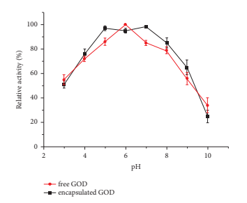

Wiley

 Journal of Chemistry Volume 2024, Article ID 4141301, 9 pages https://doi.org/10.1155/2024/4141301

# Research Article Supramolecular Self-Assembled Nanospheres For Enzyme Encapsulation Based On Cyclodextrin

## Zhenqiang Dong , 1 Lili Wu,2 **And Dongdong Ma1**

1College of Chemical and Material Engineering, Quzhou University, Quzhou, China 2*Shandong Institute for Product Quality Inspection, Jinan, China* Correspondence should be addressed to Zhenqiang Dong; gaocaidzq@163.com Received 24 January 2024; Revised 7 June 2024; Accepted 12 June 2024 Academic Editor: Amr Mohamed Elsayed Nassar Copyright © 2024 Zhenqiang Dong et al. Tis is an open access article distributed under the Creative Commons Attribution License, which permits unrestricted use, distribution, and reproduction in any medium, provided the original work is properly cited. Based on the cyclodextrin (CD) and guest molecules inclusion, a novel rigid-fexible polymeric nanosphere was prepared by supramolecular self-assemble. Te rigid part was formed by α-cyclodextrin (α-CD) and methoxypolyethylene glycol (mPEG)
necklace-like crystallites while the fexible part was sodium alginate (Alg). Te rigid and fexible parts were linked by β-cyclodextrin (β-CD) and ferrocene (Fc) inclusion complex. Tis kind of nanosphere exhibited good glucose oxidase (GOD) encapsulation ability. Te encapsulated enzyme, in comparison to the free enzyme, is able to retain its high activities across a rather broader range of pH, temperature, and time. After 20 days, the encapsulated enzyme can retain its almost 86% initial activity which exhibited good storage stability. Tese studies suggested that CD host-guest inclusions to form stable polymeric nanospheres may be an efective way for enzyme encapsulation in various biomedical applications.

## 1. Introduction

In the past two decades, there has been a great deal of interest in supramolecular self-assembled polymeric microspheres due to their potential usages in drug encapsulation, transportation, and release areas [1–3]. As an intelligent and smart self-assembly, they can always change their aggregation state and structure to achieve certain physical or chemical performance and applications. For instance, they can be used as an ideal carrier for encapsulating large number of guest molecules or large-sized guests within the polymer's core domain [4, 5]. Furthermore, some can even respond to external stimuli like pH [6], light [7], temperature
[8], specifc molecules [9], and redox reactions [10].

Nowadays, the fabrication of a block copolymer is a common way to making polymeric microspheres [11, 12].

Kimura et al. have prepared a kind of block-pendant amphiphilic homopolymer which can selectively self-assemble into rod micelles or spheres by precisely adjusting the main chain length of this homopolymer [13]. Apart from the polymeric microspheres formed by the covalent bonded amphiphilic block copolymers, noncovalently bonded microspheres based on supramolecular self-assembly have also been extensively studied [14–16]. Particularly, O'Reilly [17]
and Weck's [18, 19] teams have introduced a preparing method called "block-copolymer-free." In their approach, a kind of pseudo-copolymer has been prepared by selfassembling several kinds of homopolymers through supramolecular interaction. Tese homopolymers always connect with each other through weak bonds such as hydrogen bond, π–π bond, and metal-ligand bond [20–22].

Cyclodextrins (CDs), as a kind of rather common supramolecules, are able to encapsulate a number of hydrophobic guest molecules and long-chained molecules such as adamantane, ferrocene, azobenzene, and PEG into their cavities to form stable hydrogen-bonded host-guest inclusion complexes [23–26]. CDs also have adjustable water solubility, excellent biocompatibility, and nontoxicity properties which are well suited as drug carriers for biomedical applications [27, 28].

In this paper, novel polymeric nanospheres, based on the
"block-copolymer-free" strategy, have been prepared by

$$(1)$$

host-guest interactions of β-CD/Fc as well as α-CD/mPEG.

We frstly prepared β-CD modifed sodium alginate (Algβ-CD) and ferrocene end-capped mPEG (mPEG-Fc) and further studied their host-guest self-assembly behavior in aqueous solution. As expected, this supramolecular copolymer linked by β-CD and Fc host-guest inclusions formed comb-shaped polymer in water. When α-CD was added, the PEG long chain got through the cavities of α-CDs and gradually formed the necklace-like crystalline inclusion.

In this system, the mPEG/α-CDs crystalline structure is the rigid section, while the hydrophilic sodium alginate serves as the fexible section, and the two sections were connected by Fc/β-CD inclusion complex. Tis specifc rigid-fexible structure fnally self-assembled into nanospheres in water. Further study showed that this kind of novel nanospheres exhibited high glucose oxidase (GOD) encapsulation efciency and low GOD leakage efciency and could also maintain high GOD activities over a rather broader pH and temperature range. Tese merits will beneft its application in a much wider feld such as enzyme immobilization, microreactors, and drug delivery.

## 2. Experimental

2.1. Materials. β-CD, α-CD, GOD, and glucose oxidase activity assay kit were purchased from Sigma. Methoxypolyethylene glycol (mPEG, Mw∼5000) was bought from Shanghai Jingchunshiye Co., Ltd., China. Sodium alginate
(Alg), carboxyferrocene (Fc-COOH), dicyclohexylcarbodiimide (DCC), morpholinoethanesulfonic acid
(MES), 4-(dimethylamino)pyridine (DMAP), 1-ethyl-3- [3-(dimethylamino)propyl]carbodiimide hydrochloride (EDC), and N-hydroxysuccinimide (NHS) were acquired from Quzhou Laibo Co., Ltd., China.

## 2.2. Polymer Synthesis

2.2.1. Preparation of the Alg-β-CD. Alg-β-CD was prepared through two-step reactions. In the frst step, mono-6-(p-tolylsulfonyl)-β-cyclodextrin (6-CD-OTs) and mono-6-deoxy-6-hexamethylenediamine-β-CD (6-CD-HDA) were synthesized following the procedures described in the previous literature [29, 30]. Subsequently, an amidation reaction involving amido and carboxyl group was employed to attach β-CD onto the Alg backbone. In short, 20 ml Alg with 1% concentration (w/v) was prepared in MES (0.1M) and sodium chloride (0.5M) bufer solution at pH� 6.0. After that, 190 mg EDC and 58 mg NHS (with a molar ratio of COO−:
EDC: NHS � 1 :1 : 0.5) were added to the Alg solution to activate the carboxylic acid groups on the polymer backbone. Te solution was kept stirring for 30 min to achieve a uniform and clear solution. Subsequently, 40 mL
of 6-CD-HDA MES solution was added and the reaction was conducted at 4°C for 12 h.Te obtained mixture was dialysed in pure water for 4 days. Te fnal product Alg-β-CD was obtained by freeze-drying. Equation (1) is used to calculate the degree of substitution (DS) of β-CD to Alg.

$${\frac{I_{1}}{\mathrm{I}_{2}-6\mathrm{I}_{1}-2/7\mathrm{I}_{1}}}={\frac{7}{4}}\mathrm{DS}.$$

I1 represents the digital integration of anomeric protons in β-CD, whereas I2 represents the overall digital integration between 3.4 and 4.2 ppm. Te 1HNMR of Alg-β-CD in D2O
(400 MHz) is presented in Figure 1 with a fnal DS of 25.6%.

2.2.2. Preparation of the mPEG-Fc. mPEG-Fc was synthesized with the one pot method [31, 32]. Carboxyferrocene
(1.38 g) and mPEG (15.0 g) were dissolved in 200 ml dry CHCl3. Ten DCC (2.24 g) and DMAP (0.366 g) were added successively and kept stirring for 24 h at room temperature. Te mixture underwent fltration and rotary fash drying procedures at room temperature to remove the solvent CHCl3 and byproduct dicyclohexylurea (DCU). Te dried products were dissolved in deionized water and extracted with diethyl ether for three times. Te lower layered product was gathered together and then passed through a gel column with methanol aqueous solution as solvent to further purify the target product mPEG-Fc from the remaining catalyst and carboxyferrocene residue. Te fnal deep red product obtained was concentrated by spin drying and further dried with a vacuum oven for 2 days.

Te integral ratio of Hd and Hf was used to calculate the DS of the fnal mPEG-Fc product. Te 1HNMR (400 MHz)
of mPEG-Fc in CDCl3 is shown in Figure 2, and the DS of mPEG-Fc calculated is 97.5%. 2.3. Preparation of Alg-β-CD/mPEG-Fc/α-CD Nanospheres and Alg-β-CD/mPEG-Fc/α-CD Nanospheres Loaded with GOD (Alg-β-CD/mPEG-Fc/α-CD/GOD). Alg-β-CD (16.8 mg) and mPEG-Fc (52.5 mg) were added to 10 mL deionized water continuously and stirred for 3–5 hours until the product was fully dissolved. Following this, α-CD (0.3 g) was added to the solution and kept stirring for 12 h. For GOD loading, 5.0 mg of GOD was added and stirred for 5 minutes before the addition of α-CD. Te solution changed from transparent to turbid gradually, indicating the formation of Alg-β-CD/PEG-Fc/α-CD and Alg-β-CD/mPEG-Fc/α-CD/GOD nanospheres. 2.4. Determination of GOD Encapsulation and Leakage Efciency. Te encapsulation efciency of GOD was measured in 50 ml aqueous solution with the GOD loading 0.5 mg and polymer concentration 0.5wt%. After the formation of polymer nanospheres, the suspension was subjected to centrifugal separation for 15 min at 12000rmp to separate the encapsulated and free GOD. Te mass of free GOD was determined by measuring the supernatant using UV spectrophotometry.

Equation (2) determines the encapsulation efciency of the GOD.

GOD of encapulation efficiency (%) � mass of GOD used in formulation − mass of free GOD
mass of GOD used in fromulation × 100. (2)
Te above suspension was then stored at 4°C for 48 h to assess the GOD leakage efciency. After that, the mixture was then subjected to centrifugal at 12000 rmp for 15 min to separate the encapsulated and free GOD.

$${\frac{\mathrm{mass~of~free~GOD}}{\mathrm{nulation}}}\times100.$$
$$\left(2\right)$$
$$({\mathfrak{I}})$$

Equation (3) determines the leakage efciency of GOD.

GOD leakage efficiency (%) = $\dfrac{\text{mass of GOD used in the supernatant}}{\text{mass of GOD encapsulated}}$
mass of GOD encapsulated × 100. (3)
2.5. Activity of the Free and Encapsulated GOD. It is known that the glucose and GOD can react to produce H2O2
[33, 34]. Terefore, the H2O2 production rate can be used to assess the activity of both free and encapsulated GOD. 1 μM
GOD or encapsulated GOD was incubated at constant temperature in 50 ml phosphate or carbonate bufer

$${\frac{\mathrm{{ant}}}{\mathrm{{}}}}\times100.$$

solutions with glucose concentration of 0.05 M for 30 min.

Te concentration of H2O2 produced was determined by the glucose oxidase activity assay kit at OD 570 nm. And the relative activity of GOD is calculated by setting the optimal H2O2 production as 100%, and results under other conditions should be scaled proportionally according to this.

2.6. Measurement Method of the Michaelis Constant. Te
Lineweaver–Burk plots were generated in a phosphate
bufer with a pH of 7.0 at 25°C. To determine the kinetic
parameters of both free GOD and encapsulated GOD, the
values of Km and Vmax were calculated by measuring the
initial rates of glucose oxidation (0.11 to 2.11 mM), using
a glucose oxidase concentration of 0.25 mg/mL. Te data were plotted according to the Lineweaver–Burk double
reciprocal model [35, 36] as follows:
$${\frac{1}{V}}={\frac{k_{m}}{V_{\mathrm{max}}}}\times{\frac{1}{s}}+{\frac{1}{V_{\mathrm{max}}}},$$
, (4)
where V and Vmax were the apparent initial catalytic rate and the maximum apparent initial catalytic rate, respectively. Km refers to the apparent Michaelis constant and S represents the substrate concentration.

2.7. Measurements. Te 2D 1H-NOESY NMR spectra were obtained using Bruker 600 NMR spectrometer at room temperature. High-resolution TEM was carried out by the JEM-2010 instrument with an accelerating voltage of 120 kV.

AFM image was measured with a Bruke Multi-Mode 8 instrument in tapping mode. XRD was performed by X′ Pert MPD with a scan rate of 2° theta/min in a Cu-K α irradiation source.

## 3. Results And Discussion

Based on the previous report, it has been proved that Fc and β-CD as well as their derivatives can form inclusion complex spontaneously in aqueous solution [24]. In this paper, the 2D
1H-NOESY NMR spectra were also carried out to detect the mutual relations between the Fc groups on mPEG and β-CD
groups on Alg. Te resonance peaks at 3.7–4.0 ppm and 4.34.4 ppm can be attributed to the inner protons of β-CD and the protons of cyclopentadienyl ring in Fc, respectively. As shown in Figure 3, the hydrogen peaks of β-CD in Alg-β-CD
exhibited a clear correlation with the resonance of Fc in mPEG-Fc (the part circled by the red box), indicating that the Fc groups thrusted into the inner cavity of β-CD groups and formed the inclusion complex. Similar results were also reported by other studies [37, 38].

Te resulting Alg-β-CD/mPEG-Fc was water-soluble transparent "graft copolymer." By adding α-CD to the Alg-β-CD/mPEG-Fc homogeneous solution, the system gradually becomes turbid, suggesting some kind of aggregates had been formed in water. Te morphology of these aggregates in the system was studied by highresolution TEM and AFM equipment. Figure 4(a) shows the TEM image of Alg-β-CD/mPEG-Fc/α-CD aggregates; these aggregates showed round-line shapes with average diameters of around 80 nm. In the AFM image of Figure 4(b), the Alg-β-CD/mPEG-Fc/α-CD aggregates also showed round shape from the top view and appear to almost have the same diameters as the TEM image. Particularly, the height of these nanospheres was almost less than 5 nm which is about 15 times smaller than the lateral dimension. Tis can be attributed to the collapse of the nanospheres during

$$(4)$$

sample preparation. Te same phenomenon was also reported by other studies [39, 40]. After encapsulated with GOD, as shown in Figure 4(d), the height of the nanospheres has a more than 5 fold increase compared with Alg-β-CD/mPEG-Fc/α-CD unencapsulated nanoparticles, which indicates the successful encapsulation of GOD into the Alg-β-CD/mPEG-Fc/ α-CD nanoparticles.

To further evaluate the structure of the CD-based inclusions, XRD is a commonly used method. Figure 5 shows the XRD patterns of α-CD (Figure 5(a)), mPEG/α-CD inclusion complex (Figure 5(b)), Alg-β-CD/mPEG-Fc/α-CD
(Figure 5(c)), and Alg-β-CD and mPEG-Fc mixture
(Figure 5(d)). Te XRD pattern of Alg-β-CD/mPEG-Fc/
α-CD demonstrated in the fgure was quite diferent from that of free α-CD, Alg-β-CD, and mPEG-Fc mixture. Te crystalline peaks of mPEG at 2θ �19.2° and 23.3° and α-CD
at 2θ � 21.5° were absent [41, 42]. It can be also seen that the XRD pattern of Alg-β-CD/mPEG-Fc/α-CD was quite similar to that of mPEG-α-CD crystallites, both of which exhibited sharp peaks at 2θ �19.9°. According to the previous report [43–45], the peak appearing at 2θ �19.9°
is a typical peak of mPEG-α-CD necklace-type crystallites which indicated that the inclusion structure of Alg-β-CD/
mPEG-Fc/α-CD contained mPEG-α-CD crystallites. During the Alg-β-CD/mPEG-Fc/α-CD nanosphere formation process, water becomes a selective solvent for Alg-β-CD/
mPEG-Fc/α-CD. Insoluble mPEG-α-CD rigid part forms the inner core while the protonated coil-like Alg forms the outer shell. Te zeta potential of Alg-β-CD/mPEG-Fc/α-CD
nanospheres measured was −28 mV. Tis further confrms that the shell layer of the nanospheres is covered by negatively charged protonated Alg.

Based on the discussion above, the possible mechanism of Alg-β-CD/mPEG-Fc/α-CD nanospheres' self-assembly processes is shown in Figure 6. Firstly, when the Alg-β-CD and mPEG-Fc are dissolved in water together, the β-CD group will form inclusion complex with Fc group to get a pseudo-graft copolymer Alg-β-CD/mPEG-Fc. After α-CD was added to the solution and stirred for several hours, the branched mPEG
part of Alg-β-CD/mPEG-Fc would thread through the α-CDs' inner cavity one by one and fnally form the necklace-type crystalline structure. Tese crystallites are rigid and insoluble in water which incline to gather together to form the hydrophobic core, while the coil-like hydrophilic Alg part will form the outer shell. Trough these self-assembly processes, the Alg-β-CD/mPEG-Fc/α-CD nanospheres fnally formed. Particularly, when the enzyme was added at this process, it will be partly encapsulated into the Alg-β-CD/
mPEG-Fc/α-CD nanospheres.

In fact, these Alg-β-CD/mPEG-Fc/α-CD nanospheres have shown excellent GOD encapsulation capacity.

According to the measuring method introduced in Section 2.4, the GOD encapsulation and leakage efciency calculated were 68.5% and 6.4%, respectively, which indicate that these nanospheres have great potential in drug delivery systems for medical application.

To further investigate the binding ability of GOD and Algβ-CD/mPEG-Fc/α-CD nanospheres after encapsulation, the

 5

 

Michaelis constant was determined. Te Lineweaver–Burk double reciprocal plots of free and encapsulated GOD are demonstrated in Figure 7. Te liner equations obtained were y � 8.711x + 2.297 and y � 10.621x + 1.731, respectively. Te Michaelis constant (Km) of encapsulated GOD (3.79 ×10−3 M) in nanoparticles was much lower than that of free GOD (6.14 ×10−3 M), which indicates that the afnity between GOD and its substrate

 

has increased after the GOD encapsulated in the Alg-β-CD/PEG-Fc/α-CD nanospheres.

Te impact of pH on the activities of both free and encapsulated GOD was assessed at 25°C over a pH range from 3 to 10. Te free GOD, as illustrated in Figure 8, demonstrated peak relative activity at pH � 6.0. In comparison, the encapsulated GOD demonstrated high relative activities in a rather wide pH range from 5.0 to 7.0. Te possible reason is the aggregation efect of GOD molecules which gathered in a rather small core. Te three-dimensional structure of the encapsulated GOD is rather difcult to change and their pH stability greatly improved. Tis result indicates that the Alg-β-CD/mPEG-Fc/α-CD nanospheres could stabilize the GOD activity over a much broader pH range, which will beneft its medical application.

Te efect of temperature on free and encapsulated GOD
activities was measured in a water thermal bath at the constant temperature from 15 to 75°C. As illustrated in Figure 9, both the free and encapsulated GOD showed maximum relative activities at about 45°C. But the

 

encapsulated GOD could keep rather high relative activities at a broad temperature range from 35 to 55°C, while for the free GOD, there was an obvious decrease before and after the optimum temperature at this temperature range. When the temperature exceeds 55°C, the relative activities for both free and encapsulated GOD showed a signifcant downward trend with the increasing temperature. Tese results indicate that the Alg-β-CD/PEG-Fc/α-CD nanospheres could stabilize the GOD activities at a broad temperature range.

Long-term stability is a very important indicator for encapsulated enzymes in most application scenarios. Te storage stability of free and encapsulated GOD was investigated in 0.2 M acetate bufer (pH 6.0) at 4°C for 20 days.

As shown in Figure 10, in the beginning 5 days, encapsulated GOD maintained as high as 98% relative activity.

 

 

In comparison, free GOD retained only 88% relative activity.

Even after 20 days, the encapsulated GOD exhibited almost 86% of its initial activity while for free GOD, there was only 71% relative activity left. Tese results indicate that the Alg-β-CD/PEG-Fc/α-CD encapsulation methods reported in this paper could signifcantly improve the storage stability of GOD.

## 4. Conclusion

To summarize, based on the self-assembly of β-CD/Fc and mPEG/α-CD inclusions, Alg-β-CD/mPEG-Fc/α-CD rigidfexible nanospheres were successfully prepared as novel carriers for GOD encapsulation. Although being encapsulated into nanospheres, GOD still maintains high activity, and the afnity between the encapsulated GOD and substrate has been slightly enhanced. Additionally, the encapsulation of GOD expanded the optimal pH and temperature ranges for the enzyme's activity and meanwhile improved GOD's storage stability. We believe that the encapsulation methods described in this study present a strategy for maintaining the biological functionality of protein-based pharmaceuticals in medical use.

## Data Availability

All the data used in this study are included within the article.

## Conflicts Of Interest

Te authors declare that they have no conficts of interest.

## Acknowledgments

Funding for this work was partly provided by the National Natural Science Foundation of China (21476127).

## References

[1] Z. Jia, Y. Zhou, and D. Yan, "Amphiphilic star-block copolymers based on a hyperbranched core: synthesis and supramolecular self-assembly," *Polymer Chemistry*, vol. 46, pp. 4205–4217, 2008.

[2] Z. Huang, W. Song, and X. Chen, "Supramolecular selfassembled nanostructures for cancer immunotherapy,"
Frontiers in Chemistry, vol. 8, no. 380, p. 380, 2020.

[3] E. Moulin, J. J. Cid, and N. Giuseppone, "Advances in supramolecular electronics - from randomly self-assembled nanostructures to addressable self-organized interconnects," Advanced Materials, vol. 25, no. 3, pp. 477–487, 2013.

[4] Y. Qu, Z. Zhang, X. Wang, Y. Lai, Y. Liu, and J. Li, "A simple SDS-assisted self-assembly method for the synthesis of hollow carbon nanospheres to encapsulate sulfur for advanced lithium-sulfur batteries," *Journal of Materials Chemistry A*,
vol. 1, no. 45, pp. 14306–14310, 2013.

[5] K. Kumar, B. R. Kumar Shyamlal, R. Verma, P. Kondaiah, and S. Chaudhary, "Reduction-triggered doxorubicin delivery by self-assembled nanospheres of lipoylated cafeine," *ChemMedChem*, vol. 15, no. 9, pp. 733–737, 2020.

[6] S. V. Bhosale, M. B. Kalyankar, S. V. Nalage et al.,
"RETRACTED: pH dependent molecular self-assembly of octaphosphonate porphyrin of nanoscale dimensions:
nanosphere and nanorod aggregates," *International Journal of* Molecular Sciences, vol. 12, no. 3, pp. 1464–1473, 2011.

[7] Z. Dong, Y. Cao, X. Han et al., "Photoreversible polymersurfactant micelles using the molecular recognition of α-cyclodextrin," *Langmuir*, vol. 29, no. 10, pp. 3188–3194, 2013.

[8] S. A. Costa Lima and S. Reis, "Temperature-responsive polymeric nanospheres containing methotrexate and gold nanoparticles: a multi-drug system for theranostic in rheumatoid arthritis," *Colloids and Surfaces B: Biointerfaces*,
vol. 133, pp. 378–387, 2015.

[9] H. S. Dhiraj, F. Ishizuka, M. Saeed, A. Elshaer, P. B. Zetterlund, and F. Aldabbagh, "Lactate and glucose responsive boronic acid-substituted amphiphilic block copolymer nanoparticles of high aspect ratio," *European Polymer Journal*, vol. 185, Article ID 111819, 2023.

[10] Y. S. Birhan, E. Y. Hanurry, T. W. Mekonnen et al., "Biotindecorated redox-responsive micelles from diselenide-linked star-shaped copolymers for the targeted delivery and controlled release of doxorubicin in cancer cells," Journal of Applied Polymer Science, vol. 139, no. 24, p. 20, 2022.

[11] Y. Qu, X. Chang, S. Chen, and W. Zhang, "In situ synthesis of thermoresponsive 4-arm star block copolymer nanoassemblies by dispersion RAFT polymerization," *Polymer* Chemistry, vol. 8, no. 22, pp. 3485–3496, 2017.

[12] X. Guo, S. Yuan, S. Yang, K. Lv, and S. Yuan, "Mesoscale simulation on patterned core-shell nanosphere model for amphiphilic block copolymer," *Colloids and Surfaces A:* Physicochemical and Engineering Aspects, vol. 384, no. 1-3, pp. 212–218, 2011.

[13] Y. Kimura, M. Takenaka, M. Ouchi, and T. Terashima, "Selfsorting of amphiphilic block-pendant homopolymers into sphere or rod micelles in water," *Macromolecules*, vol. 53, no. 12, pp. 4942–4951, 2020.

[14] K. Yang, A. Gao, H. Wu et al., "Layered molybdenum disulfde coated carbon hollow spheres synthesized through supramolecular self-assembly applied to supercapacitors," *International Journal of Energy Research*, vol. 44, no. 8, pp. 7082–7092, 2020.

[15] X. Cheng, P. Sun, S. Zhang et al., "Self-assembly of mphenylenediamine and polyoxometalate into hollow-sphere and core-in-hollow-shell nanostructures for selective adsorption of dyes," *Journal of Molecular Liquids*, vol. 287, Article ID 110982, 2019.

[16] D. Wetzel and U. L¨uning, "Second generation self-assembling dendrimer combining supramolecular and dynamic covalent chemistry," *European Journal of Organic Chemistry*, vol. 43, 2020.

[17] A. O. Moughton and R. K. O'Reilly, "Noncovalently connected micelles, nanoparticles, and metal-functionalized nanocages using supramolecular self-assembly," Journal of the American Chemical Society, vol. 130, no. 27, pp. 8714–
8725, 2008.

[18] X. Yang, X. Chen, J. Qiu et al., "Controllable synthesis of silicon/carbon hollow microspheres using renewable sources for high energy lithium-ion battery," *Journal of Solid State* Chemistry, vol. 296, Article ID 121968, 2021.

[19] A. V. Ambade, S. K. Yang, and M. Weck, "Supramolecular ABC triblock copolymers," Angewandte Chemie International Edition, vol. 48, no. 16, pp. 2894–2898, 2009.

[20] H. Wang, H. Xie, J. Wang et al., "Self-Assembling prodrugs by precise programming of molecular structures that contribute distinct stability, pharmacokinetics, and antitumor efcacy,"
Advanced Functional Materials, vol. 25, no. 31, pp. 4956–4965, 2015.

[21] H. Wang, J. Chen, C. Xu et al., "Cancer nanomedicines stabilized by π-π stacking between heterodimeric prodrugs enable exceptionally high drug loading capacity and safer delivery of drug combinations," *Teranostics*, vol. 7, no. 15, pp. 3638–3652, 2017.

[22] R. Gupta, H. Paithankar, J. Chugh, and R. Boomishankar,
"Construction of entropically favored supramolecular metal−ligand trimeric assemblies supported by fexible pyridylaminophosphorus(V) scafolds," *Inorganic Chemistry*,
vol. 60, no. 14, pp. 10468–10477, 2021.

[23] C. Seripracharat, C. Sinthuvanich, and T. Karpkird, "Cationic cyclodextrin-adamantane poly(vinyl alcohol)-poly(ethylene glycol) assembly for siRNA delivery," *Journal of Drug Delivery* Science and Technology, vol. 68, Article ID 103052, 2022.

[24] E. S. Perez, R. Toor, P. Bruyat et al., "Impact of multimeric ferrocene-containing cyclodecapeptide scafold on host-guest interactions at a β-Cyclodextrin covered surface," *ChemPhysChem*, vol. 22, pp. 1–10, 2021.

[25] W. Ma, H. Fang, D. Tian, L. Zheng, M. Xie, and R. Sun,
"Solvent-free stretchable photo-responsive supramolecular actuator topologically cross-linked by azobenzenecyclodextrin based slide-ring system," *Dyes and Pigments*,
vol. 200, Article ID 110120, 2022.

[26] Q. Huang, C. Yan, S. Luo, Z. Li, T. Wei, and Z. Wang,
"Synthesis, characteristics, and pharmaceutical properties of ibuprofen-cyclodextrin-PEG conjugate," *Journal of Chemistry*, vol. 2022, pp. 1–7, 2022.

[27] M. Inam, M. F. Sareh Sadat, and W. Chen, "Cyclodextrin based host-guest inclusion complex, an approach to enhancing the physicochemical and biopharmaceuticalapplication of poorly water-soluble drugs,"
Chemical Research in Chinese Universities, vol. 39, no. 6, pp. 857–861, 2023.

[28] S. Wang, Y. Wei, Y. Wang, and Y. Cheng, "Cyclodextrin regulated natural polysaccharide hydrogels for biomedical applications-a review," *Carbohydrate Polymers*, vol. 313, Article ID 120760, 2023.

[29] A. Leung, G. Lawrie, L. K. Nielsen, and M. Trau, "Synthesis and characterization of alginate/poly-L-ornithine/alginate microcapsules for local immunosuppression," *Journal of* Microencapsulation, vol. 25, no. 6, pp. 387–398, 2008.

[30] L. Tan, Y. Liu, W. Ha et al., "Stimuli-induced gel–sol transition of multi-sensitive supramolecular β-cyclodextrin grafted alginate/ferrocene modifed pluronic hydrogel," *Soft* Matter, vol. 8, no. 21, pp. 5746–5749, 2012.

[31] C. Guo, L. Wang, Y. Li, and C. Wang, "Suprarmolecular hydrogels driven by the dual host-guest interactions between α-cyclodextrin and ferrocene-modifed poly(ethylene glycol)
with low-molecular-weight," *Reactive and Functional Polymers*, vol. 73, no. 6, pp. 805–812, 2013.

[32] J. Ming-Wei, G. Cheng-Gong, W. Liang, L. Ya-Kun, and W. Cai-Qi, "Studies on the orthogonal assembly of β-cyclodextrin-poly (ε-caprolactone) and ferrocene-poly (ethylene oxide)," *Carbohydrate Polymers*, vol. 92, no. 2, pp. 1566–1572, 2013.

[33] K. C. Gulla, M. D. Gouda, M. S. Takur, and N. G. Karanth,
"Enhancement of stability of immobilized glucose oxidase by modifcation of free thiols generated by reducing disulfde bonds and using additives," *Biosensors and Bioelectronics*, vol. 19, no. 6, pp. 621–625, 2004.

[34] G. Wohlfahrt, S. Trivic, J. Zeremski, D. Pericin, and ´
V. Leskovac, "Te chemical mechanism of action of glucose oxidase from Aspergillus Niger," *Molecular and Cellular* Biochemistry, vol. 260, no. 1, pp. 69–83, 2004.

[35] G. K. Kouassi, J. Irudayaraj, and G. McCarty, "Activity of glucose oxidase functionalized onto magnetic nanoparticles,"
BioMagnetic Research and Technology, vol. 3, pp. 1–10, 2005.

[36] W. Ha, X. Meng, Q. Li et al., "Self-assembly hollow nanosphere for enzyme encapsulation," *Soft Matter*, vol. 6, no. 7, pp. 1405–1408, 2010.

[37] X. Han, Z. Dong, M. Fan et al., "pH-induced shape-memory polymers," *Macromolecular Rapid Communications*, vol. 33, no. 12, pp. 1055–1060, 2012.

[38] Z. Dong, Y. Cao, Q. Yuan et al., "Redox- and glucose-induced shape-memory polymers," *Macromolecular Rapid Communications*, vol. 34, no. 10, pp. 867–872, 2013.

[39] W. Ha, X. Meng, Q. Li et al., "Encapsulation studies and selective membrane permeability properties of self-assembly hollow nanospheres," *Soft Matter*, vol. 7, no. 3, pp. 1018–1024, 2011.

[40] Z. Dong, Y. Kang, Q. Yuan, M. Luo, and Z. Gu, "H2O2-responsive nanoparticle based on the supramolecular selfassemble of cyclodextrin," *Frontiers in Pharmacology*,
vol. 9, p. 552, 2018.

[41] H. Luo, M. Fan, Z. Yu, X. Meng, B. Li, and S. Zhang,
"Preparation and properties of degradable shape memory material based on partial α-cyclodextrin-poly(ε-caprolactone)
inclusion complex," *Macromolecular Chemistry and Physics*, vol. 210, no. 8, pp. 669–676, 2009.

[42] X. Meng, J. Qin, Y. Liu et al., "Degradable hollow spheres based on self-assembly inclusion," *Chemical Communications*, vol. 46, no. 4, pp. 643–645, 2010.

[43] X. Meng, W. Ha, C. Cheng et al., "Hollow nanospheres based on the self-assembly of alginate-graft-poly(ethylene glycol) and α-Cyclodextrin," *Langmuir*, vol. 27, no. 23, pp. 14401–
14407, 2011.

[44] C. Hwang, S. Y. Lee, H. Kim et al., "Polypseudorotaxane and polydopamine linkage-based hyaluronic acid hydrogel network with a single syringe injection for sustained drug delivery," *Carbohydrate Polymers*, vol. 266, Article ID 118104, 2021.

[45] K. A. Vandera, C. Pague, J. Omar et al., "Formation of supramolecular gels from host–guest interactions between PEGylated chitosan and α-Cyclodextrin," *Macromolecular* Materials and Engineering, vol. 308, no. 6, 2023.