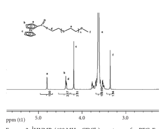
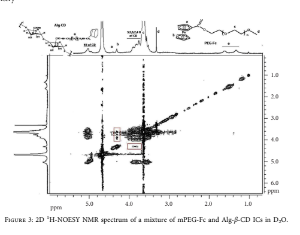
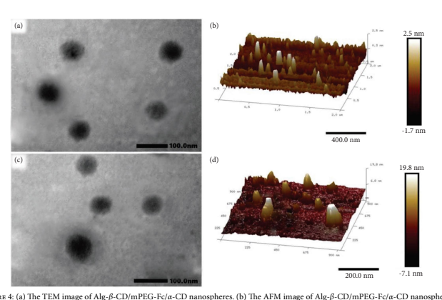
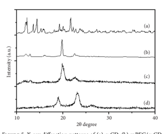
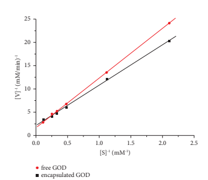
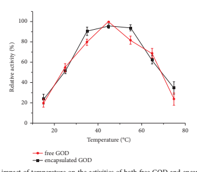
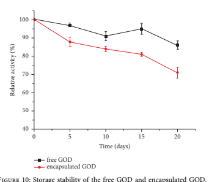

Wiley

The image is a screenshot of a research article titled "Supramolecular Self-Assembled Nanospheres For Enzyme Encapsulation Based On Cyclodextrin" published in the Journal of Chemistry. The article discusses the preparation and properties of rigid-fexible polymeric nanospheres formed by supramolecular self-assembly using cyclodextrin (CD) and guest molecules inclusion. The nanosphere exhibits good glucose oxidase (GOD) encapsulation ability, retaining its high activities across a broad range of pH, temperature, and time. The encapsulated enzyme shows good storage stability, suggesting that CD host-guest inclusions to form stable polymeric nanospheres may be an efective way for enzyme encapsulation in various biomedical applications. The image includes the title of the article, the authors' names, the journal's name, and the volume, article ID, and page numbers. It also mentions the academic editor and the copyright information.

 Journal of Chemistry Volume 2024, Article ID 4141301, 9 pages https://doi.org/10.1155/2024/4141301

# Research Article Supramolecular Self-Assembled Nanospheres For Enzyme Encapsulation Based On Cyclodextrin

## Zhenqiang Dong , 1 Lili Wu,2 **And Dongdong Ma1**

1College of Chemical and Material Engineering, Quzhou University, Quzhou, China 2*Shandong Institute for Product Quality Inspection, Jinan, China* Correspondence should be addressed to Zhenqiang Dong; gaocaidzq@163.com Received 24 January 2024; Revised 7 June 2024; Accepted 12 June 2024 Academic Editor: Amr Mohamed Elsayed Nassar Copyright © 2024 Zhenqiang Dong et al. Tis is an open access article distributed under the Creative Commons Attribution License, which permits unrestricted use, distribution, and reproduction in any medium, provided the original work is properly cited. Based on the cyclodextrin (CD) and guest molecules inclusion, a novel rigid-fexible polymeric nanosphere was prepared by supramolecular self-assemble. Te rigid part was formed by α-cyclodextrin (α-CD) and methoxypolyethylene glycol (mPEG)
necklace-like crystallites while the fexible part was sodium alginate (Alg). Te rigid and fexible parts were linked by β-cyclodextrin (β-CD) and ferrocene (Fc) inclusion complex. Tis kind of nanosphere exhibited good glucose oxidase (GOD) encapsulation ability. Te encapsulated enzyme, in comparison to the free enzyme, is able to retain its high activities across a rather broader range of pH, temperature, and time. After 20 days, the encapsulated enzyme can retain its almost 86% initial activity which exhibited good storage stability. Tese studies suggested that CD host-guest inclusions to form stable polymeric nanospheres may be an efective way for enzyme encapsulation in various biomedical applications.

## 1. Introduction

In the past two decades, there has been a great deal of interest in supramolecular self-assembled polymeric microspheres due to their potential usages in drug encapsulation, transportation, and release areas [1–3]. As an intelligent and smart self-assembly, they can always change their aggregation state and structure to achieve certain physical or chemical performance and applications. For instance, they can be used as an ideal carrier for encapsulating large number of guest molecules or large-sized guests within the polymer's core domain [4, 5]. Furthermore, some can even respond to external stimuli like pH [6], light [7], temperature
[8], specifc molecules [9], and redox reactions [10].

Nowadays, the fabrication of a block copolymer is a common way to making polymeric microspheres [11, 12].

Kimura et al. have prepared a kind of block-pendant amphiphilic homopolymer which can selectively self-assemble into rod micelles or spheres by precisely adjusting the main chain length of this homopolymer [13]. Apart from the polymeric microspheres formed by the covalent bonded amphiphilic block copolymers, noncovalently bonded microspheres based on supramolecular self-assembly have also been extensively studied [14–16]. Particularly, O'Reilly [17]
and Weck's [18, 19] teams have introduced a preparing method called "block-copolymer-free." In their approach, a kind of pseudo-copolymer has been prepared by selfassembling several kinds of homopolymers through supramolecular interaction. Tese homopolymers always connect with each other through weak bonds such as hydrogen bond, π–π bond, and metal-ligand bond [20–22].

Cyclodextrins (CDs), as a kind of rather common supramolecules, are able to encapsulate a number of hydrophobic guest molecules and long-chained molecules such as adamantane, ferrocene, azobenzene, and PEG into their cavities to form stable hydrogen-bonded host-guest inclusion complexes [23–26]. CDs also have adjustable water solubility, excellent biocompatibility, and nontoxicity properties which are well suited as drug carriers for biomedical applications [27, 28].

Wiley

The image is a screenshot of a research article titled "Supramolecular Self-Assembled Nanospheres For Enzyme Encapsulation Based On Cyclodextrin" published in the Journal of Chemistry. The article discusses the preparation and properties of rigid-fexible polymeric nanospheres formed by supramolecular self-assembly using cyclodextrin (CD) and guest molecules inclusion. The nanosphere exhibits good glucose oxidase (GOD) encapsulation ability, retaining high activity across a broad range of pH, temperature, and time. The article also mentions the use of CDs as drug carriers for biomedical applications due to their adjustable water solubility, excellent biocompatibility, and nontoxicity properties. The image includes the title of the article, the authors' names, the journal's name, and the volume and article ID. It also displays the abstract of the article and some keywords related to the research.
 Journal of Chemistry Volume 2024, Article ID 4141301, 9 pages https://doi.org/10.1155/2024/4141301

# Research Article Supramolecular Self-Assembled Nanospheres For Enzyme Encapsulation Based On Cyclodextrin

## Zhenqiang Dong , 1 Lili Wu,2 **And Dongdong Ma1**

1College of Chemical and Material Engineering, Quzhou University, Quzhou, China 2*Shandong Institute for Product Quality Inspection, Jinan, China* Correspondence should be addressed to Zhenqiang Dong; gaocaidzq@163.com Received 24 January 2024; Revised 7 June 2024; Accepted 12 June 2024 Academic Editor: Amr Mohamed Elsayed Nassar Copyright © 2024 Zhenqiang Dong et al. Tis is an open access article distributed under the Creative Commons Attribution License, which permits unrestricted use, distribution, and reproduction in any medium, provided the original work is properly cited. Based on the cyclodextrin (CD) and guest molecules inclusion, a novel rigid-fexible polymeric nanosphere was prepared by supramolecular self-assemble. Te rigid part was formed by α-cyclodextrin (α-CD) and methoxypolyethylene glycol (mPEG)
necklace-like crystallites while the fexible part was sodium alginate (Alg). Te rigid and fexible parts were linked by β-cyclodextrin (β-CD) and ferrocene (Fc) inclusion complex. Tis kind of nanosphere exhibited good glucose oxidase (GOD) encapsulation ability. Te encapsulated enzyme, in comparison to the free enzyme, is able to retain its high activities across a rather broader range of pH, temperature, and time. After 20 days, the encapsulated enzyme can retain its almost 86% initial activity which exhibited good storage stability. Tese studies suggested that CD host-guest inclusions to form stable polymeric nanospheres may be an efective way for enzyme encapsulation in various biomedical applications.

## 1. Introduction

In the past two decades, there has been a great deal of interest in supramolecular self-assembled polymeric microspheres due to their potential usages in drug encapsulation, transportation, and release areas [1–3]. As an intelligent and smart self-assembly, they can always change their aggregation state and structure to achieve certain physical or chemical performance and applications. For instance, they can be used as an ideal carrier for encapsulating large number of guest molecules or large-sized guests within the polymer's core domain [4, 5]. Furthermore, some can even respond to external stimuli like pH [6], light [7], temperature
[8], specifc molecules [9], and redox reactions [10].

Nowadays, the fabrication of a block copolymer is a common way to making polymeric microspheres [11, 12].

Kimura et al. have prepared a kind of block-pendant amphiphilic homopolymer which can selectively self-assemble into rod micelles or spheres by precisely adjusting the main chain length of this homopolymer [13]. Apart from the polymeric microspheres formed by the covalent bonded amphiphilic block copolymers, noncovalently bonded microspheres based on supramolecular self-assembly have also been extensively studied [14–16]. Particularly, O'Reilly [17]
and Weck's [18, 19] teams have introduced a preparing method called "block-copolymer-free." In their approach, a kind of pseudo-copolymer has been prepared by selfassembling several kinds of homopolymers through supramolecular interaction. Tese homopolymers always connect with each other through weak bonds such as hydrogen bond, π–π bond, and metal-ligand bond [20–22].

Cyclodextrins (CDs), as a kind of rather common supramolecules, are able to encapsulate a number of hydrophobic guest molecules and long-chained molecules such as adamantane, ferrocene, azobenzene, and PEG into their cavities to form stable hydrogen-bonded host-guest inclusion complexes [23–26]. CDs also have adjustable water solubility, excellent biocompatibility, and nontoxicity properties which are well suited as drug carriers for biomedical applications [27, 28].

ing catalyst and carboxyferrocene residue. Te fnal deep red product obtained was concentrated by spin drying and further dried with a vacuum oven for 2 days.

Te integral ratio of Hd and Hf was used to calculate the DS of the fnal mPEG-Fc product. Te 1HNMR (400 MHz)
of mPEG-Fc in CDCl3 is shown in Figure 2, and the DS of mPEG-Fc calculated is 97.5%. 2.3. Preparation of Alg-β-CD/mPEG-Fc/α-CD Nanospheres and Alg-β-CD/mPEG-Fc/α-CD Nanospheres Loaded with GOD (Alg-β-CD/mPEG-Fc/α-CD/GOD). Alg-β-CD (16.8 mg) and mPEG-Fc (52.5 mg) were added to 10 mL deionized water continuously and stirred for 3–5 hours until the product was fully dissolved. Following this, α-CD (0.3 g) was added to the solution and kept stirring for 12 h. For GOD loading, 5.0 mg of GOD was added and stirred for 5 minutes before the addition of α-CD. Te solution changed from transparent to turbid gradually, indicating the formation of Alg-β-CD/PEG-Fc/α-CD and Alg-β-CD/mPEG-Fc/α-CD/GOD nanospheres. 2.4. Determination of GOD Encapsulation and Leakage Efciency. Te encapsulation efciency of GOD was measured in 50 ml aqueous solution with the GOD loading 0.5 mg and polymer concentration 0.5wt%. After the formation of polymer nanospheres, the suspension was subjected to centrifugal separation for 15 min at 12000rmp to separate the encapsulated and free GOD. Te mass of free GOD was determined by measuring the supernatant using UV spectrophotometry.

The image appears to be a scientific document or report, detailing the preparation and characterization of Alg-β-CD/mPEG-Fc/α-CD nanospheres loaded with GOD (glucose oxidase). The document includes sections on the synthesis of mPEG-Fc, preparation of nanospheres, determination of encapsulation and leakage efficiency, activity of free and encapsulated GOD, and measurement of the Michaelis constant. 

The image contains two figures: Figure 1 shows the 1H NMR spectrum of Alg-β-CD in D2O, while Figure 2 displays the 1H NMR spectrum of mPEG-Fc in CDCl3. Both spectra are annotated with peaks corresponding to different chemical groups, such as COONa, COO-NH-CH2-CH3, and CH3OH. The DS (degree of substitution) of mPEG-Fc is calculated from the integral ratio of Hd and Hf in the 1H NMR spectrum.

The text also mentions the use of UV spectrophotometry for measuring the mass of free GOD and glucose oxidase activity assay kit for determining the concentration of H2O2 produced. The Lineweaver-Burk plots are used to determine the kinetic parameters of both free GOD and encapsulated GOD, including Km and Vmax.

The document concludes with a section on measurements, indicating that 2D 1H-NOESY NMR spectra were obtained using a Bruker 600 NMR spectrometer at room temperature, high-resolution TEM was carried out by a JEM-2010 instrument, and AFM images were measured with a Bruker M.

Equation (2) determines the encapsulation efciency of the GOD.

GOD of encapulation efficiency (%) � mass of GOD used in formulation − mass of free GOD
mass of GOD used in fromulation × 100. (2)
Te above suspension was then stored at 4°C for 48 h to assess the GOD leakage efciency. After that, the mixture was then subjected to centrifugal at 12000 rmp for 15 min to separate the encapsulated and free GOD.

$${\frac{\mathrm{mass~of~free~GOD}}{\mathrm{nulation}}}\times100.$$
$$\left(2\right)$$
$$({\mathfrak{I}})$$

Equation (3) determines the leakage efciency of GOD.

GOD leakage efficiency (%) = $\dfrac{\text{mass of GOD used in the supernatant}}{\text{mass of GOD encapsulated}}$
mass of GOD encapsulated × 100. (3)
2.5. Activity of the Free and Encapsulated GOD. It is known that the glucose and GOD can react to produce H2O2
[33, 34]. Terefore, the H2O2 production rate can be used to assess the activity of both free and encapsulated GOD. 1 μM
GOD or encapsulated GOD was incubated at constant temperature in 50 ml phosphate or carbonate bufer

$${\frac{\mathrm{{ant}}}{\mathrm{{}}}}\times100.$$

solutions with glucose concentration of 0.05 M for 30 min.

Te concentration of H2O2 produced was determined by the glucose oxidase activity assay kit at OD 570 nm. And the relative activity of GOD is calculated by setting the optimal H2O2 production as 100%, and results under other conditions should be scaled proportionally according to this.

2.6. Measurement Method of the Michaelis Constant. Te
Lineweaver–Burk plots were generated in a phosphate
bufer with a pH of 7.0 at 25°C. To determine the kinetic
parameters of both free GOD and encapsulated GOD, the
values of Km and Vmax were calculated by measuring the
initial rates of glucose oxidation (0.11 to 2.11 mM), using
a glucose oxidase concentration of 0.25 mg/mL. Te data were plotted according to the Lineweaver–Burk double
reciprocal model [35, 36] as follows:
$${\frac{1}{V}}={\frac{k_{m}}{V_{\mathrm{max}}}}\times{\frac{1}{s}}+{\frac{1}{V_{\mathrm{max}}}},$$
, (4)
where V and Vmax were the apparent initial catalytic rate and the maximum apparent initial catalytic rate, respectively. Km refers to the apparent Michaelis constant and S represents the substrate concentration.

2.7. Measurements. Te 2D 1H-NOESY NMR spectra were obtained using Bruker 600 NMR spectrometer at room temperature. High-resolution TEM was carried out by the JEM-2010 instrument with an accelerating voltage of 120 kV.

AFM image was measured with a Bruke Ming catalyst and carboxyferrocene residue. Te fnal deep red product obtained was concentrated by spin drying and further dried with a vacuum oven for 2 days.

Te integral ratio of Hd and Hf was used to calculate the DS of the fnal mPEG-Fc product. Te 1HNMR (400 MHz)
of mPEG-Fc in CDCl3 is shown in Figure 2, and the DS of mPEG-Fc calculated is 97.5%. 2.3. Preparation of Alg-β-CD/mPEG-Fc/α-CD Nanospheres and Alg-β-CD/mPEG-Fc/α-CD Nanospheres Loaded with GOD (Alg-β-CD/mPEG-Fc/α-CD/GOD). Alg-β-CD (16.8 mg) and mPEG-Fc (52.5 mg) were added to 10 mL deionized water continuously and stirred for 3–5 hours until the product was fully dissolved. Following this, α-CD (0.3 g) was added to the solution and kept stirring for 12 h. For GOD loading, 5.0 mg of GOD was added and stirred for 5 minutes before the addition of α-CD. Te solution changed from transparent to turbid gradually, indicating the formation of Alg-β-CD/PEG-Fc/α-CD and Alg-β-CD/mPEG-Fc/α-CD/GOD nanospheres. 2.4. Determination of GOD Encapsulation and Leakage Efciency. Te encapsulation efciency of GOD was measured in 50 ml aqueous solution with the GOD loading 0.5 mg and polymer concentration 0.5wt%. After the formation of polymer nanospheres, the suspension was subjected to centrifugal separation for 15 min at 12000rmp to separate the encapsulated and free GOD. Te mass of free GOD was determined by measuring the supernatant using UV spectrophotometry.

The image is a scientific figure that appears to be related to the synthesis and characterization of a nanomaterial. The figure shows a 2D 1H-NOESY NMR spectrum, which is a type of nuclear magnetic resonance spectroscopy used to study the interactions between protons in a molecule. The spectrum is labeled with peaks corresponding to different protons in the molecule, with some peaks labeled as "a," "b," "c," and "d." The x-axis represents the chemical shift in ppm (parts per million), and the y-axis represents the intensity of the signal.

The text accompanying the figure provides context for the image, indicating that it is likely part of a research paper or scientific report. The text describes the synthesis of a material called Alg-β-CD/mPEG-Fc/α-CD/GOD nanospheres, which are nanoparticles composed of alginate, β-cyclodextrin, mPEG-Fc, α-cyclodextrin, and glucose oxidase (GOD). The text also mentions the determination of the encapsulation and leakage efficiency of GOD within the nanospheres, as well as the activity and kinetic parameters of both free and encapsulated GOD.

The image is black and white, with the text and labels in black on a white background. The spectrum itself is a complex pattern of peaks and troughs, with varying intensities and positions along the axes. The overall impression is that of a detailed and precise scientific analysis.

Equation (2) determines the encapsulation efciency of the GOD.

GOD of encapulation efficiency (%) � mass of GOD used in formulation − mass of free GOD
mass of GOD used in fromulation × 100. (2)
Te above suspension was then stored at 4°C for 48 h to assess the GOD leakage efciency. After that, the mixture was then subjected to centrifugal at 12000 rmp for 15 min to separate the encapsulated and free GOD.

$${\frac{\mathrm{mass~of~free~GOD}}{\mathrm{nulation}}}\times100.$$
$$\left(2\right)$$
$$({\mathfrak{I}})$$

Equation (3) determines the leakage efciency of GOD.

GOD leakage efficiency (%) = $\dfrac{\text{mass of GOD used in the supernatant}}{\text{mass of GOD encapsulated}}$
mass of GOD encapsulated × 100. (3)
2.5. Activity of the Free and Encapsulated GOD. It is known that the glucose and GOD can react to produce H2O2
[33, 34]. Terefore, the H2O2 production rate can be used to assess the activity of both free and encapsulated GOD. 1 μM
GOD or encapsulated GOD was incubated at constant temperature in 50 ml phosphate or carbonate bufer

$${\frac{\mathrm{{ant}}}{\mathrm{{}}}}\times100.$$

solutions with glucose concentration of 0.05 M for 30 min.

Te concentration of H2O2 produced was determined by the glucose oxidase activity assay kit at OD 570 nm. And the relative activity of GOD is calculated by setting the optimal H2O2 production as 100%, and results under other conditions should be scaled proportionally according to this.

2.6. Measurement Method of the Michaelis Constant. Te
Lineweaver–Burk plots were generated in a phosphate
bufer with a pH of 7.0 at 25°C. To determine the kinetic
parameters of both free GOD and encapsulated GOD, the
values of Km and Vmax were calculated by measuring the
initial rates of glucose oxidation (0.11 to 2.11 mM), using
a glucose oxidase concentration of 0.25 mg/mL. Te data were plotted according to the Lineweaver–Burk double
reciprocal model [35, 36] as follows:
$${\frac{1}{V}}={\frac{k_{m}}{V_{\mathrm{max}}}}\times{\frac{1}{s}}+{\frac{1}{V_{\mathrm{max}}}},$$
, (4)
where V and Vmax were the apparent initial catalytic rate and the maximum apparent initial catalytic rate, respectively. Km refers to the apparent Michaelis constant and S represents the substrate concentration.

2.7. Measurements. Te 2D 1H-NOESY NMR spectra were obtained using Bruker 600 NMR spectrometer at room temperature. High-resolution TEM was carried out by the JEM-2010 instrument with an accelerating voltage of 120 kV.

AFM image was measured with a Bruke M the α-CDs' inner cavity one by one and fnally form the necklace-type crystalline structure. Tese crystallites are rigid and insoluble in water which incline to gather together to form the hydrophobic core, while the coil-like hydrophilic Alg part will form the outer shell. Trough these self-assembly processes, the Alg-β-CD/mPEG-Fc/α-CD nanospheres fnally formed. Particularly, when the enzyme was added at this process, it will be partly encapsulated into the Alg-β-CD/
mPEG-Fc/α-CD nanospheres.

In fact, these Alg-β-CD/mPEG-Fc/α-CD nanospheres have shown excellent GOD encapsulation capacity.

According to the measuring method introduced in Section 2.4, the GOD encapsulation and leakage efciency calculated were 68.5% and 6.4%, respectively, which indicate that these nanospheres have great potential in drug delivery systems for medical application.

To further investigate the binding ability of GOD and Algβ-CD/mPEG-Fc/α-CD nanospheres after encapsulation, the

 5

The image is a scientific paper discussing the encapsulation of glucose oxidase (GOD) in alginate-β-cyclodextrin/mPEG-Fc/α-cyclodextrin nanospheres. The paper presents various experiments and results related to the encapsulation process, including the formation of necklace-type crystalline structures, the stability of GOD activity over different pH and temperature ranges, and the long-term storage stability of encapsulated GOD. The images included in the paper show the Lineweaver-Burk double reciprocal plots of free and encapsulated GOD, as well as the relative activities of free and encapsulated GOD at different temperatures and after long-term storage. The text in the image provides detailed information about the experimental methods, results, and conclusions drawn from the research.
 

Michaelis constant was determined. Te Lineweaver–Burk double reciprocal plots of free and encapsulated GOD are demonstrated in Figure 7. Te liner equations obtained were y � 8.711x + 2.297 and y � 10.621x + 1.731, respectively. Te Michaelis constant (Km) of encapsulated GOD (3.79 ×10−3 M) in nanoparticles was much lower than that of free GOD (6.14 ×10−3 M), which indicates that the afnity between GOD and its substrate

 

has increased after the GOD encapsulated in the Alg-β-CD/PEG-Fc/α-CD nanospheres.

Te impact of pH on the activities of both free and encapsulated GOD was assessed at 25°C over a pH range from 3 to 10. Te free GOD, as illustrated in Figure 8, demonstrated peak relative activity at pH � 6.0. In comparison, the encapsulated GOD demonstrated high relative activities in a rather wide pH range from 5.0 to 7.0. Te possible reason is the aggregation efect of GOD molecules which gathered in a rather small core. Te three-dimensional structure of the encapsulated GOD is rather difcult to change and their pH stability greatly improved. Tis result indicates that the Alg-β-CD/mPEG-Fc/α-CD nanospheres could stabilize the GOD activity over a much broader pH range, which will beneft its medical application.

Te efect of temperature on free and encapsulated GOD
activities was measured in a water thermal bath at the constant temperature from 15 to 75°C. As illustrated in Figure 9, both the free and encapsulated GOD showed maximum relative activities at about 45°C. But the

 

encapsulated GOD could keep rather high relative activities at a broad temperature range from 35 to 55°C, while for the free GOD, there was an obvious decrease before and after the optimum temperature at this temperature range. When the temperature exceeds 55°C, the relative activities for both free and encapsulated GOD showed a signifcant downward trend with the increasing temperature. Tese results indicate that the Alg-β-CD/PEG-Fc/α-CD nanospheres could stabilize the GOD activities at a broad temperature range.

Long-term stability is a very important indicator for encapsulated enzymes in most application scenarios. Te storage stability of free and encapsulated GOD was investigated in 0.2 M acetate bufer (pH 6.0) at 4°C for 20 days.

As shown in Figure 10, in the beginning 5 days, encapsulated GOD maintained as high as 98% relative activity.

 

 

In comparison, free GOD retained only 88% relative activity.

Even after 20 days, the encapsulated GOD exhibited almost 86% of its initial activity while for free GOD, there was only 71% relative activity left. Tese results indicate that the Alg-β-CD/PEG-Fc/α-CD encapsulation methods reported in this paper could signifcantly improve the storage stability of GOD.

## 4. Conclusion

To summarize, based the α-CDs' inner cavity one by one and fnally form the necklace-type crystalline structure. Tese crystallites are rigid and insoluble in water which incline to gather together to form the hydrophobic core, while the coil-like hydrophilic Alg part will form the outer shell. Trough these self-assembly processes, the Alg-β-CD/mPEG-Fc/α-CD nanospheres fnally formed. Particularly, when the enzyme was added at this process, it will be partly encapsulated into the Alg-β-CD/
mPEG-Fc/α-CD nanospheres.

In fact, these Alg-β-CD/mPEG-Fc/α-CD nanospheres have shown excellent GOD encapsulation capacity.

According to the measuring method introduced in Section 2.4, the GOD encapsulation and leakage efciency calculated were 68.5% and 6.4%, respectively, which indicate that these nanospheres have great potential in drug delivery systems for medical application.

To further investigate the binding ability of GOD and Algβ-CD/mPEG-Fc/α-CD nanospheres after encapsulation, the

 5

 

The image is a scientific figure that appears to be from a research paper or publication. It consists of four parts labeled (a), (b), (c), and (d). Each part shows a different aspect of the study:

- Part (a) shows two TEM images of Alg-β-CD/mPEG-Fc/α-CD nanospheres, with a scale bar indicating 100 nm.
- Part (b) displays two 3D AFM images of Alg-β-CD/mPEG-Fc/α-CD nanospheres, with a scale bar indicating 400 nm and 200 nm for the respective images.
- Part (c) presents a 3D AFM image of Alg-β-CD/mPEG-Fc/α-CD nanospheres with a scale bar indicating 19.8 nm.
- Part (d) shows a 3D AFM image of Alg-β-CD/mPEG-Fc/α-CD nanospheres with a scale bar indicating 5 nm.

The text accompanying the images provides context and explains the significance of the images. It discusses the formation of necklace-type crystalline structures within the nanospheres, the encapsulation of GOD enzyme, and the stability of the encapsulated enzyme. The text also includes data on the Michaelis constant (Km), pH stability, temperature stability, and long-term storage stability of the encapsulated enzyme compared to the free enzyme. The overall theme of the image is the characterization and potential applications of Alg-β-CD/mPEG-Fc/α-CD nanospheres in drug delivery systems.

Michaelis constant was determined. Te Lineweaver–Burk double reciprocal plots of free and encapsulated GOD are demonstrated in Figure 7. Te liner equations obtained were y � 8.711x + 2.297 and y � 10.621x + 1.731, respectively. Te Michaelis constant (Km) of encapsulated GOD (3.79 ×10−3 M) in nanoparticles was much lower than that of free GOD (6.14 ×10−3 M), which indicates that the afnity between GOD and its substrate

 

has increased after the GOD encapsulated in the Alg-β-CD/PEG-Fc/α-CD nanospheres.

Te impact of pH on the activities of both free and encapsulated GOD was assessed at 25°C over a pH range from 3 to 10. Te free GOD, as illustrated in Figure 8, demonstrated peak relative activity at pH � 6.0. In comparison, the encapsulated GOD demonstrated high relative activities in a rather wide pH range from 5.0 to 7.0. Te possible reason is the aggregation efect of GOD molecules which gathered in a rather small core. Te three-dimensional structure of the encapsulated GOD is rather difcult to change and their pH stability greatly improved. Tis result indicates that the Alg-β-CD/mPEG-Fc/α-CD nanospheres could stabilize the GOD activity over a much broader pH range, which will beneft its medical application.

Te efect of temperature on free and encapsulated GOD
activities was measured in a water thermal bath at the constant temperature from 15 to 75°C. As illustrated in Figure 9, both the free and encapsulated GOD showed maximum relative activities at about 45°C. But the

 

encapsulated GOD could keep rather high relative activities at a broad temperature range from 35 to 55°C, while for the free GOD, there was an obvious decrease before and after the optimum temperature at this temperature range. When the temperature exceeds 55°C, the relative activities for both free and encapsulated GOD showed a signifcant downward trend with the increasing temperature. Tese results indicate that the Alg-β-CD/PEG-Fc/α-CD nanospheres could stabilize the GOD activities at a broad temperature range.

Long-term stability is a very important indicator for encapsulated enzymes in most application scenarios. Te storage stability of free and encapsulated GOD was investigated in 0.2 M acetate bufer (pH 6.0) at 4°C for 20 days.

As shown in Figure 10, in the beginning 5 days, encapsulated GOD maintained as high as 98% relative activity.

 

 

In comparison, free GOD retained only 88% relative activity.

Even after 20 days, the encapsulated GOD exhibited almost 86% of its initial activity while for free GOD, there was only 71% relative activity left. Tese results indicate that the Alg-β-CD/PEG-Fc/α-CD encapsulation methods reported in this paper could signifcantly improve the storage stability of GOD.

## 4. Conclusion

To summarize, based the α-CDs' inner cavity one by one and fnally form the necklace-type crystalline structure. Tese crystallites are rigid and insoluble in water which incline to gather together to form the hydrophobic core, while the coil-like hydrophilic Alg part will form the outer shell. Trough these self-assembly processes, the Alg-β-CD/mPEG-Fc/α-CD nanospheres fnally formed. Particularly, when the enzyme was added at this process, it will be partly encapsulated into the Alg-β-CD/
mPEG-Fc/α-CD nanospheres.

In fact, these Alg-β-CD/mPEG-Fc/α-CD nanospheres have shown excellent GOD encapsulation capacity.

According to the measuring method introduced in Section 2.4, the GOD encapsulation and leakage efciency calculated were 68.5% and 6.4%, respectively, which indicate that these nanospheres have great potential in drug delivery systems for medical application.

To further investigate the binding ability of GOD and Algβ-CD/mPEG-Fc/α-CD nanospheres after encapsulation, the

 5

 

Michaelis constant was determined. Te Lineweaver–Burk double reciprocal plots of free and encapsulated GOD are demonstrated in Figure 7. Te liner equations obtained were y � 8.711x + 2.297 and y � 10.621x + 1.731, respectively. Te Michaelis constant (Km) of encapsulated GOD (3.79 ×10−3 M) in nanoparticles was much lower than that of free GOD (6.14 ×10−3 M), which indicates that the afnity between GOD and its substrate

The image is a compilation of scientific figures and text related to the encapsulation of glucose oxidase (GOD) in alginate (Alg)-β-cyclodextrin (β-CD)/mPEG-Fc/α-CD nanospheres. The figures are labeled as (a), (b), (c), and (d), and they appear to be X-ray diffraction patterns, possibly showing the crystalline structure of the nanospheres or the encapsulated enzyme.

The text provides context for the images, discussing the self-assembly process of the nanospheres, their potential in drug delivery systems, and the encapsulation capacity of GOD within them. It also mentions the determination of the Michaelis constant (Km) for both free and encapsulated GOD, indicating an increased affinity between GOD and its substrate after encapsulation. The impact of pH and temperature on the activities of free and encapsulated GOD is also discussed, with the encapsulated form showing improved stability over a broader pH range and at higher temperatures compared to the free form. Finally, the long-term storage stability of encapsulated and free GOD is compared, with the encapsulated form retaining more activity over time.

 

has increased after the GOD encapsulated in the Alg-β-CD/PEG-Fc/α-CD nanospheres.

Te impact of pH on the activities of both free and encapsulated GOD was assessed at 25°C over a pH range from 3 to 10. Te free GOD, as illustrated in Figure 8, demonstrated peak relative activity at pH � 6.0. In comparison, the encapsulated GOD demonstrated high relative activities in a rather wide pH range from 5.0 to 7.0. Te possible reason is the aggregation efect of GOD molecules which gathered in a rather small core. Te three-dimensional structure of the encapsulated GOD is rather difcult to change and their pH stability greatly improved. Tis result indicates that the Alg-β-CD/mPEG-Fc/α-CD nanospheres could stabilize the GOD activity over a much broader pH range, which will beneft its medical application.

Te efect of temperature on free and encapsulated GOD
activities was measured in a water thermal bath at the constant temperature from 15 to 75°C. As illustrated in Figure 9, both the free and encapsulated GOD showed maximum relative activities at about 45°C. But the

 

encapsulated GOD could keep rather high relative activities at a broad temperature range from 35 to 55°C, while for the free GOD, there was an obvious decrease before and after the optimum temperature at this temperature range. When the temperature exceeds 55°C, the relative activities for both free and encapsulated GOD showed a signifcant downward trend with the increasing temperature. Tese results indicate that the Alg-β-CD/PEG-Fc/α-CD nanospheres could stabilize the GOD activities at a broad temperature range.

Long-term stability is a very important indicator for encapsulated enzymes in most application scenarios. Te storage stability of free and encapsulated GOD was investigated in 0.2 M acetate bufer (pH 6.0) at 4°C for 20 days.

As shown in Figure 10, in the beginning 5 days, encapsulated GOD maintained as high as 98% relative activity.

 

 

In comparison, free GOD retained only 88% relative activity.

Even after 20 days, the encapsulated GOD exhibited almost 86% of its initial activity while for free GOD, there was only 71% relative activity left. Tese results indicate that the Alg-β-CD/PEG-Fc/α-CD encapsulation methods reported in this paper could signifcantly improve the storage stability of GOD.

## 4. Conclusion

To summarize, based the α-CDs' inner cavity one by one and fnally form the necklace-type crystalline structure. Tese crystallites are rigid and insoluble in water which incline to gather together to form the hydrophobic core, while the coil-like hydrophilic Alg part will form the outer shell. Trough these self-assembly processes, the Alg-β-CD/mPEG-Fc/α-CD nanospheres fnally formed. Particularly, when the enzyme was added at this process, it will be partly encapsulated into the Alg-β-CD/
mPEG-Fc/α-CD nanospheres.

In fact, these Alg-β-CD/mPEG-Fc/α-CD nanospheres have shown excellent GOD encapsulation capacity.

According to the measuring method introduced in Section 2.4, the GOD encapsulation and leakage efciency calculated were 68.5% and 6.4%, respectively, which indicate that these nanospheres have great potential in drug delivery systems for medical application.

To further investigate the binding ability of GOD and Algβ-CD/mPEG-Fc/α-CD nanospheres after encapsulation, the

 5

 

Michaelis constant was determined. Te Lineweaver–Burk double reciprocal plots of free and encapsulated GOD are demonstrated in Figure 7. Te liner equations obtained were y � 8.711x + 2.297 and y � 10.621x + 1.731, respectively. Te Michaelis constant (Km) of encapsulated GOD (3.79 ×10−3 M) in nanoparticles was much lower than that of free GOD (6.14 ×10−3 M), which indicates that the afnity between GOD and its substrate

The image is a scientific illustration that depicts the self-assembly process of Alg-β-CD/mPEG-Fc/α-CD nanospheres and their encapsulation of GOD enzyme. The image is divided into two main sections: the top half shows the assembly process, while the bottom half illustrates the encapsulation and stability properties of the nanospheres.

In the top section, there are four stages labeled from 1 to 4, showing the step-by-step formation of the nanospheres. The first stage shows individual α-CDs forming a necklace-like structure. In the second stage, Alg-β-CD/mPEG-Fc/α-CD nanospheres are formed by the assembly of these structures. The third stage shows the addition of GOD enzyme to the nanospheres, which is partially encapsulated within them. The final stage shows the completed nanospheres with the encapsulated GOD enzyme.

The bottom section of the image provides graphical data on the properties of the nanospheres. There are three graphs: one for the Michaelis constant (Km) of free and encapsulated GOD, another for the impact of pH on the activities of free and encapsulated GOD, and a third graph for the temperature effect on the activities of free and encapsulated GOD. Additionally, there is a bar graph showing the long-term storage stability of free and encapsulated GOD.

The colors used in the image are primarily blue and green, representing the nanospheres and the enzyme, respectively. The text is black, providing clear contrast against the background. The overall layout is designed to convey complex scientific information in an organized and visually appealing manner.

 

has increased after the GOD encapsulated in the Alg-β-CD/PEG-Fc/α-CD nanospheres.

Te impact of pH on the activities of both free and encapsulated GOD was assessed at 25°C over a pH range from 3 to 10. Te free GOD, as illustrated in Figure 8, demonstrated peak relative activity at pH � 6.0. In comparison, the encapsulated GOD demonstrated high relative activities in a rather wide pH range from 5.0 to 7.0. Te possible reason is the aggregation efect of GOD molecules which gathered in a rather small core. Te three-dimensional structure of the encapsulated GOD is rather difcult to change and their pH stability greatly improved. Tis result indicates that the Alg-β-CD/mPEG-Fc/α-CD nanospheres could stabilize the GOD activity over a much broader pH range, which will beneft its medical application.

Te efect of temperature on free and encapsulated GOD
activities was measured in a water thermal bath at the constant temperature from 15 to 75°C. As illustrated in Figure 9, both the free and encapsulated GOD showed maximum relative activities at about 45°C. But the

 

encapsulated GOD could keep rather high relative activities at a broad temperature range from 35 to 55°C, while for the free GOD, there was an obvious decrease before and after the optimum temperature at this temperature range. When the temperature exceeds 55°C, the relative activities for both free and encapsulated GOD showed a signifcant downward trend with the increasing temperature. Tese results indicate that the Alg-β-CD/PEG-Fc/α-CD nanospheres could stabilize the GOD activities at a broad temperature range.

Long-term stability is a very important indicator for encapsulated enzymes in most application scenarios. Te storage stability of free and encapsulated GOD was investigated in 0.2 M acetate bufer (pH 6.0) at 4°C for 20 days.

As shown in Figure 10, in the beginning 5 days, encapsulated GOD maintained as high as 98% relative activity.

 

 

In comparison, free GOD retained only 88% relative activity.

Even after 20 days, the encapsulated GOD exhibited almost 86% of its initial activity while for free GOD, there was only 71% relative activity left. Tese results indicate that the Alg-β-CD/PEG-Fc/α-CD encapsulation methods reported in this paper could signifcantly improve the storage stability of GOD.

## 4. Conclusion

To summarize, based the α-CDs' inner cavity one by one and fnally form the necklace-type crystalline structure. Tese crystallites are rigid and insoluble in water which incline to gather together to form the hydrophobic core, while the coil-like hydrophilic Alg part will form the outer shell. Trough these self-assembly processes, the Alg-β-CD/mPEG-Fc/α-CD nanospheres fnally formed. Particularly, when the enzyme was added at this process, it will be partly encapsulated into the Alg-β-CD/
mPEG-Fc/α-CD nanospheres.

In fact, these Alg-β-CD/mPEG-Fc/α-CD nanospheres have shown excellent GOD encapsulation capacity.

According to the measuring method introduced in Section 2.4, the GOD encapsulation and leakage efciency calculated were 68.5% and 6.4%, respectively, which indicate that these nanospheres have great potential in drug delivery systems for medical application.

To further investigate the binding ability of GOD and Algβ-CD/mPEG-Fc/α-CD nanospheres after encapsulation, the

 5

 

Michaelis constant was determined. Te Lineweaver–Burk double reciprocal plots of free and encapsulated GOD are demonstrated in Figure 7. Te liner equations obtained were y � 8.711x + 2.297 and y � 10.621x + 1.731, respectively. Te Michaelis constant (Km) of encapsulated GOD (3.79 ×10−3 M) in nanoparticles was much lower than that of free GOD (6.14 ×10−3 M), which indicates that the afnity between GOD and its substrate

The image is a compilation of scientific data and graphs related to the encapsulation of GOD (glucose oxidase) in Alg-β-CD/mPEG-Fc/α-CD nanospheres. The image consists of three separate sections, each with its own title and corresponding graph or data.

The first section is titled "GOD encapsulation capacity" and includes a graph showing the relationship between the concentration of GOD and the amount of GOD encapsulated in the nanospheres. The graph shows a positive correlation between the two variables.

The second section is titled "Michaelis constant (Km)" and presents Lineweaver-Burk double reciprocal plots for both free and encapsulated GOD. The plots indicate that the Km value for encapsulated GOD is lower than that of free GOD, suggesting an increased affinity between GOD and its substrate after encapsulation.

The third section is titled "pH stability" and displays a graph showing the relative activity of both free and encapsulated GOD at various pH levels. The encapsulated GOD demonstrates high relative activities over a broader pH range compared to the free GOD.

The fourth section is titled "Temperature stability" and shows a graph illustrating the relative activity of both free and encapsulated GOD at different temperatures. The encapsulated GOD maintains higher relative activities across a broad temperature range compared to the free GOD.

The fifth section is titled "Long-term stability" and presents a graph comparing the storage stability of free and encapsulated GOD over 20 days at 4°C. The encapsulated GOD retains higher relative activity over time compared to the free GOD.

The images are primarily composed of scientific graphs and text, with a color scheme that includes red, black, and white text on a white background. The graphs are detailed and precise, indicating a focus on the accuracy and reliability of the data presented.
 

has increased after the GOD encapsulated in the Alg-β-CD/PEG-Fc/α-CD nanospheres.

Te impact of pH on the activities of both free and encapsulated GOD was assessed at 25°C over a pH range from 3 to 10. Te free GOD, as illustrated in Figure 8, demonstrated peak relative activity at pH � 6.0. In comparison, the encapsulated GOD demonstrated high relative activities in a rather wide pH range from 5.0 to 7.0. Te possible reason is the aggregation efect of GOD molecules which gathered in a rather small core. Te three-dimensional structure of the encapsulated GOD is rather difcult to change and their pH stability greatly improved. Tis result indicates that the Alg-β-CD/mPEG-Fc/α-CD nanospheres could stabilize the GOD activity over a much broader pH range, which will beneft its medical application.

Te efect of temperature on free and encapsulated GOD
activities was measured in a water thermal bath at the constant temperature from 15 to 75°C. As illustrated in Figure 9, both the free and encapsulated GOD showed maximum relative activities at about 45°C. But the

 

encapsulated GOD could keep rather high relative activities at a broad temperature range from 35 to 55°C, while for the free GOD, there was an obvious decrease before and after the optimum temperature at this temperature range. When the temperature exceeds 55°C, the relative activities for both free and encapsulated GOD showed a signifcant downward trend with the increasing temperature. Tese results indicate that the Alg-β-CD/PEG-Fc/α-CD nanospheres could stabilize the GOD activities at a broad temperature range.

Long-term stability is a very important indicator for encapsulated enzymes in most application scenarios. Te storage stability of free and encapsulated GOD was investigated in 0.2 M acetate bufer (pH 6.0) at 4°C for 20 days.

As shown in Figure 10, in the beginning 5 days, encapsulated GOD maintained as high as 98% relative activity.

 

 

In comparison, free GOD retained only 88% relative activity.

Even after 20 days, the encapsulated GOD exhibited almost 86% of its initial activity while for free GOD, there was only 71% relative activity left. Tese results indicate that the Alg-β-CD/PEG-Fc/α-CD encapsulation methods reported in this paper could signifcantly improve the storage stability of GOD.

## 4. Conclusion

To summarize, based the α-CDs' inner cavity one by one and fnally form the necklace-type crystalline structure. Tese crystallites are rigid and insoluble in water which incline to gather together to form the hydrophobic core, while the coil-like hydrophilic Alg part will form the outer shell. Trough these self-assembly processes, the Alg-β-CD/mPEG-Fc/α-CD nanospheres fnally formed. Particularly, when the enzyme was added at this process, it will be partly encapsulated into the Alg-β-CD/
mPEG-Fc/α-CD nanospheres.

In fact, these Alg-β-CD/mPEG-Fc/α-CD nanospheres have shown excellent GOD encapsulation capacity.

According to the measuring method introduced in Section 2.4, the GOD encapsulation and leakage efciency calculated were 68.5% and 6.4%, respectively, which indicate that these nanospheres have great potential in drug delivery systems for medical application.

To further investigate the binding ability of GOD and Algβ-CD/mPEG-Fc/α-CD nanospheres after encapsulation, the

 5

 

Michaelis constant was determined. Te Lineweaver–Burk double reciprocal plots of free and encapsulated GOD are demonstrated in Figure 7. Te liner equations obtained were y � 8.711x + 2.297 and y � 10.621x + 1.731, respectively. Te Michaelis constant (Km) of encapsulated GOD (3.79 ×10−3 M) in nanoparticles was much lower than that of free GOD (6.14 ×10−3 M), which indicates that the afnity between GOD and its substrate

 

has increased after the GOD encapsulated in the Alg-β-CD/PEG-Fc/α-CD nanospheres.

Te impact of pH on the activities of both free and encapsulated GOD was assessed at 25°C over a pH range from 3 to 10. Te free GOD, as illustrated in Figure 8, demonstrated peak relative activity at pH � 6.0. In comparison, the encapsulated GOD demonstrated high relative activities in a rather wide pH range from 5.0 to 7.0. Te possible reason is the aggregation efect of GOD molecules which gathered in a rather small core. Te three-dimensional structure of the encapsulated GOD is rather difcult to change and their pH stability greatly improved. Tis result indicates that the Alg-β-CD/mPEG-Fc/α-CD nanospheres could stabilize the GOD activity over a much broader pH range, which will beneft its medical application.

Te efect of temperature on free and encapsulated GOD
activities was measured in a water thermal bath at the constant temperature from 15 to 75°C. As illustrated in Figure 9, both the free and encapsulated GOD showed maximum relative activities at about 45°C. But the

The image is a compilation of scientific data and results related to the encapsulation of GOD (glucose oxidase) in Alg-β-CD/mPEG-Fc/α-CD nanospheres. The image consists of several graphs and charts that display various aspects of the study, such as the encapsulation capacity, pH stability, temperature stability, and long-term storage stability of the encapsulated enzyme.

The first graph shows the relative activity of free and encapsulated GOD at different pH levels, with the encapsulated GOD demonstrating higher activity across a broader pH range. The second graph depicts the Michaelis constant (Km) for both free and encapsulated GOD, indicating an increased affinity between GOD and its substrate after encapsulation. The third graph illustrates the impact of temperature on the activities of free and encapsulated GOD, with the encapsulated enzyme maintaining higher activity over a broader temperature range. The fourth graph displays the long-term storage stability of free and encapsulated GOD, showing that the encapsulated enzyme retains more activity over time compared to the free enzyme.

The text accompanying the images provides context and interpretation of the data presented. It explains the self-assembly process of the nanospheres, the encapsulation capacity, and the potential medical applications of these nanospheres. The text also discusses the stability of the encapsulated enzyme under various conditions, including pH, temperature, and long-term storage.
 

encapsulated GOD could keep rather high relative activities at a broad temperature range from 35 to 55°C, while for the free GOD, there was an obvious decrease before and after the optimum temperature at this temperature range. When the temperature exceeds 55°C, the relative activities for both free and encapsulated GOD showed a signifcant downward trend with the increasing temperature. Tese results indicate that the Alg-β-CD/PEG-Fc/α-CD nanospheres could stabilize the GOD activities at a broad temperature range.

Long-term stability is a very important indicator for encapsulated enzymes in most application scenarios. Te storage stability of free and encapsulated GOD was investigated in 0.2 M acetate bufer (pH 6.0) at 4°C for 20 days.

As shown in Figure 10, in the beginning 5 days, encapsulated GOD maintained as high as 98% relative activity.

 

 

In comparison, free GOD retained only 88% relative activity.

Even after 20 days, the encapsulated GOD exhibited almost 86% of its initial activity while for free GOD, there was only 71% relative activity left. Tese results indicate that the Alg-β-CD/PEG-Fc/α-CD encapsulation methods reported in this paper could signifcantly improve the storage stability of GOD.

## 4. Conclusion

To summarize, based the α-CDs' inner cavity one by one and fnally form the necklace-type crystalline structure. Tese crystallites are rigid and insoluble in water which incline to gather together to form the hydrophobic core, while the coil-like hydrophilic Alg part will form the outer shell. Trough these self-assembly processes, the Alg-β-CD/mPEG-Fc/α-CD nanospheres fnally formed. Particularly, when the enzyme was added at this process, it will be partly encapsulated into the Alg-β-CD/
mPEG-Fc/α-CD nanospheres.

In fact, these Alg-β-CD/mPEG-Fc/α-CD nanospheres have shown excellent GOD encapsulation capacity.

According to the measuring method introduced in Section 2.4, the GOD encapsulation and leakage efciency calculated were 68.5% and 6.4%, respectively, which indicate that these nanospheres have great potential in drug delivery systems for medical application.

To further investigate the binding ability of GOD and Algβ-CD/mPEG-Fc/α-CD nanospheres after encapsulation, the

 5

 

Michaelis constant was determined. Te Lineweaver–Burk double reciprocal plots of free and encapsulated GOD are demonstrated in Figure 7. Te liner equations obtained were y � 8.711x + 2.297 and y � 10.621x + 1.731, respectively. Te Michaelis constant (Km) of encapsulated GOD (3.79 ×10−3 M) in nanoparticles was much lower than that of free GOD (6.14 ×10−3 M), which indicates that the afnity between GOD and its substrate

 

has increased after the GOD encapsulated in the Alg-β-CD/PEG-Fc/α-CD nanospheres.

Te impact of pH on the activities of both free and encapsulated GOD was assessed at 25°C over a pH range from 3 to 10. Te free GOD, as illustrated in Figure 8, demonstrated peak relative activity at pH � 6.0. In comparison, the encapsulated GOD demonstrated high relative activities in a rather wide pH range from 5.0 to 7.0. Te possible reason is the aggregation efect of GOD molecules which gathered in a rather small core. Te three-dimensional structure of the encapsulated GOD is rather difcult to change and their pH stability greatly improved. Tis result indicates that the Alg-β-CD/mPEG-Fc/α-CD nanospheres could stabilize the GOD activity over a much broader pH range, which will beneft its medical application.

Te efect of temperature on free and encapsulated GOD
activities was measured in a water thermal bath at the constant temperature from 15 to 75°C. As illustrated in Figure 9, both the free and encapsulated GOD showed maximum relative activities at about 45°C. But the

 

encapsulated GOD could keep rather high relative activities at a broad temperature range from 35 to 55°C, while for the free GOD, there was an obvious decrease before and after the optimum temperature at this temperature range. When the temperature exceeds 55°C, the relative activities for both free and encapsulated GOD showed a signifcant downward trend with the increasing temperature. Tese results indicate that the Alg-β-CD/PEG-Fc/α-CD nanospheres could stabilize the GOD activities at a broad temperature range.

Long-term stability is a very important indicator for encapsulated enzymes in most application scenarios. Te storage stability of free and encapsulated GOD was investigated in 0.2 M acetate bufer (pH 6.0) at 4°C for 20 days.

As shown in Figure 10, in the beginning 5 days, encapsulated GOD maintained as high as 98% relative activity.

The image is a scientific paper discussing the encapsulation of GOD (glucose oxidase) in Alg-β-CD/mPEG-Fc/α-CD nanospheres. The paper presents various experiments and results related to the encapsulation process, including the determination of Michaelis constant (Km), the impact of pH and temperature on enzyme activity, and the long-term stability of encapsulated and free GOD. The images included in the paper are likely to be graphs or plots showing the experimental data. The text in the image is technical and scientific, discussing the properties and applications of the encapsulated enzyme.
 

 

In comparison, free GOD retained only 88% relative activity.

Even after 20 days, the encapsulated GOD exhibited almost 86% of its initial activity while for free GOD, there was only 71% relative activity left. Tese results indicate that the Alg-β-CD/PEG-Fc/α-CD encapsulation methods reported in this paper could signifcantly improve the storage stability of GOD.

## 4. Conclusion

To summarize, based the α-CDs' inner cavity one by one and fnally form the necklace-type crystalline structure. Tese crystallites are rigid and insoluble in water which incline to gather together to form the hydrophobic core, while the coil-like hydrophilic Alg part will form the outer shell. Trough these self-assembly processes, the Alg-β-CD/mPEG-Fc/α-CD nanospheres fnally formed. Particularly, when the enzyme was added at this process, it will be partly encapsulated into the Alg-β-CD/
mPEG-Fc/α-CD nanospheres.

In fact, these Alg-β-CD/mPEG-Fc/α-CD nanospheres have shown excellent GOD encapsulation capacity.

According to the measuring method introduced in Section 2.4, the GOD encapsulation and leakage efciency calculated were 68.5% and 6.4%, respectively, which indicate that these nanospheres have great potential in drug delivery systems for medical application.

To further investigate the binding ability of GOD and Algβ-CD/mPEG-Fc/α-CD nanospheres after encapsulation, the

 5

 

Michaelis constant was determined. Te Lineweaver–Burk double reciprocal plots of free and encapsulated GOD are demonstrated in Figure 7. Te liner equations obtained were y � 8.711x + 2.297 and y � 10.621x + 1.731, respectively. Te Michaelis constant (Km) of encapsulated GOD (3.79 ×10−3 M) in nanoparticles was much lower than that of free GOD (6.14 ×10−3 M), which indicates that the afnity between GOD and its substrate

 

has increased after the GOD encapsulated in the Alg-β-CD/PEG-Fc/α-CD nanospheres.

Te impact of pH on the activities of both free and encapsulated GOD was assessed at 25°C over a pH range from 3 to 10. Te free GOD, as illustrated in Figure 8, demonstrated peak relative activity at pH � 6.0. In comparison, the encapsulated GOD demonstrated high relative activities in a rather wide pH range from 5.0 to 7.0. Te possible reason is the aggregation efect of GOD molecules which gathered in a rather small core. Te three-dimensional structure of the encapsulated GOD is rather difcult to change and their pH stability greatly improved. Tis result indicates that the Alg-β-CD/mPEG-Fc/α-CD nanospheres could stabilize the GOD activity over a much broader pH range, which will beneft its medical application.

Te efect of temperature on free and encapsulated GOD
activities was measured in a water thermal bath at the constant temperature from 15 to 75°C. As illustrated in Figure 9, both the free and encapsulated GOD showed maximum relative activities at about 45°C. But the

 

encapsulated GOD could keep rather high relative activities at a broad temperature range from 35 to 55°C, while for the free GOD, there was an obvious decrease before and after the optimum temperature at this temperature range. When the temperature exceeds 55°C, the relative activities for both free and encapsulated GOD showed a signifcant downward trend with the increasing temperature. Tese results indicate that the Alg-β-CD/PEG-Fc/α-CD nanospheres could stabilize the GOD activities at a broad temperature range.

Long-term stability is a very important indicator for encapsulated enzymes in most application scenarios. Te storage stability of free and encapsulated GOD was investigated in 0.2 M acetate bufer (pH 6.0) at 4°C for 20 days.

As shown in Figure 10, in the beginning 5 days, encapsulated GOD maintained as high as 98% relative activity.

 

The image is a scientific paper discussing the encapsulation of glucose oxidase (GOD) in Alg-β-CD/mPEG-Fc/α-CD nanospheres. The paper presents various experiments and results related to the encapsulation process, including the determination of GOD encapsulation and leakage efficiency, the impact of pH on enzyme activity, the effect of temperature on enzyme activity, and the long-term storage stability of encapsulated and free GOD. The images included in the paper show the Lineweaver-Burk double reciprocal plots of free and encapsulated GOD, as well as the relative activity of encapsulated and free GOD over 20 days of storage at 4°C. The text in the image provides detailed information about the experimental methods, results, and conclusions drawn from the research.
 

In comparison, free GOD retained only 88% relative activity.

Even after 20 days, the encapsulated GOD exhibited almost 86% of its initial activity while for free GOD, there was only 71% relative activity left. Tese results indicate that the Alg-β-CD/PEG-Fc/α-CD encapsulation methods reported in this paper could signifcantly improve the storage stability of GOD.

## 4. Conclusion

To summarize, based