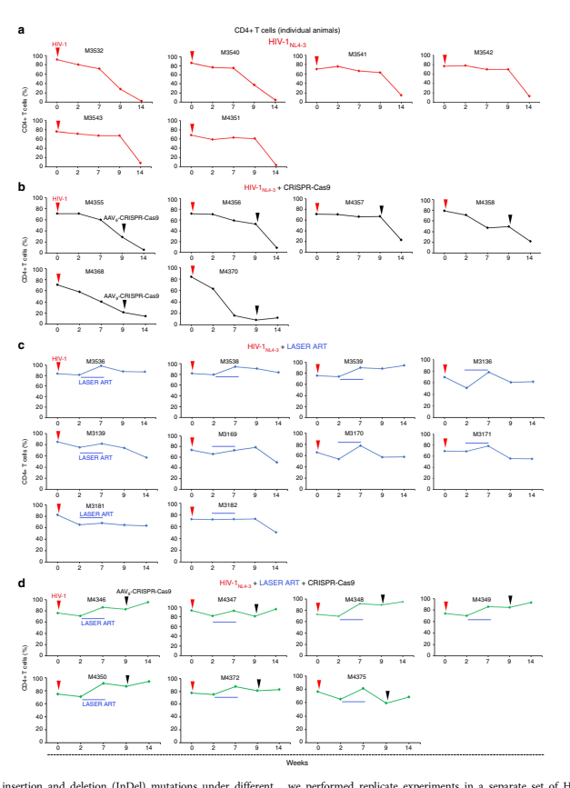
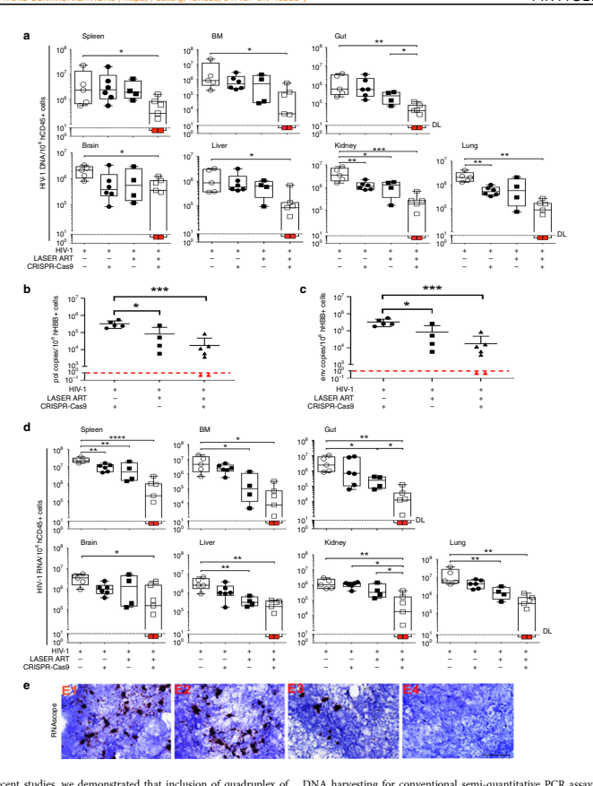
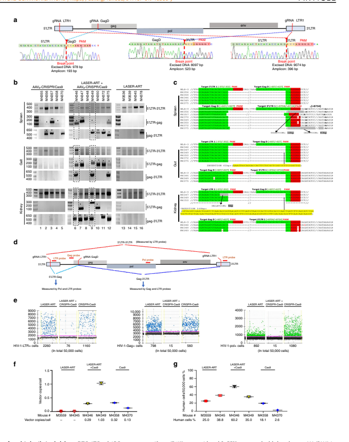
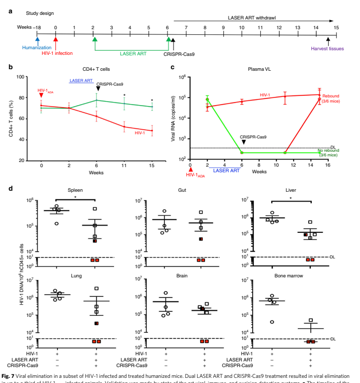
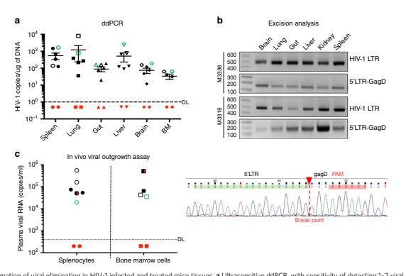
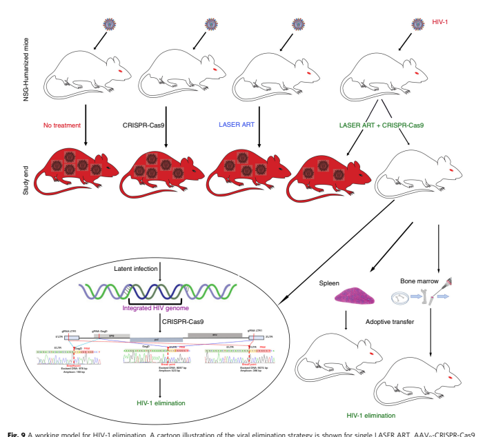

ARTICLE

# Https://Doi.Org/10.1038/S41467-019-10366-Y Open

## Sequential Laser Art And Crispr Treatments Eliminate Hiv-1 In A Subset Of Infected Humanized Mice

Prasanta K. Dash1,4, Rafal Kaminski2,4, Ramona Bella2,4, Hang Su1, Saumi Mathews1, Taha M. Ahooyi2, Chen Chen2, Pietro Mancuso2, Rahsan Sariyer2, Pasquale Ferrante2, Martina Donadoni2, Jake A. Robinson2, Brady Sillman1, Zhiyi Lin1, James R. Hilaire1, Mary Banoub1, Monalisha Elango1, Nagsen Gautam3, R. Lee Mosley1, Larisa Y. Poluektova1, JoEllyn McMillan1, Aditya N. Bade1, Santhi Gorantla1, Ilker K. Sariyer2, Tricia H. Burdo2, Won-Bin Young2, Shohreh Amini2, Jennifer Gordon2, Jeffrey M. Jacobson2, Benson Edagwa1, Kamel Khalili2 & Howard E. Gendelman1 Elimination of HIV-1 requires clearance and removal of integrated proviral DNA from infected cells and tissues. Here, sequential long-acting slow-effective release antiviral therapy (LASER
ART) and CRISPR-Cas9 demonstrate viral clearance in latent infectious reservoirs in HIV-1 infected humanized mice. HIV-1 subgenomic DNA fragments, spanning the long terminal repeats and the Gag gene, are excised in vivo, resulting in elimination of integrated proviral DNA; virus is not detected in blood, lymphoid tissue, bone marrow and brain by nested and digital-droplet PCR as well as RNAscope tests. No CRISPR-Cas9 mediated off-target effects are detected. Adoptive transfer of human immunocytes from dual treated, virus-free animals to uninfected humanized mice fails to produce infectious progeny virus. In contrast, HIV-1 is readily detected following sole LASER ART or CRISPR-Cas9 treatment. These data provide proof-of-concept that permanent viral elimination is possible.

According to UNAIDS, it is estimated that more than 36.7 million people worldwide are infected with the human immunodeficiency virus type one (HIV-1) and >5000 individuals worldwide are newly infected each day. In the clinic, antiretroviral therapy (ART) restricts viral infection by stalling various steps of the viral life cycle. However, ART fails to eliminate integrated copies of HIV-1 proviral DNA from the host genome1,2. As such, virus persists in a latent state within infectious reservoirs; and ART cessation readily leads to viral reactivation and disease progression to acquired immunodeficiency syndrome (AIDS)3. Thus, a major issue for any HIV-1 curative strategy is the means to eliminate either integrated proviral DNA
or the cells that harbor virus without collateral cytotoxic reactions. However, elimination of HIV-1 infection in its infected human host is documented only in two individuals4,5. There are several reasons why success has not yet been realized. This includes inadequate therapeutic access to viral reservoirs, rapid spread of infection by continuous sources of virus and susceptible cells and a failure to eliminate residual latent integrated proviral DNA. All single or combination therapeutic approaches preclude HIV-1 cure as viral rebound universally follows ART cessation6–10. Yet, another obstacle towards elimination of infection is that viral latency is established after infection onset and precedes peak viremia. This underscores that early intervention with potent antiretroviral medicines may help to further reduce the size of the reservoir and ultimately facilitate viral elimination11. Therefore, multimodal robust pharmaceutic strategies are needed for complete elimination of HIV-1 if no viral resurgence after cessation of ART is to be achieved. To address this need and design a suitable therapeutic strategy, our laboratories produce highly hydrophobic lipophilic viral reservoir penetrating antiretroviral prodrugs coined as long-acting sloweffective release ART (LASER ART). LASER ART properties are defined by slow drug dissolution, enhanced lipophilicity, improved bioavailability and limited off-target toxicities, which directly affect the frequency of ART administration from daily to weeks. These reduce disease co-morbidity in small animals and maintains effective antiretroviral drug concentrations in blood and tissue viral reservoirs from days to weeks12–16. Macrophages enable uptake of significant amounts of intracellular antiretroviral drug crystals and tightly control ongoing viral replication by the cells' slow drug release and transfer to adjacent CD4 + T cells during cell-to-cell contact or through direct drug uptake13,14,16–18. However, LASER ART alone cannot rid the infected host of latent HIV-1 no matter how successful the drugs may prove to be at restricting viral infection. Thus, in parallel, we develop CRISPR-Cas9 based gene editing technology using AAV9 delivery that specifically and efficiently excises fragments of integrated HIV-1 proviral DNA from the host genome19–24. We realize that CRISPR-Cas9-based technologies could be most effective in the setting of maximal viral restriction and substantive reductions in the absolute proviral DNA load. Thus, the two approaches are combined to examine whether LASER ART and CRISPR-Cas9 treatments could provide combinatorial benefit for viral elimination. Here we demonstrate elimination of replication competent HIV-1 in an experimental model of human infectious disease. Viral clearance is achieved from HIV-1 infected spleen and lymphoid tissues as well as a broad range of solid organs from documented prior infected humanized mice treated with LASER ART and AAV9-CRISPR-Cas9. This is confirmed in those mice using ultrasensitive HIV-1 nucleic acid detection methods by the absence of post-treatment viral rebound; and by the inability to transfer virus from those infected and dual-treated mice to replicate uninfected untreated mice. We conclude that viral elimination by a combination of LASER ART and gene editing strategy is possible.

## Results

Creation and characterization of HIV-1 infected humanized mice. With the knowledge that few small animal models of HIV-1 reflect actual viral reservoirs and long-term infections, another system for study is required. This is based both on known species restrictions for HIV-1 infection and long-term establishment of tissue reservoirs of infection. Human hematopoietic stem cells
(HSC) reconstituted NOD.Cg-Prkdcscid Il2rgtm1Wjl/SzJ (NSG)
mice produce human T cells, that are broadly susceptible to HIV1 infection23–30. The model permits evaluation of long-term viral infection in blood and tissues and ART-induced HIV-1 latency.

To affirm the model's relevance for studies of HIV-1 elimination, we undertook a detailed evaluation of each of the human cellvirus model components (Fig. 1). First, after irradiation of mice at birth, animals were engrafted with human CD34 + HSC isolated from cord blood by a single intrahepatic injection. The presence of human immunocytes in blood was confirmed by flow cytometry. Second, four months after humanization was confirmed animals were infected with HIV-1ADA at 104 tissue culture infection dose50 (TCID50)/animal and analyzed for acute
(14 days) (Fig. 1a–d) and chronic (16 weeks infection) (Fig. 1e–g)
paradigm. At sacrifice, human cell reconstitution was confirmed in tissues (spleen, lymph node, liver, lung and brain) by immunohistochemical staining with human HLA-DR antibodies.

Anatomical localizations and lymphocyte prominence were confirmed by human cell penetration into the white and red pulp and germinal centers of spleen. Lymph nodes were enriched with human cells with anatomical distinctions in the cortex, medulla and germinal centers. Third, productive HIV-1 infection was confirmed by HIV-1p24 staining as shown by large numbers of stained cells. Infection was highest in lymphoid compartments as compared to liver, lung and brain. A significant CD4 + T-cell decline and increased CD8 + T-cell numbers were observed as a consequence of sustained HIV-1 infection. The percentage of human CD4 + T cells in mice was determined in blood by flow cytometry at 2, 6, 11, and 15 weeks and showed decline after infection (Fig. 1f). Plasma viral RNA copies/ml 16 weeks after HIV-1 infection were readily observed (Fig. 1g).

Generation and pharmacokinetic (PK) testing of LASER ART.

We posit that use of CRISPR-Cas9 strategies developed for the elimination of HIV-1 proviral DNA are aided by optimal control of viral replication leading to sustained viral latency (supplementary fig. 1). To this end amongst others, our laboratories have developed LASER ART that facilitates sustained inhibition of viral replication by long-acting hydrophobic lipophilic antiretroviral nanoparticles11–15. To accomplish this goal, fatty-acidmodified prodrugs were synthesized as prodrugs for dolutegravir
(DTG), lamivudine (3TC) and abacavir (ABC) by esterification with myristic acid. The chemical structures and physicochemical properties were characterized by nuclear magnetic resonance spectroscopy and Fourier-transform infrared spectroscopy, electrospray ionization mass spectrometry and powder X-ray diffraction11–15. The LASER ART particles were characterized fully for stability, size, and shape. This included human monocytederived macrophage (MDM) nanoparticle drug uptake, release and potency. Data sets were obtained for nanoformulated myristoylated NM (NMDTG), NM3TC and NMABC prodrugs and nanoformulated rilpivirine (NRPV) (Table 1) before being used in the animal studies. These included individual antiretroviral activity for each of the nanoformulations. Moreover, complete PK profiles were performed for each of the nanoformulated drugs after a single drug nanoformulation injection. These are illustrated with the accompanying dosages administered in BALB/c mice (Table 1). The PK measurements including terminal rate

 

Fig. 1 Viral and human immune profiles in a HIV-1 infected humanized mice. a Human CD4 + T cells were determined by flow cytometry in blood of humanized mice before infection (time 0) and on days 3, 5, 7, and 14 after HIV-1ADA infection (n = 4, red color). Each infected animal received 104 TCID50 of titered virus. Uninfected (control, n = 3) animals are shown in blue. b Viral load measurements in plasma of HIV-1 infected humanized mice at 14 days. c HIV-1 DNA was detected by semi-nested real-time qPCR in tissue of infected animals at 14 days after viral infection (n = 4). d Representative images of human HLA-DR expression in spleen, lung, and lymph nodes, confirms human cell reconstitution in all animals. Replicate sections were stained for HIV1p24 and show large numbers of infected cells. Scale- bars (10 and 40 μm) e–g Immune cell profiles and viral load of tissue were evaluated 16 weeks after viral infection. e Photomicroscopic images illustrate human cells present in spleens, lymph nodes, lungs, livers and brains of humanized mice. Tissue sections stained with anti- human HLA-DR (upper 2 panels) and HIV-1p24 (bottom panels). f Total human CD45 + leukocytes, CD3 + and subpopulations of CD4 + and CD8 T + cells from blood of control (n = 15) and HIV-1 infected (n = 40) mice. g Plasma viral load was consist among the animals in both acute (14 days) and chronic (16 weeks) infectious paradigms, n = 54. One-way ANOVA and Bonferroni's post-hoc tests for multiple comparisons and twotailed Student's t-test were used for statistical analyses in a and f. *P < 0.05, ***P < 0.001. Source data are provided as a source data file

## Table 1 Cell And Animal Pk Data Sets For The Laser Art Nanoformulations

NMDTG NM3TC NMABC NRPV

Macrophage Uptake, Retention and Antiretroviral

Activity

Maximal prodrug uptake (μg/106 cells) 74.3 10.4 11.3 31.6 Prodrug retention (μg/106 cells) 10.0 ND 5.0 17.9

Drug Concentration tested (μM) 100 100 100 100

Multiplicity of infections (MOI) 0.01 0.01 0.01 0.01 Percent of HIV-1 inhibition (%) ND 99 99 99

Pharmacokinetics λz (1/day) 0.0506 0.6584 ND 0.1274

t1/2 (day) 13.77 1.05 ND 5.44

AUC last (daya ng/ml) 38995.2 1187.0 315.4 13694.9

AUC 0-∞ (daya ng/ml) 40727.9 1187.4 1513.8 13706.7

AUC % Extrapolation 4.34 0.03 79.17 0.086

Vb/F (L/kg) 22.1 64.0 ND 25.8

CL/F (L/day/kg) 1.1 42.1 ND 3.3

MRT 0-∞ 14.53 2.27 5.53 3.77

Tabular representation of in vitro activity of each of the four nanoformulated long-acting antiretroviral drugs (NMDTG, NM3TC, NMABC, and NRPV). The pharmacokinetic (PK) profile of each of the

nanoformulated drugs are illustrated with accompanying doses for mouse testing. The various parameters of PK measurement include terminal rate constant (slowest rate constant), (λz), terminal halflife (t1/2), area under the concentration-time curve (AUC), apparent volume of distribution after IM administration (Vb/F), apparent total plasma or serum clearance of drug after injection (CL/F), mean

resident time (of the unchanged drug in the systemic circulation) (MRT). Source data are provided as a source data file.

HIV-1ADA challenge 10 days after loading

ND could not be determined; no significant decline in drug levels from day 1 to day 14 after treatment aDoses: Single IM injection into mice; NMDTG, NMABC and NRPV = 45 mg/kg as DTG, ABC and RPV equivalents; NM3TC = 50 mg/kg as 3TC equivalents

Editing of viral DNA in ART treated T-cells by CRISPR-Cas9. In earlier studies, we demonstrated editing of HIV-1 proviral DNA by CRISPR-Cas9 in in vitro and ex vivo T cells18,22. Here, we adapted a procedure as schematized in supplementary fig 1 and found that at sub-optimum conditions for CRISPR editing of viral DNA, suppression of viral replication by treatment of cells with ART enhances the efficiency of proviral DNA editing by CRISPR. A higher inhibitory effect from LASER-ART compared to those seen in cells treated with conventional ART on HIV-1 expression was observed (Supplementary Fig. 1b and c).

Accordingly, cleavage of proviral DNA by (lentiviral), CRISPRCas9 was more robust in cells treated with LASER ART than those treated with conventional ART (supplementary fig. 1d and e). The integrity of the editing at the designated sites within the LTR sequences and the specificity of the cleavage were verified by DNA sequences (supplementary fig. 1f). These observations suggest that LASER ART therapy, by keeping the integrated HIV1 copies to a minimum, improves the ability of CRISPR-Cas9 to edit integrated proviral DNA.

Viral rebound after LASER ART and AAV9-CRISPR-Cas9 treatment of infected humanized mice. With the model and therapies in hand, we next evaluated the ability of LASER ART
and CRISPR-Cas9 to affect viral rebound after therapeutic interruption in HIV-1 infected humanized mice (Fig. 2a). In these experiments, HSC reconstituted NSG mice (n = 33) were infected with 104 TCID50 of HIV-1NL4-3 for 2 weeks. Four representative animals were sacrificed at this time point to confirm viral infection establishment from various tissues. At this time, depletion of CD4 + T cells (Fig. 2b) was coincident with plasma viral RNA at a median of 2.2 × 105 copies/ml (Fig. 2c).

The remaining 29 HIV-1 infected animals were divided into four groups with four more uninfected untreated animals serving as uninfected controls. The first group (n = 6) of mice were left untreated (HIV-1 control), the second group (n = 6) received a single intravenous (IV) injection of AAV9-CRISPR-Cas9, 1012 GC (genome copy) units, with a volume of 50 μl; the third group
(n = 10) were administered LASER ART that consisted of 45 mg/
kg parent drug equivalents of nanoformulated RPV and myristoylated DTG, and 40 mg/kg parent drug equivalents of myristoylated 3TC and ABC nanoparticles by intramuscular (IM)
injection. A fourth group (n = 7) received LASER ART followed by AAV9-CRISPR-Cas9. Eight weeks following the last administration of LASER ART and five weeks after the single AAV9-
CRISPR-Cas9 treatment animals were observed for evidence of viral rebound (Fig. 2c). In the group that received LASER ART
with subsequent AAV9-CRISPR-Cas9, viral rebound was not observed in two animals. Examination of the plasma viral load (Fig. 2d) for each individual animal showed drastic decline in the viral copy number to below detectable levels in the group of animals treated with LASER ART. Removal of LASER ART led to rebound in all 10 animals treated with LASER ART alone and in five out of seven animals that received both LASER ART and AAV9-CRISPR-Cas9. Repeated search for the viral RNA in the plasma of two animals, M4346 and M4349 (Fig. 2d framed in red), failed to detect evidence of viral presence. In the absence of LASER ART, numbers of CD4+ T cells relative to controls were 4  

15 ± 6% and < 6% in groups 2 and 1, respectively (Fig. 2b). The CD4 + T cell profile of each animal is shown (Fig. 3) for all treatment groups. Disease was determined by declining percentages of CD4 + T cells. Results showed a robust restoration of CD4 + T cells in the animals that received LASER ART alone or in combination with AAV9-CRISPR-Cas9 as compared to infected controls and AAV9-CRISPR-Cas9 alone treated animals
(Figs. 2b and 3).

Next, we evaluated the number of total human cells (CD45 + )
and T cells (CD3 + ) by flow cytometry and demonstrated sustained human cell numbers in both control (uninfected), infected and treated animals at and beyond four months until the
  5 Fig. 2 Viral load and CD4 + T cells in HIV-1 infected and treated humanized mice. Mice were infected with 104 TCID50 of HIV-1NL4–3 followed by treatments with LASER ART, CRISPR-Cas9 or both. a The study scheme shows the times of infection and treatments. After confirmation of viral infection, 29 infected humanized mice were subdivided into four groups. The first group (n = 6, red) were left untreated (control), the second group (n = 6, black)
received a single intravenous (IV) dose of AAV9-CRISPR-Cas9 (1012 units), nine weeks after viral infection, the third group (n = 10, blue) were administered LASER ART (NMDTG and NRPV at 45 mg/kg and NMABC and NM3TC at 40 mg/mg) by intramuscular (IM) injection two weeks after viral infection, the fourth (n = 7, green) were given LASER ART (as in group 3) and three weeks after the last LASER ART treatment, a single IV dose of AAV9-
CRISPR-Cas9 was administered as in group 2. LASER ART treatment was ceased and after an additional five weeks, antiretroviral drug levels were assessed and were at or below the limit of quantitation < 1 ng/ml (Table 1). b Flow cytometry for human CD4 + T cells are shown with increased numbers of CD4 counts in the LASER ART and dual LASER ART and CRISPR-Cas9 groups. c Evaluation of plasma viral load indicated that after administration of AAV9-
CRISPR-Cas9, 2 of 7 mice showed no evidence for viral rebound at 14 weeks. d Plasma viral load of individual animals for different treatment groups of humanized mice were assayed at 2, 7, 9, and 14 weeks of HIV-1 infection for HIV-1 RNA. Viral RNA levels were determined by the COBAS AmpliprepTaqman-48 V2.0 assay with a sensitivity of 200 copies/ml once adjusted to the plasma dilution factor. Viral RNA rebound was observed at the study end in all 10 LASER ART treated animals. This corresponded to eight weeks after therapy interruption. Rebound was also observed at the study end in 5 of 7 dual-treated animals. Virus was not observed in two dual-treated animals (M4346 and M4349) and are highlighted in the red boxes. Source data are provided as a source data file study conclusion (Fig. 4a, b respectively). The presence of human CD4 + cells (Fig. 4c) and HLA-DR in spleen was observed to confirm graft stability. We also observed restoration of CD4 +
T cells in spleens of dual-treated animals (Fig. 4c). This was further confirmed by the identification of species-specific DNA
sequences in spleens of all animal groups independent of treatments administered (Fig. 4d). Indeed, cell numbers proved constant following all CRISPR-Cas9 and LASER ART interventions.

RNA were eliminated despite the presence of high numbers of human cells (supplementary fig. 3).

On and Off target CRISPR-Cas9 effects. We next evaluated on and off target CRISPR-Cas9 effects in infected and treated animals. In these experiments, gel electrophoresis was performed in PCR-amplified DNA fragments from infected and treated animals using pairs of primers designed to detect cleavage (Fig. 6). As expected, excision of viral DNA fragments was readily observed from spleen, gut, and kidney samples of animals treated with LASER ART and CRISPR-Cas9 (Fig. 6b). Excision of the predicted fragment in lung, liver, and brain amongst other tissues was also observed (supplementary fig. 4). The excision type differed in the various tissues amongst animals. The integrity and precision of the HIV-1 DNA excision by CRISPR-Cas9 were verified by sequencing (Fig. 6c, and supplementary figs. 5–7). In mice that received CRISPR-Cas9 without LASER ART, fragmental deletion was detected. Several other DNA fragments in tissues from animals that received LASER ART alone were amplified, but after sequencing were found unrelated to HIV or CRISPR-Cas9 editing. This observation likely represented replication defective HIV-1 (highlighted by double asterisks, Fig. 6b).

The efficiency of the proviral DNA excision by CRISPR-Cas9 in the spleens of two infected humanized mice from the CRISPRCas9 and LASER ART group (animals where no rebound was observed) was determined by ddPCR. Excision efficiency was estimated to be 80% in both 5′-LTR-Gag and Gag to 3'-LTR in mouse M4349. Transduction efficiency was determined by ddPCR and ranged from 0.12–1.03 AAV vector copies/cell
(Fig. 6d–f). Amplification of the DNA fragments corresponding to the control housekeeping actin gene in tissues and expression of gRNAs and Cas9 are shown in supplementary fig 8.

Clustering analysis revealed similar excision patterns with high efficiency across the tissues in animals that received dual treatments compared to those that received CRISPR-Cas9 alone
(supplementary fig. 9). However, results from sequencing of several selected sites with high scores of specificities and/or their locations in the exons ruled out off-target effects (supplementary figs. 10 and 11, and supplementary table 3). Further, results from whole genome deep sequencing of DNA from spleens of four treated animals, including two animals that showed no rebound after dual treatment and one from each of the two single treatment groups was performed and then confirmed by bioinformatics analyses. No detectable off target effects on more than one hundred predicted sites that were seen can be attributed to CRISPR. This was done by identifying somatic genomic alterations including structural variants (SVs), single nucleotide polymorphisms (SNPs), copy number variations (CNVs) and HIV-1 elimination in LASER ART and CRISPR-Cas9-treated mice. Next, we determined viral DNA and RNA levels in tissues
(Fig. 5) using ultrasensitive semi-nested real-time qPCR with primers and probes designed for detection of HIV-1 gag. DNA
analysis revealed that combination treatment (n = 7) was more effective than either LASER ART (n = 10) or CRISPR-Cas9 alone (n = 6) in DNA copy reductions. The spleen, bone marrow (BM),
gut, brain, liver, kidney, and lung of mice M4346 and M4349 showed no rebound. Results from targeted qPCR for DNA
sequence detection excluded the presence of DNA corresponding to pol and env genes in the two, dual-treated and virus eradicated animals (Fig. 5a–c). Similarly, results from the RNA detection assay corroborated these results and showed that combination of LASER ART and CRISPR-Cas9 reduced HIV-1 RNA in select animals with complete absence of viral RNA in M4346 and M4349 (Fig. 5d). The presence of HIV-1 RNA was also examined by RNAscope using 5 μm thick spleen sections from infected animals and antisense probe V-HIV-1 Clade-B designed for targeting base pairs 854–8291 of HIV-1NL4–3 (Fig. 5e). Viral DNA
and RNA were not detected in plasma or tissues from both mice. Cells and tissues obtained from mouse M4346 contained no viral nucleic acid (Fig. 5e). Further evidence supporting the absence of HIV-1 genomes in animals M4346 and M4349 was provided by digital droplet PCR (ddPCR) (supplementary fig. 2). Verifying prior qPCR results, no viral DNA/RNA (assay's detection sensitivity of < 2 viral copies) was detected in spleen, bone marrow, and gut of mice M4346 and M4349. The data, taken together, all support the findings of complete HIV-1 elimination. In further cross validation tests, viral rescue assays were performed by coculturing bone marrow cells and splenocytes of representative animals with phytohemaglutinin/interleukin-2 (PHA/IL-2)- stimulated peripheral blood mononuclear cells (PBMCs). These tests were performed for an additional two weeks. Representative data from these experiments showed that while HIV-1 was rescued from 100% of samples with detectable viral DNA and RNA,
no evidence for virus recovery was observed in the samples from the two animals (M4346 and M4349) where HIV-1 DNA and 6  

we performed replicate experiments in a separate set of HSC-
reconstituted NSG mice infected with a second macrophage tropic viral strain (HIV-1 ada) (Fig. 7a). Animals were infected with 10 4 TCID 50 of HIV-1 ADA for two-weeks, at which time depletion of CD4 + T cells was observed and viral RNA copies in plasma  were  recorded  at  a  median  level  of  8.4 × 10 4  copies/ml apeutic elimination. To validate eradication of HIV-1 infection, NATURE COMMUNICATIONS| (2019)10:2753|https://doi.org/10.1038/s41467-019-10366-y |www.nature.com/naturecommunications 7 Fig. 3 Human CD4 + T cells in HIV-1 infected and treated humanized mice. a–d Peripheral blood of humanized mice was assayed before and 2, 7, 9, and 14 weeks after HIV-1NL4-3 infection and the presence of human CD4 + cells from CD3 + gated populations were examined. a Percentage of human CD4 +
T cells followed a decreased pattern in all mice (n = 6, red) in the HIV-1 infected group. b Percentage of human CD4 + T cells were decreased in all mice (n = 6, black) in the HIV-1 infected and AAV9-CRISPR-Cas9 group. c CD4 + T cell profile of HIV-1 infected and LASER ART animals (n = 10, blue) showed a decline in CD4 + T cell numbers two weeks after viral infection. LASER ART was eliminated eight weeks after treatment. d CD4 + T cells of HIV-1 infected and LASER ART and AAV9-CRISPR-Cas9-treated animals (n = 7, green). Decreased CD4 + T cell numbers were seen as early as two weeks after infection. At this time, LASER ART was administered for four weeks followed by AAV9-CRISPR-Cas9 given at week 9. The mice were then followed for an additional five weeks. Restoration of CD4 + T cells was observed in both LASER ART and LASER ART and AAV9-CRISPR-Cas9 treatment groups. Source data are provided as a source data file
(Fig. 7b–c). Semi-nested real-time qPCR of HIV-1 nucleic acid confirmed tissue viral infection from three representative animals.

Infected animals were divided into three groups, a no treatment infected group (n = 4); those that received LASER ART (combinations of DTG, RPV, 3TC, and ABC) with (n = 6) or without CRISPR-Cas9 (n = 7). Animals were observed for ten weeks after cessation of LASER ART for viral rebound. Continuous viral replication was readily observed in untreated animals and those treated with only LASER ART. Notably, three of six LASER ART
and CRISPR-Cas9-dual-treated animals had no demonstrable viral rebound (Fig. 7c). In these mice, protection of CD4+ T cell counts (71.3 ± 3.5%) was observed compared to infected controls
(48.3 ± 4.5%) (Fig. 7b). The CD4 + T cell and viral load profiles for each of the individual animals are shown (supplementary figs. 14–15). As in the first experiment, detection of human DNA
sequences in spleen confirmed uniform presence of human cells in lymphoid tissues of all humanized mice regardless of treatment. Moreover, no evidence of viral gene expression was found in another two animals (M3319 and M3336) employing qPCR
tests for DNA sequence detection (Fig. 7d). HIV-1 genome amplification was also absent in these two mice and were confirmed by the ddPCR (Fig. 8a) and RNAscope tests (supplementary fig. 16). One animal out of three that had no demonstrable rebound in plasma showed detectable HIV-1 DNA
in tissues (split red-black structure, Fig. 7d), confirming the important role that tissue reservoirs play during HIV-1 infection. Viral DNA by PCR, gel electrophoresis, and Sanger sequencing verified the ability of CRISPR-Cas9 to excise the target DNA
fragment positioned between the LTR and GagD (Fig. 8b and supplementary fig. 17).

Finally, splenocytes and bone marrow cells were isolated from HIV-1 infected mice with or without prior LASER ART and/or CRISPR-Cas9 treatments at the study end. These cells were used in adoptive transfer studies performed in uninfected drug naive humanized mice to examine the potential rebound from latent reservoirs not detected by standard ddPCR and nested PCR. In addition, as positive controls, two animals from the HIV1 infected group, one from the LASER ART alone treatment group and five animals from the dual treatment group were used as controls for adoptive transfers (Fig. 8c and supplementary fig. 18). Recipient mice were sacrificed after 30 days and analyzed for plasma viral RNA. Virus was not detected in plasma from animals that received splenocytes or bone marrow cells isolated from sequentially LASER ART CRISPR Cas9-treated animals (M3319 and M3336). In contrast, virus was readily identified in all virus infected or virus infected and LASER ART
treated animals. One animal each from the HIV-1- and dualtreated bone marrow injected group died prior to the assay performance and as such these data were not included. In conclusion, the in vivo viral outgrowth assays performed from virus eliminated dual-treated mice to new uninfected recipient humanized mice failed to demonstrate viral recovery after one month following adoptive transfers (Fig. 8c). Also, no histopathological evidence for cytotoxicities were detected in any of the animals by conventional microscopic test evaluations of liver
(supplementary fig. 19).

To provide an additional level of confirmation to these observations, a third series of studies using replicate procedures were performed. Here, we confirmed the ability of LASER ART
and CRISPR-Cas9 to eliminate viral rebound in a new cohort of CD34 + HSC-reconstituted animals infected with HIV-1ADA. The outcome of the virological assays showed no evidence of the presence of replication competent virus in four out of ten animals tested after removal of LASER ART in the dual therapy group
(supplementary Table 6). All HIV-1 animals that received no or single treatments showed viral rebound after treatment was stopped. Notably, in all three experiments and in all treatment groups, no demonstrable changes in the animals' well-being or histopathology were observed.

Altogether, the results from three independent sets of studies revealed that a third or more of the animals that received sequential LASER ART and CRISPR-Cas9 therapy became virus free (supplementary Table 6). Most likely, successful outcomes for virus elimination in these animals reflect a combination of factors that include viral set points, extent of a previously established tissue viral reservoir, efficient intracellular and tissue delivery of LASER ART, transduction efficiency and excision therapy at sites of viral growth. Future work will begin to dissect each and all of these factors pointing to viral elimination pathways.

LASER ART was administered then removed with consequent CRISPR-Cas9 excision. Plasma drug levels were monitored until they reached levels that were at or below the limit of detection. In these three independent experiments, one with HIV-1NL4–3 and the other two with HIV-1ADA infection of humanized mice, single treatments with LASER ART or AAV9-
CRISPR-Cas9 resulted in viral rebound in 100% of treated infected animals. In dual LASER ART and AAV9-CRISPR-Cas9treated mice, virus was eliminated from cell and tissue reservoirs in up to a third of infected animals as illustrated (Fig. 9).

## Discussion

While ART has transformed HIV-1 infection into a chronic treatable disease, virus persists in tissues that include the gut, lymph nodes, brain, spleen amongst other sites. The inability of ART to eliminate virus in these tissue sanctuaries remains the major obstacle towards a disease cure. Such a limitation is linked, in large measure, to continuous long-term infections in CD4 +
memory T cells and less frequently in mononuclear phagocytes despite both directed host antiviral immunity and ART effectiveness. Thus, one may predict that, any or all steps towards HIV
elimination must include precise targeted ART delivery, maintenance of vigorous immune control, effective blockade of viral growth and immune-based elimination of pools of infected cells or genome integrated proviral DNA. Even under these conditions, the presence of replication competent virus that allows lowlevels of viral production and viral latency underscores employment of strategies that eliminate virus that is integrated but latent.

Because of notable graft versus host disease in several humanized

Fig. 4 Human leukocytes in blood and spleens of humanized mice. a, b Peripheral blood of HSC reconstituted mice was assayed before and after 2, 7, 9, and 14 weeks of HIV-1NL4–3 infection for human CD45 + (A) and CD3 + (B) cells. The experiments were performed to assess levels of humanization and percentage of total CD3 + T cells throughout the study. These included uninfected (n = 3, green), HIV-1NL4–3 infected (n = 6, red), HIV-1 and AAV9- CRISPR-Cas9-treated (n = 6, black), HIV-1 and LASER ART (n = 10, blue), and HIV-1 and LASER ART and AAV9-CRISPR-Cas9 (n = 7, blue/black) treated mice. All are shown from data generated from the experiments outlined in Fig. 3. In the HIV-1 infected mice group, the numbers of CD45 + and CD3 +
human cells in blood of mice were comparable to the treatment groups. We did not observe any differences amongst time points when compared to control uninfected and untreated animals. c Immunohistochemistry was performed in spleens of HIV-1 infected mice to confirm T cell reconstitution. Here, the spleens of infected animals treated with LASER ART or both LASER ART and CRISPR-Cas9 were examined for the presence and numbers of CD4 +
T cells. Significant reductions in CD4 + T cells (brown stained cells) were seen readily in the HIV-1-infected control mice. These cells were protected in HIV-1 infected animals treated with LASER ART with or without CRISPR-Cas9. Scale bar, 10 μm. d Verification of the presence of human cells in the spleens of humanized mice. PCR analysis of genomic DNA isolated from the spleens of humanized mice using primer sets specific to human and mouse betaglobin. Source data are provided as a source data file responses to the viral infection12,17,29,36,37,39. These previously published data support the successful use of humanized mice in studies of HIV/AIDS pathogenesis, therapeutics40–42, and treatment12–14,16,18,29,43,44. These studies, taken together, clearly provide a rationale for the scientific approaches taken in the current report12,13,29,43,45–47.

Therefore, our approaches towards evaluating viral cures have included the demonstrated ability of the drugs to reach sites of latent infection and to do so at significant levels18,37,39,43,44.

Notably, the use of molecular tools can permanently eliminate the viral genome and preclude reactivation20,21,24,48. Thus, we suggest that the current successful outcome in achieving this goal in more than 30% of the infected experimental animals reflects the combinatorial use of a suitable animal model, control of viral set points, reach to the viral reservoirs, delivery and intracellular drug penetration of potent LASER ART, and the widespread employment of CRISPR-Cas9 gene editing. The latter enabled high efficiency excision of large fragments of the viral genome from anatomically privileged tissues. Results support the idea that maximal viral restriction must be first established prior to excision to achieve optimal viral editing by CRISPR-Cas9.

Current HIV-1 treatment patterns are defined by daily dosing of a combination of either two nucleoside reverse transcriptase inhibitors (NRTIs) and one integrase strand transfer inhibitor
(INSTI), or two NRTIs and one nonnucleoside reverse transcriptase inhibitor. Rebound that follows affects both the number and function of CD4 + T cells leading to virus-associated comorbid conditions. LASER ART was developed in an attempt to eliminate these limitations and was shown effective in establishing drug depots in macrophages with sustained antiretroviral activities and reductions in HIV-1 proviral load beyond ART
alone15,38,47,49–55. The success in these prior studies led to the use of LASER ART in the current report in order to maximize ART
ingress to cell and tissue sites of viral replication enabling the drugs to reach these sites at high concentrations for sustained time periods. The maintenance of slow drug release for times measured in weeks or longer provided optimal settings for viral excision17,39,47. ART particles coated with poloxamers enabled lipophilic hydrophobic prodrug crystals to readily cross cell and tissue barriers, aiding precision drug release to viral sanctuary sites12–14,37,39,46. These claims are reinforced by our prior studies demonstrating up to a 10-fold increase in viral restriction at two independent multiplicities of infection in CD4 + T cell lines with LASER ART when compared to conventional native drugs12,13.

The advantages of LASER ART over native ART include rapid entry across cell membranes of both CD4 + T cells and macrophages (due to drug lipophilicity); accelerated antiretroviral drug entry into viral reservoir sites (including the brain, gut, lymph nodes, liver, bone marrow and spleen); increased intracellular drug delivery; and stable plasma concentrations observed over weeks to months. The ART were selected in order to produce sustained plasma concentrations 4X the protein-adjusted 90% inhibitory concentration. Notably, a single parenteral dose of NMDTG at 45 mg DTG equivalents/kg to mice provided plasma DTG concentration of 88 ng/ml at 56 days32. Liver, spleen and lymph node DTG concentrations were 8.0, 31.2 and 17.6 ng/g, respectively at 56 days following single treatment. At 14 days after NMABC and NM3TC given at 50 mg ABC or 3TC equivalents/kg to mice, ABC and 3TC plasma concentrations were 21 and < 7 ng/
ml, respectively12–14. In summary, there was little to no residual ART in plasma or tissue at the time of animal sacrifice reflecting the robust viral rebound found in all infected mice treated with LASER ART alone. Further, significant efforts were made by us to demonstrate that one month after LASER ART was discontinued, viral rebound was detectable. All of this highlights the rationale for use of LASER ART over native ART. Most importantly, our research12–14 demonstrated that ART levels in plasma were undetectable during the period of measured viral rebound.

For elimination of proviral DNA, we chose the CRISPR-Cas9 gene editing platform and created a multiplex of gRNAs that caused cleavage of the viral genome at the highly conserved regions within the LTRs and the Gag gene. This strategy allowed for the removal of the large intervening DNA fragments across the viral genome and mitigated any chance for the emergence of virus escape mutants20,23. In support of this notion, results from cell culture and animal adoptive infection studies showed the absence of replication competent HIV-1 in the spleen and bone marrow of animals with no rebound that could be attributed to virus escape. Our choice for the use of AAV9 comes from earlier studies demonstrating the broad range tissue distribution of CRISPR-Cas9 in a mouse model20. Accordingly, the results in our current study verified the bioavailability of our gene editing molecule in various organs of the NSG humanized mice. No offtarget effects were detected in in vivo deep sequencing and bioinformatics analysis that may be caused by the CRISPR-Cas9 editing strategy. Nevertheless, as expected naturally occurring cellular DNA variation was found in both untreated cells as well as in CRISPR-Cas9-treated cells. Examination of several potential target cellular genes performed on clonal cells expressing CRISPR-Cas9 by gene amplification and direct sequencing showed no mutations that may be caused by the presence of CRISPR-Cas9 in the cells.

Results from ddPCR showed 60% to 80% efficiency of viral DNA excision by CRISPR-Cas9. Of note, this approach quantified dual cleavage events that removed the DNA fragment spanning 5'LTR to 3'LTR, 5'LTR to gag, and gag to 3'LTR of the proviral genome. However, the occurrence of single site editing events that would permanently interrupt the viral DNA and potentially inactivate viral replication by introducing small InDel mutations at the cleavage sites are not included in this estimate19. Therefore, viral activation and rebound may not be observed under the conditions whereby excision efficiency is less than 100%. In 10  

Fig. 5 Viral DNA and RNA in HIV-1 infected and treated humanized mouse tissues. a HIV-1 DNA and (d) HIV-1 RNA analyses using ultrasensitive seminested real-time qPCR assays from spleen, bone marrow, gut, brain, liver, kidney, and lung from treatment groups described in Fig. 4a–c. Animal numbers were decreased in one group due to deaths seen through the experimental observation period. The data represent each of the four groups HIV-1 infected
(n = 5), HIV-1 infected and AAV9-CRISPR-Cas9 treated (n = 6), HIV-1 infected and LASER ART treated (n = 4) and HIV-1 infected LASER ART and AAV9-
CRISPR-Cas9-treated mice (n = 7). The data are expressed as total HIV-1 DNA (a) or HIV-1 RNA (d) copies/106 human CD45 + cells. Two animals, M4346 and M4349 [shown by the red squares below the dashed lines (detection limit)], with dual treatments, showed sterilization of virus from all tissues analyzed. b, c Quantitative PCR showed complete elimination of signals corresponding to pol (b) and env (c) DNA sequences of HIV-1 in mice M4346 and M4349 (shown as red triangles). One-way ANOVA and Bonferroni's post-hoc tests for multiple comparisons and two-tailed Student's t test were used for comparisons between two groups for statistical analyses. *P < 0.05, **P < 0.01, ***P < 0.001, ****P < 0.0001. e Representative results from RNAscope assay revealed the detection of single or clusters of brown dots corresponding to HIV-1 RNA in 5 μm-thick spleen sections of infected animals receiving either LASER ART or CRISPR-Cas9 alone, but not both (M4346). E1, humanized mice infected with HIV-1 (controls); E2, HIV-1 infected animals treated only with CRISPR-Cas9; E3, HIV-1 infected LASER ART treated animals demonstrating viral rebound after cessation of therapy; E4, infected animals treated with LASER ART followed by CRISPR-Cas9. E1-E4 are representative tissue sections taken from each of the animal groups. In these assays, we used the antisense V-HIV1-Clade-B targeting 854–8291 bp of HIV-1 as the probe. Scale bar 40μM. Source data are provided as a source data file

## Facilitate Effective Hiv-1 Elimination Strategies In An Infected Human Host56.

In conclusion, we employed a broad range of highly sensitive tests to evaluate HIV-1 elimination by LASER ART and AAV9delivered CRISPR-Cas9 treatments. These included viral gene amplification, flow cytometry, adoptive viral transfers, on target and off target assays, and measures of viral rebound to demonstrate that combination therapies can safely lead to the elimination of HIV-1 infection. Results demonstrated that eradication of replication-competent HIV-1 present in infectious cell and tissue sites of infected animals can be achieved. Although reappearance of viremia in humans can be delayed6, rebound occurs on average 2 to 4 weeks after ART interruption6,57,58 and 5 to 11 days in humanized mice59. Despite the vigorous treatments offered, there was no evidence of outward untoward effects of any therapies
(supplementary fig. 19)12 including the persistence of human adult lymphocytes in mouse plasma and tissue (Fig. 4). As such, these proof-of-concept results offer readily defined and realistic pathways toward strategies for HIV-1 elimination. Future studies are designed to improve delivery of agents to viral reservoirs and specifically eliminate residual latent viral infections. This is a first important step towards a longer journey for viral eradication.

## Methods

Cell culture reagents. 4-(2-Hydroxyethyl)-1-piperazineethanesulfonic acid
(HEPES) buffer and ciprofloxacin were purchased from Sigma-Aldrich, St. Louis, MO. Diethyl ether, endotoxin-free water, gentamicin, acetonitrile (ACN), methanol, KH2PO4, bovine serum albumin (BSA), Triton X-100, LC-MS-grade water, and TRIzol reagent were purchased from Fisher Scientific, San Diego, CA. The TZM-bl reporter cell line (AIDS Reagent Program, Division of AIDS, NIAID, NIH, Bethesda, MD) and HEK-293T cells (the American Type Culture Collection (ATCC), Manassas, VA) were cultured in high glucose DMEM supplemented with 10% FBS and gentamicin (10 µg/ml). Jurkat (Clone E6–1, TIB-152™) cells were purchased from ATCC and cultured in Roswell Park Memorial Institute (RPMI) medium containing 10% FBS and gentamicin (10 µg/ml) (Sigma-Aldrich, St. Louis, MO). PBMCs were isolated from leukopaks by gradient centrifugation on FicollPaque for 30 minutes at 600 g. PBMCs collected from the buffy coat were stimulated with PHA (5 µg/ml) for 24 h in RPMI with 10% FBS and gentamicin (10 µg/
ml) supplemented with human recombinant interleukin-2 (rIL-2) at a concentration of 30 ng/ml ((STEMCELL Technologies, Seattle, WA). Fresh media was exchanged every 2–3 days.

Cell culture HIV-1 infection. HEK-293T cells were transfected using CaPO4 precipitation method in the presence of chloroquine (50 µM) with 30 µg of pNL4–3-
EGFP-P2A-Nef plasmid22 /2.5 × 106 cells/100 mm dish. Next day, media were replaced; and 24 and 48 h later supernatants were collected, clarified at 1400 g for 10 minutes, filtered through 0.45 µm filter, and concentrated by ultracentrifugation for 2 h with 20% sucrose cushion. Viral pellets were resuspended in Hank's Basic Salt Solution (HBSS) by gentle agitation overnight, aliquoted, and tittered in Jurkat cells by FACS for GFP expression. Jurkat cells were infected by spinoculation for 1.5 h, 32 °C in 500 µl inoculum containing 8 µg/ml polybrene then resuspended and left for 4 h then 500 µl of growth medium was added. Next day, cells were washed 3 times with phosphate-buffered saline (PBS) and re-suspended in growth medium.

## Design Of Grna, Construction Of Crispr-Cas9 Expression Plasmid And The

AAV9 vector. Bioinformatics design and cloning of LTR1 and GagD gRNAs into AAV-CMV-saCas9 vector was previously described19,23. Briefly, the Broad Institute gRNA designer tool (https://www.broadinstitute.org/rnai/public/
analysis-tools/sgrna-design) was used to screen HIV-1NL4–3 or ADA sequences for possible gRNA protospacer regions followed by saCas9 specific PAM: NGGRR
(N). A pair of gRNAs showing the best predicted on-target (in HIV-1 genome)
and the lowest off-target (in human genome) activities was selected: one targeting the HIV-1 LTR promoter region and the other targeting gag gene. The sequences of respective LTR1 and GagD gRNAs plus PAM were further cross referenced with Los Alamos HIV sequence database confirming high levels of conservation (>90%) across the HIV-1 sequences. Next, pair of oligonucleotides for each target site with 5′-CACC and 3′-AAAC Bsa1 overhangs was obtained from Integrated DNA Technologies (IDT, Coralville, Iowa, Table S1), annealed, phosphorylated, and ligated into BsaI digested, dephosphorylated pX601-AAVCMV:NLS-saCas9-NLS-3xHA-bGHpA;U6::BsaI-sgRNA (a gift from Feng Zhang via Addgene) (61591; Addgene). For multiplex gRNA cloning, the U6-LTR1gRNAscaffold cassette from pX601-CMV-saCas9-LTR1 was amplified using T795/T796 primers (Table S1) and cloned using In-Fusion HD Cloning Kit
(Clontech, Mountain View, CA) into EcoRI and KpnI linearized pX601-CMVsaCas9-GagD plasmid resulting in pX601-CMV-saCas9-LTR1-GagD AAV
delivery vector. Finally, sequence verified plasmid was sent for packaging into AAV-9 serotype (Vigene Biosciences Inc., Milton Park Abingdon, UK). AAV9 was chosen as the vector for CRISPR-Cas9 delivery for its robust transduction efficiencies in multiple tissues including the central nervous system as significant putative reservoirs for HIV-1. The notion was to permit efficient AAV entry into all putative HIV-1 target tissues including the brain.

HIV-1 infection of CD34 + humanized mice. NSG (NOD.Cg-Prkdcscid Il2rgtm1Wjl/SzJ) mice were obtained from the Jackson Laboratories, Bar Harbor, ME and bred under specific pathogen-free conditions at the University of Nebraska Medical Center (UNMC) in accordance with the ethical guidelines set forth by the National Institutes of Health for care of laboratory animals. CD34 + HSC were enriched from human cord blood or fetal liver cells using immune-magnetic beads
(CD34 + selection kit; Miltenyi Biotec Inc., Auburn, CA, USA). CD34 + cell purity was >90% by flow cytometry. Cells were transplanted into newborn mice irradiated at 1 Gy using a RS‐2000 × ‐Ray Irradiator (Rad Source Technologies, Buford, GA).

Cells were transplanted by intrahepatic (i.h.) injection of 50,000 cells/mouse in 20 μl phosphate-buffered saline (PBS) with a 30-gauge needle. The experiments shown in Fig. 2–6 were from human fetal liver cells were isolated from a single donor. In the study described in Figs. 7 and 8, cord blood-derived HSC were obtained from two donors. Mice from a single donor were used for all dual treatment mice.

Humanization of the animals was affirmed by flow cytometry31,60 for the presence of human CD45 and CD3 positive blood immune cells, as shown in Fig. 4. At 18 weeks of age, 25 NSG-hu mice were infected intraperitoneally (i.p.) with HIV1NL4–3 32,36 at 104 tissue culture infective dose50 (TCID50)/ml and sacrificed at days 1, 3, 7, and 14; n = 5 at each time point. Five control-uninfected animals were included in all test evaluations. Levels of viral RNA copies/ml were analyzed with the automated COBAS Ampliprep System V2.0/Taqman-48 system (Roche Molecular Diagnostics, Basel, Switzerland)30,31. For this assay, 100 μl of mouse serum was diluted to 1 ml with sterile filtered normal human serum. The detection limit of the assay after dilution is 200 viral RNA copies/ml. Although the eclipse phase for viral infection in humans remains variable61, the viral loads and CD4 + T
cell depletion levels observed in our infected humanized mice are in point of fact reflective of the disease course in an infected human host. Indeed, only after weeks of infection we do observe significant cell loss12,17,29,37,50. These findings can be viewed as an affirmation of the model including CD4 + T cell timed-restorations seen after ART as is seen in humans.

Nanoformulated antiretroviral drugs. DTG, 3TC and ABC were generous gifts from ViiV Healthcare, Research Triangle Park, NC. RPV was purchased from Hangzhou Bingo Chemical Co., Ltd, Hangzhou, China. Antiretroviral prodrugs and their polymer encasements were performed as previously described12–14.

Myristoylated modifications for DTG, 3TC, and ABC were made (referred to as MDTG, M3TC, and MABC) to enhance the incorporation into poloxamer 407
(P407) nanoparticles, while RPV was encased solely by poloxamer 338 (P338) in unmodified form using high pressure homogenization to form crystalline nanoformulated drugs. Particle size, polydispersity index, and zeta potential were determined by dynamic light scattering using a Malvern Nano-ZS (Malvern, Worcestershire, UK)49. Final drug concentrations in the nanoformulation suspensions and injection solutions were determined by HPLC-UV/Vis and
  13 Fig. 6 Excision of HIV-1 DNA by CRISPR-Cas9 in HIV-1 infected humanized mice. a Schematic illustration of proviral HIV-1NL4–3 DNA highlighting the positions of gRNA LTR1 and gRNA GagD target sites, their nucleotide compositions, and the three CRISPR-Cas9 induced break points. b Total DNA from spleen, gut, and kidney from three groups of animals used for PCR genotyping with primers sets derived from the 5'LTR, 3'LTR, and the HIV-1 gag gene. Predicted amplicons of 193 bp and 523 bp, which result from the excisions of DNA fragments between 5'LTR to Gag and Gag to 3'LTR, respectively, were selected for DNA sequencing. The fragment of 396 bp represents both populations of full length LTRs, as well as the chimeric of both 5' and 3'LTR after excision of entire proviral genome. Single asterisks above the bands point to the specificity of fragmental HIV DNA excision by CRISPR-Cas9 as verified by Sanger sequencing (supplementary figs. 3 and 4). The double asterisk depicts non-specific amplicons (supplementary fig. 2). The dashed boxes show the excised HIV-1 amplicons in the two animals with no viral rebound. c Representative DNA sequences from each group were aligned to the reference LTRGag region of the HIV-1NL4–3 sequence. The positions and nucleotide compositions of targets for gRNAs LTR1 and GagD are shown in green, PAM in red, and insertion sequences in yellow. Arrows highlight positions of small and large deletions. d Schematic showing locations of each gRNA, the TaqMan probe and the possible excision outcomes. e Representative ddPCR data for HIV-1, LTR, Gag, and Pol collected from one HIV-infected humanized mouse of each group treated with LASER ART, LASER ART plus AAV9-CRISPR-Cas9 or AAV9-CRISPR-Cas9 only (Cas9) are shown. f TaqMan probe and primers specific for saCas9, which was delivered by AAV9, were used to determine the AAV transduction efficiency and represented as AAV vector copies/cell. g Total human cell population in samples was measured using TaqMan probe and primers specific for human beta-actin. Source data are provided as a source data file UPLC-MS/MS. A 40–50 μl volume for each nanoformulation combination
(NMDTG/NRPV and NM3TC/NMABC) was administered by intramuscular (IM) injection in opposing thigh muscles of the mice.

Antibodies. For flow cytometric analysis, we used a panel of antibodies (all from BD Biosciences, San Jose, CA) comprised of FITC-conjugated mouse anti-human CD45 (catalog \#555482), Alexa Fluor 700-conjugated mouse anti-human CD3 (catalog \#557943), APC-conjugated mouse anti-human CD4 (catalog \#555349), and BV421-conjugated mouse anti-human CD8 (catalog \#562428), PE-conjugated mouse anti-human CD14 (catalog \#555398), and PE-Cy5-conjugated mouse antihuman CD19 (catalog \#555414) antibodies. For immunohistochemical staining, we used monoclonal mouse anti-human HIV-1p24 (clone Kal-1, M0857, Dako, 1:10), monoclonal mouse anti-human leukocyte antigen (HLA-DR; clone CR3/43, Dako, 1:100), and the polymer-based HRP-conjugated anti-mouse EnVision + secondary antibodies were purchased from Dako (Carpinteria, CA). Peripheral blood was collected from the submandibular vein into ethylenediaminetetraacetic acid (EDTA)-coated tubes or by cardiac puncture at the study end. Blood leukocytes were tested for human pan-CD45, CD3, CD4, CD8, CD14, and CD19 markers as six-color combinations using LSR-II FACS analyzer (BD Biosciences). Antibodies and isotype controls were obtained from BD Pharmingen, San Diego, CA, and staining was analyzed with a FlowJo (BD Immunocytometry Systems, Mountain View, CA). The gating strategy is shown in supplementary fig. 20. Results were expressed as percentages of total number of gated lymphocytes. The percentages of CD4 and CD8 positive cells were obtained from human CD3 + gate17. We used absolute counts of human CD45 + cells to normalize each of the human cell data sets. Equivalent numbers of total blood cells/mouse were used at each time point.

Immunohistochemistry (IHC) examinations. Spleen, lung, liver, and lymph nodes were perfused with PBS followed by 4% paraformaldehyde and then post-fixed overnight and processed for paraffin embedding. Five-micron thick sections were cut from the paraffin blocks, mounted on glass slides, and labeled with mouse monoclonal antibodies (Dako) for HLA-DQ/DP/DR (clone CR3/43, 1:100) and HIV-1p24 (1:10). The polymer-based HRP-conjugated anti-mouse Dako EnVision system was used as a secondary detection reagent and developed with 3,3′-diaminobenzidine (DAB). All paraffin-embedded sections were counterstained with Mayer's hematoxylin. Deletion of primary antibodies or using mouse IgG served as controls. Images were obtained with a Nikon DS-Fi1 camera fixed to a Nikon Eclipse E800 (Nikon Instruments, Melville, NY) using NIS-Elements F 3.0 software.

Nucleic acid extractions and qPCR assays. In studies presented in Fig. 2–8, total viral nucleic acids (RNA and DNA) were extracted from the spleen, bone marrow cells, lung, gut, liver, kidney, and brain using a Qiagen Kit (Qiagen, Hilden, Germany) according to the manufacturer's instructions. Total cellular DNA obtained from the HIV-1 infected cell line ACH2 served as a positive control and standards, while human genomic DNA obtained from uninfected NSG-hu mice served as a negative control. Cell-associated HIV-1 RNA and DNA were quantified by realtime qPCR and droplet digital PCR (ddPCR) assays. Because of extremely low numbers of latently-infected human cells in HIV-infected NSG-hu mice after longterm ART, detection of total HIV-1 DNA, required two rounds of PCR amplification. The first round of PCR was performed on a conventional PCR machine
(T100 Thermal Cycler, Biorad, CA) in 25 μl of PCR reaction mix containing 500 ng of template and 50 ng each of both primers annealing to HIV-1 gag region and the reaction conditions are as follows: 94 °C for 3 min, followed by 15 cycles of 94 °C
for 30 s, 55 °C for 30 s, and 72 °C for 1 min. The product of the first PCR was subsequently used as a template in the second semi-nested real-time PCR ampli-fication performed on the ABI Step One Plus real-time PCR machine (Applied Biosystems, Foster City, CA) using TaqMan detection probe and primers30. Two μl of the first PCR product was diluted to 50 μl with PCR master mix containing two primers at 0.2 μM each and 0.2 µM TaqMan dual-labeled fluorescent probe. Realtime PCR settings were as follows: 50 °C for 2 min, then 95 °C for 10 min, followed by 40 cycles of 95 °C for 15 s, and 60 °C for 1 min. The amplicon sizes are 221 bp for the first round of PCR and 83 bp for the second round (real-time) PCR. DNA
extracted from ACH2 cells containing one integrated copy of HIV-1 per cell was used as standard in serial 10-fold dilutions with HIV copy numbers ranging from 101 to 105 DNA copies/reaction36,37. Integrated DNA (iDNA) provirus was quantified using an adapted Alu-gag PCR assay as described by Agosto et al.62 with modifications for the second round of PCR, following prior published methods63.

Briefly, samples underwent a first-round PCR amplification (95 °C for 2 min; 20 cycles of 95 °C for 15 s, 50 °C for 15 s, and 72 °C for 150 s) using 100 nM Alu and 600 nM gag reverse primers. Five μl of the first-round product were amplified in a nested protocol using the assay for HIV-1 gag gene (second PCR primers and probe), as described above. First-round PCR included 3 replicates using only gag reverse primer (gag only) to serve as background un-integrated control. Integration levels per cell were calculated by subtracting gag-only signals from the Alu-gag quantification. Semi-nested real-time RT-PCR on HIV-1 RNA was performed as described36,37. The eluted cellular RNA was first subjected to DNase treatment to remove HIV-1 DNA to avoid the interference with the quantitation. For reverse transcription assay, random hexamers were used as primers and SuperScript III
(Invitrogen, MA) to synthesize first-strand cDNA at 42 °C for 60 min. cDNA was used for the unspliced (usRNA) assay. Two rounds of PCR were performed under the same PCR conditions as described for total viral DNA. For the usRNA assay, real-time PCR was run for 45 cycles and same primers and fluorescent probe as for the total viral DNA assay were used. Human CD45 species-specific primers and probes were obtained from Thermo-Fisher Scientific (USA) (cat. no. 433182 for Hs0036534_g1).

For viral excision testing, frozen tissues sent to Temple University from the University of Nebraska Medical Center were homogenized using Bullet Blender homogenizer (Next Advance, Averill Park, NY) using bead combinations and settings specific for every tissue according to manufacturer's protocols. T1 buffer from NucleoSpin Tissue kit (Macherey-Nagel, Duren, Germany) was used for homogenization/initial lysis followed by over-night proteinase K digestion.

Extraction of genomic DNA was completed according to the manufacturer's protocol. For standard PCRs (supplementary Table 1), 500 ng of extracted DNA were subjected to PCR using Fail Safe PCR kit and buffer D (Epicentre, Madison, WI) under the following PCR conditions: 94 °C 5 min, 30 cycles (94 °C 30 s, 55 °C 30 s, 72 °C 30 s), 72 °C 7 min using 1st round primers followed by nested PCR
using diluted 1st round PCR reaction. Nested PCR products were subjected to Sanger sequencing directly if only one amplicon population was detected by agarose gel electrophoresis. For multiple amplicons detected, in order to investigate the composition of HIV excision, each amplicon population was separated and purified from an agarose gel electrophoresis and then cloned into TA vector
(Invitrogen, Carlsbad, CA). Plasmid DNA containing excised HIV amplicon was purified from each bacterial colony for Sanger sequencing (Genewiz, South Plainfield, NJ). HIV-1 DNA was quantified using TaqMan qPCR specific for HIV-1 pol and env genes and cellular beta-globin gene as a reference (supplementary Table 1). Prior to qPCR, genomic DNA was diluted to 10 ng/µl and then 5 µl (50 ng) were taken per reaction/well. Reaction mixtures were prepared using Platinum Taq DNA Polymerase (Invitrogen) according to a simplified procedure64. Standard was prepared from serial dilutions of U1 cells genomic DNA since it contains two single copies of HIV-1 provirus per diploid genome equal to beta-globin gene copy number. qPCR conditions: 98 °C 5 min, 45 cycles (98 °C 5 min, 45 cycles (98 °C 15 s, 60 °C 30 s with acquisition, 72 °C 1 min). Reactions were carried out and data analyzed in a LightCycler96 (Roche, Basel, Switzerland). For RT-PCR, TRIzol reagent (Ambion, Austin, TX) was used for initial RNA extraction followed by clean up using RNeasy kit (Qiagen, Hilden, Germany) with DNAse I digestion in the extraction column. Total 0.5ug of RNA was used for M-MLV reverse 14  

Fig. 8 Confirmation of viral elimination in HIV-1 infected and treated mice tissues. a Ultrasensitive ddPCR, with sensitivity of detecting 1–2 viral copies, was used in cross validation tests for viral DNA detection and performed in tissues of HIV-1ADA-infected and infected/dual-treated animals. As a positive control, one animal each from the HIV-1 infected (open black structure) and HIV-1 and LASER ART (open green structure) groups are illustrated. These were placed together with the six infected animals from the dual treatment group illustrated as closed structures (either black or red). Dashed line represents the limit of detection. Results are shown as the mean ± SEM (BM: bone marrow). b Agarose gel analyses of the PCR assay of DNA from various tissues of two animals with no rebound shows the presence of segments of HIV-1 LTR DNA and detection of a 193 bp amplicon, indicative of excision of a DNA fragment between the LTR and the gag gene (top). The histogram illustrates representative results from sequencing of the 193 bp fragment highlighting the position of the 5' LTR breakpoint, and Gag and PAM trinucleotide on the GagD RNA. c An in vivo viral outgrowth assay was performed by adoptive transfer of splenocytes and bone marrow cells from infected and virus eradicated LASER ART + CRISPR Cas9-treated mice to uninfected recipient CD34 + NSG-hu mice. These animals failed to show viral recovery after one month of examination by plasma viral RNA measurements. Confirmation assays were performed as positive controls: two animals from an HIV-1 infected group (open black circles for spleen and boxes for bone marrow) and an animal from a LASER ART treatment group are shown as open green circles (spleen) and box (bone marrow). All controls readily recovered virus. Five animals from the dual treatment group are illustrated as closed circles (spleen) and boxes (bone marrow). Virus was not detected in plasma from animals injected with splenocytes and bone marrow cells isolated from 2 dual-treated animals (M3319 and M3336, red circles and boxes) and used as the definition of viral eradication. Source data are provided as a source data file transcription (Invitrogen). For gRNA expression screening specific reverse primer
(pX601gRNA scaffold/R, supplementary table 1) was used in RT reaction followed by standard PCR using target LTR 1 or GagD sense oligos as forward primers (supplementary table 1) and agarose gel electrophoresis. For checking saCas9 mRNA expression oligo-dT primer mix was used in RT and cDNA was subjected to PCR using saCas9 specific primer pairs and β-actin as a reference
(supplementary table 1). Sanger sequencing results were analyzed using Clustal Omega (EMBL-EBI) multiple sequence alignment tool and Sequence Scanner Software 2 (Applied Biosystems).

and Gag to 3'LTR were estimated to be about 80% for both (100%-19.7% or100% -
19.5%). In the spleen of the same mouse, the AAV9 transduction efficiency was calculated as high as 1.03 AAV vector copies/cell in the total population including both human graft and mouse host cells (Fig. 6g). In another mouse M4346 (Source Data file for Fig. 6e), we demonstrated that the excision occurred mainly in Gag to 3'LTR because the ratio of Pol/LTR is 38.4% while Gag/LTR is 89.5%. Thus, the excision efficiency was estimated at 61.6% in 5'LTR to Gag and 10.5% in Gag to 3'LTR. Nonetheless, the presence of 2 LTRs in an uncut HIV proviral DNA was not considered in order to simplify the estimate.

ddPCR for detection of HIV-1 nucleic acids. ddPCR was performed based on the water–oil emulsion droplet technology, using the ddPCR™ Supermix for Probes reagents in the QX200™ Droplet Digital™ PCR system (Bio-Rad Laboratories, Hercules, CA). For quantification of HIV-1 DNA, the eluted cellular DNA was PCR-amplified36,37,63 using Taqman sets targeting the HIV-1 LTRs, gag and pol genes and as a reference mouse or human beta-actin (supplementary Table 1). A
total of 100–200 ng DNA from each tissue was used as template for ddPCR
amplifications with the same thermal cycling conditions used for real-time q-PCR
detection. Data acquisition and analysis were done using QX200 droplet reader and QuantaSoft™ software provided with the instrument. The genomic DNA extracted from a total of 50,000 cells including human and mouse cells was used as template for each ddPCR analysis. The reduction of Gag represents a deletion between 5'LTR and Gag or 5'LTR to 3'LTR, while a reduction in Pol represents the excision between Gag to 3'LTR or 5'LTR to 3'LTR. However, a single LTR will always remain detectable in all three conditions. Thus, we used the ratio of Gag or Pol to LTR to estimate the excision efficiency. For example, in mouse M4349 (Fig. 6e), the ratios of Gag/LTR and Pol/LTR are 19.7% (15 cells with detectable gag out of 76 cells with detectable LTR) and 19.5%, respectively, in the genomic DNA extracted from the spleen of the treated mice. Thus, the excision efficiencies of 5'LTR to Gag RNAscope. Viral RNA was detected as single brown dots or cluster of dots in 5 μm thick paraffin embedded spleen and lymph node tissue sections using antisense probe V-HIV1- Clade-B (Cat no 416111) targeting 854–8291 bp of HIV-1NL4–3 65.

Human peptidylprolyl Isomerase B (PPIB) was used as positive control for the spleen tissue analyzed (images were captured at 40-x magnification). All reagents are from Advanced Cellular Diagnostics, Newark, CA.

Viral recovery. PBMCs obtained from leukopaks from HIV-1,2 seronegative donors were stimulated with PHA and IL-2 and co-cultured with human bone marrow or spleen cells recovered from 3 groups of CD34 + HSC- NSG mice that included HIV- 1 infected, infected and LASER ART treated, and LASER ART
and AAV9-CRISPR-Cas9-treated mice. PBMCs were used in assays after a 3-day treatment maintained in 10% RPMI with 30 U/ml of IL-2 then co-cultured with human bone marrow or spleen cells at concentrations of (1:5)66–68. Cells were harvested eight days later for HIV-1 DNA (A) and RNA (B) using semi-nested real-time qPCR assay and supernatant fluids assayed for reverse transcriptase activity for up to day-14. Data are expressed as total HIV-1 DNA (A) or RNA (B)
copies/106 human CD45 + cells. One of the two dual-treated animals was tested 16  

Adoptive transfers. Splenocytes and bone marrow cells (8–10 × 106) were harvested at the time of sacrifice from NSG-hu mice that were HIV-1ADA infected with and without LASER ART and AAV9-CRISPR-Cas9. The cells were adoptively transferred into unmanipulated 18-week old CD34 + HSC-NSG mice. Cell counts and viability tests were determined by both trypan blue and live/dead stains on the TC-20 automated cell counter (Bio-Rad). Cells were injected IP into mice and monitored for an additional 4 weeks. These experiments were performed to cross validate eradication of viral infection that could occur from latent reservoirs and not detected by either qPCR, RNAscope, and ddPCR assays. Viral load was measured from blood samples of the adoptively transferred mice using automated COBAS Ampliprep System V2.0/Taqman-48 system, and immune cell profiles
(CD4 and CD8 + T cells by flow cytometry) recorded, in parallel. Residual virus from all humanized mice tissues was examined by qPCR and ddPCR assays. Virus was not detected in plasma or tissues from two adoptively transferred animals
(mice M3319 and M3336).

Off-target analyses. TZM-bl cells were plated in 6 well plates at 1 × 105 cells/
well and co-transfected using Lipofectamine 2000 reagent (Invitrogen) with 1 µg of control pX601-AAV-CMV:NLS-SaCas9-NLS-3xHA-bGHpA;U6::Bsa1-sgRNA (Addgene catalog \#61591) or 1 µg of pX601-LTR1-GagD (20) plasmid together with 0.2 µg of pKLV-U6gRNA(Bbs1)-PGKpuro2ABFP (Addgene catalog
\#50946) to provide puromycin selection marker. The next day, cells were transferred into 100-mm dishes and cultured in the presence of puromycin
(Sigma) at concentration 1 µg/ml. After two weeks, surviving clones were isolated using cloning cylinders (Corning, Corning, NY, USA). Genomic DNA was prepared from each single cell clone and LTR specific PCRs followed by gel purification; TA cloning and Sanger sequencing were performed. The clones showing the presence of on target CRISPR-Cas9 induced InDel mutations at target LTR 1 site in integrated HIV-1 LTR sequence (n = 6) together with two control clones were selected for further in vitro off target analysis. The list of potential OFF target sites in human genome for HIV-1 target LTR 1 and GagD
was created using Benchling CRISPR design tool (https://benchling.com/, supplementary table 2). A total of three potential OFF target sites were chosen (the top scorer plus two top gene specific potential off target sites, see supplementary table 2, highlighted in yellow) for PCR based screening in selected single cell clones. The potential OFF target regions were PCR-amplified, cloned into TA
vector, and performed Sanger sequencing (3–6 sequences/single cell clone/single OFF target) (supplementary table 3).

The genetic variation analyses among the three treatments were performed through the next generation sequencing (by the Novogene NGS facility) and
  17 bioinformatics tools for four sample animals, one animal from the LASER ART,
one animal from CRISPR-Cas9- and two no-rebound animals from the LASER ART/CRISPR-Cas9 groups. The main objective was to detect the possible CRISPR-Cas9 off-target sites. Besides this, some genetic variations such as single nucleotide polymorphisms (SNP), insertion-deletions (InDels),
structural variants (SVs), and copy number variants (CNVs) were analyzed for those four animals; and the results are in supplementary tables 4–5. After a thorough quality control step, the resulting paired-end short-reads were mapped to the human reference genome (Human_G1K_V37) utilizing Burrows-Wheeler Aligner (BWA) algorithm. For the animals M4356 (CRISPRCas9), M4348 and M4349 (LASER ART + CRISPR-Cas9), and M3539
(LASER ART), the 8 coverages were reported to be 92.01%, 91.97%, 92.01%,
and 91.92%, while the sequencing depths were 36.08, 63.11, 45.22, and 15.41, respectively.

Excision efficiencies and hierarchal clustering. The excision efficiencies for each animal, tissue, and HIV-1 gene segment were calculated as the ratio of the number of the sequencing-verified PCR product to all members in each group with denoted experimental conditions (i.e. treatments, cells and tissues shown in Figs. 3, 4, 5, 6 and supplementary fig. 4). Defined such that the excision efficiencies can be viewed as frequentist probabilities, i.e. the ratio of the frequency of occurrence of the event of interest to the total number of experimental repeats. This interpretation of excision efficiencies provides the user with a predictive value, as they can be used to set a prior expectation on the success rate of each treatment (LASER ART, CRISPR-Cas9, and LASER ART plus CRISPR-Cas9) in excising the desired segments of HIV-1 gene in the studied tissues and further to relate that to the likelihood of cure. Hierarchical clustering was performed on the efficiency values of truncation events under different treatments and across different animals, tissues, and HIV-1 gene segments. Once the excision efficiencies were calculated under different combinations of experimental conditions, the hierarchical clustering scheme was employed to group the efficiency values into a multilevel cluster tree represented by a dendrogram. This hierarchical clustering heat map may offer a predictive capability for viral elimination. Bioinformatics analysis of human genome sequence data identified human genome sites that could serve as off targets for gRNAs designed for editing HIV-1 DNA. The corresponding efficiency values were listed in heat-map table to make the clusters visually detectable. To this end, three combinations were considered: i) excision probabilities of different HIV-1 segments in 6 different tissues of animals undergoing antiretroviral treatment, CRISPR-Cas9 mediated editing, and the combined treatments; ii) excision probabilities of different segments in different animals under the three treatments; and iii) probabilities of observing at least one positive band for each specified tissue in all animals. Clusters of supplementary figs. 10–16 also include additional conditions of cure and qPCR data to identify which animals experienced complete cure and highest viral genome eradication.

Study Approval. All experimental protocols involving the use of laboratory animals were approved by the University of Nebraska Medical Center (UNMC)
Institutional Animal Care and Use Committee (IACUC) ensuring the ethical care and use of laboratory animals in experimental research. Human blood cells were isolated by leukapheresis from HIV-1/2 and hepatitis seronegative donors and were deemed exempt from approval by the Institutional Review Board (IRB) of UNMC.

Human CD34 + hematopoietic stem cells were isolated from human fetal liver and umbilical cord blood and are exempt from UNMC IRB approval.

Statistics. The data were analyzed using GraphPad Prism 7.0 software (La Jolla, CA) and presented as the mean ± the standard error of the mean (SEM). Experiments were performed using a minimum of three biologically distinct replicates. Sample sizes were not based on power analyses as the efficiency of HIV1 elimination was not known nor could it be projected. For comparisons of two groups, Student's t test (two-tailed) was used. Tissue drug levels, HIV-1 RT activity, HIV-1p24 antigen staining, T-cell populations, viral RNA and DNA, and viral load were analyzed by one-way ANOVA with Bonferroni correction for multiplecomparisons. For studies with multiple time points, two-way factorial ANOVA and Bonferroni's post-hoc tests for multiple comparisons were performed. Extreme outliers beyond the 99% confidence interval of the mean and 3-fold greater than the SEM were excluded. Significant differences were determined at P < 0.05.

Reporting Summary. Further information on research design is available in the Nature Research Reporting Summary linked to this article.

## Data Availability

The sequencing data reported in this paper are included in the Source Data file. The source data underlying Figs. 4d, 5b, c 6b, c, e, f 7f, and 8c, and Supplementary Figs. 1, 4–
12 and 17 are provided as a Source Data file. All other relevant data supporting the key findings of this study are available within the article and its supplementary files or from the corresponding authors upon reasonable request.

Received: 15 November 2018 Accepted: 22 April 2019

## References

1. Chun, T. W. et al. Presence of an inducible HIV-1 latent reservoir during highly active antiretroviral therapy. Proc. Natl Acad. Sci. USA 94, 13193–13197 (1997).

2. Lorenzo-Redondo, R. et al. Persistent HIV-1 replication maintains the tissue reservoir during therapy. Nature 530, 51–56 (2016).

3. Deeks, S. G. et al. International AIDS Society global scientific strategy: towards an HIV cure 2016. Nat. Med. 22, 839–850 (2016).

4. Hutter, G. et al. Long-term control of HIV by CCR5 Delta32/Delta32 stem-cell transplantation. New Engl. J. Med. 360, 692–698 (2009).

5. Gupta, R. K. et al. HIV-1 remission following CCR5Delta32/Delta32 haematopoietic stem-cell transplantation. Nature 568, 244–248 (2019).

6. Li, J. Z. et al. The size of the expressed HIV reservoir predicts timing of viral rebound after treatment interruption. AIDS 30, 343–353 (2016).

7. Martin, A. R. & Siliciano, R. F. Progress toward HIV eradication: case reports, current efforts, and the challenges associated with cure. Annu. Rev. Med. 67, 215–228 (2016).

8. Saez-Cirion, A. et al. Post-treatment HIV-1 controllers with a long-term virological remission after the interruption of early initiated antiretroviral therapy ANRS VISCONTI Study. PLoS Pathog. 9, e1003211 (2013).

9. Siliciano, J. D. & Siliciano, R. F. Recent developments in the effort to cure HIV
infection: going beyond N = 1. J. Clin. Investig. 126, 409–414 (2016).

10. Xu, W. et al. Advancements in developing strategies for sterilizing and functional HIV cures. BioMed. Res. Int. 2017, 6096134 (2017).

11. Horwitz, J. A. et al. HIV-1 suppression and durable control by combining single broadly neutralizing antibodies and antiretroviral drugs in humanized mice. Proc. Natl Acad. Sci. USA 110, 16538–16543 (2013).

12. Sillman, B. et al. Creation of a long-acting nanoformulated dolutegravir. Nat.

Commun. 9, 443 (2018).

13. Guo, D. et al. Creation of a Long-Acting Nanoformulated 2',3'-Dideoxy-3'-
Thiacytidine. J. Acquir Immune Defic. Syndr. 74, e75–e83 (2017).

14. Singh, D. et al. Development and characterization of a long-acting nanoformulated abacavir prodrug. Nanomedicine 11, 1913–1927 (2016).

15. Edagwa, B. J., Zhou, T., McMillan, J. M., Liu, X. M. & Gendelman, H. E.

Development of HIV reservoir targeted long acting nanoformulated antiretroviral therapies. Curr. Med. Chem. 21, 4186–4198 (2014).

16. Edagwa, B., McMillan, J., Sillman, B. & Gendelman, H. E. Long-acting slow effective release antiretroviral therapy. Expert Opin. Drug Deliv. 14, 1281–1291
(2017).

17. Dash, P. K. et al. Long-acting nanoformulated antiretroviral therapy elicits potent antiretroviral and neuroprotective responses in HIV-1-infected humanized mice. AIDS 26, 2135–2144 (2012).

18. Ottemann, B. M. et al. Bioimaging predictors of rilpivirine biodistribution and antiretroviral activities. Biomaterials 185, 174–193 (2018).

19. Hu, W. et al. RNA-directed gene editing specifically eradicates latent and prevents new HIV-1 infection. Proc. Natl Acad. Sci. USA 111, 11461–11466
(2014).

20. Kaminski, R. et al. Excision of HIV-1 DNA by gene editing: a proof-ofconcept in vivo study. Gene Ther. 23, 690–695 (2016).

21. Kaminski, R. et al. Elimination of HIV-1 genomes from human t-lymphoid cells by CRISPR/Cas9 gene editing. Sci. Rep. 6, 22555 (2016).

22. Kaminski, R. et al. Negative feedback regulation of HIV-1 by gene editing strategy. Sci. Rep. 6, 31527 (2016).

23. White, M. K., Hu, W. & Khalili, K. Gene editing approaches against viral infections and strategy to prevent occurrence of viral escape. PLoS Pathog. 12, e1005953 (2016).

24. Yin, C. et al. In vivo excision of HIV-1 Provirus by saCas9 and Multiplex single-guide RNAs in animal models. Mol. Ther. 25, 1168–1186 (2017).

25. Hunsucker, S. A., Mitchell, B. S. & Spychala, J. The 5'-nucleotidases as regulators of nucleotide and drug metabolism. Pharmacol. Ther. 107, 1–30
(2005).

26. Yuen, G. J., Weller, S. & Pakes, G. E. A review of the pharmacokinetics of abacavir. Clin. Pharmacokinet. 47, 351–371 (2008).

27. Singh, H., Kaur, M., Kakkar, A. K. & Kumar, H. The promise of dolutegravir: a novel second generation integrase strand transfer inhibitor. Curr. Clin.

Pharmacol. 11, 88–94 (2016).

28. Ford, N., Lee, J., Andrieux-Meyer, I. & Calmy, A. Safety, efficacy, and pharmacokinetics of rilpivirine: systematic review with an emphasis on resource-limited settings. HIV/AIDS 3, 35–44 (2011).

29. Zhou, T. et al. Creation of a nanoformulated cabotegravir prodrug with improved antiretroviral profiles. Biomaterials 151, 53–65
(2018).

30. Gorantla, S. et al. Human immunodeficiency virus type 1 pathobiology studied in humanized BALB/c-Rag2-/-gammac-/- mice. J. Virol. 81, 2700–2712 (2007).

31. Gorantla, S. et al. Links between progressive HIV-1 infection of humanized mice and viral neuropathogenesis. Am. J. Pathol. 177, 2938–2949
(2010).

32. Dash, P. K. et al. Loss of neuronal integrity during progressive HIV-1 infection of humanized mice. J. Neurosci. 31, 3148–3157 (2011).

33. Boska, M. D. et al. Associations between brain microstructures, metabolites, and cognitive deficits during chronic HIV-1 infection of humanized mice.

Mol. Neurodegener. 9, 58 (2014).

34. Gorantla, S., Gendelman, H. E. & Poluektova, L. Y. Can humanized mice reflect the complex pathobiology of HIV-associated neurocognitive disorders?

J. NeuroImmune Pharmacol. 7, 352–362 (2012).

35. Gorantla, S., Poluektova, L., Gendelman, H. E. Rodent models for HIVassociated neurocognitive disorders. Trends Neurosci, 35, 197–208
(2012).

36. Arainga, M., Su, H., Poluektova, L. Y., Gorantla, S. & Gendelman, H. E. HIV-1 cellular and tissue replication patterns in infected humanized mice. Sci. Rep. 6, 23513 (2016).

37. Arainga, M. et al. A mature macrophage is a principal HIV-1 cellular reservoir in humanized mice after treatment with long acting antiretroviral therapy.

Retrovirology 14, 17 (2017).

38. Puligujja, P. et al. Pharmacodynamics of folic acid receptor targeted antiretroviral nanotherapy in HIV-1-infected humanized mice. Antivir. Res 120, 85–88 (2015).

39. Gnanadhas, D. P. et al. Autophagy facilitates macrophage depots of sustainedrelease nanoformulated antiretroviral drugs. J. Clin. Invest 127, 857–873
(2017).

40. Poluektova, L. Y., Garcia, J. V., Koyanagi, Y., Manz, M. G., Tager, A. M. (eds).

Humanized Mice for HIV Research (Springer, New York, 2014).

41. Akkina, R. et al. Improvements and limitations of humanized mouse models for hiv research: NIH/NIAID "Meet the Experts" 2015 Workshop Summary.

AIDS Res Hum Retroviruses 32, 109–119 (2016).

42. Marsden, M. D. & Zack, J. A. Humanized mouse models for human immunodeficiency virus infection. Annu Rev. Virol. 4, 393–412
(2017).

43. Herskovitz, J., Gendelman, H. E. HIV and the macrophage: from cell reservoirs to drug delivery to viral eradication. J Neuroimmune Pharmacol. 14, 52–67 (2018).

44. McMillan, J. et al. Antiretroviral drug metabolism in humanized PXR-CARCYP3A-NOG mice. J. Pharmacol. Exp. Ther. 365, 272–280 (2018).

45. Dou, H. et al. Development of a macrophage-based nanoparticle platform for antiretroviral drug delivery. Blood 108, 2827–2835 (2006).

46. Dou, H. et al. Macrophage delivery of nanoformulated antiretroviral drug to the brain in a murine model of neuroAIDS. J. Immunol. 183, 661–669
(2009).

47. Edagwa, B., McMillan, J., Sillman, B. & Gendelman, H. E. Long-acting slow effective release antiretroviral therapy. Expert Opin. Drug Deliv. 14, 1281–1291
(2017).

48. Bella, R. et al. Removal of HIV DNA by CRISPR from patient blood engrafts in humanized mice. Mol. Ther. Nucleic Acids 12, 275–282
(2018).

49. Zhou, T. et al. Optimizing the preparation and stability of decorated antiretroviral drug nanocrystals. Nanomed. 13, 871–885 (2018).

50. Zhang, G. et al. The mixed lineage kinase-3 inhibitor URMC-099 improves therapeutic outcomes for long-acting antiretroviral therapy. Nanomedicine 12, 109–122 (2016).

51. Puligujja, P. et al. Pharmacodynamics of long-acting folic acid-receptor targeted ritonavir-boosted atazanavir nanoformulations. Biomaterials 41, 141–150 (2015).

52. Guo, D. et al. Endosomal trafficking of nanoformulated antiretroviral therapy facilitates drug particle carriage and HIV clearance. J. Virol. 88, 9504–9513
(2014).

53. Nowacek, A. S. et al. Analyses of nanoformulated antiretroviral drug charge, size, shape and content for uptake, drug release and antiviral activities in human monocyte-derived macrophages. J. Control Release 150, 204–211
(2011).

54. Balkundi, S. et al. Methods development for blood borne macrophage carriage of nanoformulated antiretroviral drugs. J. Vis. Exp. 2460, PMC3052269
(2010).

55. Nowacek, A. S. et al. Nanoformulated antiretroviral drug combinations extend drug release and antiretroviral responses in HIV-1-infected macrophages:
implications for neuroAIDS therapeutics. J. Neuroimmune Pharm. 5, 592–601
(2010).

56. Kevadiya, B. D. et al. Multimodal theranostic nanoformulations permit magnetic resonance bioimaging of antiretroviral drug particle tissue-cell biodistribution. Theranostics 8, 256–276 (2018).

57. Jacobson, J. M. et al. Evidence that intermittent structured treatment interruption, but not immunization with ALVAC-HIV vCP1452, promotes host control of HIV replication: the results of AIDS Clinical Trials Group 5068. J. Infect. Dis. 194, 623–632 (2006).

58. Byrareddy, S. N. et al. Sustained virologic control in SIV + macaques after antiretroviral and alpha4beta7 antibody therapy. Sci. (New Y., NY) 354, 197–202 (2016).

59. Honeycutt, J. B. et al. HIV persistence in tissue macrophages of humanized myeloid-only mice during antiretroviral therapy. Nat. Med. 23, 638–643
(2017).

60. O'Doherty, U., Swiggard, W. J. & Malim, M. H. Human immunodeficiency virus type 1 spinoculation enhances infection through virus binding. J. Virol.

74, 10074–10080 (2000).

61. Cohen, M. S., Gay, C. L., Busch, M. P. & Hecht, F. M. The detection of acute HIV infection. J. Infect. Dis. 202, S270–S277 (2010).

62. Agosto, L. M. et al. HIV-1 integrates into resting CD4 + T cells even at low inoculums as demonstrated with an improved assay for HIV-1 integration.

Virology 368, 60–72 (2007).

63. Pasternak, A. O. et al. Highly sensitive methods based on seminested real-time reverse transcription-PCR for quantitation of human immunodeficiency virus type 1 unspliced and multiply spliced RNA and proviral DNA. J. Clin.

Microbiol. 46, 2206–2211 (2008).

64. Liszewski, M. K., Yu, J. J. & O'Doherty, U. Detecting HIV-1 integration by repetitive-sampling Alu-gag PCR. Methods 47, 254–260 (2009).

65. Deleage, C. et al. Defining HIV and SIV reservoirs in lymphoid tissues.

Pathog. Immunity 1, 68–106 (2016).

66. Buzon, M. J. et al. Long-term antiretroviral treatment initiated at primary HIV-1 infection affects the size, composition, and decay kinetics of the reservoir of HIV-1-infected CD4 T cells. J. Virol. 88, 10056–10065
(2014).

67. Buzon, M. J. et al. HIV-1 persistence in CD4 + T cells with stem cell-like properties. Nat. Med. 20, 139–142 (2014).

68. Laird, G. M. et al. Rapid quantification of the latent reservoir for HIV-1 using a viral outgrowth assay. PLoS Pathog. 9, e1003398 (2013).

## Acknowledgements

We greatly appreciate past and present members of the Center for Neurovirology and the Department of Neuroscience at the Lewis Katz School of Medicine at Temple University and the Center for Neurodegenerative Diseases and Department of Pharmacology and Experimental Neuroscience and Pharmaceutical Sciences, University of Nebraska Medical Center. These members include Drs. Martyn White
(deceased), Tracy Fischer, Wenhui Hu, Siddappa Byrareddy, Shilpa Buch, Howard S.

Fox and Yazen Alnouti for intellectual exchanges. We want to thank Midhun Ben Thomas, Divyaprakash Gnanadhas, Weimen Wang, Yan Cheng, Sruthi Sravanam for technical assistance. We wish to thank Ms. Cindy Papaleo and Robin Taylor for assistance in formatting and editing the manuscript. A thank you is extended to Dr. Carl V. Smith, the nursing and attending physicians in the Department of Obstetrics and Gynecology University of Nebraska Medical Center for cord blood sample acquisitions used for the mouse humanizations. This work was supported by ViiV
Healthcare, the University of Nebraska Foundation, the Carol Swarts, M.D. Emerging Neuroscience Research Laboratory, the Margaret R. Larson Professorship, the Frances and Louie Blumkin and Harriet Singer Endowments and by the National Institute of Health grants awarded to Temple University and University of Nebraska Medical Center including R01MH104147, R01NS36126, R01NS034239, P01NS43985, P30MH062261, P30AI078498, R01AG043540, P30MH092177, P01DA028555, P01DA037830, R01MH110360, R01DA013137, R01NS087971, R24OD018546 and R01DA42706.

## Author Contributions

Conceived, designed and interpreted the data sets (K.K., H.EG.). Designed, prepared and performed virologic, immune and pharmacologic experiments and interpreted the data sets for the humanized mice and assisted in the writing and preparing figures for the manuscript (P.K.D.). Developed, designed, performed experiments related to gene editing, sequence analysis, in vitro infection, bioinformatics and data interpretation (R.K.,
R.B., T.HB., J.A.R., P.M., M.D., I.K.S., C.C., W.B.Y., S.A., P.F.). Performed the molecular analyses for viral excision for the animal experiments including performance and interpretation of molecular assays (P.K.D., H.S., A.N.B., S.M.). Designed the LASER ART used in studies (B.E.). Synthesized, characterized and assayed LASER ART including product quality control tests (B.S., Z.L., M.E., M.B., J.R.H., J.M.). Performed bioinformatics and data managements (T.M.A.). Performed the animal humanizations assayed plasma viral loads and viral tissue quantitations of viral DNA and antiretroviral drugs (H. S.). Evaluations of LASER ART PK data sets (N.G., J.M.). Performed statistical analyses (R.L.M.). Contributed to the design and interpretation of the experiments and data set analyses (R.S., J.G., T.H.B. and J.M.J.). Wrote the manuscript and designed the figures and illustration (H.E.G., K.K. and P.K.D.). Edited the manuscript (P.K.D., S.G., L.Y.P.,
J.M.J., T.H.B., S.A., J.G., R.K.).

## Additional Information

Supplementary Information accompanies this paper at https://doi.org/10.1038/s41467019-10366-y.

Competing interests: K.K. and RK are named inventors on patents that cover the viral gene editing technology that is the subject of this article. HEG and BE are named inventors on patents that cover the medicinal and polymer chemistry technologies that were also employed in this manuscript. In addition to the foregoing interests, KK is a co-founder, board member, scientific advisor, and holds equity in Excision Biotherapeutics, a biotech start-up that has licensed the viral gene editing technology from Temple University for commercial development and clinical trials. H.E.G. is the founder of Brain First, a second independent biotech start-up and is the operative head of the Nebraska Nanomedicine Production Plant, a good manufacturing program facility that was responsible for synthesizing the long-acting slow effective release antiretroviral therapies used in the accompanying report. The authors declare that this work was produced solely by the authors and that no other individuals or entities influenced any aspects of the work including, but not limited to, the study conception and design; data acquisition, analysis and interpretation; and writing of the manuscript. No other entities provided funds for the work. The authors further declare that they have received no financial compensation from any other third parties for any aspects of the published work. The remaining authors declare no competing interests.

Reprints and permission information is available online at http://npg.nature.com/
reprintsandpermissions/
Peer review information: Nature Communications thanks Thomas Zydowsky and the other, anonymous, reviewer(s) for their contribution to the peer review of this work. Peer reviewer reports are available.

Publisher's note: Springer Nature remains neutral with regard to jurisdictional claims in published maps and institutional affiliations.

Open Access This article is licensed under a Creative Commons Attribution 4.0 International License, which permits use, sharing, adaptation, distribution and reproduction in any medium or format, as long as you give appropriate credit to the original author(s) and the source, provide a link to the Creative Commons license, and indicate if changes were made. The images or other third party material in this article are included in the article's Creative Commons license, unless indicated otherwise in a credit line to the material. If material is not included in the article's Creative Commons license and your intended use is not permitted by statutory regulation or exceeds the permitted use, you will need to obtain permission directly from the copyright holder. To view a copy of this license, visit http://creativecommons.org/
licenses/by/4.0/.

© The Author(s) 2019