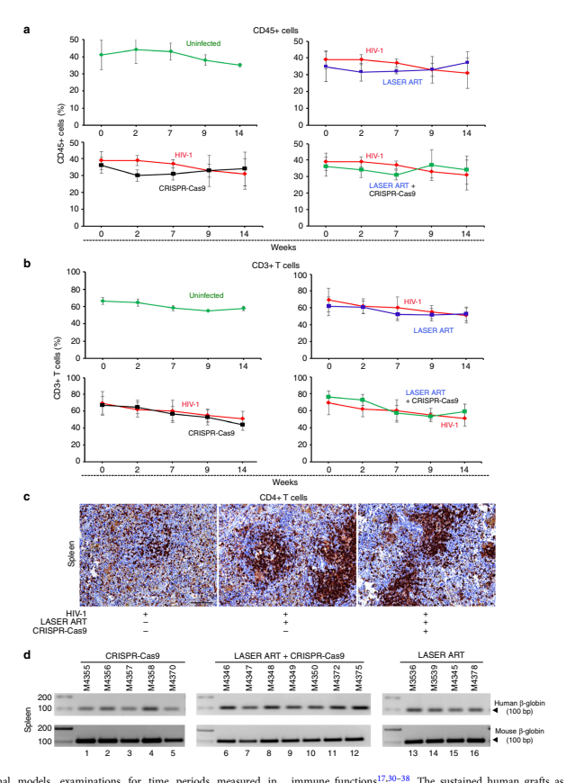

ARTICLE

The image is a graphical representation of the article titled "Sequential Laser Art And Crispr Treatments Eliminate HIV-1 In A Subset Of Infected Humanized Mice" which was published in the journal Nature Communications. The image features a stylized ribbon-like design with colors transitioning from red to orange and then to yellow, set against a light grey background. The text within the image is structured as follows:

- The title of the article is prominently displayed at the top of the image.
- Below the title, there is a reference to the article's DOI (Digital Object Identifier) and a citation number.
- The main body of the text begins with the authors' names listed in two columns.
- The abstract of the article is provided below the authors' names, summarizing the research findings.

The image serves as a visual summary of the article's content, highlighting the innovative approach of combining LASER ART and CRISPR-Cas9 treatments to eliminate HIV-1 in infected humanized mice.

# Https://Doi.Org/10.1038/S41467-019-10366-Y Open

## Sequential Laser Art And Crispr Treatments Eliminate Hiv-1 In A Subset Of Infected Humanized Mice

Prasanta K. Dash1,4, Rafal Kaminski2,4, Ramona Bella2,4, Hang Su1, Saumi Mathews1, Taha M. Ahooyi2, Chen Chen2, Pietro Mancuso2, Rahsan Sariyer2, Pasquale Ferrante2, Martina Donadoni2, Jake A. Robinson2, Brady Sillman1, Zhiyi Lin1, James R. Hilaire1, Mary Banoub1, Monalisha Elango1, Nagsen Gautam3, R. Lee Mosley1, Larisa Y. Poluektova1, JoEllyn McMillan1, Aditya N. Bade1, Santhi Gorantla1, Ilker K. Sariyer2, Tricia H. Burdo2, Won-Bin Young2, Shohreh Amini2, Jennifer Gordon2, Jeffrey M. Jacobson2, Benson Edagwa1, Kamel Khalili2 & Howard E. Gendelman1 Elimination of HIV-1 requires clearance and removal of integrated proviral DNA from infected cells and tissues. Here, sequential long-acting slow-effective release antiviral therapy (LASER
ART) and CRISPR-Cas9 demonstrate viral clearance in latent infectious reservoirs in HIV-1 infected humanized mice. HIV-1 subgenomic DNA fragments, spanning the long terminal repeats and the Gag gene, are excised in vivo, resulting in elimination of integrated proviral DNA; virus is not detected in blood, lymphoid tissue, bone marrow and brain by nested and digital-droplet PCR as well as RNAscope tests. No CRISPR-Cas9 mediated off-target effects are detected. Adoptive transfer of human immunocytes from dual treated, virus-free animals to uninfected humanized mice fails to produce infectious progeny virus. In contrast, HIV-1 is readily detected following sole LASER ART or CRISPR-Cas9 treatment. These data provide proof-of-concept that permanent viral elimination is possible.

According to UNAIDS, it is estimated that more than 36.7 million people worldwide are infected with the human immunodeficiency virus type one (HIV-1) and >5000 individuals worldwide are newly infected each day. In the clinic, antiretroviral therapy (ART) restricts viral infection by stalling various steps of the viral life cycle. However, ART fails to eliminate integrated copies of HIV-1 proviral DNA from the host genome1,2. As such, virus persists in a latent state within infectious reservoirs; and ART cessation readily leads to viral reactivation and disease progression to acquired immunodeficiency syndrome (AIDS)3. Thus, a major issue for any HIV-1 curative strategy is the means to eliminate either integrated proviral DNA
or the cells that harbor virus without collateral cytotoxic reactions. However, elimination of HIV-1 infection in its infected human host is documented only in two individuals4,5. There are several reasons why success has not yet been realized. This includes inadequate therapeutic access to viral reservoirs, rapid spread of infection by continuous sources of virus and susceptible cells and a failure to eliminate residual latent integrated proviral DNA. All single or combination therapeutic approaches preclude HIV-1 cure as viral rebound universally follows ART cessation6–10. Yet, another obstacle towards elimination of infection is that viral latency is established after infection onset and precedes peak viremia. This underscores that early intervention with potent antiretroviral medicines may help to further reduce the size of the reservoir and ultimately facilitate viral elimination11. Therefore, multimodal robust pharmaceutic strategies are needed for complete elimination of HIV-1 if no viral resurgence after cessation of ART is to be achieved. To address this need and design a suitable therapeutic strategy, our laboratories produce highly hydrophobic lipophilic viral reservoir penetrating antiretroviral prodrugs coined as long-acting sloweffective release ART (LASER ART). LASER ART properties are defined by slow drug dissolution, enhanced lipophilicity, improved bioavailability and limited off-target toxicities, which directly affect the frequency of ART administration from daily to weeks. These reduce disease Fig. 1f). Plasma viral RNA copies/ml 16 weeks after HIV-1 infection were readily observed (Fig. 1g).

Generation and pharmacokinetic (PK) testing of LASER ART.

We posit that use of CRISPR-Cas9 strategies developed for the elimination of HIV-1 proviral DNA are aided by optimal control of viral replication leading to sustained viral latency (supplementary fig. 1). To this end amongst others, our laboratories have developed LASER ART that facilitates sustained inhibition of viral replication by long-acting hydrophobic lipophilic antiretroviral nanoparticles11–15. To accomplish this goal, fatty-acidmodified prodrugs were synthesized as prodrugs for dolutegravir
(DTG), lamivudine (3TC) and abacavir (ABC) by esterification with myristic acid. The chemical structures and physicochemical properties were characterized by nuclear magnetic resonance spectroscopy and Fourier-transform infrared spectroscopy, electrospray ionization mass spectrometry and powder X-ray diffraction11–15. The LASER ART particles were characterized fully for stability, size, and shape. This included human monocytederived macrophage (MDM) nanoparticle drug uptake, release and potency. Data sets were obtained for nanoformulated myristoylated NM (NMDTG), NM3TC and NMABC prodrugs and nanoformulated rilpivirine (NRPV) (Table 1) before being used in the animal studies. These included individual antiretroviral activity for each of the nanoformulations. Moreover, complete PK profiles were performed for each of the nanoformulated drugs after a single drug nanoformulation injection. These are illustrated with the accompanying dosages administered in BALB/c mice (Table 1). The PK measurements including terminal rate

 

The image is a scientific article that discusses the development and testing of LASER ART, a method for controlling viral replication and achieving sustained viral latency in HIV-1 infected humanized mice. The article includes various figures and tables that provide data on the effectiveness of LASER ART in inhibiting HIV-1 replication and reducing viral load in the animals. The figures show the results of different experiments, including immune cell profiles, tissue staining for HIV-1 p24, and pharmacokinetic data for the nanoformulated antiretroviral drugs used in the study. The text provides an overview of the research methodology, the chemical structures and properties of the prodrugs used, and the results obtained from the animal studies. The article also mentions the use of CRISPR-Cas9 strategies for the elimination of HIV-1 proviral DNA and the potential applications of LASER ART in HIV treatment.

Fig. 1 Viral and human immune profiles in a HIV-1 infected humanized mice. a Human CD4 + T cells were determined by flow cytometry in blood of humanized mice before infection (time 0) and on days 3, 5, 7, and 14 after HIV-1ADA infection (n = 4, red color). Each infected animal received 104 TCID50 of titered virus. Uninfected (control, n = 3) animals are shown in blue. b Viral load measurements in plasma of HIV-1 infected humanized mice at 14 days. c HIV-1 DNA was detected by semi-nested real-time qPCR in tissue of infected animals at 14 days after viral infection (n = 4). d Representative images of human HLA-DR expression in spleen, lung, and lymph nodes, confirms human cell reconstitution in all animals. Replicate sections were stained for HIV1p24 and show large numbers of infected cells. Scale- bars (10 and 40 μm) e–g Immune cell profiles and viral load of tissue were evaluated 16 weeks after viral infection. e Photomicroscopic images illustrate human cells present in spleens, lymph nodes, lungs, livers and brains of humanized mice. Tissue sections stained with anti- human HLA-DR (upper 2 panels) and HIV-1p24 (bottom panels). f Total human CD45 + leukocytes, CD3 + and subpopulations of CD4 + and CD8 T + cells from blood of control (n = 15) and HIV-1 infected (n = 40) mice. g Plasma viral load was consist among the animals in both acute (14 days) and chronic (16 weeks) infectious paradigms, n = 54. One-way ANOVA and Bonferroni's post-hoc tests for multiple comparisons and twotailed Student's t-test were used for statistical analyses in a and f. *P < 0.05, ***P < 0.001. Source data are provided as a source data file

## Table 1 Cell And Animal Pk Data Sets For The Laser Art Nanoformulations

NMDTG NM3TC NMABC NRPV

Macrophage Uptake, Retention and Antiretroviral

Activity

Maximal prodrug uptake (μg/106 cells) 74.3 10.4 11.3 31.6 Prodrug retention (μg/106 cells) 10.0 ND 5.0 17.9

Drug Concentration tested (μM) 100 100 100 100

Multiplicity of infections (MOI) 0.01 0.01 0.01 0.01 Percent of HIV-1 inhibition (%) ND 99 99 99

Pharmacokinetics λz (1/day) 0.0506 0.6584 ND 0.1274

t1/2 (day) 13.77 1.05 ND 5.44

AUC last (daya ng/ml) 38995.2 1187.0 315.4 13694.9

AUC 0-∞ (daya ng/ml) 40727.9 1187.4 1513.8 13706.7

AUC % Extrapolatdrastic decline in the viral copy number to below detectable levels in the group of animals treated with LASER ART. Removal of LASER ART led to rebound in all 10 animals treated with LASER ART alone and in five out of seven animals that received both LASER ART and AAV9-CRISPR-Cas9. Repeated search for the viral RNA in the plasma of two animals, M4346 and M4349 (Fig. 2d framed in red), failed to detect evidence of viral presence. In the absence of LASER ART, numbers of CD4+ T cells relative to controls were 4  

The image is a scientific figure from a study that examines the effects of LASER ART and CRISPR-Cas9 treatments on HIV-1 infected humanized mice. The figure is divided into several parts, each representing different aspects of the study.

Part b shows the viral load and CD4+ T cell counts over time in different treatment groups. The graph indicates that the viral load decreases significantly in all treatment groups compared to the control group. The CD4+ T cell counts also increase in treated groups compared to the control group.

Part c presents the plasma viral load of individual animals for different treatment groups. The graph shows that the viral load remains below detectable levels in some animals after treatment with LASER ART alone or in combination with AAV9-CRISPR-Cas9.

Part d displays the flow cytometry results for human CD4+ T cells, showing increased numbers in the LASER ART and dual LASER ART and CRISPR-Cas9 groups. It also shows the evaluation of plasma viral load at different time points for different treatment groups.

The colors used in the image are primarily blue, black, and red, with different shades used to distinguish between different data sets and treatment groups. The text is mostly in black, with some words highlighted in red for emphasis. The overall structure of the image is designed to convey complex scientific data in an organized and visually appealing manner.

15 ± 6% and < 6% in groups 2 and 1, respectively (Fig. 2b). The CD4 + T cell profile of each animal is shown (Fig. 3) for all treatment groups. Disease was determined by declining percentages of CD4 + T cells. Results showed a robust restoration of CD4 + T cells in the animals that received LASER ART alone or in combination with AAV9-CRISPR-Cas9 as compared to infected controls and AAV9-CRISPR-Cas9 alone treated animals
(Figs. 2b and 3).

Next, we evaluated the number of total human cells (CD45 + )
and T cells (CD3 + ) by flow cytometry and demonstrated sustained human cell numbers in both control (uninfected), infected and treated animals at and beyond four months until the
  5 Fig. 2 Viral load and CD4 + T cells in HIV-1 infected and treated humanized mice. Mice were infected with 104 TCID50 of HIV-1NL4–3 followed by treatments with LASER ART, CRISPR-Cas9 or both. a The study scheme shows the times of infection and treatments. After confirmation of viral infection, 29 infected humanized mice were subdivided into four groups. The first group (n = 6, red) were left untreated (control), the second group (n = 6, black)
received a single intravenous (IV) dose of AAV9-CRISPR-Cas9 (1012 units), nine weeks after viral infection, the third group (n = 10, blue) were administered LASER ART (NMDTG and NRPV at 45 mg/kg and NMABC and NM3TC at 40 mg/mg) by intramuscular (IM) injection two weeks after viral infection, the fourth (n = 7, green) were given LASER ART (as in group 3) and three weeks after the last LASER ART treatment, a single IV dose of AAV9-
CRISPR-Cas9 was administered as in group 2. LASER ART treatment was ceased and after an additional five weeks, antiretroviral drug levels were assessed and were at or below the limit of quantitation < 1 ng/ml (Table 1). b Flow cytometry for human CD4 + T cells are shown with increased numbers of CD4 counts in the LASER ART and dual LASER ART and CRISPR-Cas9 groups. c Evaluation of plasma viral load indicated that after administration of AAV9-
CRISPR-Cas9, 2 of 7 mice showed no evidence for viral rebound at 14 weeks. d Plasma viral load of individual animals for different treatment groups of humanized mice were assayed at 2, 7, 9, and 14 weeks of HIV-1 infection for HIV-1 RNA. Viral RNA levels were determined by the COBAS AmpliprepTaqman-48 V2.0 assay with a sensitivity of 200 copies/ml once adjusted to the plasma dilution factor. Viral RNA rebound was observed at the study end in all 10 LASER ART treated animals. This corresponded to eight weeks after therapy interruption. Rebound was also observed at the study end in 5 of 7 dual-treated animals. Virus was not observed in two dual-treated animals (M4346 and M4349) and are highlighted in the red boxes. Source data are provided as a source data file study conclusion (Fig. 4a, b respectively). The presence of human CD4 + cells (Fig. 4c) and HLA-DR in spleen was observed to confirm graft stability. We also observed restoration of CD4 +
T cells in spleens of dual-treated animals (Fig. 4c). This was further confirmed by the identification of species-specific DNA
sequences in spleens of all animal groups independent of treatments administered (Fig. 4d). Indeed, cell numbers proved constant following all CRISPR-Cas9 and LASER ART interventions.

RNA were eliminated despite the presence of high numbers of human cells (supplementary fig. 3).

On and Off target CRISPR-Cas9 effects. We next evaluated on and offg the absence of HIV-1 genomes in animals M4346 and M4349 was provided by digital droplet PCR (ddPCR) (supplementary fig. 2). Verifying prior qPCR results, no viral DNA/RNA (assay's detection sensitivity of < 2 viral copies) was detected in spleen, bone marrow, and gut of mice M4346 and M4349. The data, taken together, all support the findings of complete HIV-1 elimination. In further cross validation tests, viral rescue assays were performed by coculturing bone marrow cells and splenocytes of representative animals with phytohemaglutinin/interleukin-2 (PHA/IL-2)- stimulated peripheral blood mononuclear cells (PBMCs). These tests were performed for an additional two weeks. Representative data from these experiments showed that while HIV-1 was rescued from 100% of samples with detectable viral DNA and RNA,
no evidence for virus recovery was observed in the samples from the two animals (M4346 and M4349) where HIV-1 DNA and 6  

The image is a scientific figure from a research paper, detailing the results of experiments conducted on humanized mice infected with HIV-1. The figure is structured into four main sections labeled a, b, c, and d, each representing different experimental groups: LASER ART, AAV9-CRISPR-Cas9, LASER ART + AAV9-CRISPR-Cas9, and HIV-1 ADA. Each section contains multiple graphs showing the percentage of human CD4+ T cells in peripheral blood over time, as well as the viral RNA copies in plasma.

The graphs are color-coded to represent different treatment groups: red for HIV-1 infected group, black for HIV-1 infected and AAV9-CRISPR-Cas9 group, blue for HIV-1 infected and LASER ART group, and green for HIV-1 infected and LASER ART and AAV9-CRISPR-Cas9 group. The x-axis represents time in weeks, while the y-axis shows the percentage of CD4+ T cells or viral RNA copies.

The text accompanying the graphs provides context and explains the experimental design, including the use of HIV-1 strains, the administration of treatments, and the methods used for detection and quantification of HIV-1 DNA/RNA. It also mentions the use of digital droplet PCR (ddPCR) and viral rescue assays to confirm the absence of HIV-1 in treated animals. The text emphasizes the successful eradication of HIV-1 infection in some animals and the protective effect of LASER ART and CRISPR-Cas9 dual-treatment.

we performed replicate experiments in a separate set of HSC-
reconstituted NSG mice infected with a second macrophage tropic viral strain (HIV-1 ada) (Fig. 7a). Animals were infected with 10 4 TCID 50 of HIV-1 ADA for two-weeks, at which time depletion of CD4 + T cells was observed and viral RNA copies in plasma  were  recorded  at  a  median  level  of  8.4 × 10 4  copies/ml apeutic elimination. To validate eradication of HIV-1 infection, NATURE COMMUNICATIONS| (2019)10:2753|https://doi.org/10.1038/s41467-019-10366-y |www.nature.com/naturecommunications 7 Fig. 3 Human CD4 + T cells in HIV-1 infected and treated humanized mice. a–d Peripheral blood of humanized mice was assayed before and 2, 7, 9, and 14 weeks after HIV-1NL4-3 infection and the presence of human CD4 + cells from CD3 + gated populations were examined. a Percentage of human CD4 +
T cells followed a decreased pattern in all mice (n = 6, red) in the HIV-1 infected group. b Percentage of human CD4 + T cells were decreased in all mice (n = 6, black) in the HIV-1 infected and AAV9-CRISPR-Cas9 group. c CD4 + T cell profile of HIV-1 infected and LASER ART animals (n = 10, blue) showed a decline in CD4 + T cell numbers two weeks after viral infection. LASER ART was eliminated eight weeks after treatment. d CD4 + T cells of HIV-1 infected and LASER ART and AAV9-CRISPR-Cas9-treated animals (n = 7, green). Decreased CD4 + T cell numbers were seen as early as two weeks after infection. At this time, LASER ART was administered for four weeks followed by AAV9-CRISPR-Cas9 given at week 9. The mice were then followed for an additional five weeks. Restoration of CD4 + T cells was observed in both LASER ART and LASER ART and AAV9-CRISPR-Cas9 treatment groups. Source data are provided as a source data file
(Fig. 7b–c). Semi-nested real-time qPCR of HIV-1 nucleic acid confirmed tissue viral infection from three representative animals.

Infected animals were divided into three groups, a no treatment infected group (n = 4); those that received LASER ART (combinations of DTG, RPV, 3TC, and ABC) with (n = 6) or without CRISPR-Cas9 (n = 7). Animals were observed for ten weeks after cessation of LASER ART for viral rebound. Continuous viral replication was readily observed in untreated animals and those treated with only LASER ART. Notably, three of six LASER ART
and CRISPR-Cas9-dual-treated animals had no demonstrable viral rebound (Fig. 7c). In these mice, protection of CD4+ T cell counts (71.3 ± 3.5%) was observed compared to infected controls
(48.3 ± 4.5%) (Fig. 7b). The CD4 + T cell and viral load profiles for each of the individual animals are shown (supplementary figs. 14–15). As in the first experiment, detection of human DNA
sequences in spleen confirmed uniform presence of human cells in lymphoid tissues of all humanized mice regardless of treatment. Moreover, no evidence of viral gene expression was found in another two animals (M3319 and M3336) employing qPCR
tests for DNA sequence detection (Fig. 7d). HIV-1 genome amplif eliminated from cell and tissue reservoirs in up to a third of infected animals as illustrated (Fig. 9).

## Discussion

While ART has transformed HIV-1 infection into a chronic treatable disease, virus persists in tissues that include the gut, lymph nodes, brain, spleen amongst other sites. The inability of ART to eliminate virus in these tissue sanctuaries remains the major obstacle towards a disease cure. Such a limitation is linked, in large measure, to continuous long-term infections in CD4 +
memory T cells and less frequently in mononuclear phagocytes despite both directed host antiviral immunity and ART effectiveness. Thus, one may predict that, any or all steps towards HIV
elimination must include precise targeted ART delivery, maintenance of vigorous immune control, effective blockade of viral growth and immune-based elimination of pools of infected cells or genome integrated proviral DNA. Even under these conditions, the presence of replication competent virus that allows lowlevels of viral production and viral latency underscores employment of strategies that eliminate virus that is integrated but latent.

Because of notable graft versus host disease in several humanized

The image is a scientific figure from a research paper that discusses the use of LASER ART and CRISPR-Cas9 gene editing in combination with antiretroviral therapy (ART) to eliminate HIV-1 from tissue reservoirs. The figure is structured into several parts, each representing different aspects of the study.

Part a shows three graphs labeled 'CD45+ cells', 'HIV-1', and 'CRISPR-Cas9'. Each graph plots the percentage of CD45+ cells over time for different treatment groups: uninfected, HIV-1 infected, HIV-1 and AAV9-CRISPR-Cas9 treated, HIV-1 and LASER ART treated, and HIV-1 and LASER ART + AAV9-CRISPR-Cas9 treated mice. The colors represent different conditions: green for uninfected, red for HIV-1 infected, black for HIV-1 and AAV9-CRISPR-Cas9 treated, blue for HIV-1 and LASER ART treated, and blue/black for HIV-1 and LASER ART + AAV9-CRISPR-Cas9 treated.

Part b displays three similar graphs for CD3+ T cells, HIV-1, and CRISPR-Cas9, with the same color coding as part a.

Part c presents immunohistochemistry images of spleen sections from HIV-1 infected mice treated with LASER ART or both LASER ART and CRISPR-Cas9. The brown stained cells represent CD4+ T cells, which are significantly reduced in HIV-1 infected control mice but protected in treated animals.

Part d shows PCR analysis of genomic DNA isolated from the spleens of humanized mice using primer sets specific to human and mouse beta-globin. The results indicate the presence of human cells in the spleens of humanized mice.

The bottom of the image contains a caption that provides context for the study, mentioning the use of molecular tools to permanently eliminate the viral genome and prevent reactivation, and the successful outcome in achieving this goal in more than 30% of infected experimental animals.

Fig. 4 Human leukocytes in blood and spleens of humanized mice. a, b Peripheral blood of HSC reconstituted mice was assayed before and after 2, 7, 9, and 14 weeks of HIV-1NL4–3 infection for human CD45 + (A) and CD3 + (B) cells. The experiments were performed to assess levels of humanization and percentage of total CD3 + T cells throughout the study. These included uninfected (n = 3, green), HIV-1NL4–3 infected (n = 6, red), HIV-1 and AAV9- CRISPR-Cas9-treated (n = 6, black), HIV-1 and LASER ART (n = 10, blue), and HIV-1 and LASER ART and AAV9-CRISPR-Cas9 (n = 7, blue/black) treated mice. All are shown from data generated from the experiments outlined in Fig. 3. In the HIV-1 infected mice group, the numbers of CD45 + and CD3 +
human cells in blood of mice were comparable to the treatment groups. We did not observe any differences amongst time points when compared to control uninfected and untreated animals. c Immunohistochemistry was performed in spleens of HIV-1 infected mice to confirm T cell reconstitution. Here, the spleens of infected animals treated with LASER ART or both LASER ART and CRISPR-Cas9 were examined for the presence and numbers of CD4 +
T cells. Significant reductions in CD4 + T cells (brown stained cells) were seen readily in the HIV-1-infected control mice. These cells were protected in HIV-1 infected animals treated with LASER ART with or without CRISPR-Cas9. Scale bar, 10 μm. d Verification of the presence of human cells in the spleens of humanized mice. PCR analysis of genomic DNA isolated from the spleens of humanized mice using primer sets specific to human and mouse betaglobin. Source data are provided as a source data file responses to the viral infection12,17,29,36,37,39. These previously published data support the successful use of humanized mice in studies of HIV/AIDS pathogenesis, therapeutics40–42, and treatment12–14,16,18,29,43,44. These studies, taken together, clearly provide a rationale for the scientific approaches taken in the current report12,13,29,43,45–47.

Therefore, our approaches towards evaluating viral cures have included the demonstrated ability of the drugs to reach sites of latent infection and to do so at significant levels18,37,39,43,44.

Notably, the use of molecular tools can permanently eliminate the viral genome and preclude reactivation20,21,24,48. Thus, we suggest that the current successful outcome in achieving this goal in more than 30% of the infected experimental animals reflects the combinatorial use of a suitable animal model, control of viral set points, reach to the viral reservoirs, delivery and intracellular drug penetration of potent LASER ART, and the widespread employment of CRISPR-Cas9 gene editing. The latter enabled high efficiency excision oftudy verified the bioavailability of our gene editing molecule in various organs of the NSG humanized mice. No offtarget effects were detected in in vivo deep sequencing and bioinformatics analysis that may be caused by the CRISPR-Cas9 editing strategy. Nevertheless, as expected naturally occurring cellular DNA variation was found in both untreated cells as well as in CRISPR-Cas9-treated cells. Examination of several potential target cellular genes performed on clonal cells expressing CRISPR-Cas9 by gene amplification and direct sequencing showed no mutations that may be caused by the presence of CRISPR-Cas9 in the cells.

Results from ddPCR showed 60% to 80% efficiency of viral DNA excision by CRISPR-Cas9. Of note, this approach quantified dual cleavage events that removed the DNA fragment spanning 5'LTR to 3'LTR, 5'LTR to gag, and gag to 3'LTR of the proviral genome. However, the occurrence of single site editing events that would permanently interrupt the viral DNA and potentially inactivate viral replication by introducing small InDel mutations at the cleavage sites are not included in this estimate19. Therefore, viral activation and rebound may not be observed under the conditions whereby excision efficiency is less than 100%. In 10  

The image is a scientific figure from a research study that investigates the effectiveness of gene editing using CRISPR-Cas9 and laser art therapy (LASER ART) in eliminating HIV-1 from humanized mice. The figure is structured into several parts, each representing different aspects of the study.

Part a shows box plots for HIV-1 DNA and RNA levels in various tissues of mice treated with different combinations of LASER ART and CRISPR-Cas9. The tissues include spleen, bone marrow, gut, brain, liver, kidney, and lung. Each box plot represents the number of HIV-1 DNA or RNA copies per 10^6 human CD45+ cells.

Part b presents quantitative PCR results for pol and env DNA sequences of HIV-1 in two mice, M4346 and M4349, which showed complete elimination of signals corresponding to these sequences.

Part c displays RNAscope assay results, showing the detection of HIV-1 RNA in 5 μm-thick spleen sections of infected animals receiving either LASER ART or CRISPR-Cas9 alone, but not both (M4346).

The color scheme consists of black text on a white background, with red squares indicating sterilization of virus from all tissues analyzed in part a. The box plots use a combination of black, red, and grey colors to represent different data points and statistical significance.

The text in the image provides context and explanation for the data presented, including the experimental design, the methods used, and the statistical analysis performed. It also discusses the implications of the study's findings for HIV-1 elimination strategies in an infected human host.

Fig. 5 Viral DNA and RNA in HIV-1 infected and treated humanized mouse tissues. a HIV-1 DNA and (d) HIV-1 RNA analyses using ultrasensitive seminested real-time qPCR assays from spleen, bone marrow, gut, brain, liver, kidney, and lung from treatment groups described in Fig. 4a–c. Animal numbers were decreased in one group due to deaths seen through the experimental observation period. The data represent each of the four groups HIV-1 infected
(n = 5), HIV-1 infected and AAV9-CRISPR-Cas9 treated (n = 6), HIV-1 infected and LASER ART treated (n = 4) and HIV-1 infected LASER ART and AAV9-
CRISPR-Cas9-treated mice (n = 7). The data are expressed as total HIV-1 DNA (a) or HIV-1 RNA (d) copies/106 human CD45 + cells. Two animals, M4346 and M4349 [shown by the red squares below the dashed lines (detection limit)], with dual treatments, showed sterilization of virus from all tissues analyzed. b, c Quantitative PCR showed complete elimination of signals corresponding to pol (b) and env (c) DNA sequences of HIV-1 in mice M4346 and M4349 (shown as red triangles). One-way ANOVA and Bonferroni's post-hoc tests for multiple comparisons and two-tailed Student's t test were used for comparisons between two groups for statistical analyses. *P < 0.05, **P < 0.01, ***P < 0.001, ****P < 0.0001. e Representative results from RNAscope assay revealed the detection of single or clusters of brown dots corresponding to HIV-1 RNA in 5 μm-thick spleen sections of infected animals receiving either LASER ART or CRISPR-Cas9 alone, but not both (M4346). E1, humanized mice infected with HIV-1 (controls); E2, HIV-1 infected animals treated only with CRISPR-Cas9; E3, HIV-1 infected LASER ART treated animals demonstrating viral rebound after cessation of therapy; E4, infected animals treated with LASER ART followed by CRISPR-Cas9. E1-E4 are representative tissue sections taken from each of the animal groups. In these assays, we used the antisense V-HIV1-Clade-B targeting 854–8291 bp of HIV-1 as the probe. Scale bar 40μM. Source data are provided as a source data file

## Facilitate Effective Hiv-1 Elimination Strategies In An Infected Human Host56.

In conclusion, we employed a broad range of highly sensitive tests to evaluate HIV-1 elimination by LASER ART and AAV9delivered CRISPR-Cas9 treatments. These included viral gene amplification, flow cytometry, adoptive viral transfers, on target and off target assays, and measures of viral rebound to demonstrate that combination therapies can safely lead to the elimination of HIV-1 infection. Results demonstrated that eradication of replication-competent HIV-1 present in infectious cell and tissue sites of infected animals can be achieved. Although-AAVCMV:NLS-saCas9-NLS-3xHA-bGHpA;U6::BsaI-sgRNA (a gift from Feng Zhang via Addgene) (61591; Addgene). For multiplex gRNA cloning, the U6-LTR1gRNAscaffold cassette from pX601-CMV-saCas9-LTR1 was amplified using T795/T796 primers (Table S1) and cloned using In-Fusion HD Cloning Kit
(Clontech, Mountain View, CA) into EcoRI and KpnI linearized pX601-CMVsaCas9-GagD plasmid resulting in pX601-CMV-saCas9-LTR1-GagD AAV
delivery vector. Finally, sequence verified plasmid was sent for packaging into AAV-9 serotype (Vigene Biosciences Inc., Milton Park Abingdon, UK). AAV9 was chosen as the vector for CRISPR-Cas9 delivery for its robust transduction efficiencies in multiple tissues including the central nervous system as significant putative reservoirs for HIV-1. The notion was to permit efficient AAV entry into all putative HIV-1 target tissues including the brain.

HIV-1 infection of CD34 + humanized mice. NSG (NOD.Cg-Prkdcscid Il2rgtm1Wjl/SzJ) mice were obtained from the Jackson Laboratories, Bar Harbor, ME and bred under specific pathogen-free conditions at the University of Nebraska Medical Center (UNMC) in accordance with the ethical guidelines set forth by the National Institutes of Health for care of laboratory animals. CD34 + HSC were enriched from human cord blood or fetal liver cells using immune-magnetic beads
(CD34 + selection kit; Miltenyi Biotec Inc., Auburn, CA, USA). CD34 + cell purity was >90% by flow cytometry. Cells were transplanted into newborn mice irradiated at 1 Gy using a RS‐2000 × ‐Ray Irradiator (Rad Source Technologies, Buford, GA).

Cells were transplanted by intrahepatic (i.h.) injection of 50,000 cells/mouse in 20 μl phosphate-buffered saline (PBS) with a 30-gauge needle. The experiments shown in Fig. 2–6 were from human fetal liver cells were isolated from a single donor. In the study described in Figs. 7 and 8, cord blood-derived HSC were obtained from two donors. Mice from a single donor were used for all dual treatment mice.

Humanization of the animals was affirmed by flow cytometry31,60 for the presence of human CD45 and CD3 positive blood immune cells, as shown in Fig. 4. At 18 weeks of age, 25 NSG-hu mice were infected intraperitoneally (i.p.) with HIV1NL4–3 32,36 at 104 tissue culture infective dose50 (TCID50)/ml and sacrificed at days 1, 3, 7, and 14; n = 5 at each time point. Five control-uninfected animals were included in all test evaluations. Levels of viral RNA copies/ml were analyzed with the automated COBAS Ampliprep System V2.0/Taqman-48 system (Roche Molecular Diagnostics, Basel, Switzerland)30,31. For this assay, 100 μl of mouse serum was diluted to 1 ml with sterile filtered normal human serum. The detection limit of the assay after dilution is 200 viral RNA copies/ml. Although the eclipse phase for viral infection in humans remains variable61, the viral loads and CD4 + T
cell depletion levels observed in our infected humanized mice are in point of fact reflective of the disease course in an infected human host. Indeed, only after weeks of infection we do observe significant cell loss12,17,29,37,50. These findings can be viewed as an affirmation of the model including CD4 + T cell timed-restorations seen after ART as is seen in humans.

The image is a scientific figure that appears to be from a research paper or presentation. It consists of multiple parts labeled as "a," "b," "c," "d," "e," "f," and "g." Each part contains various types of data visualizations, including gel electrophoresis images, graphs, and bar charts.

Part "a" shows gel electrophoresis images with different bands labeled as "SLTR," "Gag," and "Pol," which are likely proteins related to HIV-1 infection. The images are accompanied by a legend explaining the abbreviations used in the figure.

Part "b" presents a schematic representation of the plasmid constructs used in the study. It includes diagrams of plasmids pX601-CMV-saCas9-GagD AAV delivery vector and pX601-CMV-saCas9-LTR1-GagD AAV delivery vector, indicating the components and structure of the vectors used for CRISPR-Cas9 delivery.

Part "c" displays a timeline of events related to the study, including the use of AAV9 serotype for CRISPR-Cas9 delivery, HIV-1 infection of CD34 + humanized mice, and the administration of antiretroviral drugs.

Part "d" shows a graph with multiple lines representing different conditions or treatments, with the x-axis labeled as "days" and the y-axis labeled as "HIV-1 RNA copies/ml."

Part "e" presents another graph with similar characteristics as part "d," but with different data points and trends.

Part "f" contains a series of bar charts with different colors representing different groups or conditions, with the x-axis labeled as "mouse ID" and the y-axis labeled as "HIV-1 RNA copies/ml."

Part "g" displays a flow cytometry plot with different colors representing different cell populations, with the x-axis labeled as "FSC-H" and the y-axis labeled as "CD45+CD3+."

The image also includes text that provides context for the study, such as the use of AAV9 serotype for CRISPR-Cas9 delivery, the HIV-1 infection of CD34 + humanized mice, and the administration of antiretroviral drugs. The text also mentions the use of myristoylated modifications for certain drugs to enhance their incorporation into poloxamer 407 nanoparticles.

Nanoformulated antiretroviral drugs. DTG, 3TC and ABC were generous gifts from ViiV Healthcare, Research Triangle Park, NC. RPV was purchased from Hangzhou Bingo Chemical Co., Ltd, Hangzhou, China. Antiretroviral prodrugs and their polymer encasements were performed as previously described12–14.

Myristoylated modifications for DTG, 3TC, and ABC were made (referred to as MDTG, M3TC, and MABC) to enhance the incorporation into poloxamer 407
(P407) nanoparticles, while RPV was encased solely by poloxamer 338 (P338) in unmodified form using high pressure homogenization to form crystalline nanoformulated drugs. Particle size, polydispersity index, and zeta potential were determined by dynamic light scattering using a Malv transcription assay, random hexamers were used as primers and SuperScript III
(Invitrogen, MA) to synthesize first-strand cDNA at 42 °C for 60 min. cDNA was used for the unspliced (usRNA) assay. Two rounds of PCR were performed under the same PCR conditions as described for total viral DNA. For the usRNA assay, real-time PCR was run for 45 cycles and same primers and fluorescent probe as for the total viral DNA assay were used. Human CD45 species-specific primers and probes were obtained from Thermo-Fisher Scientific (USA) (cat. no. 433182 for Hs0036534_g1).

For viral excision testing, frozen tissues sent to Temple University from the University of Nebraska Medical Center were homogenized using Bullet Blender homogenizer (Next Advance, Averill Park, NY) using bead combinations and settings specific for every tissue according to manufacturer's protocols. T1 buffer from NucleoSpin Tissue kit (Macherey-Nagel, Duren, Germany) was used for homogenization/initial lysis followed by over-night proteinase K digestion.

Extraction of genomic DNA was completed according to the manufacturer's protocol. For standard PCRs (supplementary Table 1), 500 ng of extracted DNA were subjected to PCR using Fail Safe PCR kit and buffer D (Epicentre, Madison, WI) under the following PCR conditions: 94 °C 5 min, 30 cycles (94 °C 30 s, 55 °C 30 s, 72 °C 30 s), 72 °C 7 min using 1st round primers followed by nested PCR
using diluted 1st round PCR reaction. Nested PCR products were subjected to Sanger sequencing directly if only one amplicon population was detected by agarose gel electrophoresis. For multiple amplicons detected, in order to investigate the composition of HIV excision, each amplicon population was separated and purified from an agarose gel electrophoresis and then cloned into TA vector
(Invitrogen, Carlsbad, CA). Plasmid DNA containing excised HIV amplicon was purified from each bacterial colony for Sanger sequencing (Genewiz, South Plainfield, NJ). HIV-1 DNA was quantified using TaqMan qPCR specific for HIV-1 pol and env genes and cellular beta-globin gene as a reference (supplementary Table 1). Prior to qPCR, genomic DNA was diluted to 10 ng/µl and then 5 µl (50 ng) were taken per reaction/well. Reaction mixtures were prepared using Platinum Taq DNA Polymerase (Invitrogen) according to a simplified procedure64. Standard was prepared from serial dilutions of U1 cells genomic DNA since it contains two single copies of HIV-1 provirus per diploid genome equal to beta-globin gene copy number. qPCR conditions: 98 °C 5 min, 45 cycles (98 °C 5 min, 45 cycles (98 °C 15 s, 60 °C 30 s with acquisition, 72 °C 1 min). Reactions were carried out and data analyzed in a LightCycler96 (Roche, Basel, Switzerland). For RT-PCR, TRIzol reagent (Ambion, Austin, TX) was used for initial RNA extraction followed by clean up using RNeasy kit (Qiagen, Hilden, Germany) with DNAse I digestion in the extraction column. Total 0.5ug of RNA was used for M-MLV reverse 14  

The image is a scientific figure, specifically Figure 7 from a study on viral elimination in HIV-1 infected and treated mice. The figure is structured into several parts: a study design diagram (a), a timeline of the study (b), and three separate graphs (c, d) that represent different aspects of the study's findings.

In part (a), there is a timeline from weeks 0 to 15 with various events marked such as "HIV-1 infection," "LASER ART," and "Harvest tissues." The timeline is color-coded with red squares indicating specific events or time points.

Part (b) shows a timeline from weeks 0 to 12 with markers for "HIV-1 infection," "LASER ART," and "Plasma VL" (viral load). There are also lines representing "CD4+ T cells" and "CD4+ T cells (CRISP9-Cas9)" over time, indicating changes in cell counts.

Parts (c) and (d) are bar graphs and line graphs, respectively, showing the results of the study. Part (c) has multiple bar graphs with error bars, representing the mean ± SEM (standard error of the mean) for different groups of animals (HIV-1 infected, HIV-1 and LASER ART, and dual treatment) across various tissues (Lung, Brain, Bone marrow, Spleen, Gut, Liver, BM). Part (d) has similar bar graphs but with a focus on the ultrasensitive ddPCR assay, which can detect 1-2 viral copies, and the PCR assay of DNA from various tissues of two animals with no rebound.

The colors used in the graphs include black, red, green, and grey, with red and green likely representing different groups or conditions within the study. The text in the image provides detailed information about the methods used in the study, including DNA extraction, PCR, and sequencing techniques.

Fig. 8 Confirmation of viral elimination in HIV-1 infected and treated mice tissues. a Ultrasensitive ddPCR, with sensitivity of detecting 1–2 viral copies, was used in cross validation tests for viral DNA detection and performed in tissues of HIV-1ADA-infected and infected/dual-treated animals. As a positive control, one animal each from the HIV-1 infected (open black structure) and HIV-1 and LASER ART (open green structure) groups are illustrated. These were placed together with the six infected animals from the dual treatment group illustrated as closed structures (either black or red). Dashed line represents the limit of detection. Results are shown as the mean ± SEM (BM: bone marrow). b Agarose gel analyses of the PCR assay of DNA from various tissues of two animals with no rebound shows the presence of segments of HIV-1 LTR DNA and detection of a 193 bp amplicon, indicative of excision of a DNA fragment between the LTR and t transcription assay, random hexamers were used as primers and SuperScript III
(Invitrogen, MA) to synthesize first-strand cDNA at 42 °C for 60 min. cDNA was used for the unspliced (usRNA) assay. Two rounds of PCR were performed under the same PCR conditions as described for total viral DNA. For the usRNA assay, real-time PCR was run for 45 cycles and same primers and fluorescent probe as for the total viral DNA assay were used. Human CD45 species-specific primers and probes were obtained from Thermo-Fisher Scientific (USA) (cat. no. 433182 for Hs0036534_g1).

For viral excision testing, frozen tissues sent to Temple University from the University of Nebraska Medical Center were homogenized using Bullet Blender homogenizer (Next Advance, Averill Park, NY) using bead combinations and settings specific for every tissue according to manufacturer's protocols. T1 buffer from NucleoSpin Tissue kit (Macherey-Nagel, Duren, Germany) was used for homogenization/initial lysis followed by over-night proteinase K digestion.

Extraction of genomic DNA was completed according to the manufacturer's protocol. For standard PCRs (supplementary Table 1), 500 ng of extracted DNA were subjected to PCR using Fail Safe PCR kit and buffer D (Epicentre, Madison, WI) under the following PCR conditions: 94 °C 5 min, 30 cycles (94 °C 30 s, 55 °C 30 s, 72 °C 30 s), 72 °C 7 min using 1st round primers followed by nested PCR
using diluted 1st round PCR reaction. Nested PCR products were subjected to Sanger sequencing directly if only one amplicon population was detected by agarose gel electrophoresis. For multiple amplicons detected, in order to investigate the composition of HIV excision, each amplicon population was separated and purified from an agarose gel electrophoresis and then cloned into TA vector
(Invitrogen, Carlsbad, CA). Plasmid DNA containing excised HIV amplicon was purified from each bacterial colony for Sanger sequencing (Genewiz, South Plainfield, NJ). HIV-1 DNA was quantified using TaqMan qPCR specific for HIV-1 pol and env genes and cellular beta-globin gene as a reference (supplementary Table 1). Prior to qPCR, genomic DNA was diluted to 10 ng/µl and then 5 µl (50 ng) were taken per reaction/well. Reaction mixtures were prepared using Platinum Taq DNA Polymerase (Invitrogen) according to a simplified procedure64. Standard was prepared from serial dilutions of U1 cells genomic DNA since it contains two single copies of HIV-1 provirus per diploid genome equal to beta-globin gene copy number. qPCR conditions: 98 °C 5 min, 45 cycles (98 °C 5 min, 45 cycles (98 °C 15 s, 60 °C 30 s with acquisition, 72 °C 1 min). Reactions were carried out and data analyzed in a LightCycler96 (Roche, Basel, Switzerland). For RT-PCR, TRIzol reagent (Ambion, Austin, TX) was used for initial RNA extraction followed by clean up using RNeasy kit (Qiagen, Hilden, Germany) with DNAse I digestion in the extraction column. Total 0.5ug of RNA was used for M-MLV reverse 14  

The image is a scientific figure that appears to be from a research paper or presentation. It contains multiple parts labeled as ddPCR, Excision analysis, In vivo viral outgrowth assay, and RT-PCR. The ddPCR part shows a graph with various tissues like Lung, Liver, Kidney, Brain, Spleen, and Spine plotted against HIV-1 cDNA copies per µl. The Excision analysis section displays gel electrophoresis images of DNA fragments from different tissues. The In vivo viral outgrowth assay part presents a graph showing the number of Plasmas Viral RNA copies in Splenocytes and Bone marrow cells. Lastly, the RT-PCR section includes an agarose gel electrophoresis image showing the presence of segments of HIV-1 LTR DNA and a 193 bp amplicon indicative of excision. The text provides detailed information on the methods used for the assays, including PCR conditions, primer and probe sequences, and the use of random hexamers and SuperScript III for cDNA synthesis. It also mentions the use of TaqMan qPCR for HIV-1 DNA quantification and the use of TRIzol reagent for RNA extraction. The overall structure of the image suggests a comprehensive study on the elimination of HIV-1 in infected and treated mice tissues.

Fig. 8 Confirmation of viral elimination in HIV-1 infected and treated mice tissues. a Ultrasensitive ddPCR, with sensitivity of detecting 1–2 viral copies, was used in cross validation tests for viral DNA detection and performed in tissues of HIV-1ADA-infected and infected/dual-treated animals. As a positive control, one animal each from the HIV-1 infected (open black structure) and HIV-1 and LASER ART (open green structure) groups are illustrated. These were placed together with the six infected animals from the dual treatment group illustrated as closed structures (either black or red). Dashed line represents the limit of detection. Results are shown as the mean ± SEM (BM: bone marrow). b Agarose gel analyses of the PCR assay of DNA from various tissues of two animals with no rebound shows the presence of segments of HIV-1 LTR DNA and detection of a 193 bp amplicon, indicative of excision of a DNA fragment between the LTR and t Thus, the excision efficiencies of 5'LTR to Gag RNAscope. Viral RNA was detected as single brown dots or cluster of dots in 5 μm thick paraffin embedded spleen and lymph node tissue sections using antisense probe V-HIV1- Clade-B (Cat no 416111) targeting 854–8291 bp of HIV-1NL4–3 65.

Human peptidylprolyl Isomerase B (PPIB) was used as positive control for the spleen tissue analyzed (images were captured at 40-x magnification). All reagents are from Advanced Cellular Diagnostics, Newark, CA.

Viral recovery. PBMCs obtained from leukopaks from HIV-1,2 seronegative donors were stimulated with PHA and IL-2 and co-cultured with human bone marrow or spleen cells recovered from 3 groups of CD34 + HSC- NSG mice that included HIV- 1 infected, infected and LASER ART treated, and LASER ART
and AAV9-CRISPR-Cas9-treated mice. PBMCs were used in assays after a 3-day treatment maintained in 10% RPMI with 30 U/ml of IL-2 then co-cultured with human bone marrow or spleen cells at concentrations of (1:5)66–68. Cells were harvested eight days later for HIV-1 DNA (A) and RNA (B) using semi-nested real-time qPCR assay and supernatant fluids assayed for reverse transcriptase activity for up to day-14. Data are expressed as total HIV-1 DNA (A) or RNA (B)
copies/106 human CD45 + cells. One of the two dual-treated animals was tested 16  

The image is a schematic representation of a study's design and results, specifically focusing on the use of LASER ART and AAV9-CRISPR-Cas9 in HIV-1 infected mice. The top section of the image shows a flowchart with three columns labeled "No treatment," "CRISPR-Cas9," and "LASER ART + CRISPR-Cas9." Each column has a corresponding mouse illustration with different colors indicating the presence or absence of HIV-1 infection and the treatment received.

Below the flowchart, there is a detailed diagram labeled "Fig. 9. A working model for HIV-1 elimination." This diagram illustrates the process of viral RNA detection using RNAscope and the use of PBMCs from humanized mice to detect HIV-1 DNA and RNA. It also includes a representation of adoptive transfers and off-target analyses.

The bottom section of the image contains text that provides context and details about the study. It mentions the use of PBMCs, spleen cells, and bone marrow cells from HIV-1 infected and treated mice, as well as the use of LASER ART and AAV9-CRISPR-Cas9 treatments. The text describes the experimental procedures, including the use of qPCR, RNAscope, and ddPCR assays, as well as the analysis of viral load and immune cell profiles.

The image uses a combination of black and white illustrations and color-coded representations to convey complex scientific data. The text is primarily in black, with some words highlighted in red for emphasis.

Adoptive transfers. Splenocytes and bone marrow cells (8–10 × 106) were harvested at the time of sacrifice from NSG-hu mice that were HIV-1ADA infected with and without LASER ART and AAV9-CRISPR-Cas9. The cells were adoptively transferred into unmanipulated 18-week old CD34 + HSC-NSG mice. Cell counts and viability tests were determined by both trypan blue and live/dead stains on the TC-20 automated cell counter (Bio-Rad). Cells were injected IP into mice and monitored for an additional 4 weeks. These experiments were performed to cross validate eradication of viral infection that could occur from latent reservoirs and not detected by either qPCR, RNAscope, and ddPCR assays. Viral load was measured from blood samples of the adoptively transferred mice using automated COBAS Ampliprep System V2.0/Taqman-48 system, and immune cell profiles
(CD4 and CD8 + T cells by flow cytometry) recorded, in parallel. Residual virus from all humanized mice tissues was examined by qPCR and ddPCR assays. Virus was not detected in plasma or tissues from two adoptively transferred animals
(mice M3319 and M3336).

Off-target analyses. TZM-bl cells were plated in 6 well plates at 1 × 105 cells/
well and co-transfected using Lipofectamine 2000 reagent (Invitrogen) with 1 µg of control pX601-AAV-CMV:NLS-SaCas9-NLS-3xHA-bGHpA;U6::Bsa1-sgRNA (Addgene catalog \#61591) or 1 µg of pX601-LTR1-GagD (20) plasmid together with 0.2 µg of pKLV-U6gRNA(Bbs1)-PGKpuro2ABFP (Addgene catalog
\#50946) to provide puromycin selection marker. The next day, cells were transferred into 100-mm dishes and cultured in the presence of puromycin
(Sigma) at concentration 1 µg/ml. After two weeks, surviving clones were isolated using cloning cylinders (Corning, Corning, NY, USA). Genomic DNA was prepared from each single cell clone and LTR specific PCRs followed by gel purification; TA cloning and Sanger sequencing were performed. The clones showing the presence of on target CRISPR-Cas9 induced InDel mutations at target LTR 1 site in integrated HIV-1 LTR sequence (n = 6) together with two control clones were selected for further in vitro off target analysis. The list of potential OFF target sites in human genome for HIV-1 target LTR 1 and GagD
was created using Benchling CRISPR design tool (https://benchling.com/, supplementary table 2). A total of three potential OFF target sites were chosen (the top scorer plus two top gene specific potential off target sites, see supplementary table 2, highlighted in yellow) for PCR based screening in selected single cell clones. The potential OFF target regions were PCR-amplified, cloned into TA
ve